# 2. cube设计

## 新建cube

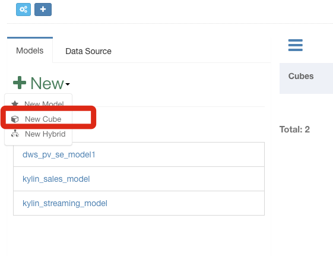

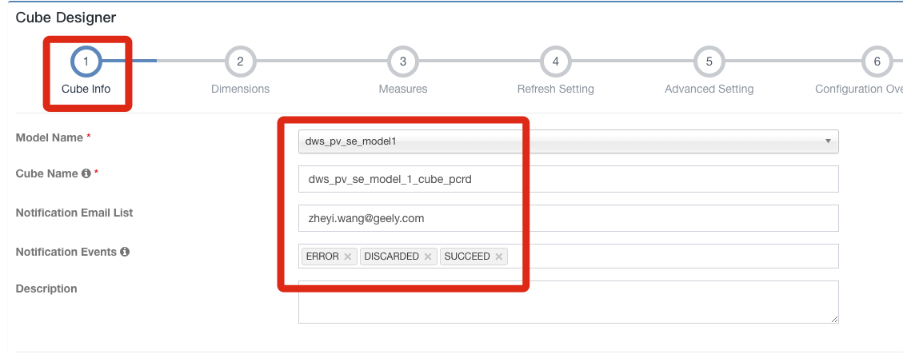

按需选取cube的维度。Cube的维度是Model的子集。点击“Add Dimension”添加维度

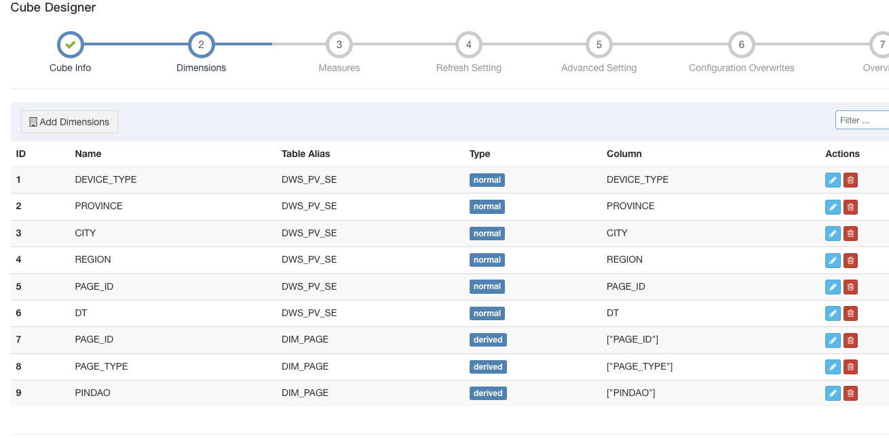

计算人数、会话数、pv访问量、访问时长

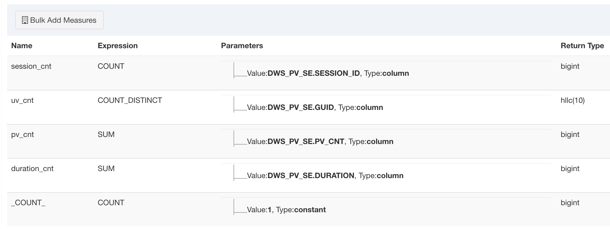

设置更新策略：

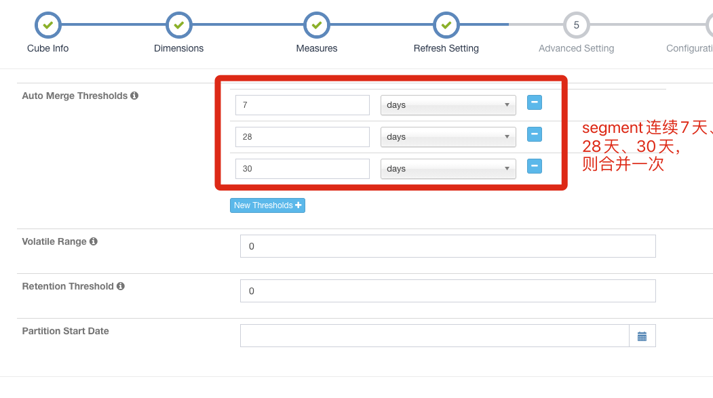

Volatille Range: 如果是0，则会合并尽可能多的cube segment，否则会不合并最后的[Volatille Range] days的segement

Retention Threshold: 如果是0，则会保存所有cube segment, 否则会不保存最后的[Retention Threshold] days的segement

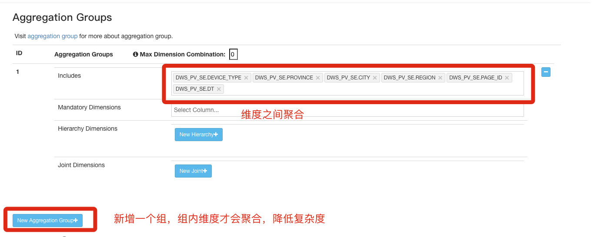

常见聚合组内容举例：

* 聚合组1：设备类型、操作系统、系统版本、网络类型
* 聚合组2：广告平台、广告系统、广告位置
* 聚合组3：频道、栏目、页面
* 聚合组4：国家、省、市、区

因此，demo中的案例可以变为：

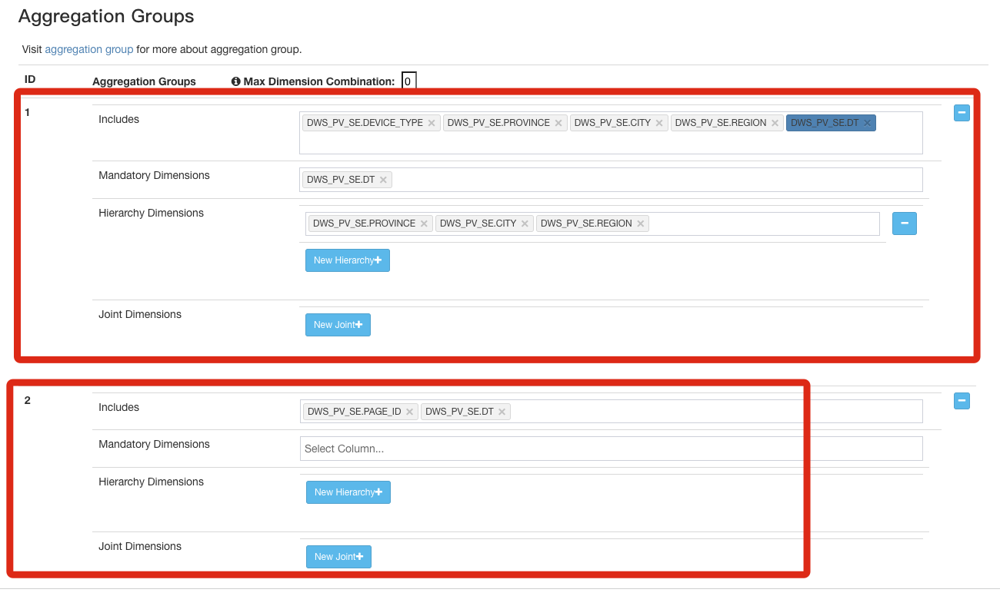

* Mandatory Dimensions： 必需维度
* Hierarchy Dimensions： 层级维度. 按照由大到小逐级排序。
* Joint Dimensions： 联合维度

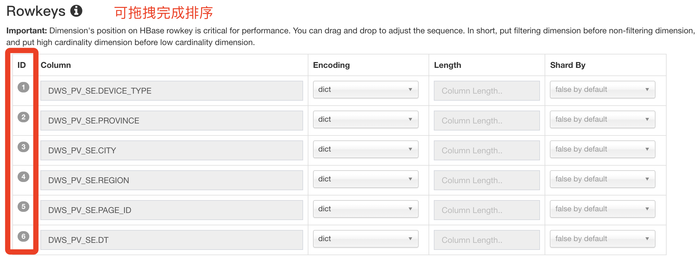
使用频率越高的rowkey，放在越前面

Encoding:  dict 代表它是一个映射字典。 比如存储为1，实际代表北京，存储为2，实际代表上海。

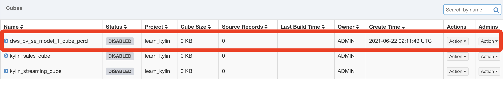
cube创建完成

## 查看构建的cube

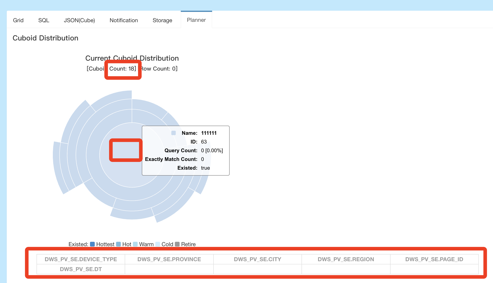

在cube planner里面可以查看。示例是18个Cuboid， 中心处是base Cuboid，最下层高亮的item是维度。

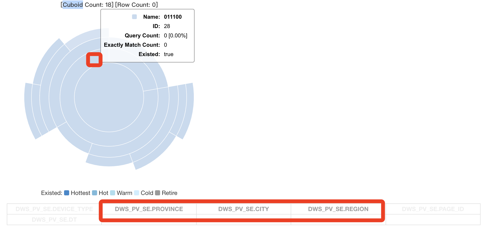
Cuboid 外圈，高亮的维度就不是全量，表示对维度进行了分区。

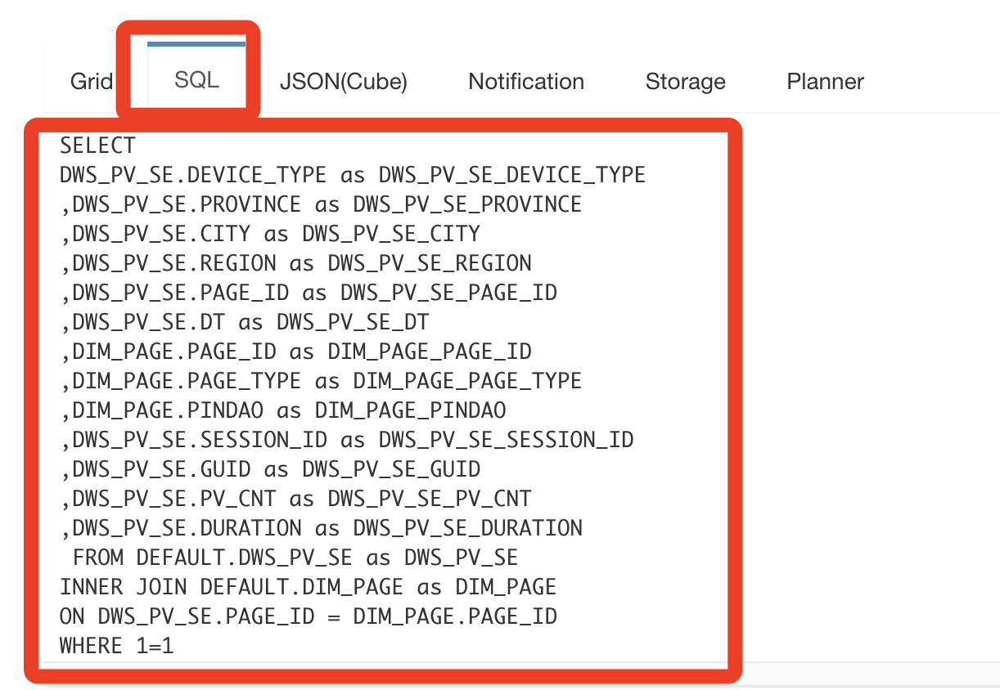
上图是根据选择自动生成的SQL

##  Build cube

 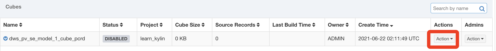
 
 选择build

 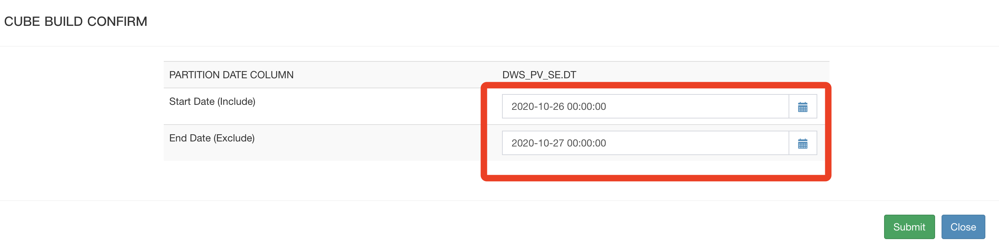

## 查看进度

 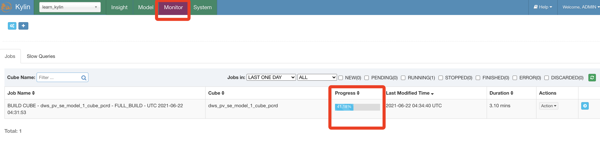

完成后：

 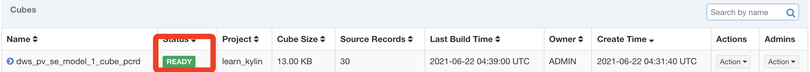
