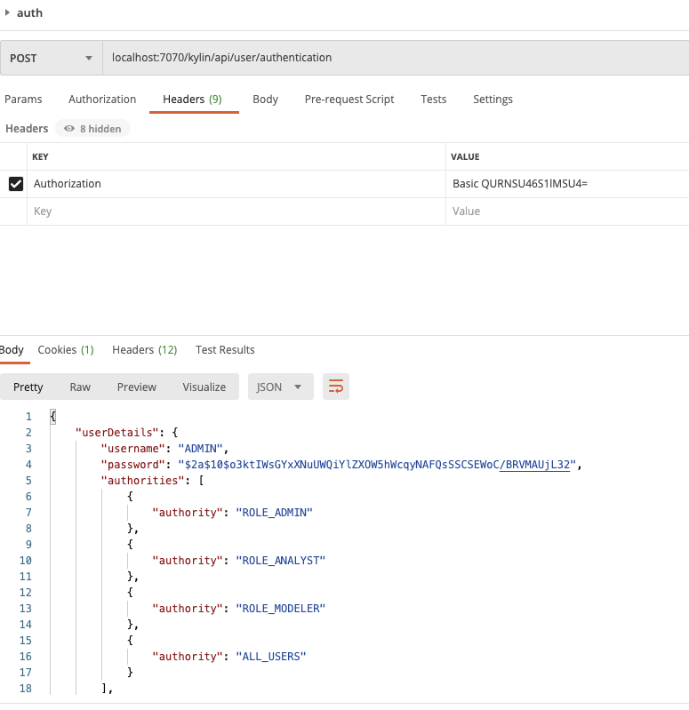
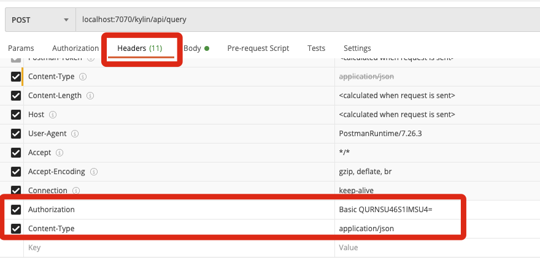
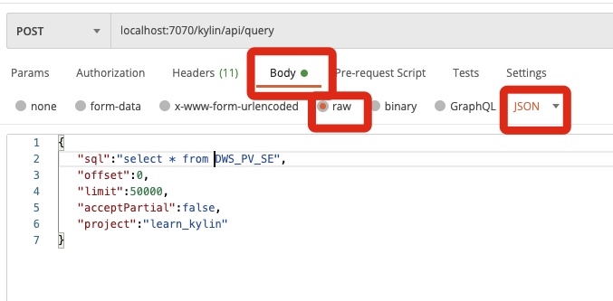
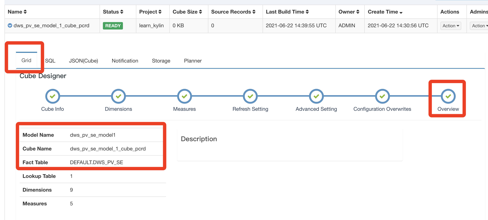

# 3. Restful API

参考：http://kylin.apache.org/cn/docs/howto/howto_use_restapi.html#authentication

## 验证权限

API：

	localhost:7070/kylin/api/user/authentication
	
Header：

	Authorization：Basic QURNSU46S1lMSU4=
	
其中，账号名密码需要用base64加密， 

	python -c "import base64; print base64.standard_b64encode('$UserName:$Password')"
	
或者访问

https://www.sojson.com/base64.html

使用

	ADMIN:KYLIN
	

## Query

API：

localhost:7070/kylin/api/query

	Authorization：Basic QURNSU46S1lMSU4=
	Content-Type application/json

	{  
	   "sql":"select * from DWS_PV_SE",
	   "offset":0,
	   "limit":50000,
	   "acceptPartial":false,
	   "project":"learn_kylin"
	}
	
其中cube构建后的事实表名字来自于：

