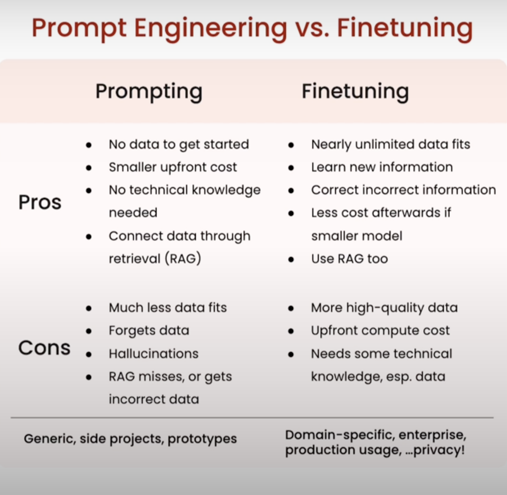

# 01. 为什么需要Fine Tuning


提示词 和 Fine Tuning各自的优势：




## 比较经过Fine Tuning 和没有Fine Tuning 的模型


```Python
import os
import lamini

lamini.api_url = os.getenv("POWERML__PRODUCTION__URL")
lamini.api_key = os.getenv("POWERML__PRODUCTION__KEY")
```


### Try Non-Finetuned models

```python
non_finetuned = BasicModelRunner("meta-llama/Llama-2-7b-hf")
non_finetuned_output = non_finetuned("Tell me how to train my dog to sit")
print(non_finetuned_output)
```


打印：

```
Tell me how to train my dog to stay.
Tell me how to teach my dog to come.
Tell me how to get my dog to heel.
Tell me how to stop my dog from jumping.
Tell me how to make my dog stop barking.
Tell me how I can get my dog to stop chewing.
Tell me how to house train my dog.
Tell me how to potty train my dog.
Tell me how to train my dog to walk on a leash.
Tell me how to crate train my dog.
Tell Me How To Train My Dog To Sit, Stay, Come, Heel, Stop Jumping, Stop Barking, Stop Chewing, House Train, Potty Train, Walk On A Leash, Crate Train, And More!
Tell Me How To Train Your Dog To Sit, Stay, Heel, Come, Stop Jumping, Stop Chewing, House Trained, Potty Trained, Walk On A Leash, And More!
Tell me how to train your dog to sit.
Tell Me How To House Train My Dog.
```


```python
print(non_finetuned("What do you think of Mars?"))
```


打印：

```
I think it's a great planet.
I think it's a good planet.
I think it'll be a great planet.
I think we should go there.
I think we should go back there.
I think we should stay there.
I think we should leave there.
I think we should colonize there.
I think we should terraform there.
I think we should mine there.
I think we should build there.
I think we should live there.
I think we should die there.
I think we should be there.
I think we should have been there.
I think we should never be there.
I think we'll be there.
I think we won't be there.
I think we will be there.
I think we can be there.
I think we could be there.
I think we would be there.
I think we might be there.
I think we may be there.
I think we shall be there.
I think we must be there.
I think we have to be there.
I think we need to be there.
I think I'll be there.
I know I'll be there.
```


```python
print(non_finetuned("taylor swift's best friend"))
```


打印：

```
I'm not sure if I've mentioned this before, but I'm a huge Taylor Swift fan.
I've been a fan since her first album, and I've been a fan ever since. I've been a fan of her music, her style, her personality, and her music. I've been a fan for a long time.
I've been a fan of Taylor Swift for a long time. I've been a fan of her music for a long time. I'm a fan of her style, her personality, her music, and her music. I've been a fan for a long, long time.
I've always been a fan of Taylor Swift. I've always been a fan of her music.
I've always been a big fan of her style. I've always been a huge fan of her personality. I've always been a massive fan of her music. I'm a fan of Taylor Swift. I love her music. I love her style. I love her personality. I love her music. I'm a huge fan of Taylor Swift.
I've always been an avid fan of Taylor Swift. I'm
```


```python
print(non_finetuned("""Agent: I'm here to help you with your Amazon deliver order.
Customer: I didn't get my item
Agent: I'm sorry to hear that. Which item was it?
Customer: the blanket
Agent:"""))
```

打印：

```
I'm sorry to hear that but I'm here to help.
Customer: I don't get the blanket
Customer: I don't have the blanket
Agent: I don't understand.
Agent: I'm sorry. I don't understand. customer: I don't have the blanket Agent: I'm so sorry to hear that.
Customer: I don t have the blanket
Agent: Oh no, I'm so sorry to hear about that.
customer: I
```


### Compare to finetuned models 


```python
finetuned_model = BasicModelRunner("meta-llama/Llama-2-7b-chat-hf")
finetuned_output = finetuned_model("Tell me how to train my dog to sit")
print(finetuned_output)
```


打印：

```
on command. Training your dog to sit is a basic obedience command that can be achieved with patience, consistency, and positive reinforcement. Here's a step-by-step guide on how to train your dog to sit:

1. Choose a quiet and distraction-free area: Find a quiet room or area where your dog can focus on you without getting distracted.
2. Have treats ready: Choose your dog's favorite treats and have them readily available to reward good behavior.
3. Stand in front of your dog: Stand in front of your dog and hold a treat close to their nose.
4. Move the treat up and back: Slowly move the treat upwards and backwards, towards your dog's tail, while saying "sit" in a calm and clear voice.
5. Dog will follow the treat: As you move the treat, your dog should naturally sit down to follow it. The moment they touch their bottom to the ground, give them the treat and praise them.
```


```python
print(finetuned_model("[INST]Tell me how to train my dog to sit[/INST]"))
```


打印：

```
Training your dog to sit is a basic obedience command that can be achieved with patience, consistency, and positive reinforcement. Here's a step-by-step guide on how to train your dog to sit:

1. Choose a quiet and distraction-free area: Find a quiet room or area where your dog can focus on you without getting distracted.
2. Have treats ready: Choose your dog's favorite treats and have them readily available to reward good behavior.
3. Stand in front of your dog: Stand in front of your dog and hold a treat close to their nose.
4. Move the treat up and back: Slowly move the treat upwards and backwards, towards your dog's tail, while saying "sit" in a calm and clear voice.
5. Dog will follow the treat: As you move the treat, your dog should naturally sit down to follow it. The moment they touch their bottom to the ground, give them the treat and praise them.
6. Repeat the process: Repeat steps 3-5 several times, so your dog learns to associate the command "sit" with the action of sitting down.
```


可以看出：经过场景化Fine tuning的模型在特定场景下更好