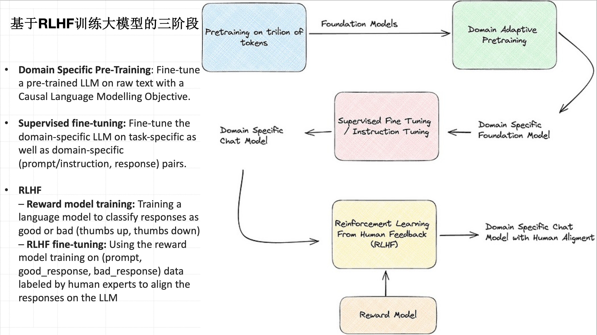
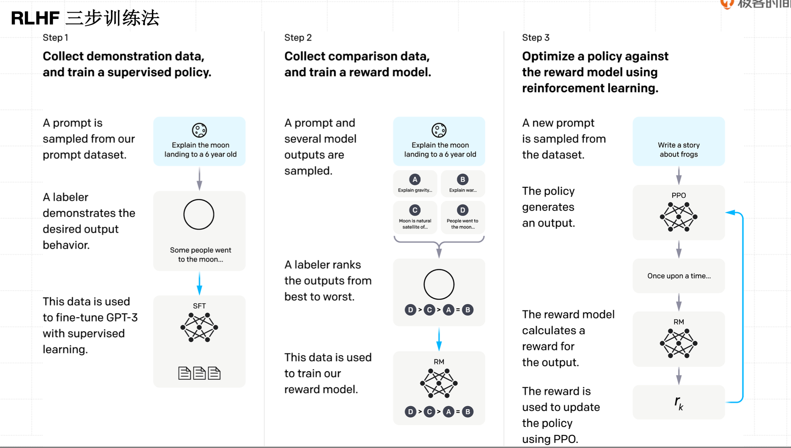
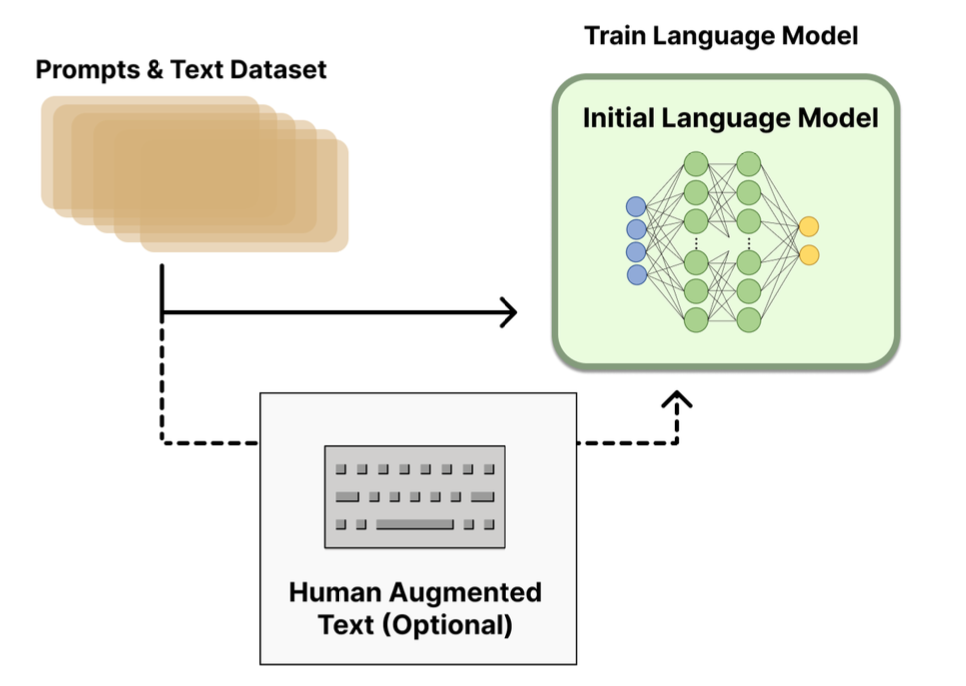
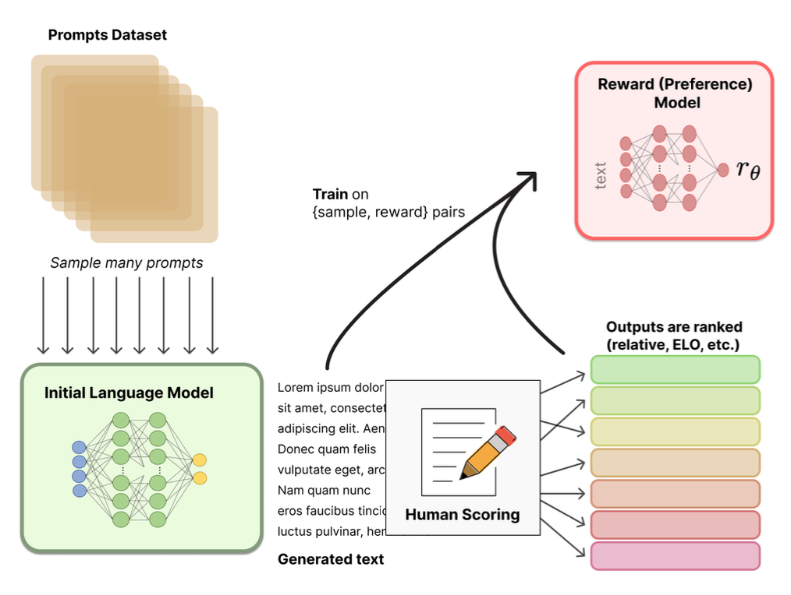
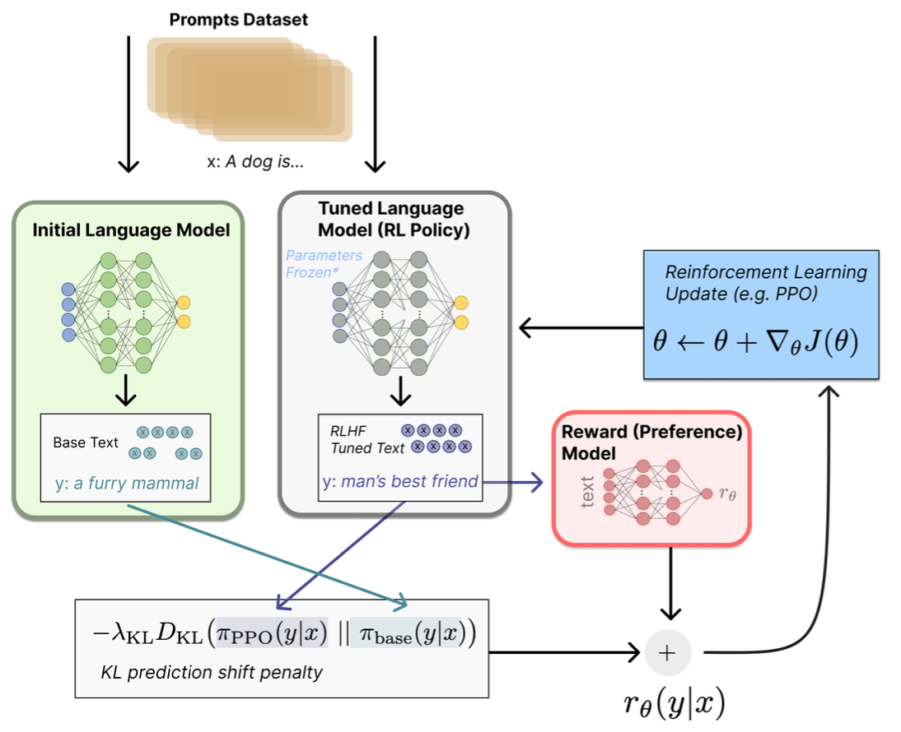
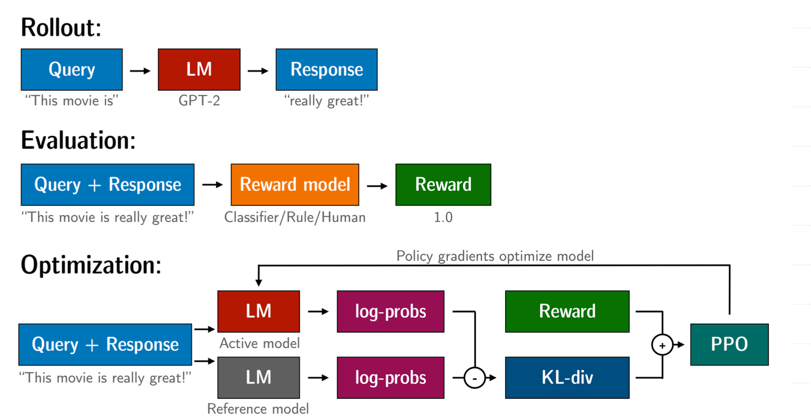

# ChatGPT 大模型训练技术 RLHF


## 背景



**大语言模型（LLM）基于 RLHF（人类反馈强化学习）训练的三阶段流程**：

| 阶段              | 目标                       | 类比理解                       |
| ----------------- | -------------------------- | ------------------------------ |
| **1. 领域预训练** | 让模型懂“语言”和“专业知识” | 像一个人读完所有百科全书       |
| **2. 监督微调**   | 教它“怎么回答问题”         | 教它写作文、答题               |
| **3. RLHF**       | 教它“回答得更符合人类偏好” | 训练它懂“人话”、有礼貌、有逻辑 |

三阶段的关系：

| 阶段                 | 输入                   | 输出                 | 是否人工参与     |
| -------------------- | ---------------------- | -------------------- | ---------------- |
| Domain Pretrain      | 原始文本               | 专业语言模型         | ❌ 无             |
| Supervised Fine-Tune | Prompt + 人工答案      | 指令遵循模型         | ✅ 有人工样本     |
| RLHF                 | Prompt + 好/坏答案偏好 | 对齐人类价值观的模型 | ✅ 有人工偏好反馈 |


## 训练方法



##### 🧩 Step 1：监督微调（SFT）

> 人类示范正确回答，让模型模仿人类输出。

- 用标注的「Prompt → 理想回答」数据训练模型；
- 让模型具备基础对话与任务能力。

##### 🧠 Step 2：奖励模型训练（RM）

> 人类对多个回答排序，让模型学会判断“好答案”。

- 对同一问题，模型生成多个答案；
- 人类根据质量打分或排序；
- 奖励模型学会预测哪个回答更优。

##### ⚙️ Step 3：强化学习优化（PPO）

> 用奖励模型指导主模型不断改进。

- 奖励模型打分；
- 用 PPO 算法优化语言模型；
- 输出逐步更符合人类偏好的答案


## 详细拆解


### **步骤一:使用**SFT**微调预训练语言模型**

先收集一个提示词集合，并要求标注人员写出高质量的回复，然后使用该数据集以监督的方式微调预训练的 基础模型。对这一步的模型，OpenAI 在其第一个流行的 RLHF 模型 InstructGPT 中使用了较小版本的 GPT- 3; Anthropic 使用了 1000 万 ~ 520 亿参数的 Transformer 模型进行训练;DeepMind 使用了自家的 2800 亿参数模型 Gopher。




### **步骤二:训练奖励模型(**Reward Model**)**

RM 的训练是 RLHF 区别于旧范式的开端。这一模型接收一系列文本并返回一个标量奖励，数值上对应人的偏好。我们可以用端到端的方式用 LM 建模，或者用模块化的系统建模 (比如对输出进行排名，再将排名转换 为奖励) 。这一奖励数值将对后续无缝接入现有的 RL 算法至关重要。




### 步骤三：:使用 PPO（Proximal Policy Optimization）优化微调语言模型

在强化学习里，模型（称为**策略 policy**）会根据输入（环境）做出行动并获得奖励。同理，语言模型也可以看作是一个策略网络，它接受提示（prompt），生成文本，并根据人类的反馈得到“奖励”。





##### ① Policy（策略）

- **是什么：**
   就是语言模型本身（LM）。它根据输入文本生成输出文本。
- **动作空间（action space）：**
   LM 可以选择输出的所有词汇——比如有 50,000 个词，那每一步都有 5 万种可能。
- **举个例子：**
   当提示是 “写一首关于大海的诗”，模型的动作就是选择哪些词依次组成整首诗。

------

##### ② Observation Space（观察空间）

- **是什么：**
   所有可能的输入文本（prompt）组成的空间。
- **理解方式：**
   就是模型能看到的世界，比如用户输入的每一句话、每个标记（token）。

------

##### ③ 奖励函数（Reward Function）

- **作用：**
   告诉模型“这段回答好不好”。
- **构成：**
   来自人类偏好模型（Reward Model, RM）的得分 + 策略不要偏离太多的约束（Policy shift constraint）。
   → 简单理解：既要讨人喜欢，也不能变得奇怪。

------

##### ④ PPO 算法如何算奖励（核心）

- **步骤：**
  1. 把相同的输入 x 分别喂给初始模型和当前微调后的模型；
  2. 它们生成两个输出文本 y₁ 和 y₂；
  3. 把 y₂（当前模型输出）送给 RM（奖励模型）打分；
  4. 计算这两者之间的差异（KL 散度）作为“惩罚项”；
  5. 总的奖励 = RM 打分 - 偏离惩罚。
- **目的：**
   惩罚模型偏离原始语言风格太多，防止它胡乱输出（比如为了“骗分”输出垃圾内容）。


## 使用Hugging Face TRL 实现PPO流程图解




##### 🧩 Step 1：Rollout（生成响应）

模型（LM）根据输入问题生成回答。
 👉 相当于 GPT 根据提示写出一句话。

------

##### 🧩 Step 2：Evaluation（打分）

把生成的“问 + 答”交给奖励模型（Reward Model），
 奖励模型根据人类偏好给回答打分（比如 1.0、0.5 等）。

------

##### 🧩 Step 3：Optimization（优化）

模型根据奖励更新参数。
 PPO 算法会让模型：

- ✅ 奖励高的输出更可能出现；
- ⚠️ 同时避免模型偏离原始分布太多（通过 KL 散度惩罚）。


## Demo

```python
# -*- coding: utf-8 -*-
# =========================================================
# 0) 安装依赖（仅需第一次运行）
# =========================================================
# !pip install -U "torch>=2.5" "transformers>=4.56" "datasets>=2.19" "trl>=0.8" accelerate peft

# =========================================================
# 1) 导入模块
# =========================================================
import os
from typing import List

import torch
from datasets import Dataset
from transformers import AutoTokenizer, DataCollatorWithPadding
from transformers.modeling_outputs import CausalLMOutputWithPast
from trl import (
    PPOConfig,
    PPOTrainer,
    AutoModelForCausalLMWithValueHead,
    create_reference_model,
)

# 梯子
os.environ["HTTP_PROXY"] = "http://127.0.0.1:10887"
os.environ["HTTPS_PROXY"] = "http://127.0.0.1:10887"

# =========================================================
# 2) 基础配置：模型、分词器与设备
# =========================================================
model_name = "lvwerra/gpt2-imdb"  # 小型 GPT-2 变体，适合演示

tokenizer = AutoTokenizer.from_pretrained(model_name)
if tokenizer.pad_token is None:
    tokenizer.pad_token = tokenizer.eos_token  # PPO 过程中需要明确 pad_token


def ensure_wrapper_attributes(wrapper: AutoModelForCausalLMWithValueHead) -> AutoModelForCausalLMWithValueHead:
    """
    Hugging Face 和 TRL 版本更新很快，不同版本之间常出现属性兼容问题。这个函数是解决不同版本兼容性问题的。
    """
    if not hasattr(wrapper, "pretrained_model"):
        return wrapper

    backbone = wrapper.pretrained_model
    base_prefix = getattr(backbone, "base_model_prefix", None)
    if base_prefix:
        setattr(wrapper, "base_model_prefix", base_prefix)
        if not hasattr(wrapper, base_prefix):
            setattr(wrapper, base_prefix, getattr(backbone, base_prefix))

    if not hasattr(wrapper, "generation_config") and hasattr(backbone, "generation_config"):
        wrapper.generation_config = backbone.generation_config

    if not hasattr(wrapper, "is_gradient_checkpointing") and hasattr(backbone, "is_gradient_checkpointing"):
        wrapper.is_gradient_checkpointing = backbone.is_gradient_checkpointing

    if not hasattr(wrapper, "score") and hasattr(wrapper, "v_head"):
        def _score(hidden_states: torch.Tensor) -> torch.Tensor:
            output = hidden_states
            if output.dtype != wrapper.v_head.summary.weight.dtype:
                output = output.to(wrapper.v_head.summary.weight.dtype)
            return wrapper.v_head(output).squeeze(-1)

        wrapper.score = _score

    return wrapper


def patch_policy_forward(wrapper: AutoModelForCausalLMWithValueHead):
    """
    这个函数是解决不同版本兼容性问题的。把 “带价值头（ValueHead）” 的模型包装成“像普通语言模型那样工作
    """
    backbone = wrapper.pretrained_model

    def _forward(
        input_ids=None,
        attention_mask=None,
        past_key_values=None,
        return_dict=True,
        **kwargs,
    ):
        kwargs["output_hidden_states"] = True
        if past_key_values is not None:
            kwargs["past_key_values"] = past_key_values

        if getattr(wrapper, "is_peft_model", False) and getattr(
            wrapper, "pretrained_model", None
        ) is not None:
            active_config = getattr(wrapper.pretrained_model, "active_peft_config", None)
            if active_config is not None and getattr(active_config, "peft_type", None) == "PREFIX_TUNING":
                kwargs.pop("past_key_values", None)

        outputs = backbone(
            input_ids=input_ids,
            attention_mask=attention_mask,
            return_dict=True,
            **kwargs,
        )

        if not return_dict:
            return outputs

        return CausalLMOutputWithPast(
            loss=outputs.loss,
            logits=outputs.logits,
            past_key_values=outputs.past_key_values,
            hidden_states=outputs.hidden_states,
            attentions=outputs.attentions,
        )

    wrapper.forward = _forward

# =========================================================
# policy model（策略模型） → 要训练的主模型
# reference model（参考模型） → 用于计算 KL 惩罚
# value model（价值模型） → 预测奖励期望值
# reward model（奖励模型） → 打分老师
# =========================================================    

# policy
policy_model = ensure_wrapper_attributes( 
    AutoModelForCausalLMWithValueHead.from_pretrained(model_name)   #AutoModelForCausalLMWithValueHead：加载一个基础语言模型（如 GPT-2）并添加一个「价值头
)
patch_policy_forward(policy_model)

# reference （参考模型用来计算「KL 散度惩罚」，确保策略模型不会偏离原始分布太多。）
reference_wrapper = ensure_wrapper_attributes(create_reference_model(policy_model))  #create_reference_model(policy_model)创建一个 policy_model 的冻结副本
reference_model = reference_wrapper.pretrained_model
reference_model.eval()

# value
value_model = ensure_wrapper_attributes(AutoModelForCausalLMWithValueHead.from_pretrained(model_name))

# reward
reward_model = ensure_wrapper_attributes(AutoModelForCausalLMWithValueHead.from_pretrained(model_name))
reward_model.requires_grad_(False)
reward_model.eval()

# =========================================================
# 3) 玩具数据集：若干英文提示
# =========================================================
demo_prompts: List[str] = [
    "Review: A heartfelt drama about family bonds.\nSummary:",
    "Review: An action-packed blockbuster with dazzling visuals.\nSummary:",
    "Review: A boring film with wooden acting.\nSummary:",
    "Review: An inspiring documentary that moved me to tears.\nSummary:",
    "Review: The plot was confusing but the soundtrack was amazing.\nSummary:",
    "Review: A hilarious comedy that had the whole theater laughing.\nSummary:",
]

dataset = Dataset.from_dict({"prompt": demo_prompts})

max_prompt_tokens = 128


def tokenize_batch(example):
    tokens = tokenizer(
        example["prompt"],
        truncation=True,
        max_length=max_prompt_tokens,
        add_special_tokens=False,
    )
    return {"input_ids": tokens["input_ids"], "attention_mask": tokens["attention_mask"]}


tokenized_ds = dataset.map(tokenize_batch, remove_columns=["prompt"])
eval_ds = tokenized_ds.select(range(min(2, len(tokenized_ds))))

collator = DataCollatorWithPadding(tokenizer=tokenizer, padding="longest")

# =========================================================
# 4) 最新 TRL (0.8+) 的 PPO 配置
# =========================================================
ppo_config = PPOConfig(
    output_dir="./ppo_imdb_demo",
    seed=42,
    report_to="none",
    num_train_epochs=1,
    total_episodes=len(tokenized_ds),
    per_device_train_batch_size=2,
    per_device_eval_batch_size=2,
    gradient_accumulation_steps=2,
    num_mini_batches=1,
    response_length=48,
    temperature=0.7,
    stop_token="eos",
    learning_rate=1.5e-5,
    logging_steps=5,
    local_rollout_forward_batch_size=2,
)
# 训练演示期间不必保存 checkpoint，关闭 safetensors 以绕过共享权重冲突
ppo_config.save_safetensors = False
ppo_config.save_strategy = "no"

# =========================================================
# 5) 初始化 PPOTrainer
# =========================================================
ppo_trainer = PPOTrainer(
    args=ppo_config,
    processing_class=tokenizer,      
    model=policy_model,
    ref_model=reference_model,
    reward_model=reward_model,
    train_dataset=tokenized_ds,
    value_model=value_model,
    data_collator=collator,
    eval_dataset=eval_ds,
)

# =========================================================
# 6) 训练
# =========================================================
ppo_trainer.train()

# =========================================================
# 7) 推理与结果
# =========================================================
def chat(prompt: str, max_new_tokens: int = 64) -> str:
    """使用最新策略模型生成回答。"""
    policy = ppo_trainer.accelerator.unwrap_model(ppo_trainer.model).policy
    policy.eval()
    inputs = tokenizer(prompt, return_tensors="pt").to(ppo_trainer.accelerator.device)
    with torch.no_grad():
        output = policy.generate(
            **inputs,
            max_new_tokens=max_new_tokens,
            do_sample=True,
            temperature=0.8,
            pad_token_id=tokenizer.eos_token_id,
        )
    return tokenizer.decode(output[0], skip_special_tokens=True)


test_prompt = "Review: The acting was mediocre but the final scene was powerful.\nSummary:"
print("=== Sample Generation ===")
print(chat(test_prompt))

```


打印：

```
(lora-env) zheyiwang@ZHEYIdeMacBook-Pro study demo % /opt/anaconda3/envs/lora-env/bin/python rlhf.py
Map: 100%|█████████████████████████████████████████████████████████████████████████████████████████████| 6/6 [00:00<00:00, 1261.82 examples/s]
/opt/anaconda3/envs/lora-env/lib/python3.10/site-packages/trl/trainer/ppo_trainer.py:200: UserWarning: This trainer will soon be moved to trl.experimental and is a candidate for removal. If you rely on it and want it to remain, please share your comments here: https://github.com/huggingface/trl/issues/4223. Silence this warning by setting environment variable TRL_EXPERIMENTAL_SILENCE=1.
  warnings.warn(
===training policy===
  0%|                                                                                                                   | 0/2 [00:00<?, ?it/s]`generation_config` default values have been modified to match model-specific defaults: {'bos_token_id': 50256, 'eos_token_id': 50256}. If this is not desired, please set these values explicitly.
Setting `pad_token_id` to `eos_token_id`:50256 for open-end generation.
Setting `pad_token_id` to `eos_token_id`:50256 for open-end generation.
{'eps': 0, 'objective/kl': -0.24512894451618195, 'objective/entropy': 90.1410140991211, 'objective/non_score_reward': 0.012256447225809097, 'objective/rlhf_reward': 0.3954721689224243, 'objective/scores': 0.3832157254219055, 'policy/approxkl_avg': 0.3271065354347229, 'policy/clipfrac_avg': 0.3841145634651184, 'loss/policy_avg': -0.06062384694814682, 'loss/value_avg': 0.32659775018692017, 'val/clipfrac_avg': 0.375, 'policy/entropy_avg': 1.8676555156707764, 'val/ratio': 1.127786636352539, 'val/ratio_var': 0.029384726658463478, 'val/num_eos_tokens': 0, 'lr': 1.5e-05, 'episode': 4, 'epoch': 0.67}
 50%|█████████████████████████████████████████████████████▌                                                     | 1/2 [00:05<00:05,  5.95s/it]Setting `pad_token_id` to `eos_token_id`:50256 for open-end generation.
┏━━━━━━━━━━━━━━━━━━━━━━━━━━━━━━━━━━━━━━━━━━━━━━━━━━━━━━━━━━┳━━━━━━━━━━━━━━━━━━━━━━━━━━━━━━━━━━━━━━━━━━━━━━━━━━━━━━━━━━┳━━━━━━━━━━━━━━━━━━━━━━┓
┃ query                                                    ┃ model response                                           ┃ score                ┃
┡━━━━━━━━━━━━━━━━━━━━━━━━━━━━━━━━━━━━━━━━━━━━━━━━━━━━━━━━━━╇━━━━━━━━━━━━━━━━━━━━━━━━━━━━━━━━━━━━━━━━━━━━━━━━━━━━━━━━━━╇━━━━━━━━━━━━━━━━━━━━━━┩
│ Review: A heartfelt drama about family bonds.            │  A family drama about family                             │ -0.13202518224716187 │
│ Summary:                                                 │ bonds.<|endoftext|><|endoftext|><|endoftext|>            │                      │
├──────────────────────────────────────────────────────────┼──────────────────────────────────────────────────────────┼──────────────────────┤
│ Review: An action-packed blockbuster with dazzling       │  A must see for fans of action movies.<|endoftext|>      │ -0.40011152625083923 │
│ visuals.                                                 │                                                          │                      │
│ Summary:                                                 │                                                          │                      │
└──────────────────────────────────────────────────────────┴──────────────────────────────────────────────────────────┴──────────────────────┘
Setting `pad_token_id` to `eos_token_id`:50256 for open-end generation.
Setting `pad_token_id` to `eos_token_id`:50256 for open-end generation.
{'eps': 0, 'objective/kl': 1.0205090045928955, 'objective/entropy': 55.83944320678711, 'objective/non_score_reward': -0.05102544650435448, 'objective/rlhf_reward': 0.20578807592391968, 'objective/scores': 0.25681352615356445, 'policy/approxkl_avg': 0.01869163103401661, 'policy/clipfrac_avg': 0.19953417778015137, 'loss/policy_avg': -0.08171942830085754, 'loss/value_avg': 0.32703897356987, 'val/clipfrac_avg': 0.2468406856060028, 'policy/entropy_avg': 1.6089422702789307, 'val/ratio': 1.0011248588562012, 'val/ratio_var': 0.0018394151702523232, 'val/num_eos_tokens': 46, 'lr': 7.5e-06, 'episode': 8, 'epoch': 1.33}
100%|███████████████████████████████████████████████████████████████████████████████████████████████████████████| 2/2 [00:12<00:00,  6.37s/it]Setting `pad_token_id` to `eos_token_id`:50256 for open-end generation.
┏━━━━━━━━━━━━━━━━━━━━━━━━━━━━━━━━━━━━━━━━━━━━━━━━━━━━━━━━━━┳━━━━━━━━━━━━━━━━━━━━━━━━━━━━━━━━━━━━━━━━━━━━━━━━━━━━━━━━━━┳━━━━━━━━━━━━━━━━━━━━━━┓
┃ query                                                    ┃ model response                                           ┃ score                ┃
┡━━━━━━━━━━━━━━━━━━━━━━━━━━━━━━━━━━━━━━━━━━━━━━━━━━━━━━━━━━╇━━━━━━━━━━━━━━━━━━━━━━━━━━━━━━━━━━━━━━━━━━━━━━━━━━━━━━━━━━╇━━━━━━━━━━━━━━━━━━━━━━┩
│ Review: A heartfelt drama about family bonds.            │  A family drama about family                             │ -0.13202518224716187 │
│ Summary:                                                 │ bonds.<|endoftext|><|endoftext|><|endoftext|>            │                      │
├──────────────────────────────────────────────────────────┼──────────────────────────────────────────────────────────┼──────────────────────┤
│ Review: An action-packed blockbuster with dazzling       │  A must see for fans of action movies.<|endoftext|>      │ -0.40011152625083923 │
│ visuals.                                                 │                                                          │                      │
│ Summary:                                                 │                                                          │                      │
└──────────────────────────────────────────────────────────┴──────────────────────────────────────────────────────────┴──────────────────────┘
100%|███████████████████████████████████████████████████████████████████████████████████████████████████████████| 2/2 [00:13<00:00,  6.51s/it]
=== Sample Generation ===
Review: The acting was mediocre but the final scene was powerful.
Summary: This was a very, very bad movie. I really just want to say, "I'm sorry but I just want the movie to be better".
```


解释：


##### 🧩 训练阶段 1：Rollout（模型生成）

```
===training policy===
Setting `pad_token_id` to `eos_token_id`:50256 for open-end generation.
Setting `pad_token_id` to `eos_token_id`:50256 for open-end generation.
```

📘 **说明**
 模型开始“生成回答”（即 rollout）。
 `pad_token_id` 设置为 GPT-2 的结束标志 `<|endoftext|>`。

------

##### 📊 PPO 第一次更新统计

```
{
  "eps": 0,
  "objective/kl": -0.2451,
  "objective/entropy": 90.1410,
  "objective/non_score_reward": 0.0122,
  "objective/rlhf_reward": 0.3954,
  "objective/scores": 0.3832,
  "policy/approxkl_avg": 0.3271,
  "policy/clipfrac_avg": 0.3841,
  "loss/policy_avg": -0.0606,
  "loss/value_avg": 0.3266,
  "policy/entropy_avg": 1.8676,
  "lr": 1.5e-05,
  "episode": 4,
  "epoch": 0.67
}
```

📘 **关键指标说明：**

| 指标                    | 含义                          |
| ----------------------- | ----------------------------- |
| `objective/kl`          | KL 散度惩罚，限制模型更新幅度 |
| `objective/entropy`     | 熵，反映输出多样性            |
| `objective/rlhf_reward` | 奖励平均值（越高越符合偏好）  |
| `policy/approxkl_avg`   | 策略变化的平均 KL             |
| `loss/policy_avg`       | 策略损失（越低越好）          |
| `loss/value_avg`        | 值函数损失                    |
| `epoch`                 | 当前训练进度                  |

------

##### 💬 模型生成示例（第 1 次）

| **Query**                                                    | **Model Response**                       | **Score** |
| ------------------------------------------------------------ | ---------------------------------------- | --------- |
| Review: A heartfelt drama about family bonds. Summary:       | A family drama about family bonds. `<    | endoftext |
| Review: An action-packed blockbuster with dazzling visuals. Summary: | A must see for fans of action movies. `< | endoftext |

📘 **说明：**

- `query` 是输入提示；
- `model response` 是生成结果；
- `score` 为奖励值（你的简单 reward 函数打分）；
- 负分表示“不符合偏好”（例如没包含 "good"）。

------

##### 📈 PPO 第二次更新统计

```
{
  "objective/kl": 1.0205,
  "objective/entropy": 55.8394,
  "objective/non_score_reward": -0.0510,
  "objective/rlhf_reward": 0.2057,
  "objective/scores": 0.2568,
  "policy/approxkl_avg": 0.0187,
  "policy/clipfrac_avg": 0.1995,
  "loss/policy_avg": -0.0817,
  "loss/value_avg": 0.3270,
  "policy/entropy_avg": 1.6089,
  "lr": 7.5e-06,
  "episode": 8,
  "epoch": 1.33
}
```

📘 **说明：**

- 奖励值从 0.39 → 0.20，说明当前输出还未完全趋向“高奖励”；
- PPO 会在多轮后逐步逼近最优策略。

------

##### 💬 模型生成示例（第 2 次）

| **Query**                                                    | **Model Response**                       | **Score** |
| ------------------------------------------------------------ | ---------------------------------------- | --------- |
| Review: A heartfelt drama about family bonds. Summary:       | A family drama about family bonds. `<    | endoftext |
| Review: An action-packed blockbuster with dazzling visuals. Summary: | A must see for fans of action movies. `< | endoftext |

------

##### 🧾 训练结束样本生成

```
=== Sample Generation ===
Review: The acting was mediocre but the final scene was powerful.
Summary: This was a very, very bad movie. I really just want to say,
"I'm sorry but I just want the movie to be better".
```

📘 **说明：**

- 模型根据优化后的策略生成新样本；
- 输出仍略显随机，因为训练样本极少；
- 但已能体现出模型“学习偏好”的趋势。