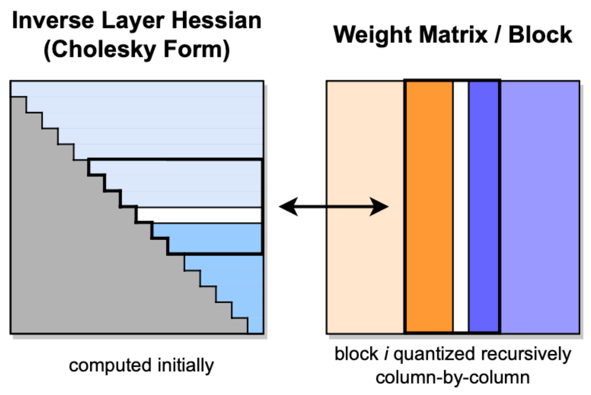
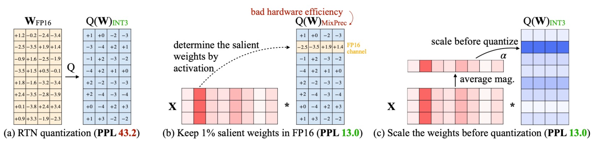

# HF Transformers 模型量化

## 简介

量化是“让模型说话更省电”。Transformer 模型里有大量的参数（如 BERT-base 有 1.1 亿个浮点数，GPT-3 有 1750 亿个）。这些参数通常是 **float32（32 位浮点数）** 存储的。每个数字都要占 4 字节。

> 量化（Quantization）= 用更少的位数（如 8 位、4 位）去表示这些参数。

| 精度类型    | 每个权重占用 | 示例                             |
| ----------- | ------------ | -------------------------------- |
| FP32        | 32 bit       | 原始模型（最精准但最慢）         |
| FP16 / BF16 | 16 bit       | 混合精度训练用                   |
| INT8        | 8 bit        | 常用于推理加速                   |
| INT4        | 4 bit        | 超轻量部署（例如手机、边缘设备） |

为什么要量化？

| 目标                  | 效果                               |
| --------------------- | ---------------------------------- |
| **减小模型体积**      | 例如 BERT-base 从 420MB → 100MB    |
| **提高推理速度**      | 更小的矩阵乘法、更快的内存访问     |
| **降低显存/内存占用** | 同样的 GPU 可以跑更大模型          |
| **更适合边缘部署**    | 手机、嵌入式设备上运行模型成为可能 |

## Transformers 核心设计 Auto Classes

包含三个重点：

- **AutoConfig**：自动加载模型的配置参数（如层数、隐藏维度、类别数等）。
- **AutoTokenizer**：自动加载与模型匹配的分词器，用于把文本转成模型输入。
- **AutoModel**：自动加载对应架构的预训练模型权重，直接用于下游任务。

## Transformers 模型量化 Quantization

量化（Quantization）技术专注于用较少的信息表示数据，同时尽量不损失太多准确性。

##### 示例：不同位宽的权重存储与显存占用

假设模型权重最初以 **32 位浮点数（Float32）** 存储：

- **量化为 16 位（Float16）**
  - 模型大小减少约 **一半**
  - 只需一半的 GPU 显存即可加载量化后的模型
- **量化为 8 位（Int8）**
  - 显存占用约为原来的 **1/4**
- **量化为 4 位（NF4, Normal Float 4）**
  - 显存占用约为原来的 **1/8**

较低精度的量化不仅能**减少显存占用**，还可以 **加快推理速度** —— 因为使用更少位宽的计算单元进行乘加运算，耗时更短。

##### 模型显存占用计算举例（以 OPT-6.7B 为例）

1. OPT-6.7B 有 **67 亿个参数**。
2. 每个参数用 **Float16（2 字节）** 存储。
3. 总显存占用 = 67 亿 × 2 字节 = **约 13.4 GB**。
4. 如果用 **Int8（1 字节）** 量化，只需 **约 7 GB 显存**。

## GPTQ 量化

**GPTQ（Gradient Post-Training Quantization）量化算法的核心流程**，它是一种**高精度的后量化方法**，常用于把大语言模型（如 GPT、LLaMA）从 16bit 压缩到 4bit，而精度几乎不掉。

##### 🧠 GPTQ 核心思想

> **在不重新训练模型的情况下，用最小的误差把模型权重量化成低位（如 4bit）表示。**

它的关键是： 通过近似 Hessian（海森矩阵，表示权重变化对损失的敏感度）来**决定每个权重的重要性**，在量化时尽量保留重要的权重精度。

左图（Inverse Layer Hessian）：Hessian 逆矩阵经过 Cholesky 分解，用于提供“量化顺序”的数学依据。

右图（Weight Matrix）：橙色列是当前正在量化的权重块，蓝色是尚未量化的部分。

##### GPTQ 量化流程（4个主要步骤）

1. **块量化（Block Quantization）**
   - 把权重矩阵分成若干块（连续的列）。
   - 每次只量化一小块，逐步处理整个矩阵。
2. **Cholesky 分解（Hessian 信息）**
   - 对 Hessian 的逆矩阵做 Cholesky 分解，用它来衡量权重之间的关联。
   - 这样可以在量化时最小化误差，并保持计算稳定性。
3. **权重更新（Residual Update）**
   - 每量化一块后，更新剩余权重（用蓝色表示）。
   - 相当于告诉模型：“我改动了这部分参数，你要重新平衡剩下的部分”，从而减少累计误差。
4. **递归量化（Recursive Quantization）**
   - 在块内部，再逐列递归地应用量化操作。
   - 这样可以局部细化处理，每次量化都尽量精确。

Hessian（海森矩阵） = 二阶导数矩阵，用来描述 **“损失函数对每个参数的敏感程度”**。Hessian 判断“哪些权重更敏感，哪些可以量化”。

- 如果某个权重的变化让损失变化很大 → 它很重要；
- 如果变化几乎不影响损失 → 它不重要，可以粗略处理（比如量化精度低一点没事）。

为什么要“求逆矩阵”？因为在量化时，我们需要知道：“如果我改变某个参数，其他参数的误差会不会被放大或抵消？” 这需要知道参数之间的**相互影响关系**。Hessian 的**逆矩阵**（也叫 Fisher 信息矩阵的近似）能量化这种依赖关系。为什么要用 Cholesky 分解？Hessian 的逆矩阵非常大（比如上亿参数），直接算或存都不现实。Cholesky 分解 是一种高效分解正定矩阵的算法。

## AWQ量化

AWQ = *Activation-aware Weight Quantization*，即「激活感知的权 重量化」。 它是一种 **仅量化权重（weight-only）** 的方法，不量化激活或者至少优先保证激活精度，从而在低位（如 4 bit）下保持良好性能。 特别适用于指令调优的模型、甚至多模态模型（语言+视觉）上。AWQ 的核心观察：**并不是所有权重都同样重要**。有少数关键权重（“salient weights”）对模型输出影响很大。保护这少数关键权重就能显著降低量化误差。 

##### AWQ 算法图解说明： （**PPL = Perplexity（困惑度）**，是评估语言模型好坏的常用指标。）

###### (a) RTN 量化

- 直接把权重从 FP16 转成低位整数（如 INT3）。
- 简单但误差大，模型性能下降。
- **PPL 43.2（效果差）**

------

###### (b) MixPrec 混合精度

- 先找出最重要的 1% 权重（激活值高的部分）。
- 保留它们为 FP16，其余量化成 INT3。
- 精度好但硬件效率低，因为计算混合。
- **PPL 13.0（效果好但慢）**

------

###### (c) AWQ 激活感知量化

- 在量化前，对重要通道的权重进行缩放（scale）。
- 所有权重都能用 INT3 表示，同时保持高精度。
- 快又准，兼顾性能与效率。
- **PPL 13.0（效果好且快）**

：**AWQ不是看权重本身大不大，而是看它对模型输出的影响大不大。**在神经网络里，每一层的输入会经过矩阵乘法。

###### 🧠 神经网络中的矩阵乘法与激活分布

在神经网络中，每一层的输入都会经过矩阵乘法：

$$
y = W \times x
$$

其中：

- **\( W \)**：权重矩阵（你要量化的对象）  
- **\( x \)**：输入（也叫激活值 *Activation*）

当模型运行时，不同输入（句子）会激活不同的神经元。  
有的通道非常活跃（数值大），有的几乎不动（数值小）。

👉 **这就是“激活分布”**：描述了每个通道被使用的频率和强度。

举个例子：

| 权重 | 激活    | 乘积（影响力）      |
| ---- | ------- | ------------------- |
| 0.2  | **10**  | **2.0** ✅（影响大） |
| 2.0  | **0.1** | **0.2** ❌（影响小） |

## 量化算法对比 AWQ vs GPTQ

| 特征/算法      | **AWQ（Activation-Aware Weight Quantization）**              | **GPTQ（Gradient Post-Training Quantization）**             |
| -------------- | ------------------------------------------------------------ | ----------------------------------------------------------- |
| **设计目的**   | 面向大型语言模型，强调保护“显著权重”，减少量化误差。         | 专为 GPT 类模型设计，高效完成权重量化，降低计算与存储成本。 |
| **量化方法**   | 基于激活分布选择重要权重进行保护。                           | 基于近似二阶信息（Hessian）的一次性权重量化。               |
| **精度与效率** | 在多种模型和位宽下表现稳定，能提升视觉、语音、语言模型性能。 | 在极低位数（如 2bit）下仍保持合理精度，能快速量化大模型。   |
| **硬件适应性** | 兼容桌面端与移动端 GPU，高效推理框架支持良好。               | 支持在单 GPU 上运行大规模模型，提升推理速度。               |
| **应用范围**   | 适用于多模态、多任务场景。                                   | 针对 GPT 系列及高计算需求模型优化。                         |
| **推理性能**   | 显著提升推理速度，尤其适合边缘设备部署。                     | 在高端 GPU 上实现高效推理和成本优化。                       |