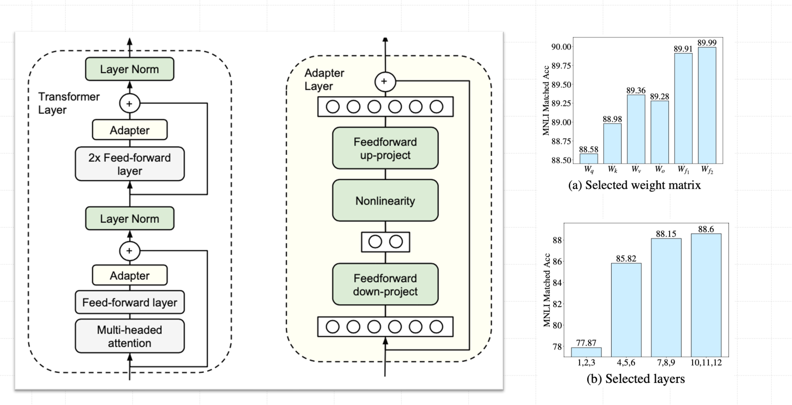
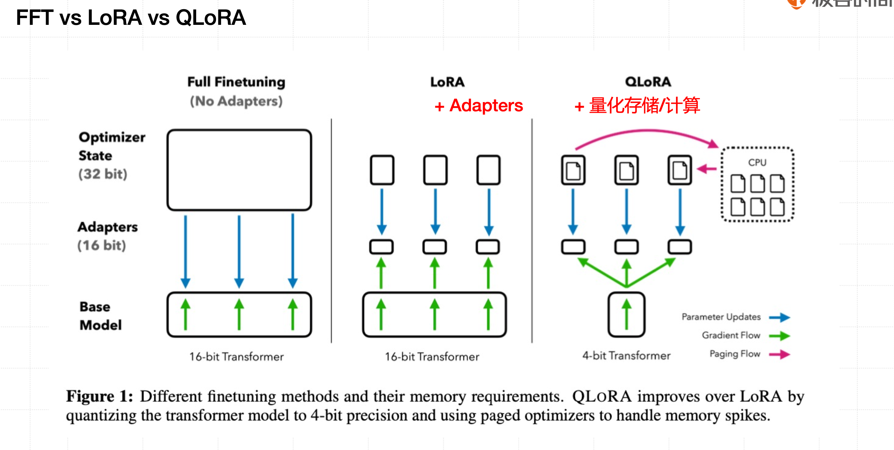
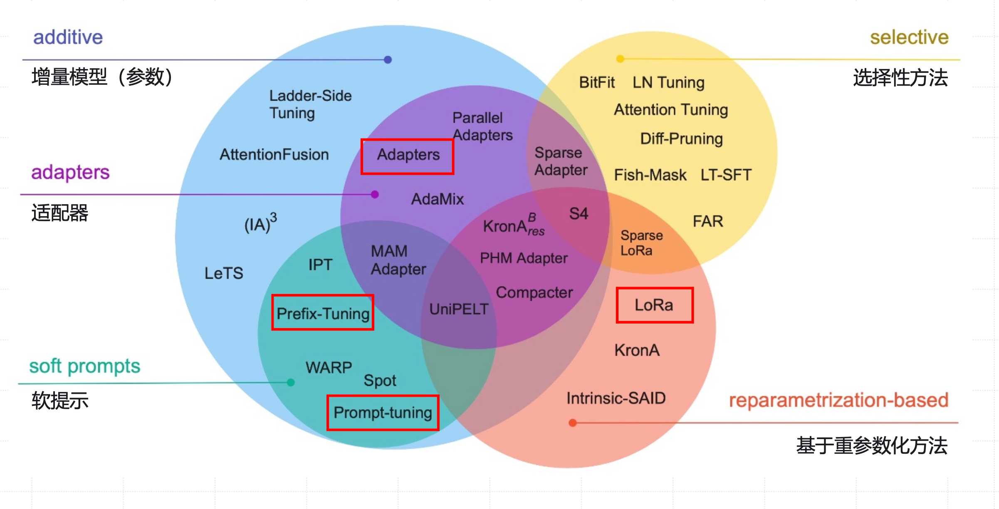

# LORA

## 现有PEFT方法的局限与挑战

- Adapter方法，通过增加模型深度而额外增加了模型推理延时。
- Prompt Tuning、Prefix Tuning、P-Tuning等方法中的提示较难训练，同时缩短了模型可用的序列长度。
- 往往难以同时实现高效率和高质量，效果通常不及完全微调(full-finetuning)。

尽管大模型参数规模巨大，但是关键作用通常是由其中的低秩本质维度（Low Intrinsic Dimension）发挥的

## 核心思想  低秩适配（Low-Rank Adaptation）

**一个矩阵的秩越大，它的信息含量就越大。**

在 **LoRA（Low-Rank Adaptation）** 方法中，实际上是在原始的预训练语言模型（PLM）上**附加一个额外的网络通路**，可以视作一种“外挂结构”。
 这个外挂结构的目标是通过两个矩阵 **A** 和 **B** 的相乘来模拟本征秩（*intrinsic rank*）较低的特征。

公式如下：

$$
h = W_0 x + \Delta W\, x = W_0 x + BA\, x
$$

简单理解：

- **$W_0$**：原模型的权重（被冻结不变）
- **$A$**：负责把输入降维（从大维度 → 小维度）
- **$B$**：负责再把它映射回原维度（小维度 → 大维度）
- **$r$**：降维后的维度，也叫“秩（rank）”，通常比原维度小得多（比如 $r=8$，$d=1024$

这样一来：

- 计算量从 $d \times d$ 变成了 $d \times r + r \times d$
- 参数量大幅下降，计算效率更高！

| 项目 | 作用               | 是否训练    |
| ---- | ------------------ | ----------- |
| W₀   | 预训练模型权重     | ❌ 冻结      |
| A    | 降维矩阵（d → r）  | ✅ 微调      |
| B    | 升维矩阵（r → d）  | ✅ 微调      |
| r    | 秩（低维空间大小） | 一般取 4~16 |

LoRA 就是把“模型参数的改动（ΔW）”压缩成两个小矩阵 **A**（降维） 和 **B**（升维）的乘积，从而只需训练极少参数，就能让大模型学会新任务。

## LORA  和 Adaptor 的对比

| 对比维度         | LoRA                   | Adapter          | 含义通俗解释                                                 |
| ---------------- | ---------------------- | ---------------- | ------------------------------------------------------------ |
| **推理延迟**     | ✅ 无额外延迟           | ❌ 增加前向计算   | LoRA 在推理时几乎不变慢，因为只是矩阵加法；Adapter 要多经过几层网络，所以会稍微慢。 |
| **参数增量**     | ✅ 极低（<1%）          | ❌ 较高（需新层） | LoRA 只多几个小矩阵参数；Adapter 需要新建几层网络，参数翻倍。 |
| **模型结构改动** | ✅ 无结构变更           | ❌ 增加子网络     | LoRA 不动原模型结构；Adapter 必须在模型中插入额外层。        |
| **微调效果**     | ✅ 接近全量微调         | ⚪ 略逊           | LoRA 微调效果几乎等同于完全训练模型，而 Adapter 有时效果稍差。 |
| **多任务部署**   | ✅ 参数独立，可动态加载 | ⚪ 需额外管理     | LoRA 的任务参数是独立的文件，可以随时切换；Adapter 要改结构或单独管理模块。 |
| **通用性**       | ✅ 支持多种架构         | ⚪ 依赖实现       | LoRA 适配 Transformer、CNN、RNN 等模型都行；Adapter 有些结构用不了。 |
| **稳定性**       | ✅ 高                   | ⚪ 一般           | LoRA 的数学形式更简单、梯度更稳定，训练时不容易崩。          |

## LORA  和 Soft Prompt 的对比

| 对比维度     | **LoRA**               | **Soft Prompts**       | 说明                                      |
| ------------ | ---------------------- | ---------------------- | ----------------------------------------- |
| 作用层级     | 深层（权重矩阵）       | 浅层（输入 embedding） | LoRA 改模型内部结构，Soft Prompt 仅改输入 |
| 输入空间占用 | ❌ 不占                 | ✅ 占用输入长度         | Soft Prompt 会减少可用上下文              |
| 微调效果     | ✅ 接近全参数           | ⚪ 略低                 | LoRA 能达到 full fine-tuning 水平         |
| 灵活性       | ✅ 高，可插多层         | ⚪ 一般                 | Soft Prompt 只能调整输入 embedding        |
| 可解释性     | ✅ 高                   | ⚪ 低                   | LoRA 的参数改动可直观追踪                 |
| 参数复用     | ✅ 模块可独立加载       | ⚪ 不可复用             | LoRA 支持任务模块组合                     |
| 训练稳定性   | ✅ 高                   | ⚪ 一般                 | LoRA 梯度路径短、收敛快                   |
| 计算资源     | ✅ 低（仅训练少量参数） | ⚪ 较低                 | 两者都轻量，但 LoRA 更节省显存            |

## LoRA增强技术：AdaLoRA 自适应权重矩阵

LORA的核心思想：对下游任务增量训练小模型(W=W0+△W)

LoRA 问题:

1. **固定秩（rank r）**：
    训练前必须人为设定低秩矩阵的大小（比如 r=4 或 r=8），训练过程中不会变化。
    👉 如果模型某一层任务很复杂，需要更高秩，LoRA 却“卡死”在固定 r，就学不够；反之太简单层又浪费参数。
2. **忽略层之间差异**：
    不同层的重要性不同，有的层调一点就有效果，有的层即使调也没用。
    👉 LoRA 对所有层“一刀切”，没法区分重点。
3. **只改 Attention，没改 FFN**：
    LoRA 通常只插在注意力层，而 FFN 模块同样对模型表达能力非常重要。
    👉 相当于只优化了一半的潜力。

AdaLoRA解决思路：

##### ① 使用 SVD 提升矩阵分解能力

> **SVD = 奇异值分解（Singular Value Decomposition）**

在训练中，AdaLoRA 会不断对 LoRA 的权重矩阵 ΔW 进行 SVD 分解，
 用来度量这个矩阵“信息量”的大小（奇异值越大，说明该部分越重要）。

👉 这一步的作用：

- 找出哪些方向的特征重要；
- 哪些维度可以舍弃（降秩时不损失太多信息）。

简单理解：

> SVD 就像一台“显微镜”，帮 AdaLoRA 看清哪些参数真的有用。

------

##### ② 模型剪枝：建立重要性模型

AdaLoRA 会评估每个 LoRA 模块（比如不同层、不同矩阵）对模型性能的重要性。
 它会为每个模块打一个“重要性分数”（importance score）。

👉 这一步的作用：

- 让模型知道哪些模块值得投入更多参数；
- 哪些模块可以“精简”一点。

举个例子：
 假设有三层 LoRA 模块：

- 第 1 层对任务影响大 → 分数高 → 给高秩（比如 r=16）
- 第 3 层影响小 → 分数低 → 给低秩（比如 r=4）

------

##### ③ 动态调整本征秩 r（Adaptive Rank Allocation）

基于上一步的分数，AdaLoRA 会**动态调整每个权重矩阵的秩大小 r**，而不是像原 LoRA 那样固定不变。

- 训练早期时先用较高秩（模型还在摸索阶段）；
- 训练后期逐步收缩到最合适的秩（剪掉不重要的维度）。

👉 这样既能保持模型表达能力，又能节省计算和显存。

## LoRA增强技术 ：QLoRA: 高效微调量化大模型

## 未来趋势

