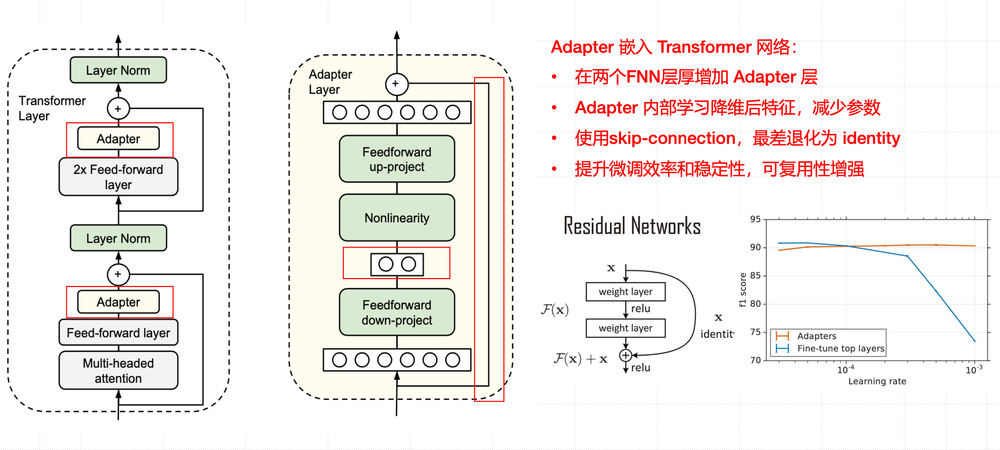
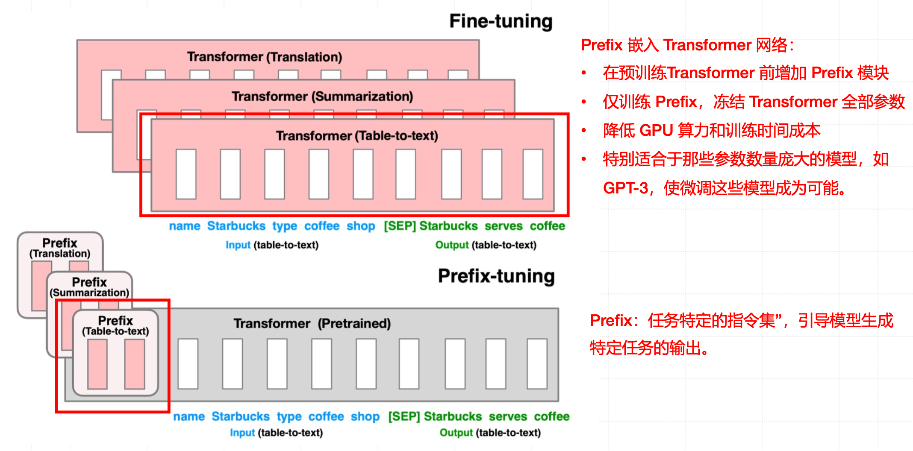
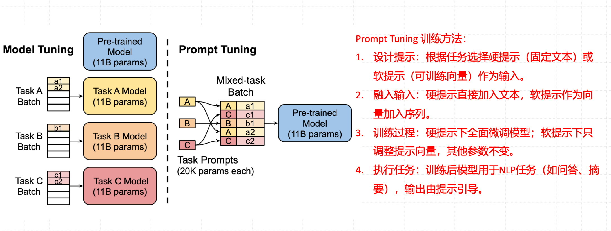

# PEFT


## Adapter 技术





#### 为什么需要 Adapter？

在大模型（比如 BERT、GPT）中：

- 模型参数动辄上亿（fine-tune 一次就要更新全部参数）
- 每个任务都微调一份 → 占内存、算力惊人

👉 **Adapter 的目的**：
 只在模型中**插入少量可训练层**（其余参数冻结），让模型能快速适配新任务，同时几乎不影响原模型的性能。


#### 它的原理（左图）

Transformer 每一层通常包含：

> Multi-head Attention → Feed-forward → LayerNorm → 残差连接

Adapter 做的事是：

> **在每个 Feed-forward 模块后面插入一个小网络（Adapter 层）**

这层：

- 学习任务特定的特征（比如情感分析或问答任务）

- 其余层保持冻结

- 训练时只更新 Adapter 的参数（通常仅占原模型的 **1%~3% 参数量**）

  

#### Adapter 层内部结构（中间图）

Adapter 层本质是一个很小的瓶颈网络：

```
输入 (维度 d_model)
↓
降维 down-project (d_model → d_adapter)
↓
非线性激活 (ReLU)
↓
升维 up-project (d_adapter → d_model)
↓
输出 + skip-connection
```

- **降维**：减少参数量
- **升维**：恢复原维度
- **skip-connection**：确保即使 Adapter 学不到东西，也不会破坏原模型功能（可退化为 identity）


#### Residual Networks残差连接（右图）

这是 Transformer 的基础结构，Adapter 也沿用了这一思想：

> 输出 = 输入 + 变化量
>  如果 Adapter 不起作用，仍然能返回原输入（稳定！）


总结：

| 特性     | 说明                                          |
| -------- | --------------------------------------------- |
| **目的** | 只调整少量参数，让大模型快速适配新任务        |
| **位置** | 插入到 Transformer 每层的 Feed-forward 模块中 |
| **结构** | 降维 → 激活 → 升维 → 残差连接                 |
| **优点** | 参数少、易训练、稳定性强、可复用              |


##  Prefix Tuning





**Prefix-tuning（前缀微调）** 技术，相比传统的 **Fine-tuning（全量微调）**，它是一种更轻量、更高效的微调方式。核心思想：在预训练好的 Transformer 前面，增加一个可学习的“前缀向量”（Prefix）。这些前缀相当于任务提示（Prompt 的向量化版本），指导模型生成与任务相关的输出。


| 对比点       | Fine-tuning（全量微调）                   | Prefix-tuning（前缀微调）        |
| ------------ | ----------------------------------------- | -------------------------------- |
| 参数更新范围 | 需要更新整个 Transformer 的参数（上亿级） | 只训练前缀向量（几百万甚至更少） |
| 计算成本     | 高，需要大量 GPU 计算和显存               | 低，仅训练小部分参数             |
| 适用场景     | 模型较小、任务较单一                      | 模型超大（如 GPT-3）、任务多样化 |
| 思路类比     | “重学整本书”                              | “只在书前加几页任务说明”         |


#### 图解说明

- 上图（Fine-tuning）：
   每个任务（翻译、摘要、表格转文本）都要**单独训练一个 Transformer 副本**，代价非常高。
- 下图（Prefix-tuning）：
   只在 Transformer 前面加上一个 Prefix 模块，每个任务的 Prefix 不同，但主模型参数完全**冻结不动**。
   这样就可以在同一个大模型上快速适配多个任务。


## Prompt Tuning




核心思想：**不动大模型，只学“提示” (Prompt)**，让模型自动学会“我现在要做哪种任务”。

图解说明：

##### 左边：Model Tuning（传统微调）

- 对每个任务（Task A、Task B、Task C）都要：
  - 拷贝一份模型（每份 11B 参数！）
  - 在各自数据集上单独训练。
- 缺点：占内存、耗算力、任务间不能共享知识。

##### 右边：Prompt Tuning（提示微调）

- 所有任务共用一个预训练模型（不改内部参数）。
- 每个任务只增加一个“小提示向量”（Prompt Embedding）。
  - 例如：任务 A 的提示告诉模型“你现在要做翻译”；
  - 任务 B 的提示告诉模型“你现在要做问答”。
- 训练时，只更新这些提示参数（比如 2 万个参数），模型本体完全冻结。