# 大模型微调基础概念


## 分类


- 全量微调(Full Fine-Tune, FFT)

-  高效微调(Parameter-Efficient Fine-Tune, PEFT)

  - 有监督微调(Supervised Fine-tune, SFT) • 基于人类反馈的强化学习(RLHF)

  -  基于AI反馈的强化学习(RLAIF)


## PEFT **主流技术方案**

 围绕 Token 做文章:语言模型(PLM)不变

- Prompt Tuning
- Prefix Tuning
- P-Tuning

 特定场景任务:训练“本质”的低维模型

- LoRA
- QLoRA
- AdaLoRA

新思路:少量数据、统一框架 

-  IA3
- UniPELT


## 统计语言模型

语言模型的任务是：给一句话一个分数，看它有多“像人说的话”。


$$
P(s) = P(w_1)\,P(w_2|w_1)\,P(w_3|w_1,w_2)\,\cdots\,P(w_l|w_1,w_2,\ldots,w_{l-1})
$$


通过语料库得到所有条件概率后，对于任何一个给定的句子S，都可以通过将对应的条件概率相乘的方法得到句子的概率。两个问题： 1）参数空间太大 2）模型归于稀疏


#### N-gram 模型与马尔科夫假设

公式1在词很多的情况下很难被计算。马尔科夫假设:一个词出现的概率只和它前面出现的一个或有限的几个词有关：
$$
\begin{aligned}
P(s) &= \prod_{i=1}^{l} P(w_i \mid w_1, w_2, \ldots, w_{i-1}) 
\\[6pt]
&\approx \prod_{i=1}^{l} P(w_i \mid w_{i-k}, w_{i-(k-1)}, \ldots, w_{i-1})
\end{aligned}
$$


这意味着：我们只看前 k 个词。这个 k 就是 N-gram 模型里的 **N-1**。


N-gram 模型：用这个假设近似整个句子的概率，让计算变得可行。

| 模型              | 公式     | 含义              | 示例句子 “This is a sentence” |
| ----------------- | -------- | ----------------- | ----------------------------- |
| **Unigram (N=1)** | (P(w_i)) | 每个词独立        | this, is, a, sentence         |
| **Bigram (N=2)**  | (P(w_i   | w_{i-1}))         | 每个词只依赖前一个词          |
| **Trigram (N=3)** | (P(w_i   | w_{i-2},w_{i-1})) | 每个词依赖前两个词            |


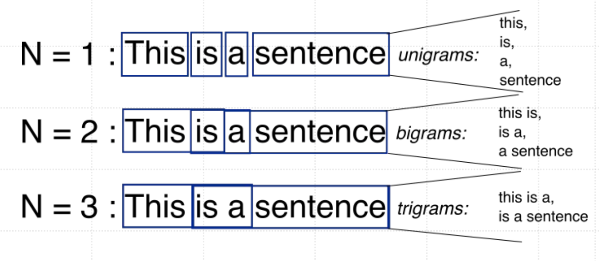


怎么计算呢？


#### 最大似然估计（Maximum Likelihood Estimation）

$$
P(w_k | w_{k-n+1}^{k-1}) = \frac{\text{count}(w_{k-n+1}^{k})}{\text{count}(w_{k-n+1}^{k-1})}
$$

解释：
$$
P(\text{下一个词} \mid \text{前面几个词}) 
= 
\frac{\text{包含下一个词的序列出现次数}}{\text{仅前面几个词的序列出现次数}}
$$


**例子：**
$$
P(\text{"love"}|\text{"I"}) = \frac{\text{count("I love")}}{\text{count("I")}}
$$
如果 "I love" 出现 50 次，而 "I" 出现 200 次，则：
$$
P(\text{"love"}|\text{"I"}) = 0.25
$$


意思是：在所有以 “I” 开头的句子或短语中，有 25% 的情况下，后面跟着 “love”。


## **神经网络语言模型**


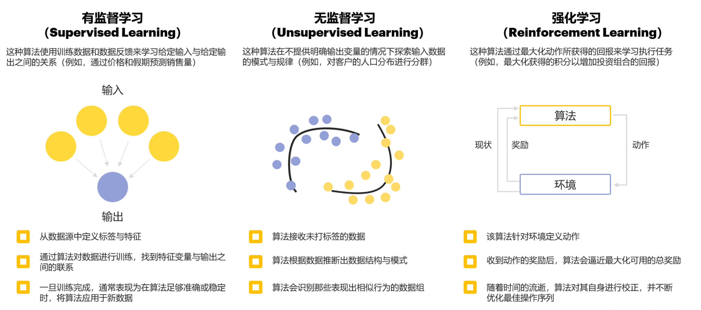


在 **神经网络语言模型（NNLM）** 中，传统的统计方法（n-gram）被替代为 **RNN / LSTM** 网络，用来建模“句子中词与词之间的依赖关系”。


为什么要用神经网络？前面的 n-gram 模型 有两个问题：

1. 只能看到前 n−1 个词（上下文太短）
2. 对未出现过的组合（比如 “summer zebra”）完全没法预测

为了解决这个问题，我们用 **神经网络** 来学习“上下文到下一个词”的关系。


#### NNLM 的基本思想

神经网络语言模型（Neural Network Language Model, NNLM）通过向量表示 + 神经网络结构来预测下一个词：

输入一串词 → 输出下一个词的概率。

例如：

> 输入 “I love” → 输出下一个词的概率分布（cats: 0.7, dogs: 0.2, apple: 0.1）


### RNN

RNN 的全称是 Recurrent Neural Network（循环神经网络），它是一种**能记住前文信息**的神经网络。RNN每次读一个“词”，会记住前面的内容，然后根据“前文 + 当前词”一起预测下一个输出。

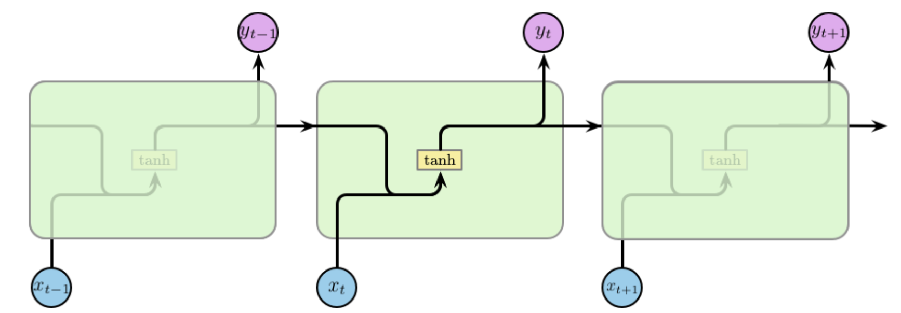

图解：

| 符号      | 含义                       | 说明                       |
| --------- | -------------------------- | -------------------------- |
| (x_t)     | 当前输入（词向量）         | 比如 “I”、“love”、“cats”   |
| (h_{t-1}) | 上一时刻的隐藏状态（记忆） | 保存“之前学到的上下文”     |
| (tanh)    | 激活函数                   | 让网络“记得重点、忘掉噪声” |
| (y_t)     | 当前输出                   | 比如预测下一个词是什么     |
| 箭头 →    | 信息流动方向               | 表示“时间”在往后推进       |

$$
\begin{aligned}
h_t &= \tanh(W_h h_{t-1} + W_x x_t + b_h) \\[6pt]
y_t &= W_y h_t + b_y
\end{aligned}
$$


RNN 处理过程是：

| 时间步 | 输入词 | 记忆更新          | 输出                        |
| ------ | ------ | ----------------- | --------------------------- |
| t=1    | I      | 记住“I”           | —                           |
| t=2    | love   | 记住“I love”      | —                           |
| t=3    | cats   | 记住“I love cats” | 预测下一个可能是“very much” |

RNN 的记忆**理论上无限**，但**实际上只有几步到几十步左右**。


RNN的两个常见缺点：
 1️⃣ **长距离依赖（梯度消失）**
 → 句子太长时，前面的信息传到后面会“越来越淡”。
 2️⃣ **难以并行**
 → 因为每一步都依赖上一步，只能顺序执行。


### LSTM

LSTM（长短期记忆网络，Long Short-Term Memory），LSTM 是 RNN 的“升级版”，专门用来解决 RNN 的最大问题：记不住太久的信息（梯度消失）。它的核心思想是：给“记忆”加上 **门控机制（Gates）**，像一个聪明的过滤系统，决定“要记什么、忘什么、输出什么”。每个时间步（每个词）里，LSTM 会维护两个状态：

| 状态    | 作用                                           |
| ------- | ---------------------------------------------- |
| ( h_t ) | 当前的“短期记忆”（隐藏状态，用来输出）         |
| ( c_t ) | 当前的“长期记忆”（细胞状态，用来存储重要信息） |

LSTM加入了3个gate：

**遗忘门**：决定哪些知识点不重要，忘掉。

**输入门**：决定哪些新的知识点要记住。

**输出门**：决定现在要用哪些知识来答题。

```
              ┌──────────────┐
              │  c(t-1) 旧记忆 │
              └──────┬───────┘
                     │
             [遗忘门 Forget Gate]
                     ↓
          ┌────────────────────┐
输入 x(t) →│ 加入新信息 Input Gate │→ 更新记忆 c(t)
          └────────────────────┘
                     ↓
             [输出门 Output Gate]
                     ↓
                  输出 h(t)

```


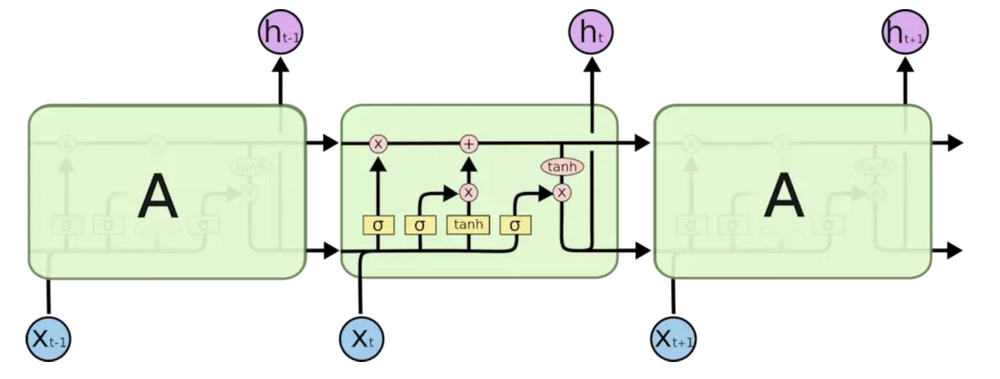

图解：

| 部分                           | 作用                         |          符号          |
| ------------------------------ | ---------------------------- | :--------------------: |
| 🧱 输入 (x_t)                   | 当前时刻的输入（例如一个词） |        蓝色圆圈        |
| 🔁 上一时刻的隐藏状态 (h_{t-1}) | “短期记忆”                   |        紫色圆圈        |
| 💾 细胞状态 (c_t)               | “长期记忆”                   | 图中横贯整条的那根主线 |
| σ（Sigmoid）                   | 控制是否“开门”               |    黄色方块（带 σ）    |
| tanh                           | 生成新信息或压缩范围         |  黄色方块（带 tanh）   |

优点：

| 问题         | RNN    | LSTM 解决方式      |
| ------------ | ------ | ------------------ |
| 记不住长依赖 | ✅ 会忘 | ❌ 有门控机制可保留 |
| 梯度消失     | 严重   | 大幅缓解           |
| 并行计算     | 不行   | 同样较慢，但精度高 |


## **基于** Transformer **的大语言模型**

为了解决RNNs的问题，新的架构Transformer被引入了，优点有：

| 项目       | RNN                  | Transformer              |
| ---------- | -------------------- | ------------------------ |
| 信息传递   | 按顺序传递，容易丢失 | 全局注意力，一次看全句   |
| 并行性     | 不可并行             | 可完全并行训练           |
| 长距离依赖 | 记忆衰减             | 注意力直接连接任意两个词 |
| 上下文感知 | 单向                 | 双向                     |
| 可解释性   | 低                   | 高（Attention 可视化）   |


核心：Encoder=decodeer架构：

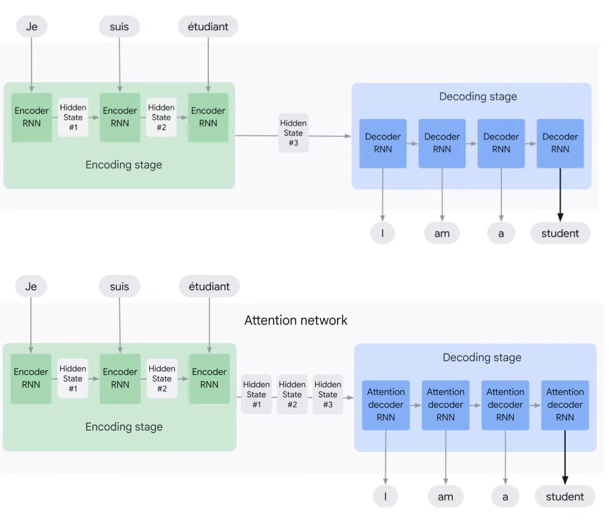

Encoder–Decoder 架构是一种常见的神经网络结构，用于把一个序列（比如一句法语）翻译成另一个序列（比如对应的英语）。它分成两部分：
 1️⃣ **Encoder（编码器）** → 负责“理解输入”
 2️⃣ **Decoder（解码器）** → 负责“生成输出”


#### 传统RNN Encoder-Decoder （上半部分图）

上面那张图展示了 **最早期的 RNN 编码–解码模型**，
 比如 “Je suis étudiant.” → “I am a student.”

##### （1）左边：Encoding Stage（编码阶段）

- 输入是法语词语：`Je → suis → étudiant`
- 每个词依次输入到 RNN（循环神经网络）中。
- RNN 会把每一步的信息存到“隐藏状态（Hidden State）”里。
- 最终，最后一个隐藏状态（Hidden State #3）被当作整句话的“压缩表示”

📦 所以：

> “Je suis étudiant” → 被压缩成一个向量（Hidden State #3）

##### （2）右边：Decoding Stage（解码阶段）

- 这个向量再交给解码器（Decoder RNN）。
- Decoder 逐词生成输出句子：`I → am → a → student`。
- 每输出一个词，Decoder 会把上一步的输出再作为下一步的输入。


##### ⚠️ 问题：信息瓶颈（Information bottleneck）

RNN 编码器只能用**最后一个隐藏状态**来表示整句输入。
 当句子很长时，前面的信息会丢失。

> 就像你听一段话，最后只记住了结尾几个字。


#### 加了 Attention 的 Encoder–Decode （下半部分图）

下半部分在结构上看似一样，但多了一个关键模块：
 👉 **Attention Network（注意力网络）**


Attention的改进：

- 解码时，不再只看最后一个 Hidden State。
- 而是能“回头”看到所有编码器的中间状态：
   `Hidden State #1, #2, #3`
- 模型会自动学习**应该关注哪一部分输入**，
   这就是 **注意力机制（Attention Mechanism）**。


📘 举例：

- 当生成 “am” 时，模型重点关注 “suis”；
- 当生成 “student” 时，模型重点关注 “étudiant”。


对比：

| 模型                          | 输入的利用方式              | 优点                     | 缺点           |
| ----------------------------- | --------------------------- | ------------------------ | -------------- |
| **传统 RNN Encoder–Decoder**  | 只使用最后一个隐藏状态      | 简单                     | 长句子信息丢失 |
| **Attention Encoder–Decoder** | 使用所有隐藏状态 + 动态权重 | 能捕捉长依赖关系，更准确 | 计算稍复杂     |


#### 核心公式解释


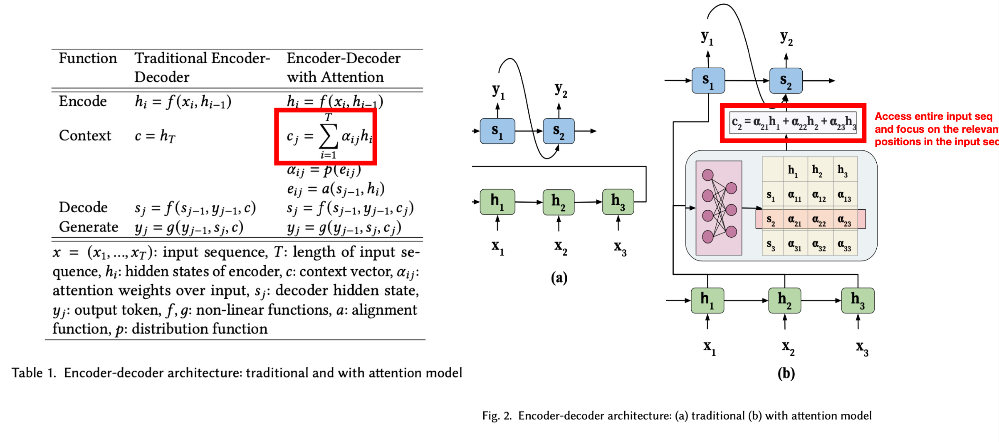


##### 🧮 核心公式（红框里的那行）

$$
c_j = \sum_{i=1}^{T} \alpha_{ij} h_i
$$

**解释：**
- **c_j**：表示在生成第 *j* 个输出词（例如 “am”）时的上下文向量。  
- **h_i**：表示输入句子的第 *i* 个词的隐藏状态（例如 *Je / suis / étudiant*）。  
- **αᵢⱼ**：注意力权重，表示“生成第 *j* 个输出词时，第 *i* 个输入词有多重要”。  
  - αᵢⱼ 越大，说明模型更关注那个输入词。

因此，当前输出词的上下文是所有输入信息的加权平均，权重由注意力机制自动分配。

---

##### 🎯 图例解释

右图展示了 Attention 的工作方式：

1️⃣ **下方绿色方块（Encoder）**  
输入每个词 *x₁, x₂, x₃*，生成对应隐藏状态 *h₁, h₂, h₃*。

2️⃣ **中间方格矩阵（Attention 权重 αᵢⱼ）**  
每个格子表示输入第 *i* 个词对输出第 *j* 个词的重要程度。  
例如，在生成 “am” 时，模型可能：  

- 对 “Je” 权重较小；  
- 对 “suis” 权重较大；  
- 对 “étudiant” 权重中等。

3️⃣ **上方蓝色方块（Decoder）**  
每生成一个输出词 *yⱼ*，都会计算一组新的注意力权重 αᵢⱼ，  
形成上下文向量 *cⱼ*：
$$
c_2 = \alpha_{21}h_1 + \alpha_{22}h_2 + \alpha_{23}h_3
$$

表示在生成第二个词 “am” 时，模型主要关注 “suis”。


其中注意力权重αᵢⱼ 不是人为设定的，而是 **模型自动学出来的**。注意力的本质是计算“语义相似度”。注意力机制是在 实时计算一个动态的“语义相关度矩阵”，而不是用预先定义好的相似度表。与Embedding的区别：

| 比较维度     | Embedding                        | Attention 权重                            |
| ------------ | -------------------------------- | ----------------------------------------- |
| **本质**     | 每个词的固定向量表示             | 动态计算出的语义“相似度”                  |
| **是否固定** | 训练好后基本固定（词向量）       | 每个解码步骤都会变（依上下文变化）        |
| **计算方式** | 从词典查表得到                   | 根据当前状态和输入向量计算（点积 / 拼接） |
| **作用**     | 表示词语含义                     | 判断当前输出词要关注哪个输入词            |
| **例子**     | “king” 和 “queen” 的余弦相似度高 | 生成 “am” 时更关注 “suis”                 |

模型内部大致会这样计算：

| 输入词   | Encoder隐藏向量 hᵢ | 与 Decoder当前状态 sⱼ 的匹配（相似度 eᵢⱼ） | Softmax 后的权重 αᵢⱼ |
| -------- | ------------------ | ------------------------------------------ | -------------------- |
| Je       | [0.2, 0.1, 0.9]    | 0.3                                        | 0.1                  |
| suis     | [0.8, 0.5, 0.7]    | 2.0                                        | 0.8                  |
| étudiant | [0.3, 0.2, 0.4]    | 0.4                                        | 0.1                  |

于是生成 “am” 的时候，模型相当于查了一次“相似度表”，但这张表是它 **即时计算的、带语境的**。


### 🎯 注意力机制公式（Transformer）

$$
A(q, K, V) = \sum_i p(a(k_i, q)) \times v_i
$$

| 符号            | 含义                                            | 类比                         |
| --------------- | ----------------------------------------------- | ---------------------------- |
| **q (query)**   | 当前需要“查找信息”的向量（比如 Decoder 当前词） | “我要找和我最相关的输入部分” |
| **kᵢ (key)**    | 每个输入词的“关键词”向量（来自 Encoder）        | “每个输入词的标签”           |
| **vᵢ (value)**  | 每个输入词真正包含的信息（来自 Encoder）        | “这个词的含义内容”           |
| **a(kᵢ, q)**    | 相似度函数，用来比较 q 和 kᵢ 的关系             | “query 和 key 的匹配分数”    |
| **p(a(kᵢ, q))** | Softmax 后的权重（注意力权重 αᵢ）               | “我关注每个输入词的程度”     |

##### 简单比喻总结

假设你在读一句话：「我 吃 苹果」

- 你现在在处理“吃”（Query）；
- 你去看句子中其他词的 Key：
  - “我”的 Key：表示“主语信息”
  - “吃”的 Key：表示“动词信息”
  - “苹果”的 Key：表示“宾语信息”
- 计算“吃”与各个词的匹配度：
  - 与“我”相似度高 → 权重 0.5
  - 与“吃”自己 → 权重 0.3
  - 与“苹果” → 权重 0.2
- 用这些权重加权每个词的 Value 向量，
   得到“吃”这个词的上下文表示。


#### 对齐和注意力

“对齐（alignment）” 表示每个输出词（Query）与输入序列中每个词（Key）之间的**关联强度**。模型通过计算这些 alignment scores 来决定「该关注谁多一点」。

右图：Attention 的实际流程（从 Encoder 到 Decoder）

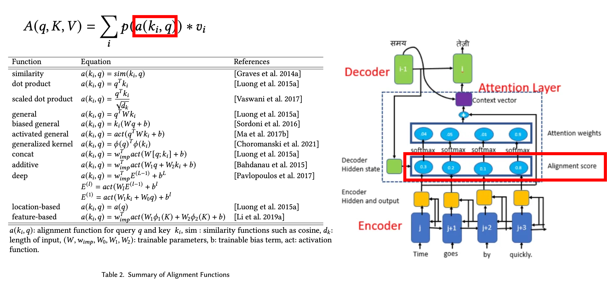


##### 🟦 **Encoder（输入编码）**

- 输入一句话（例如：“Time goes by quickly.”）

- 每个词通过编码器得到隐藏表示：

  $$
  h_1, \; h_2, \; h_3, \; h_4
  $$

- 这些向量作为 **Key (K)** 和 **Value (V)** 的来源。


##### 🟩 **Decoder（当前输出状态）**

- 当生成第 i个输出时，Decoder 有一个当前隐藏状态：  

  $$
  s_i
  $$

- 这个  s_i 就是 **Query (Q)**，表示「当前我想从输入中找什么信息」。


##### 🟥 **Attention Layer（注意力层）**

###### 1️⃣ Alignment score （对齐分数）

计算每个 Encoder 输出 h_j 与当前 Decoder 状态 s_i 的相关性：

$$
a(k_j, q_i) = a(h_j, s_i)
$$


例如：

$$
[0.3,\; 0.2,\; 0.1,\; 0.8]
$$

表示当前输出更关注第 4 个输入词。


###### 2️⃣ Softmax → Attention weights （注意力权重）

将这些分数归一化为概率分布：

$$
\alpha_{ij} = \mathrm{Softmax}\!\big(a(k_j, q_i)\big)
$$

$$
[0.3,\,0.2,\,0.1,\,0.8]
\;\Rightarrow\;
[0.04,\,0.05,\,0.01,\,0.90]
$$
权重越大，表示该输入词对当前输出越重要。


##### 3️⃣ 加权求和 → Context vector （上下文向量）


用注意力权重对所有 Value 进行加权求和：

$$
c_i = \sum_j \alpha_{ij}\, v_j
\qquad (\text{通常取 } v_j = h_j)
$$


 Attention 层让每个输出词 (Query) 在生成时，动态关注输入序列中最相关的部分，并通过 Key–Value 加权求和得到上下文表示。


##### 注意力机制的特点和优势

1. 注意力机制有助于克服循环神经网络(RNNs)的一些挑战，例如输 入序列长度增加时性能下降和顺序处理输入导致的计算效率低下。
2. 在自然语言处理(NLP)、计算机视觉(Computer Vision)、跨模 态任务和推荐系统等多个领域中，注意力机制已成为多项任务中的最先进模型，取得了显著的性能提升。
3. 注意力机制不仅可以提高主要任务的性能，还具有其他优势。它们被 广泛用于提高神经网络的可解释性，帮助解释模型的决策过程，使得 原本被认为是黑盒模型的神经网络变得更易解释。这对于人们对机器 学习模型的公平性、可追溯性和透明度的关注具有重要意义。


## Transformer

从 **老式的 RNN 模型（左边）** → 到 **Transformer 模型（右边）**，也就是「从一字一字读」变成「一眼看全句」。


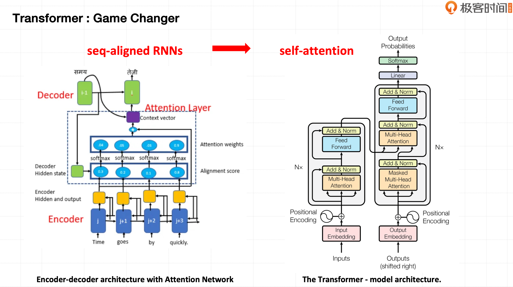


| 特点       | RNN + Attention | Transformer        |
| ---------- | --------------- | ------------------ |
| 看句子方式 | 一步步读        | 一眼看全           |
| 处理速度   | 慢（要等）      | 快（并行）         |
| 理解能力   | 局部            | 全局               |
| 代表模型   | 早期翻译模型    | GPT、BERT、ChatGPT |


#### Self-attention


$$
\text{Attention}(Q, K, V) = \mathrm{softmax}\!\left(\frac{QK^{T}}{\sqrt{d_k}}\right)V
$$


分为4步理解：

1. **计算相似度**  
   通过 \(QK^{T}\)，计算 Query 与 Key 的匹配程度。

2. **缩放（Scale）**  
   除以 \(\sqrt{d_k}\)，防止数值过大导致 softmax 不稳定。

3. **Softmax**  
   把相似度变成 0~1 的概率分布，得到注意力权重。

4. **加权求和（Weighted Sum）**  
   用这些权重乘以 Value 并求和，得到新的词表示。


Scaled Dot-Product Attention（缩放点积注意力）：


上图的计算过程：

```
Q, K, V
  ↓
MatMul（矩阵相乘，计算 QKᵀ）
  ↓
Scale（除以 √dk）
  ↓
Mask（可选，防止看未来词）
  ↓
Softmax（变成注意力分布）
  ↓
MatMul（乘以 V，得到结果）
```


Transformer 发现：
 如果只有一个 Attention Head（头），模型只能从一个角度去“看”句子。但语言有很多关系（语法、语义、位置等）， 所以引入了 **Multi-Head Attention（多头注意力）**。每个头单独计算一次 Attention：


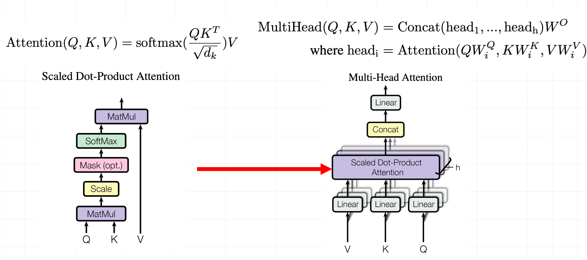


#### 预训练的3种架构


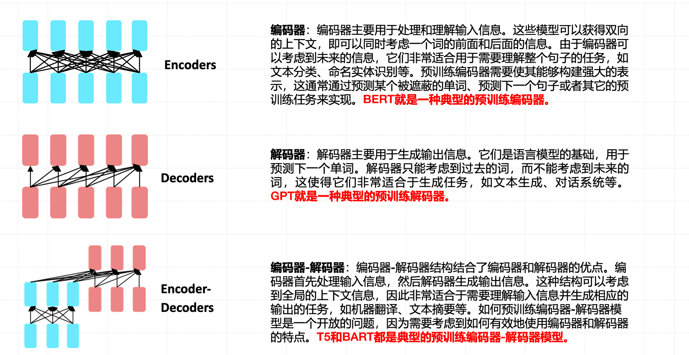


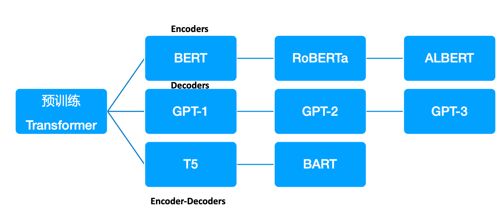


### BERT

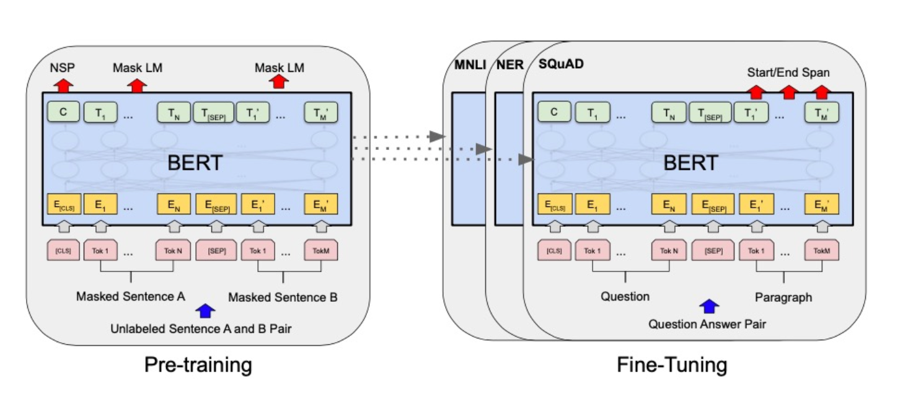

1.**全方位上下文理解**:与以前的模型(例如GPT)相比，BERT能够双向理解上下文，即同时考虑一个词 的左边和右边的上下文。这种全方位的上下文理解使得BERT能够更好地理解语言，特别是在理解词义、 消歧等复杂任务上有明显优势。

2.**预训练**+**微调(**Pre-training + Fine-tuning)**的策略**:BERT模型先在大规模无标签文本数据上进行预 训练，学习语言的一般性模式，然后在具体任务的标签数据上进行微调。这种策略让BERT能够在少量标 签数据上取得很好的效果，大大提高了在各种NLP任务上的表现。

3.**跨任务泛化能力**:BERT通过微调可以应用到多种NLP任务中，包括但不限于文本分类、命名实体识 别、问答系统、情感分析等。它的出现极大地简化了复杂的NLP任务，使得只需一种模型就能处理多种 任务。

4.**多语言支持**:BERT提供了多语言版本(Multilingual BERT)，可以支持多种语言，包括但不限于英 语、中文、德语、法语等，使得NLP任务能够覆盖更广的语言和区域。

5.**性能优异**:自BERT模型提出以来，它在多项NLP基准测试中取得了优异的成绩，甚至超过了人类的表 现。它的出现标志着NLP领域进入了预训练模型的新时代。

6.**开源和可接入性**:BERT模型和预训练权重由Google公开发布，让更多的研究者和开发者可以利用 BERT模型进行相关研究和应用开发，推动了整个NLP领域的发展。

å

##### 🧩 BERT vs GPT 差异

| 特性             | **BERT**                                             | **GPT**                                  |
| ---------------- | ---------------------------------------------------- | ---------------------------------------- |
| **训练方式**     | 自编码（Autocoding）                                 | 自回归（Autoregressive）                 |
| **预测目标**     | 给定上下文，预测其中一个或多个缺失单词               | 在给定的单词前提下，预测下一个单词       |
| **输入处理**     | 双向，可同时考虑一句话的左右上下文                   | 单向（从左到右）                         |
| **适用场景**     | 适合理解上下文，有助于信息提取、问答系统、情感分析等 | 适合生成式任务，如文章生成、诗歌创作等   |
| **模型架构**     | 基于 Transformer 的**编码器（Encoder）**             | 基于 Transformer 的**解码器（Decoder）** |
| **语言模型类型** | 判别式（Discriminative）                             | 生成式（Generative）                     |
| **优点**         | 对上下文理解能力较强                                 | 预测的连续性较强                         |
| **缺点**         | 生成的文本连贯性较弱                                 | 对上下文理解能力相对较弱                 |


##### 🤝 BERT vs GPT 共识

| 项目           | 内容                                                         |
| -------------- | ------------------------------------------------------------ |
| **模型架构**   | 均基于 Transformer                                           |
| **数据预处理** | 都需要对数据进行 Tokenization，一般使用**子词分片法（Subword Tokenization）** |
| **模型训练**   | 都使用了大量的无标签数据进行预训练                           |
| **任务迁移**   | 都可以通过 **Fine-tuning（微调）** 的方式进行任务迁移        |
| **训练目标**   | 都试图通过预训练理解语言的一般模式（如语法、语义、上下文关系等） |
| **多语言支持** | 均支持多语言模型训练                                         |
