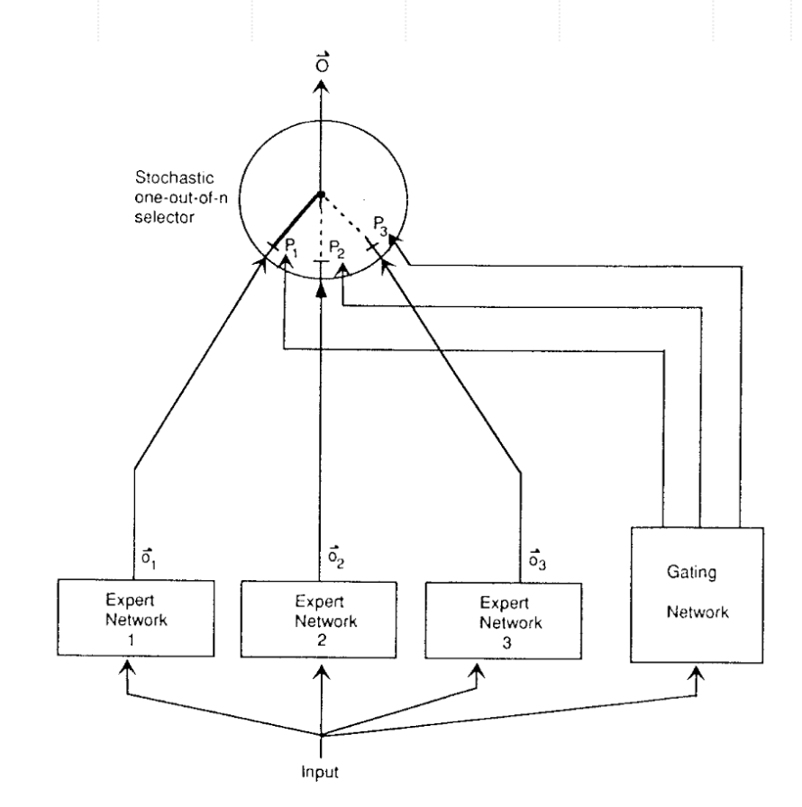
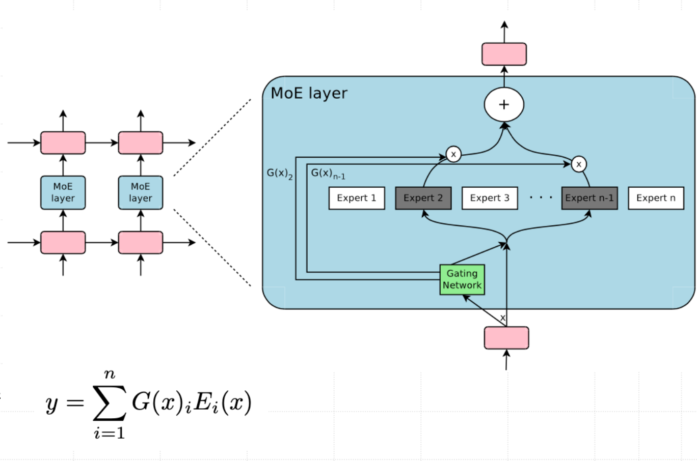
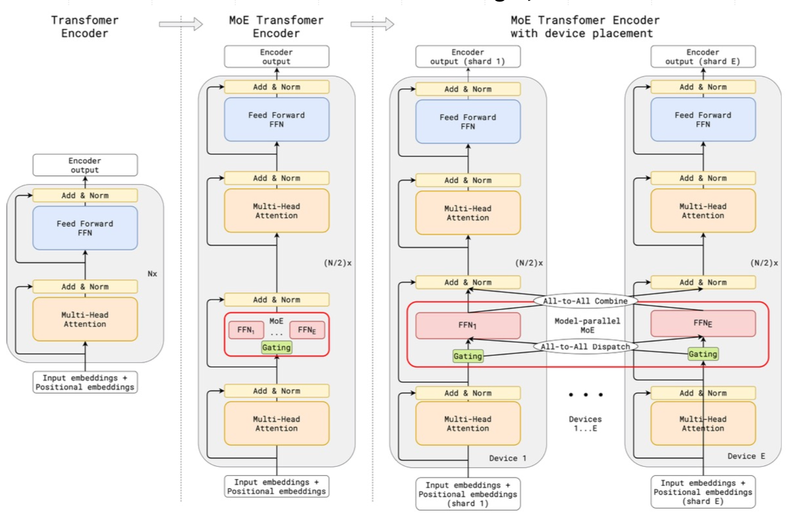
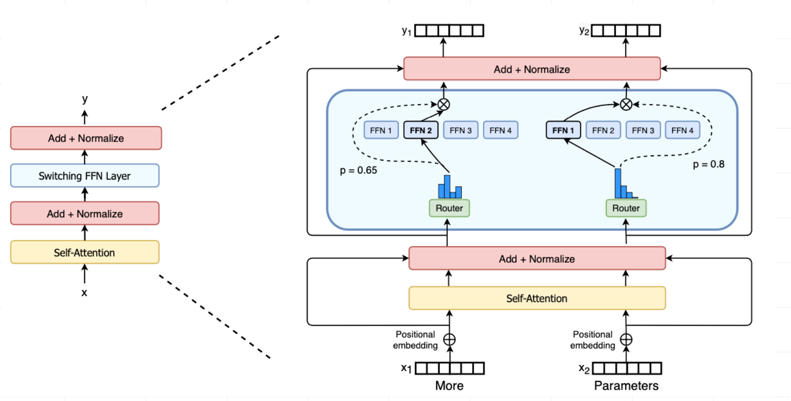
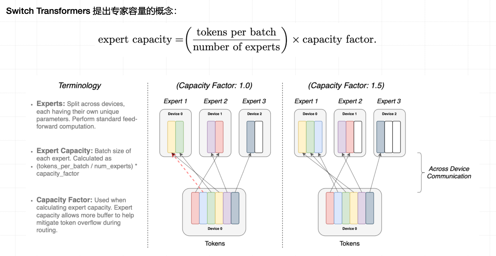
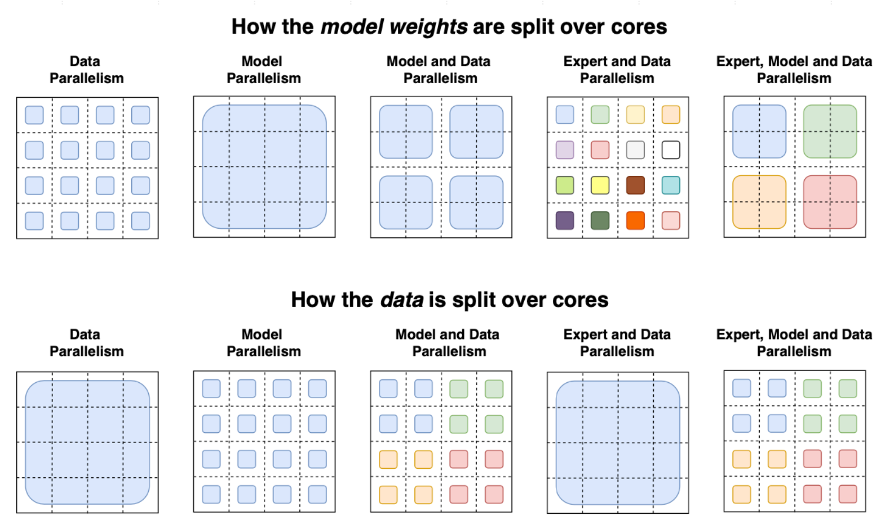
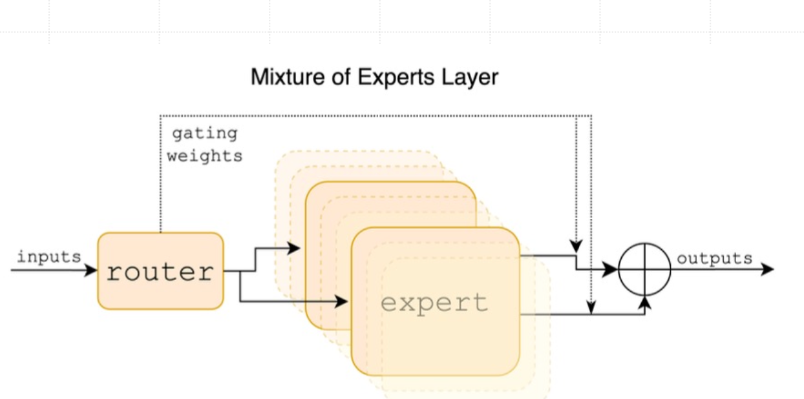

# 混合专家模型(MoEs)

Mixture-of-Experts, MoEs


## 一、MoE 的基本概念

- **核心思想**：用多个「专家网络（Expert）」分工处理不同类型的数据或任务。
- **门控网络（Gating Network）**：根据输入特征，动态决定调用哪些专家。
- **目标**：让模型既能扩展规模，又避免每次都激活所有参数（稀疏计算）。


## 二、技术发展简史

### 🧩 1991：自适应局部专家混合（Adaptive Mixtures of Local Experts）

- 由 **Michael Jordan 和 Geoffrey Hinton** 提出。
- **创新点**：
  - 多个专家网络 + 一个门控网络。
  - 各专家独立更新参数。
  - 模型能自适应调整不同专家的重要性。
- **意义**：分治复杂任务，每个专家处理特定子任务。





------

### 🧱 2013：深度混合专家模型（Deep MoE）

- 提出 **Deep Mixture of Experts (DMoE)** 架构。
- 将 MoE 与深度神经网络结合，每层可以是一个 MoE。
- 每个专家学习输入的部分特征（分解表示），最后综合形成完整表达。

------

### ⚙️ 2017：稀疏门控 MoE（Sparsely-Gated MoE）

- 由 **Hinton 与 Jeff Dean** 提出。
- **核心创新**：
  - 使用上千个前馈网络作为专家。
  - 每个样本仅激活少数几个专家（稀疏激活）。
  - 支持「条件计算」——只计算被选中的专家，降低计算量。





------

## 三、MoE 在大模型中的应用

### 🚀 2020：GShard（Google）

- 将 MoE 应用于 Transformer 的 FFN 层。
- **Top-2 门控机制**：每个 token 只经过两个专家。
- **优化手段**：
  - 随机路由机制：第二专家按概率选取。
  - 专家处理上限（防止负载不均）。
- **目标**：扩展模型至 6000 亿参数以上。




------

### 💡 2021：GLaM（Generalist Language Model）

- 稀疏激活的 MoE 语言模型。
- 比 GPT-3：
  - 训练能耗 ↓ 约 1/3
  - 推理计算量 ↓ 一半
- 展示了 MoE 能在大模型中提升性能又降低成本。

------

### ⚡ 2022：Switch Transformer

- Google 提出的万亿参数模型（1.6T）。
- 使用 **单专家（Top-1 Routing）**，进一步简化训练。
- 训练速度比 T5-XXL 提升 4 倍。
- 提出「专家容量」概念（每个专家能处理的 token 数上限）。









------

### 🧩 2024：Mixtral-8x7B（Mistral AI）

- 每层有 8 个专家，每次激活其中 2 个。
- 总参数 47B，但推理只需激活约 13B 参数。
- 在数学、代码、多语言任务上超越 LLaMA-2-70B、GPT-3.5。
- 聊天版 **Mixtral-8x7B-Instruct** 人类评测优于 GPT-3.5 Turbo、Claude-2.1、Gemini Pro。





## 四、MoE 与集成学习的区别

| 对比项 | 混合专家模型 (MoE)     | 集成学习 (Ensemble Learning) |
| ------ | ---------------------- | ---------------------------- |
| 结构   | 专家由门控网络动态选择 | 所有模型独立预测再合并       |
| 协作   | 专家间有交互与协调     | 各模型独立，无交互           |
| 目标   | 分治复杂任务           | 提高稳定性与准确率           |
| 应用   | 适合数据异质任务       | 适合提升泛化性能             |
| 复杂度 | 较高（需门控机制）     | 较低                         |


## 五、怎么加入Transformer的


#### 一句话概况

在 Transformer 的某些层（尤其是前馈层 FFN）中，把原来的 **单一前馈网络（Feed-Forward Network）**，替换成 **多个专家（Experts）+ 门控网络（Gating Network）**，每个 token 只会经过少量专家（例如 Top-2）。这样做能让模型容量变大、但计算量不变。


#### 回顾普通 Transformer 的一层结构

普通的 Transformer 块分为两部分：

```
[Input] → [Multi-Head Attention] → [Feed Forward Network (FFN)]
```

在 PyTorch 伪代码里，FFN 大致这样写👇

```
class FFN(nn.Module):
    def __init__(self, hidden_dim, ffn_dim):
        super().__init__()
        self.fc1 = nn.Linear(hidden_dim, ffn_dim)
        self.act = nn.GELU()
        self.fc2 = nn.Linear(ffn_dim, hidden_dim)

    def forward(self, x):
        return self.fc2(self.act(self.fc1(x)))
```

也就是说，每个 token 都会经过同一个 FFN。
 这在模型变大后会非常耗算力。


#### MoE 替换 FFN 层的思路

MoE 版本（以 **Switch Transformer / Mixtral / GLaM** 为代表），在 **Transformer 的 FFN 层** 里做了替换👇

```
原来：
   FFN(x)

现在：
   MoE(x) = Σ [ g_i(x) * Expert_i(x) ]
```

即每个 token 不再经过同一个 FFN，而是由 **门控网络 (Gating Network)** 决定去哪个专家 (Expert)。


#### 🧩 结构示意图

```
                 ┌─────────────────────┐
Input token ───► │ Multi-Head Attention│
                 └─────────────────────┘
                          │
                          ▼
                ┌─────────────────────┐
                │  Gating Network     │──► 输出各专家得分
                └─────────────────────┘
                          │
                          ▼
         ┌─────────────┬─────────────┬─────────────┐
         │ Expert 1     │ Expert 2     │ Expert 3     │
         │ (FFN)        │ (FFN)        │ (FFN)        │
         └─────────────┴─────────────┴─────────────┘
                          │
       仅选 Top-k 专家（稀疏计算），加权输出
                          │
                          ▼
                   [Residual + LayerNorm]
```

📘 所以在 MoE Transformer 中，
 只是把「FFN层」换成了「MoE层」。
 其他部分（Attention、LayerNorm、残差）都不变。


#### 🚀 为什么这样设计有效？

| 优势         | 说明                                                         |
| ------------ | ------------------------------------------------------------ |
| **稀疏激活** | 每个 token 只经过少数专家（例如 2 个），计算量不随参数总量线性增长。 |
| **容量大**   | 可以容纳数十亿或上万亿参数的专家，但每步只用其中一小部分。   |
| **分工更细** | 不同专家学习不同语义区域或任务类型。                         |


#### 🔧 PyTorch 简化伪代码

```python
import torch
import torch.nn as nn

class MoE(nn.Module):
    def __init__(self, num_experts, hidden_dim, ffn_dim, k=2):
        super().__init__()
        self.gate = nn.Linear(hidden_dim, num_experts)  # 门控网络：决定激活哪些专家
        self.experts = nn.ModuleList([                 # 定义多个专家（每个是独立的 FFN）
            nn.Sequential(
                nn.Linear(hidden_dim, ffn_dim),
                nn.GELU(),
                nn.Linear(ffn_dim, hidden_dim)
            ) for _ in range(num_experts)
        ])
        self.k = k  # 每次激活的专家数量（Top-k）

    def forward(self, x):
        gate_scores = torch.softmax(self.gate(x), dim=-1)  # 门控得分（每个专家的概率）
        topk = torch.topk(gate_scores, self.k, dim=-1)     # 选出前 k 个专家
        output = 0
        for i in range(self.k):
            expert_idx = topk.indices[..., i]               # 当前专家索引
            expert_weight = topk.values[..., i].unsqueeze(-1)  # 当前专家权重
            expert_out = self.experts[expert_idx](x)        # 调用对应专家计算
            output += expert_weight * expert_out            # 加权融合输出
        return output

```

