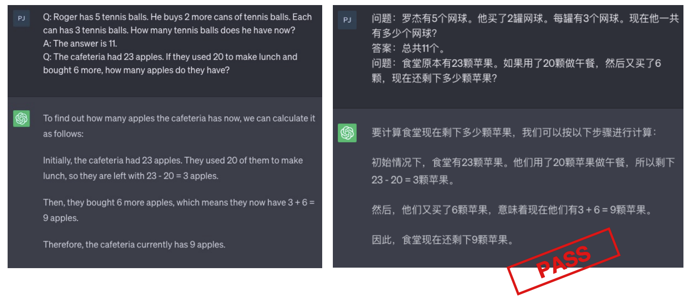
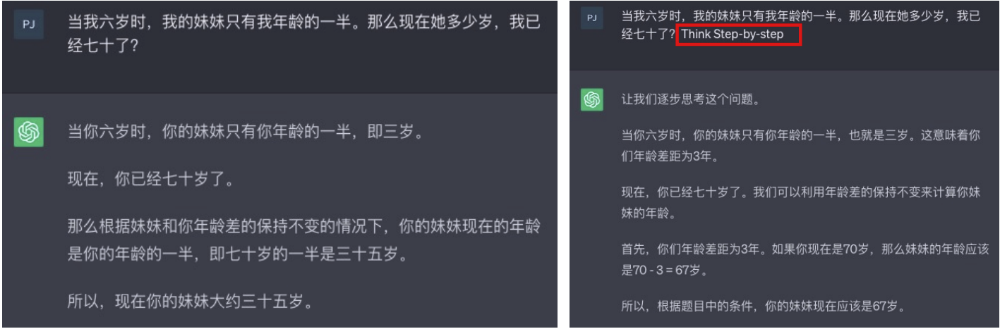

# Chain-of-Thought (COT)

## 概念

CoT Prompting 作为一种促进语言模型推理的方法具有几个吸引人的特点：

* 首先，从原则上讲，CoT 允许模型将多步问题分解为中间步骤，这意味着可以将额外计算资源分配给需要更多推理步骤的问题。
* 其次，CoT 提供了对模型行为的可解释窗口，提示了它可能是如何得出特定答案的，并提供了调试推理路径错误之处的机会（尽管完全描述支持答案的模型计算仍然是一个未解决问题）。
* 第三，在数学应用题、常识推理和符号操作等任务中都可以使用思维链推理（CoT Reasoning），并且在原则上适用于任何人类能够通过语言解决的任务。
* 最后，在足够大规模现成语言模型中很容易引发 CoT Reasoning ，只需在少样本提示示例中包含一 些连贯思路序列即可

## 举例

### 计算题

###逻辑推理题

利用关键字“Think step-by-step”

