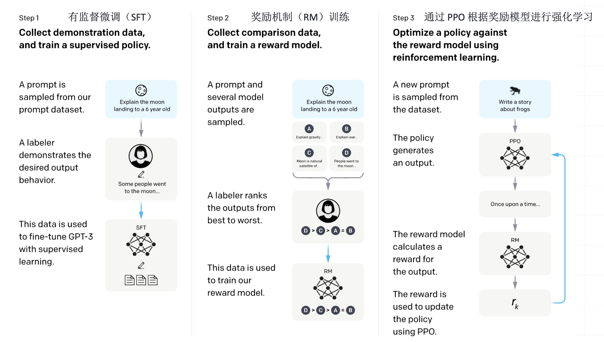

# GPT 家族

## 预训练模型类型

## GPT-1

GPT-1是一个Decoder。

* Transformer decoder with 12 layers, 117M parameters.
* 768-dimensional hidden states, 3072-dimensional feed-forward hidden layers.
*  Byte-pair encoding with 40,000 merges

## GPT-2

GPT-2, a larger version (1.5B Parameters) of GPT trained on more data(40GB of text collected from
upvoted links from reddit), was shown to produce relatively convincing samples of natural language.

## GPT-3

In-context learning

For GPT-3 ， The largest T5 model had 11 billion parameters. GPT-3 has 175 billion parameters.

### In-context learning

* zero-shot 无参考事例
* One-shot 有参考事例
* Few-shot 一些参考事例

## 对比

## 关键概念

###In-Context Learning

在上下文中学习指的是大型语言模型如GPT-3的一种能力，即在给定的上
下文中使用新的输入来改善模型的输出。这种学习方式并不涉及到梯度更新或微调模型的参数，
而是通过提供一些具有特定格式或结构的示例输入，使模型能够在生成输出时利用这些信息。例
如，如果你在对话中包含一些英法翻译的例子，然后问模型一个新的翻译问题，模型可能会根据
你提供的上下文示例生成正确的翻译。

###Few-Shot Learning

少样本学习是指用极少量的标注样本来训练机器学习模型的技术。在GPT3的案例中，少样本学习的实现方式是向模型提供少量的输入-输出对示例，这些示例作为对话的
一部分，描述了模型应该执行的任务。然后，模型会生成一个输出，该输出是对与示例类似的新
输入的响应。例如，你可以给模型提供几个英法翻译的例子，然后给出一个新的英文单词让模型
翻译，模型会尝试产生一个正确的翻译。

###Prompt Engineering

提示工程是指设计和优化模型的输入提示以改善模型的输出。在大型语言
模型中，如何提问或构造输入的方式可能对模型的输出有重大影响。因此，选择正确的提示对于
获取有用的输出至关重要。例如，为了让GPT-3生成一个诗歌，你可能需要提供一个详细的、引
导性的提示，如“写一首关于春天的十四行诗”，而不仅仅是“写诗”。

## 技术优势

### Pre-Trained LM + Fine-Tuning 范式

### OpenAI的模型迭代：预训练与微调的共舞

在 GPT 模型的演进过程中，OpenAI 采用了一系列的训练策略，这包括基础的大规模预训练，也包括后
续的指令微调等方法。这两种策略在模型的训练过程中起到了不同的作用。

####预训练(Pre-Trained)

 大规模预训练是为了使模型获取丰富的语言知识和理解能力。在预训练过程
中，模型通过大量的无标签数据来学习语言的基础知识，这一过程主要是依赖无监督学习的。

###指令微调(Instruction-Tuning)

在预训练模型的基础上，通过针对特定任务的标注数据进行微调，
能够使模型在特定任务上的表现得到提升。同时，通过对微调数据的精心设计和选择，还能够引导模
型按照人类的预期来执行任务。这一过程主要依赖有监督学习。

在这个过程中，预训练和微调是相辅相成的。预训练为模型提供了丰富的语言知识，而微调则利用这些
知识来解决特定的任务。然而，微调的数据量通常比预训练的数据量要少得多，因此微调的主要作用并
不是为模型注入新的知识，而是激发和引导模型利用已有的知识来完成特定任务

### CHatGPT 三段训练法

### GPT-4 多模态开启 LLM-native 应用时代

2022年8月，GPT-4 模型训练完成。2023年3月14日，OpenAI 正式发布 GPT-4。 与GPT-3和GPT-3.5相比，
GPT-4在各方面都有所优化和提升：

1. 多模态模型： GPT-4支持图像输入，出色的视觉信息理解能力使得GPT-4能对接更多样化的下游任务，
如：描述不寻常图像中的幽默、总结截屏文本以及回答包含图表的试题。在文本理解能力上，GPT-4 在中
文和多轮对话中也表现出远超 GPT-3.5 的能力。
2. 扩展上下文窗口：gpt-4 and gpt-4-32k 分别提供了最大长度为8192和32768个token的上下文窗口。这使
得 GPT-4可以通过更多的上下文来完成更复杂的任务，也为 思维链（CoT）、思维树（ToT）等后续工作
提供了可能。
3. GPT+生态 ：借助GPT-4强大能力，依托 ChatGPT Plugin 搭建AIGC应用生态商店（类似 App Store）
4. 应用+GPT ：GPT-4已经被应用在多个领域，包括微软Office、Duolingo、Khan Academy等。