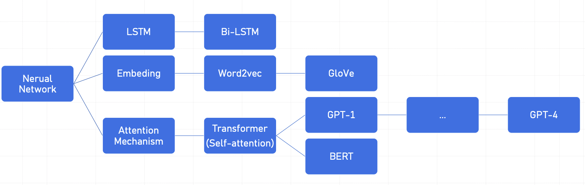
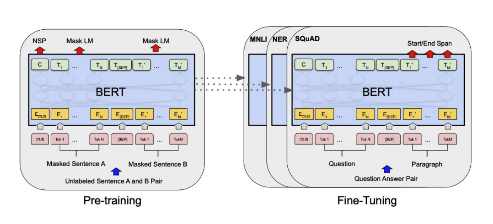
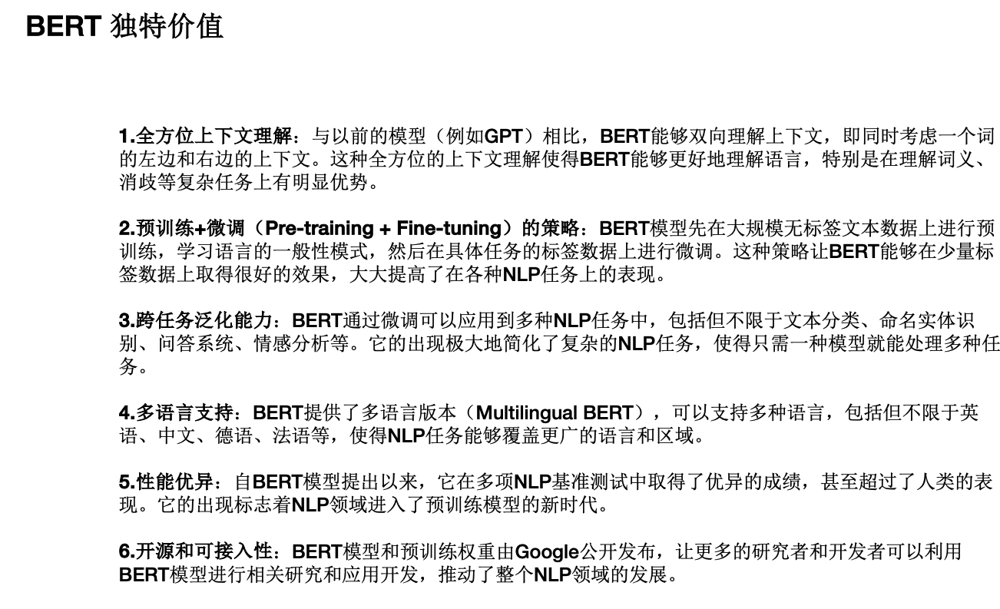
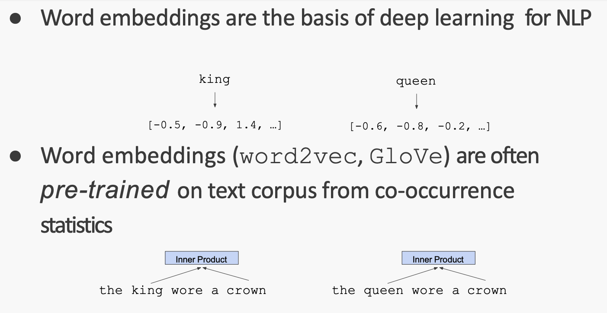
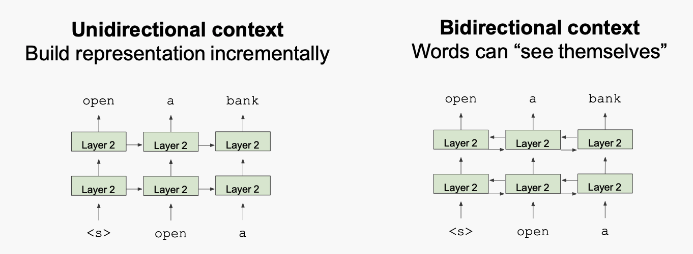
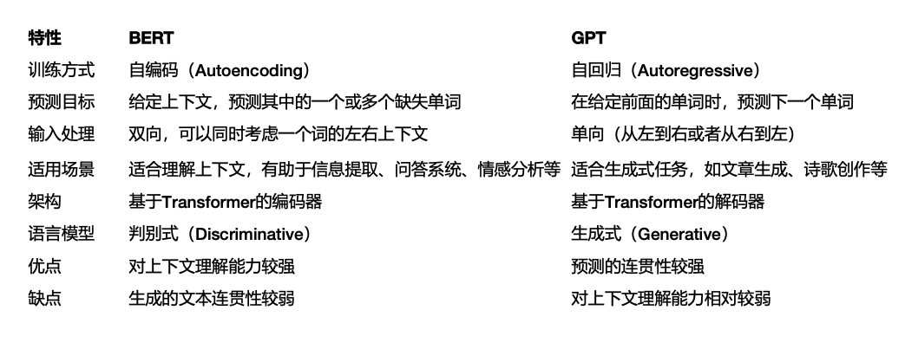
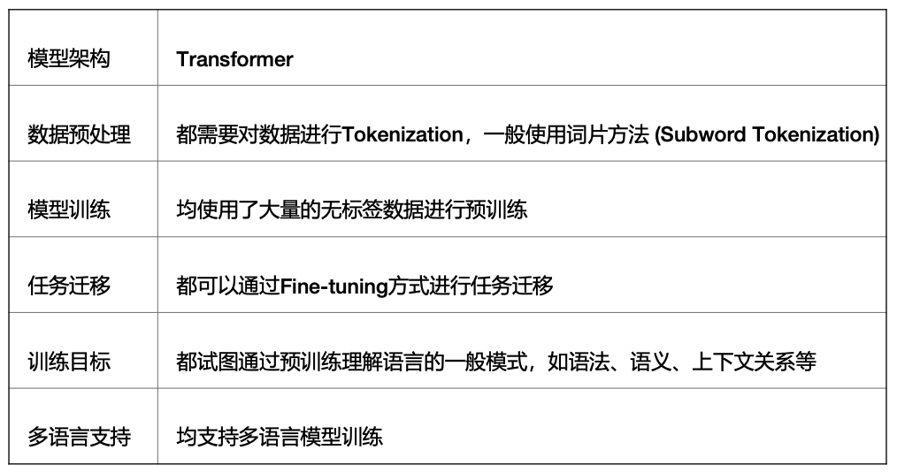

# BERT 和 GPT不同的走向

##神经网络的发展

## BERT的优势

利用**预训练模型**，做少量增量训练，得到最终的模型。

Unlabeled sentence A and B pair： 不用做标注了。

### 预训练

预训练的transformer

比如queen 和 king可以如上图所示变成2个向量。“king减去queue的差值”与“国王减去王后的差值”类似。

### 双向模型

## BERT 和 GPT的差异

## BERT 和 GPT的共识

