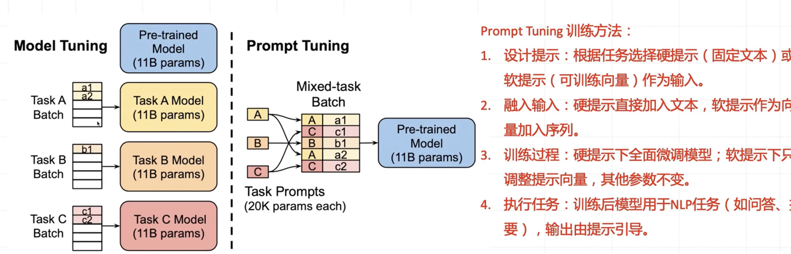
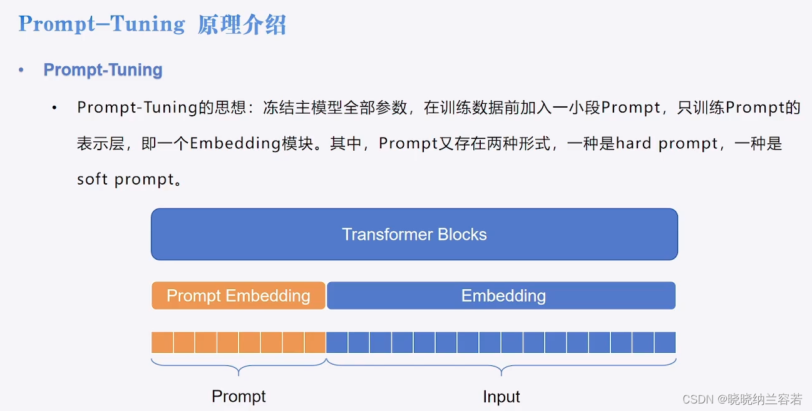
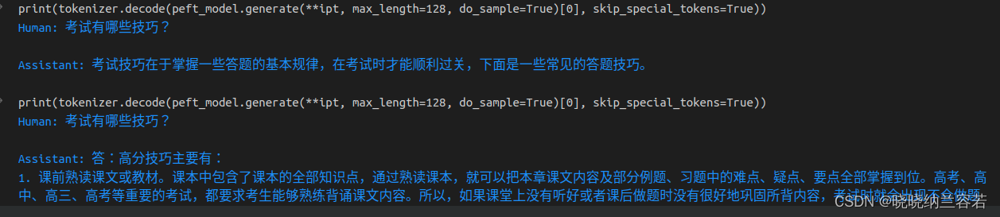
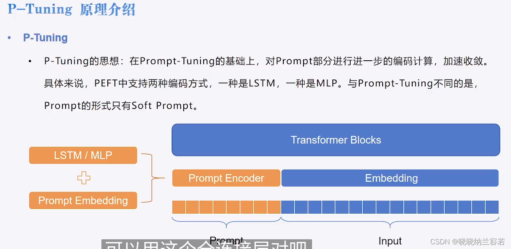
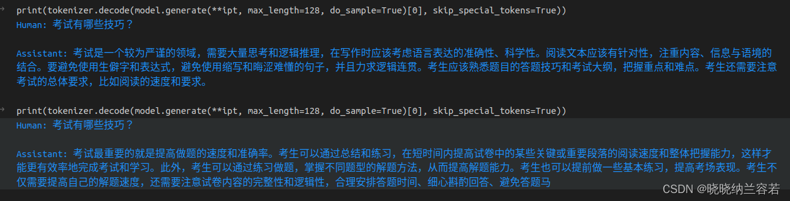
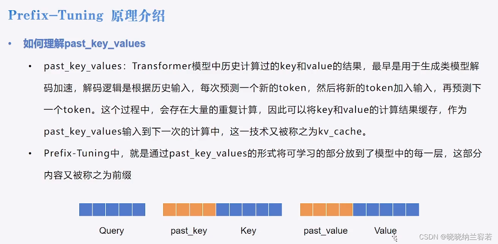

# 大模型高效微调（PEFT）技术


大模型高效微调（PEFT）是一种用于微调预训练语言模型的技术。在大规模的预训练语言模型已经被证明在各种自然语言处理任务上具有优异性能的情况下，微调成为了一种常见的策略，用于特定任务或领域的定制。PEFT（Parameter-efficient Fine-Tuning）旨在通过最小化微调过程中的参数数量，以及在微调过程中保持预训练参数不变，从而使微调过程更为高效。PEFT 的核心思想是，在微调过程中尽可能地保持预训练参数的值，而只微调部分参数以适应特定任务的需求，从而在保持模型性能的同时，减少微调所需的计算资源和时间成本。这使得 PEFT 技术在资源受限或时间敏感的环境下特别有用，同时也有助于避免对预训练参数的过度调整，从而减轻对预训练模型的“遗忘”现象。


## Prompt Tuning 

Prompt Tuning 的优势在于它可以在不修改预训练模型的情况下，通过设计不同的提示来适应不同的任务，从而实现对多种任务的灵活应用。这使得 Prompt Tuning 成为一种非常高效和通用的技术，特别是在自然语言处理领域的各种任务中。







rd Prompt 和 Soft Prompt 是两种不同类型的提示（prompt），用于引导模型执行特定任务的不同方式。它们的区别在于对提示的处理方式和模型输出的约束程度。

1. **Hard Prompt（硬提示）：**
   - 在 Hard Prompt 中，提示提供了明确的指令或限制，强制模型生成特定类型的输出。这意味着模型必须遵循提示的指示，以生成符合指定条件的输出。
   - 例如，在情感分类任务中的硬提示可能是：“给定以下文本，请预测文本的情感类别：积极、中性或消极。”在这种提示下，模型必须按照指示预测文本的情感类别，并且输出必须是积极、中性或消极之一。
2. **Soft Prompt（软提示）：**
   - 在 Soft Prompt 中，提示提供了一种指导，但并不强制模型生成特定类型的输出。相反，模型可以根据提示提供的指导进行自由地生成输出，而不受严格的约束。
   - 例如，在情感分类任务中的软提示可能是：“给定以下文本，请预测文本的情感类别。”在这种提示下，模型可以根据文本的内容自由地生成情感类别的预测，而不受特定类别的约束。

综上所述，Hard Prompt 强制模型生成符合指定条件的输出，而 Soft Prompt 则提供一种指导，允许模型在提示的指导下自由地生成输出。选择何种类型的提示取决于任务的需求和希望模型的自由度。


### 代码


```python
from datasets import load_from_disk
from transformers import AutoTokenizer, AutoModelForCausalLM, DataCollatorForSeq2Seq
from transformers import pipeline, TrainingArguments, Trainer
from peft import PromptTuningConfig, get_peft_model, TaskType, PromptTuningInit, PeftModel
 
# 分词器
tokenizer = AutoTokenizer.from_pretrained("Langboat/bloom-1b4-zh")
 
# 函数内将instruction和response拆开分词的原因是：
# 为了便于mask掉不需要计算损失的labels, 即代码labels = [-100] * len(instruction["input_ids"]) + response["input_ids"]
def process_func(example):
    MAX_LENGTH = 256
    input_ids, attention_mask, labels = [], [], []
    instruction = tokenizer("\n".join(["Human: " + example["instruction"], example["input"]]).strip() + "\n\nAssistant: ")
    response = tokenizer(example["output"] + tokenizer.eos_token)
    input_ids = instruction["input_ids"] + response["input_ids"]
    attention_mask = instruction["attention_mask"] + response["attention_mask"]
    labels = [-100] * len(instruction["input_ids"]) + response["input_ids"]
    if len(input_ids) > MAX_LENGTH:
        input_ids = input_ids[:MAX_LENGTH]
        attention_mask = attention_mask[:MAX_LENGTH]
        labels = labels[:MAX_LENGTH]
    return {
        "input_ids": input_ids,
        "attention_mask": attention_mask,
        "labels": labels
    }
 
if __name__ == "__main__":
    # 加载数据集
    dataset = load_from_disk("./PEFT/data/alpaca_data_zh")
    
    # 处理数据
    tokenized_ds = dataset.map(process_func, remove_columns = dataset.column_names)
    # print(tokenizer.decode(tokenized_ds[1]["input_ids"]))
    # print(tokenizer.decode(list(filter(lambda x: x != -100, tokenized_ds[1]["labels"]))))
    
    # 创建模型
    model = AutoModelForCausalLM.from_pretrained("Langboat/bloom-1b4-zh", low_cpu_mem_usage=True)
    
    # 设置 Prompt-Tuning
    # Soft Prompt
    # config = PromptTuningConfig(task_type=TaskType.CAUSAL_LM, num_virtual_tokens=10) # soft_prompt会随机初始化
    # Hard Prompt
    config = PromptTuningConfig(task_type = TaskType.CAUSAL_LM,
                                prompt_tuning_init = PromptTuningInit.TEXT,
                                prompt_tuning_init_text = "下面是一段人与机器人的对话。", # 设置hard_prompt的具体内容
                                num_virtual_tokens = len(tokenizer("下面是一段人与机器人的对话。")["input_ids"]),
                                tokenizer_name_or_path = "Langboat/bloom-1b4-zh")
    model = get_peft_model(model, config) # 生成Prompt-Tuning对应的model
    print(model.print_trainable_parameters())
    
    # 训练参数
    args = TrainingArguments(
        output_dir = "/tmp_1203",
        per_device_train_batch_size = 1,
        gradient_accumulation_steps = 8,
        logging_steps = 10,
        num_train_epochs = 1
    )
    
    # trainer
    trainer = Trainer(
        model = model,
        args = args,
        train_dataset = tokenized_ds,
        data_collator = DataCollatorForSeq2Seq(tokenizer = tokenizer, padding = True)
    )
    
    # 训练模型
    trainer.train()
    
    # 模型推理
    model = AutoModelForCausalLM.from_pretrained("Langboat/bloom-1b4-zh", low_cpu_mem_usage=True)
    peft_model = PeftModel.from_pretrained(model = model, model_id = "/tmp_1203/checkpoint-500/")
    peft_model = peft_model.cuda()
    ipt = tokenizer("Human: {}\n{}".format("考试有哪些技巧？", "").strip() + "\n\nAssistant: ", return_tensors="pt").to(peft_model.device)
    print(tokenizer.decode(peft_model.generate(**ipt, max_length=128, do_sample=True)[0], skip_special_tokens=True))
```


### 运行结果





## P-Tuning


P-Tuning 是在 Prompt-Tuning的基础上，通过新增 LSTM 或 MLP 编码模块来加速模型的收敛；"P-Tuning" 是一种基于 Prompt Tuning 的改进方法，旨在通过引入一个参数化的 Prompt 机制来进一步优化 Prompt Tuning。


1. **Prompt 参数化：**
   - 在 Prompt Tuning 中，提示是固定的，不随着模型的训练而变化。而在 P-Tuning 中，提示是可学习的，并作为模型的一部分，可以根据任务和数据动态调整。
2. **参数化 Prompt 的学习：**
   - 在 P-Tuning 中，模型通过与输入数据一起联合训练，学习如何使用参数化的 Prompt 来指导输出生成。这使得模型能够在训练过程中自适应地调整提示，以最大程度地提高任务性能。
3. **灵活性和泛化能力：**
   - P-Tuning 提供了更大的灵活性和泛化能力，因为它可以根据不同任务和数据集动态调整提示。这使得模型能够更好地适应各种任务，而无需手动设计和选择提示。
4. **性能提升：**
   - P-Tuning 通常可以带来比传统的 Prompt Tuning 更好的性能，因为它能够更灵活地利用提示来指导模型生成输出。参数化的 Prompt 可以根据任务的需求进行优化，从而提高模型的性能。





### 代码

```python
from datasets import load_from_disk
from transformers import AutoTokenizer, AutoModelForCausalLM, DataCollatorForSeq2Seq
from transformers import TrainingArguments, Trainer
from peft import PromptEncoderConfig, TaskType, get_peft_model, PromptEncoderReparameterizationType
 
# 分词器
tokenizer = AutoTokenizer.from_pretrained("Langboat/bloom-1b4-zh")
 
# 函数内将instruction和response拆开分词的原因是：
# 为了便于mask掉不需要计算损失的labels, 即代码labels = [-100] * len(instruction["input_ids"]) + response["input_ids"]
def process_func(example):
    MAX_LENGTH = 256
    input_ids, attention_mask, labels = [], [], []
    instruction = tokenizer("\n".join(["Human: " + example["instruction"], example["input"]]).strip() + "\n\nAssistant: ")
    response = tokenizer(example["output"] + tokenizer.eos_token)
    input_ids = instruction["input_ids"] + response["input_ids"]
    attention_mask = instruction["attention_mask"] + response["attention_mask"]
    labels = [-100] * len(instruction["input_ids"]) + response["input_ids"]
    if len(input_ids) > MAX_LENGTH:
        input_ids = input_ids[:MAX_LENGTH]
        attention_mask = attention_mask[:MAX_LENGTH]
        labels = labels[:MAX_LENGTH]
    return {
        "input_ids": input_ids,
        "attention_mask": attention_mask,
        "labels": labels
    }
 
if __name__ == "__main__":
    # 加载数据集
    dataset = load_from_disk("./PEFT/data/alpaca_data_zh")
    
    # 处理数据
    tokenized_ds = dataset.map(process_func, remove_columns = dataset.column_names)
    # print(tokenizer.decode(tokenized_ds[1]["input_ids"]))
    # print(tokenizer.decode(list(filter(lambda x: x != -100, tokenized_ds[1]["labels"]))))
    
    # 创建模型
    model = AutoModelForCausalLM.from_pretrained("Langboat/bloom-1b4-zh", low_cpu_mem_usage=True)
    
    # 设置 P-Tuning
    # 使用 MLP
    config = PromptEncoderConfig(task_type=TaskType.CAUSAL_LM, num_virtual_tokens=10,
                             encoder_reparameterization_type=PromptEncoderReparameterizationType.MLP,
                             encoder_hidden_size=1024)
    # 使用LSTM
    config = PromptEncoderConfig(task_type=TaskType.CAUSAL_LM, num_virtual_tokens=10,
                             encoder_reparameterization_type=PromptEncoderReparameterizationType.LSTM,
                             encoder_dropout=0.1, encoder_num_layers=1, encoder_hidden_size=1024)
 
    model = get_peft_model(model, config) # 生成P-Tuning对应的model
    print(model.print_trainable_parameters())
    
    # 训练参数
    args = TrainingArguments(
        output_dir = "/tmp_1203",
        per_device_train_batch_size = 1,
        gradient_accumulation_steps = 8,
        logging_steps = 10,
        num_train_epochs = 1
    )
    
    # trainer
    trainer = Trainer(
        model = model,
        args = args,
        train_dataset = tokenized_ds,
        data_collator = DataCollatorForSeq2Seq(tokenizer = tokenizer, padding = True)
    )
    
    # 训练模型
    trainer.train()
    
    # 模型推理
    model = model.cuda()
    ipt = tokenizer("Human: {}\n{}".format("考试有哪些技巧？", "").strip() + "\n\nAssistant: ", return_tensors="pt").to(model.device)
    print(tokenizer.decode(model.generate(**ipt, max_length=128, do_sample=True)[0], skip_special_tokens=True))
 
```


### 输出结果





## Prefix-Tuning


   Prefix-Tuning 会把可训练参数嵌入到整个模型中，即前缀；

​    Prefix-Tuning 将多个 prompt vectors 放在每个 multi-head attention 的 key 矩阵和 value 矩阵之前；6





### 代码


```python
from datasets import load_from_disk
from transformers import AutoTokenizer, AutoModelForCausalLM, DataCollatorForSeq2Seq
from transformers import pipeline, TrainingArguments, Trainer
from peft import PrefixTuningConfig, get_peft_model, TaskType
 
# 分词器
tokenizer = AutoTokenizer.from_pretrained("Langboat/bloom-1b4-zh")
 
# 函数内将instruction和response拆开分词的原因是：
# 为了便于mask掉不需要计算损失的labels, 即代码labels = [-100] * len(instruction["input_ids"]) + response["input_ids"]
def process_func(example):
    MAX_LENGTH = 256
    input_ids, attention_mask, labels = [], [], []
    instruction = tokenizer("\n".join(["Human: " + example["instruction"], example["input"]]).strip() + "\n\nAssistant: ")
    response = tokenizer(example["output"] + tokenizer.eos_token)
    input_ids = instruction["input_ids"] + response["input_ids"]
    attention_mask = instruction["attention_mask"] + response["attention_mask"]
    labels = [-100] * len(instruction["input_ids"]) + response["input_ids"]
    if len(input_ids) > MAX_LENGTH:
        input_ids = input_ids[:MAX_LENGTH]
        attention_mask = attention_mask[:MAX_LENGTH]
        labels = labels[:MAX_LENGTH]
    return{
        "input_ids": input_ids,
        "attention_mask": attention_mask,
        "labels": labels
    }
 
if __name__ == "__main__":
    # 加载数据集
    dataset = load_from_disk("./PEFT/data/alpaca_data_zh")
    
    # 处理数据
    tokenized_ds = dataset.map(process_func, remove_columns = dataset.column_names)
    # print(tokenizer.decode(tokenized_ds[1]["input_ids"]))
    # print(tokenizer.decode(list(filter(lambda x: x != -100, tokenized_ds[1]["labels"]))))
    
    # 创建模型
    model = AutoModelForCausalLM.from_pretrained("Langboat/bloom-1b4-zh", low_cpu_mem_usage=True)
    
    # 设置Prefix-tuning
    config = PrefixTuningConfig(task_type = TaskType.CAUSAL_LM, num_virtual_tokens = 10, prefix_projection = True)
    model = get_peft_model(model, config)
    # print(model.prompt_encoder)
    # print(model.print_trainable_parameters())
    
    # 训练参数
    args = TrainingArguments(
        output_dir = "/tmp_1203",
        per_device_train_batch_size = 1,
        gradient_accumulation_steps = 8,
        logging_steps = 10,
        num_train_epochs = 1
    )
    
    # trainer
    trainer = Trainer(
        model = model,
        args = args,
        train_dataset = tokenized_ds,
        data_collator = DataCollatorForSeq2Seq(tokenizer = tokenizer, padding = True)
    )
    
    # 训练模型
    trainer.train()
    
    # 模型推理
    model = model.cuda()
    ipt = tokenizer("Human: {}\n{}".format("考试有哪些技巧？", "").strip() + "\n\nAssistant: ", return_tensors="pt").to(model.device)
    print(tokenizer.decode(model.generate(**ipt, max_length=128, do_sample=True)[0], skip_special_tokens=True))
```


