# Transformer
参考：https://blog.csdn.net/jokerxsy/article/details/116299343

## 结构

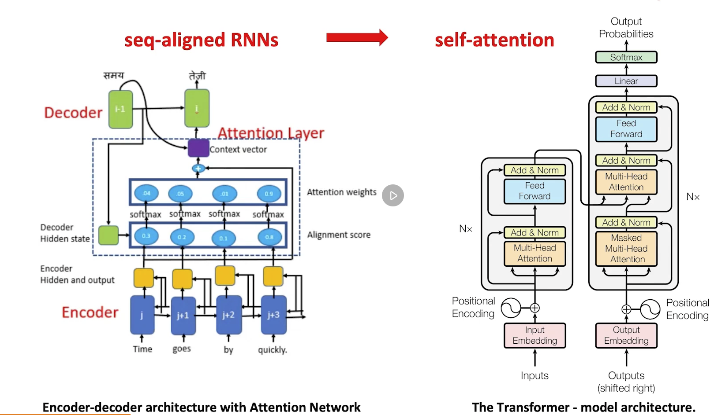

左图是一个序列对齐的方式。Transformer改变了序列对齐，以self-attention的方式处理。

## Self-attention

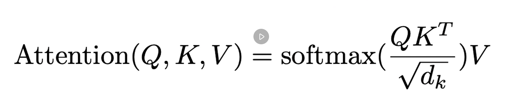

* V：输入
* 括号内为对齐函数

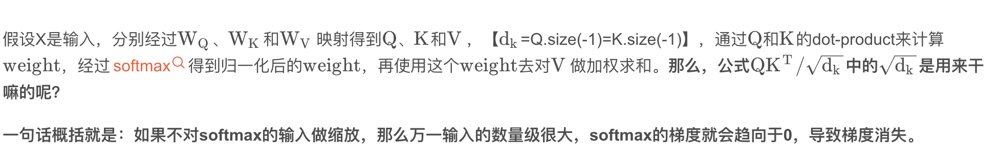

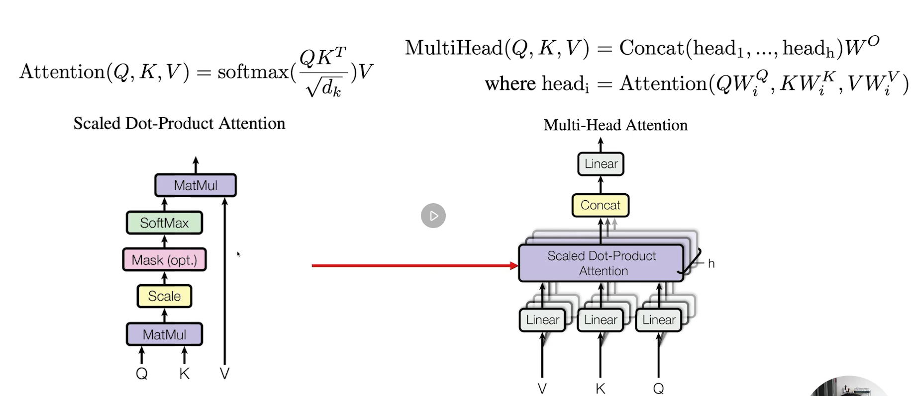

左图是右图中间部分的核心结构。

MatMul： 将Q和K矩阵相乘
Scale: 将得到的权重加权到每个通道特征上。

完整结构：

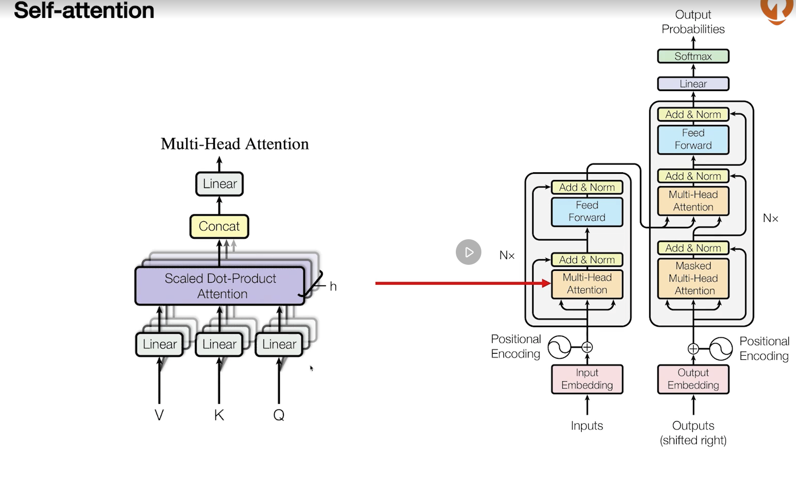

* Multi-headed 的意思是有多重学习手段，Q、K、V
* Masked Multi-head attention: 只关注前序信息

####简化后的结构：

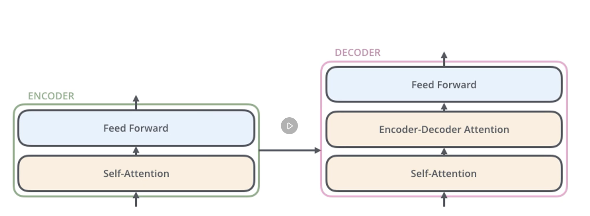

####High-level:

可以被抽象为下图

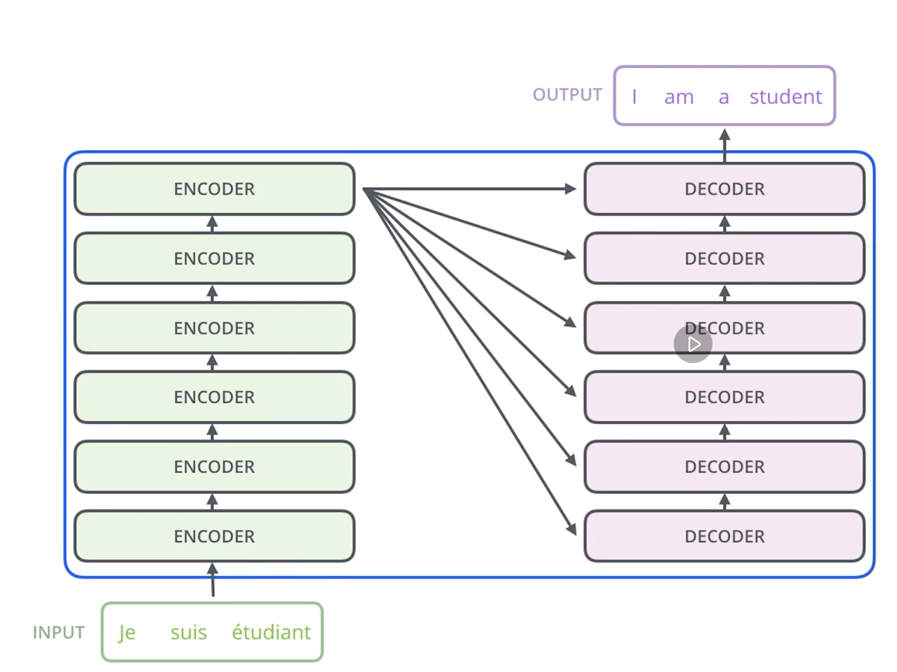

#### A specific level look

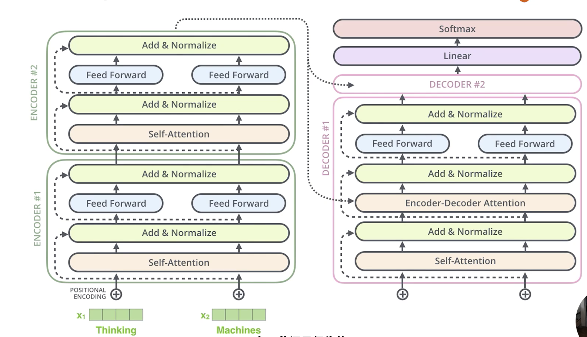

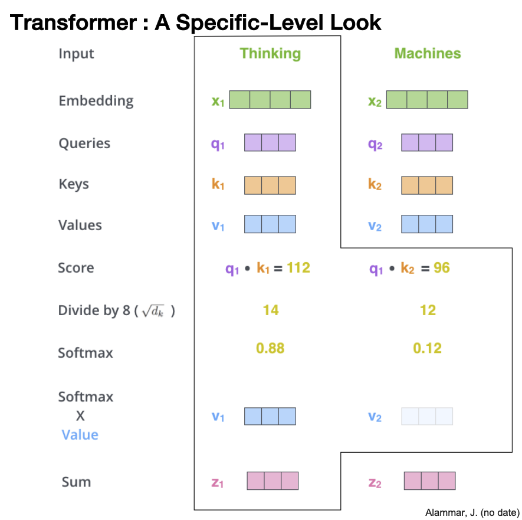

#### multi headed 训练效果demo

不同的颜色代表不同head

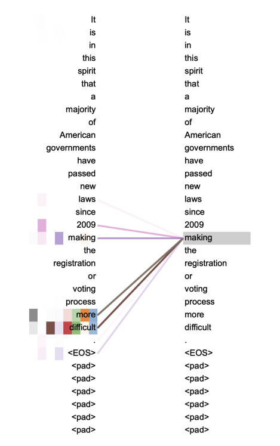

## 为什么Transfromer更重要

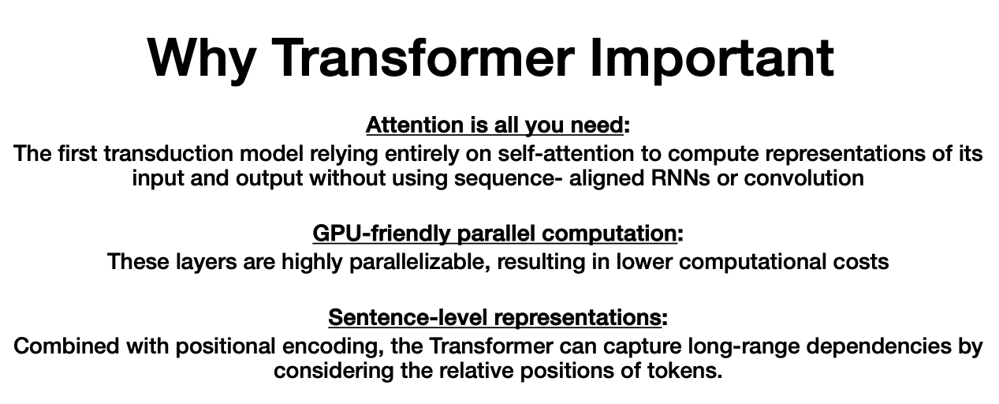

