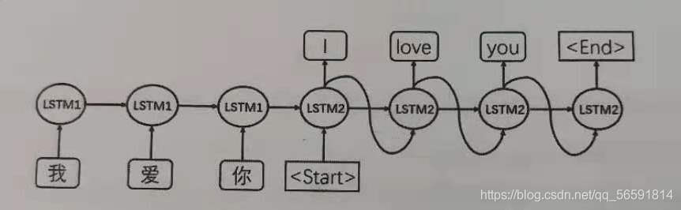

# attention和mask。从循环神经网络、transformer到GPT2
参考：https://zhuanlan.zhihu.com/p/402675253

##  图解Attention

### seq2seq

seq2seq模型是由编码器（Encoder）和解码器（Decoder）组成的。其中，编码器会处理输入序列中的每个元素，把这些信息转换为一个向量（称为上下文context）。当我们处理完整个输入序列后，编码器把上下文（context）发送给解码器，解码器开始逐项生成输出序列中的元素。上下文向量的长度，基于编码器 RNN 的隐藏层神经元的数量。

如何把每个单词都转化为一个向量呢？我们使用一类称为 "word embedding" 的方法。这类方法把单词转换到一个向量空间，这种表示能够捕捉大量单词之间的语义信息。（word2vec）通常embedding 向量大小是 200 或者 300。

在机器翻译任务中，上下文（context）是一个向量（基本上是一个数字数组)。编码器和解码器在Transformer出现之前一般采用的是循环神经网络。上下文context向量是这类模型的瓶颈。以两个具有不同参数的LSTM分别作为encoder和decoder处理机器翻译为例，结构如下：

LSTM1为编码器，在最后时刻的上下文信息 C 包含中文“我爱你”的完整信息,传给给解码器LSTM2，作为翻译阶段,LSTM2的起始状态start。之后每时刻的预测结果作为下一时刻的输入，翻译顺序进行直到终止符停止翻译。

### 循环神经网络的不足

1.机器翻译中，使用LSTM的encoder只输出最后时刻的上下文信息C，而这两个模型都存在长距离衰减问题，使得C的描述能力有限。当编码句子较长时，句子靠前部分对C的影响会降低；

2.解码阶段，随着序列的推移，编码信息C对翻译的影响越来越弱。因此，越靠后的内容，翻译效果越差。（其实也是因为长距离衰减问题）

3.解码阶段缺乏对编码阶段各个词的直接利用。简单说就是：机器翻译领域，解码阶段的词和编码阶段的词有很强的映射关系，比如“爱”和“love”。但是seq2seq模型无法再译“love”时直接使用“爱”这个词的信息，因为在编码阶段只能使用全局信息C。（attention在这点做得很好）

在 2014——2015年提出并改进了一种叫做注意力attetion的技术，它极大地提高了机器翻译的质量。注意力使得模型可以根据需要，关注到输入序列的相关部分

### attention的引出

（稍后补充完整）

