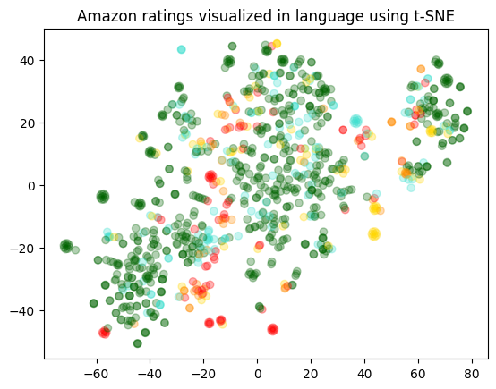
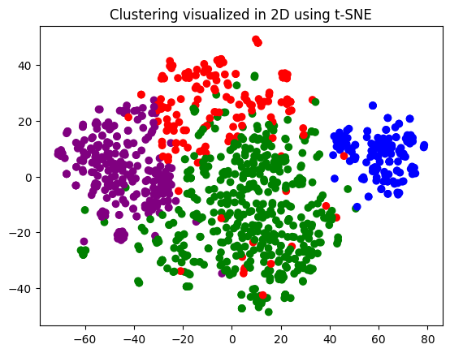

## 安装必要的包

注意openai.embeddings_utils 在最新的版本中被移除，因此将openai的版本设定为0.28.1

```python
!pip install tiktoken pandas matplotlib plotly scikit-learn numpy
```

```python
pip install openai==0.28.1
```


## 导包

```python
import pandas as pd
import tiktoken


import openai
openai.api_key = "Key here"

# 代理

proxy = {
'http': 'http://127.0.0.1:10887',
'https': 'http://127.0.0.1:10887'
}

openai.proxy = proxy;
```


## 读取文件

demo中用的是食物评价


```python
input_datapath = "data/fine_food_reviews_1k.csv"
df = pd.read_csv(input_datapath, index_col=0)
df = df[["Time", "ProductId", "UserId", "Score", "Summary", "Text"]]
df = df.dropna()

# 将 "Summary" 和 "Text" 字段组合成新的字段 "combined"
df["combined"] = (
    "Title: " + df.Summary.str.strip() + "; Content: " + df.Text.str.strip()
)
df.head(2)
```


<div>
<style scoped>
    .dataframe tbody tr th:only-of-type {
        vertical-align: middle;
    }

    .dataframe tbody tr th {
        vertical-align: top;
    }
    
    .dataframe thead th {
        text-align: right;
    }
</style>
<table border="1" class="dataframe">
  <thead>
    <tr style="text-align: right;">
      <th></th>
      <th>Time</th>
      <th>ProductId</th>
      <th>UserId</th>
      <th>Score</th>
      <th>Summary</th>
      <th>Text</th>
      <th>combined</th>
    </tr>
  </thead>
  <tbody>
    <tr>
      <th>0</th>
      <td>1351123200</td>
      <td>B003XPF9BO</td>
      <td>A3R7JR3FMEBXQB</td>
      <td>5</td>
      <td>where does one  start...and stop... with a tre...</td>
      <td>Wanted to save some to bring to my Chicago fam...</td>
      <td>Title: where does one  start...and stop... wit...</td>
    </tr>
    <tr>
      <th>1</th>
      <td>1351123200</td>
      <td>B003JK537S</td>
      <td>A3JBPC3WFUT5ZP</td>
      <td>1</td>
      <td>Arrived in pieces</td>
      <td>Not pleased at all. When I opened the box, mos...</td>
      <td>Title: Arrived in pieces; Content: Not pleased...</td>
    </tr>
  </tbody>
</table>
</div>


```python
df["combined"]
```


    0      Title: where does one  start...and stop... wit...
    1      Title: Arrived in pieces; Content: Not pleased...
    2      Title: It isn't blanc mange, but isn't bad . ....
    3      Title: These also have SALT and it's not sea s...
    4      Title: Happy with the product; Content: My dog...
                                 ...                        
    995    Title: Delicious!; Content: I have ordered the...
    996    Title: Good Training Treat; Content: My dog wi...
    997    Title: Jamica Me Crazy Coffee; Content: Wolfga...
    998    Title: Party Peanuts; Content: Great product f...
    999    Title: I love Maui Coffee!; Content: My first ...
    Name: combined, Length: 1000, dtype: object


```python
# 模型类型
# 建议使用官方推荐的第二代嵌入模型：text-embedding-ada-002
embedding_model = "text-embedding-ada-002"
# text-embedding-ada-002 模型对应的分词器（TOKENIZER）
embedding_encoding = "cl100k_base"
# text-embedding-ada-002 模型支持的输入最大 Token 数是8191，向量维度 1536
# 在我们的 DEMO 中过滤 Token 超过 8000 的文本
max_tokens = 8000  
```


```python
# 设置要筛选的评论数量为1000
top_n = 1000
# 对DataFrame进行排序，基于"Time"列，然后选取最后的2000条评论。
# 这个假设是，我们认为最近的评论可能更相关，因此我们将对它们进行初始筛选。
df = df.sort_values("Time").tail(top_n * 2) 
# 丢弃"Time"列，因为我们在这个分析中不再需要它。
df.drop("Time", axis=1, inplace=True)
# 从'embedding_encoding'获取编码
encoding = tiktoken.get_encoding(embedding_encoding)

# 计算每条评论的token数量。我们通过使用encoding.encode方法获取每条评论的token数，然后把结果存储在新的'n_tokens'列中。
df["n_tokens"] = df.combined.apply(lambda x: len(encoding.encode(x)))

# 如果评论的token数量超过最大允许的token数量，我们将忽略（删除）该评论。
# 我们使用.tail方法获取token数量在允许范围内的最后top_n（1000）条评论。
df = df[df.n_tokens <= max_tokens].tail(top_n)

# 打印出剩余评论的数量。
len(df)
```


    1000


```python
df.head(5)
```


<div>
<style scoped>
    .dataframe tbody tr th:only-of-type {
        vertical-align: middle;
    }

    .dataframe tbody tr th {
        vertical-align: top;
    }
    
    .dataframe thead th {
        text-align: right;
    }
</style>
<table border="1" class="dataframe">
  <thead>
    <tr style="text-align: right;">
      <th></th>
      <th>ProductId</th>
      <th>UserId</th>
      <th>Score</th>
      <th>Summary</th>
      <th>Text</th>
      <th>combined</th>
      <th>n_tokens</th>
    </tr>
  </thead>
  <tbody>
    <tr>
      <th>0</th>
      <td>B003XPF9BO</td>
      <td>A3R7JR3FMEBXQB</td>
      <td>5</td>
      <td>where does one  start...and stop... with a tre...</td>
      <td>Wanted to save some to bring to my Chicago fam...</td>
      <td>Title: where does one  start...and stop... wit...</td>
      <td>52</td>
    </tr>
    <tr>
      <th>297</th>
      <td>B003VXHGPK</td>
      <td>A21VWSCGW7UUAR</td>
      <td>4</td>
      <td>Good, but not Wolfgang Puck good</td>
      <td>Honestly, I have to admit that I expected a li...</td>
      <td>Title: Good, but not Wolfgang Puck good; Conte...</td>
      <td>178</td>
    </tr>
    <tr>
      <th>296</th>
      <td>B008JKTTUA</td>
      <td>A34XBAIFT02B60</td>
      <td>1</td>
      <td>Should advertise coconut as an ingredient more...</td>
      <td>First, these should be called Mac - Coconut ba...</td>
      <td>Title: Should advertise coconut as an ingredie...</td>
      <td>78</td>
    </tr>
    <tr>
      <th>295</th>
      <td>B000LKTTTW</td>
      <td>A14MQ40CCU8B13</td>
      <td>5</td>
      <td>Best tomato soup</td>
      <td>I have a hard time finding packaged food of an...</td>
      <td>Title: Best tomato soup; Content: I have a har...</td>
      <td>111</td>
    </tr>
    <tr>
      <th>294</th>
      <td>B001D09KAM</td>
      <td>A34XBAIFT02B60</td>
      <td>1</td>
      <td>Should advertise coconut as an ingredient more...</td>
      <td>First, these should be called Mac - Coconut ba...</td>
      <td>Title: Should advertise coconut as an ingredie...</td>
      <td>78</td>
    </tr>
  </tbody>
</table>
</div>

## 读取fine_food_reviews_with_embeddings_1k文件


```python
embedding_datapath = "data/fine_food_reviews_with_embeddings_1k.csv"

df_embedded = pd.read_csv(embedding_datapath, index_col=0)
```


```python
df_embedded["embedding"]
```


    0      [0.03599238395690918, -0.02116263099014759, -0...
    297    [-0.07042013108730316, -0.03175969794392586, -...
    296    [0.05692615360021591, -0.005402443464845419, 0...
    295    [-0.011223138310015202, -0.049720242619514465,...
    294    [0.05692615360021591, -0.005402443464845419, 0...
                                 ...                        
    623    [-0.04803164303302765, 0.04621649533510208, 0....
    624    [0.02654704451560974, -0.027484629303216934, -...
    625    [-0.011052397079765797, -0.029021456837654114,...
    619    [-0.0058358414098620415, 0.021213747560977936,...
    999    [0.019206926226615906, -0.019285108894109726, ...
    Name: embedding, Length: 1000, dtype: object


```python
len(df_embedded["embedding"][0])
```


    34200


```python
type(df_embedded["embedding"][0])
```


    str

embedding是字符串


```python
df_embedded["embedding"][0]
```


    '[0.03599238395690918, -0.02116263099014759, -0.02902303636074066, 0.009706169366836548, -0.015163900330662727, -0.05273154750466347, -0.01680281013250351, 0.05333619564771652, -0.024154040962457657, -0.01953963190317154, 0.047894373536109924, -0.013302224688231945, 0.016675516963005066, 0.005688451696187258, 0.019014544785022736, 0.0009184064692817628, 0.018982721492648125, 0.019316866993904114, 0.04032038152217865, 0.08127722889184952, 0.05413178354501724, 0.005449775140732527, -0.00773311173543334, 0.007347251754254103, 0.031521182507276535, -0.011695138178765774, -0.02467912808060646, 0.015609429217875004, 0.04152967408299446, -0.040161263197660446, -0.04499843716621399, -0.0358969122171402, -0.014797929674386978, -0.0335419736802578, 0.019873779267072678, 0.037424441426992416, 0.015919707715511322, -0.007327361963689327, 0.0072239357978105545, 0.0019113993039354682, 0.005151429679244757, 0.036533381789922714, 0.04538031667470932, 0.02822744846343994, 0.025617921724915504, 0.017009662464261055, 0.0047973934561014175, 0.004916731268167496, -0.02148086577653885, 0.00030356639763340354, 0.03831550106406212, 0.04305720329284668, -0.02902303636074066, -0.03225312381982803, 0.013079460710287094, 0.003361357608810067, -0.029659505933523178, -0.007371119223535061, 0.012188402004539967, -0.008142839185893536, 0.025347420945763588, -0.0250132754445076, 0.06485630571842194, 0.0007642613491043448, 0.028004683554172516, -0.06103748083114624, -0.012618019245564938, -0.020876219496130943, -0.028434300795197487, 0.008142839185893536, -0.02078074775636196, 0.01562534086406231, -0.031505268067121506, -0.017900722101330757, 0.00015638269542250782, -0.0005708340904675424, -0.03048691712319851, 0.0012073041871190071, -0.023549392819404602, -0.05079031363129616, -0.02658853866159916, 0.013381783850491047, -0.02121036686003208, -0.028307007625699043, 0.012912387028336525, -0.05645489692687988, -0.010915461927652359, 0.01756657473742962, 0.005119606386870146, -0.005915193818509579, 0.0063249217346310616, -0.015665119513869286, -0.020542072132229805, 0.026429420337080956, 0.015251414850354195, -0.014583121053874493, -0.0211148951202631, 0.053368017077445984, 0.010668830014765263, -0.02547471597790718, 0.03634244203567505, -0.029675418511033058, -0.01580832526087761, 0.013930738903582096, 0.05126766487956047, -0.017741603776812553, 0.03360562026500702, 0.04786255210638046, -0.024535922333598137, -0.008146816864609718, -0.03177576884627342, -0.04152967408299446, -0.002027753973379731, 0.011193918064236641, -0.010613138787448406, 0.0765037089586258, -0.04184791073203087, -0.08458687365055084, 0.012816916219890118, 0.03405115008354187, -0.026890860870480537, 0.008290022611618042, -0.017073310911655426, -0.03904743865132332, -0.02852977253496647, -0.024933716282248497, 0.04175243899226189, 0.0003314119821880013, 0.04334361478686333, -0.013962563127279282, 0.049899253994226456, -0.01879177987575531, 0.011894035153090954, -0.025140568614006042, -0.01912592723965645, 0.02078074775636196, -0.035387735813856125, -0.029293537139892578, -0.04697149246931076, 0.03799726441502571, -0.0026154944207519293, -0.061292070895433426, 0.008910581469535828, -0.0030988138169050217, 0.05034478381276131, -0.02977088838815689, -0.046748727560043335, 0.04079773277044296, 0.013700018636882305, -0.0026771523989737034, 0.00644823769107461, 0.013238578103482723, -0.04970831423997879, 0.02270607091486454, 0.0211944542825222, -0.06345606595277786, 0.001193381380289793, 0.02743186056613922, -0.032682739198207855, 0.03834732249379158, 0.012801004573702812, -0.010446065105497837, -0.03433756157755852, -0.013143107295036316, -0.044043730944395065, -0.0008134883246384561, 0.00703697232529521, 0.01957145519554615, -0.04703513905405998, -0.06644748151302338, -0.020430689677596092, -0.03430573642253876, 0.01075634453445673, -0.008878758177161217, -0.033701092004776, -0.03056647628545761, 0.005815745331346989, -0.008910581469535828, -0.03631062060594559, -0.021783189848065376, 0.020860306918621063, 0.056073013693094254, 0.014145547524094582, -0.051872313022613525, -0.00763366324827075, 0.05756872147321701, -0.011384858749806881, -0.028275184333324432, -0.020048808306455612, 0.016691427677869797, -0.006340833380818367, 0.01249868143349886, 0.00980163924396038, 0.009586830623447895, 0.033128269016742706, -0.018473545089364052, 0.01646866463124752, 0.04433014243841171, 0.04744884744286537, 0.047989845275878906, -0.038570087403059006, 0.05308160558342934, -0.018457632511854172, 0.012968078255653381, -0.00614989222958684, -0.015935620293021202, -0.04455290734767914, 0.052254196256399155, 0.0037770522758364677, -0.06791135668754578, 0.01718469336628914, -0.028704801574349403, 0.005147452000528574, 0.05661401525139809, -0.06899335980415344, -0.03704255819320679, -0.032714564353227615, 0.01637319289147854, 0.01371593028306961, 0.055850252509117126, 0.015521914698183537, 0.04413920268416405, 0.051076725125312805, -0.0008771353750489652, 0.039397500455379486, -0.0072199576534330845, -0.03433756157755852, -0.04652596265077591, -0.049962904304265976, 0.0324440635740757, 0.030598299577832222, 0.001563329715281725, -0.018171221017837524, -0.029643595218658447, -0.060464657843112946, 0.02079666033387184, 0.01115413848310709, -0.016245899721980095, 0.029070772230625153, -0.035037677735090256, -0.009857330471277237, 0.015800369903445244, -0.004276283551007509, 0.008862846530973911, 0.02432907000184059, 0.010652918368577957, -0.028657065704464912, -0.0682932436466217, -0.013007857836782932, 0.027240920811891556, 0.022578775882720947, 0.021035335958003998, -0.0048292167484760284, -0.005604914855211973, 0.04509390518069267, 0.0187599565833807, 0.04490296542644501, -0.0002447674924042076, 0.042452555149793625, -0.006877854932099581, 0.004578606691211462, 0.010819992050528526, 0.006997193209826946, 0.01767795719206333, -0.024042658507823944, -0.0019511786522343755, 0.015140032395720482, -0.004733746405690908, -0.02856159582734108, -0.026111185550689697, -0.036215148866176605, -0.026493066921830177, 0.03182350471615791, 0.020016985014081, -0.017741603776812553, -0.04814896360039711, 0.007713221944868565, -0.007685376331210136, 0.02226054109632969, 0.00664315652102232, -0.01545826718211174, -0.03430573642253876, -0.020526161417365074, -0.07930417358875275, 0.00957887526601553, -0.0015842138091102242, 0.0008597318665124476, 0.02391536347568035, 0.018330339342355728, -0.021767277270555496, -0.049103669822216034, -0.03611967712640762, 0.023294806480407715, -0.009491360746324062, 0.005330436863005161, 0.01016760990023613, -0.05365442857146263, -0.009634566493332386, 0.0024165974464267492, 0.008441184647381306, -0.0028124023228883743, 0.031887151300907135, 0.03195079788565636, -0.0020337209571152925, 0.01079612411558628, -0.028275184333324432, 0.0005703368806280196, -0.0026791412383317947, 0.024535922333598137, 0.03133023902773857, -0.032332681119441986, -0.029675418511033058, 0.009674345143139362, -0.02346983551979065, 0.013198798522353172, -0.05136313661932945, 0.05632760375738144, -0.019651014357805252, 0.02782965451478958, -0.016977839171886444, -0.012053152546286583, -0.02620665542781353, 0.010819992050528526, 0.01155193243175745, 0.02381989359855652, 0.08560522645711899, 0.0051235840655863285, -0.01607087068259716, 0.004682033322751522, -0.012681666761636734, -0.03161665052175522, -0.014416047371923923, -0.01249868143349886, 0.009865286760032177, -0.060401011258363724, -0.054227251559495926, 0.025554275140166283, -0.029229888692498207, 0.00265129585750401, 0.0192054845392704, -0.011432593688368797, -0.04748066887259483, 0.004220592323690653, 0.0051633636467158794, -0.017009662464261055, 0.042484380304813385, 0.03166438639163971, 0.07554899901151657, -0.005569113418459892, 0.033414680510759354, -0.03561050072312355, -0.010048272088170052, -0.00818659644573927, 0.010517667979001999, 0.020223837345838547, -0.029627682641148567, -0.013429518789052963, 0.006495973095297813, -0.020080631598830223, 0.03634244203567505, -0.01874404400587082, 0.008154773153364658, 0.011368947103619576, 2.0620014765881933e-05, -0.015529870055615902, -0.007466590031981468, -0.015848105773329735, 0.020160190761089325, 0.01638910546898842, 0.02892756648361683, 0.001138684805482626, 0.0454757884144783, -0.02662036195397377, 0.010748389177024364, -0.03328738734126091, 0.059319011867046356, 0.04226161539554596, 0.011058667674660683, 0.0018537191208451986, 0.031139299273490906, 0.06421983242034912, 0.008854890242218971, 0.027925126254558563, -0.015593517571687698, 0.043248143047094345, -0.023549392819404602, 0.05114037171006203, -0.007776868995279074, 0.009897110052406788, -0.024981452152132988, 0.008154773153364658, -0.033064622431993484, -0.026095274835824966, 0.039397500455379486, 0.009483404457569122, 0.03401932492852211, 0.020112454891204834, 0.04760796204209328, -0.023581217974424362, -0.019332779571413994, 0.013811401091516018, -0.05830065906047821, -0.04343908280134201, -0.05289066582918167, -0.0429617315530777, 0.04315267130732536, -0.03955661505460739, -0.0052667902782559395, -0.04748066887259483, -0.0115121528506279, -0.02900712378323078, -0.026890860870480537, 0.036183323711156845, 0.01040628645569086, 0.025283774361014366, 0.025649745017290115, -0.014487650245428085, 0.026922686025500298, -0.0033414680510759354, -0.003436938626691699, -0.03522862121462822, -0.006639178842306137, -0.0494537279009819, 0.034974031150341034, -0.056518543511629105, 0.051872313022613525, 0.042134322226047516, -0.021385395899415016, 0.0017085244180634618, -0.03876102715730667, -0.02942083030939102, 0.003498596604913473, -0.0025896376464515924, 0.011106403544545174, -0.004514959640800953, -0.009730036370456219, -0.057759661227464676, 0.03255544602870941, 0.0335419736802578, -0.060114599764347076, -0.046780552715063095, -0.03414662182331085, 0.005079826805740595, -0.021830923855304718, -0.0768219381570816, 0.0024185862857848406, 0.035005856305360794, 0.0211148951202631, -0.0012391277123242617, 0.007685376331210136, -0.024583658203482628, -0.0034767179749906063, -0.02423359826207161, 0.006424370221793652, -0.05594572052359581, 0.026158921420574188, 0.006265252362936735, -0.024360893294215202, 0.04140238091349602, -0.017311986535787582, 0.04662143439054489, -0.009475448168814182, 0.023740334436297417, 0.03222129866480827, -0.018855426460504532, 0.018171221017837524, 0.002953618997707963, 0.009952801279723644, 0.004646231885999441, -0.026031626388430595, 0.025172391906380653, -0.009332242421805859, -0.009626610204577446, 0.03561050072312355, -0.008377538062632084, -0.051458608359098434, 0.03166438639163971, 0.03907926380634308, 0.012983989901840687, -0.035387735813856125, -0.001397250802256167, 0.039747558534145355, -0.0030829019378870726, 0.0007871345151215792, -0.016595957800745964, -0.006694869603961706, -0.011400770395994186, 0.0041290996596217155, 0.016309546306729317, -0.012188402004539967, -0.07281217724084854, 0.022069601342082024, -0.04277079179883003, -0.02078074775636196, -0.03242815285921097, 0.006340833380818367, 0.048371728509664536, 0.0003898379218298942, 0.012013372965157032, -0.007398964837193489, 0.04468020051717758, 0.009626610204577446, -0.010342638939619064, 0.038506440818309784, -0.010541535913944244, -0.03802908957004547, -0.04108414426445961, -0.020828483626246452, -0.011798564344644547, -0.008015545085072517, -0.0032280967570841312, 0.04732155054807663, -0.03258726745843887, -0.03907926380634308, -0.02033521980047226, 0.011488284915685654, -0.013302224688231945, 0.022801540791988373, -0.023167511448264122, 0.017884809523820877, -0.03249179944396019, -0.018457632511854172, 0.000529065786395222, -0.034178443253040314, -0.012920343317091465, 0.01387504767626524, -0.005238944664597511, 0.06657477468252182, -0.0021997997537255287, 0.014447871595621109, 0.010064183734357357, -0.03557867929339409, -0.02469504065811634, 0.03250771015882492, 0.00287604914046824, 0.00030456087552011013, 0.013819357380270958, -0.02781374379992485, 0.012745313346385956, -0.006364700850099325, 0.03249179944396019, -0.007677420508116484, -0.01234752032905817, -0.03876102715730667, 0.018139397725462914, -0.03408297523856163, -0.01637319289147854, 0.01486953254789114, -0.0021978109143674374, -0.00011591960355872288, 0.0010491812136024237, -0.025331510230898857, 0.03834732249379158, -0.007820626720786095, 0.0175824873149395, 0.02151268906891346, 0.02148086577653885, -0.05906442552804947, 0.012427078559994698, 0.02811606600880623, -0.011432593688368797, -0.026318037882447243, -0.002917817560955882, 0.014941135421395302, 0.024583658203482628, 0.022021865472197533, -0.004089320544153452, 0.011416682042181492, -0.008743507787585258, -0.011106403544545174, -0.02230827696621418, 0.03707438334822655, -0.02071710117161274, -0.011042756028473377, 0.03806091099977493, -0.022403746843338013, 0.04846719652414322, -0.01523550320416689, -0.03646973520517349, 0.029595859348773956, -0.03376473858952522, -0.01582423783838749, -0.031568918377161026, 0.03398750349879265, -0.003399148117750883, 0.011671270243823528, 0.0028223469853401184, 0.004578606691211462, -0.0034269937314093113, 0.005254856310784817, -0.010446065105497837, 0.0047973934561014175, -0.019380513578653336, -0.009722081013023853, -0.005409996025264263, 0.015084341168403625, -0.04967649281024933, -0.010668830014765263, -0.007422832306474447, 0.007164266426116228, 0.03277821093797684, -0.016015179455280304, -0.009356110356748104, -0.046303197741508484, -0.024472275748848915, 0.021242190152406693, -0.06406071782112122, -0.0001165411522379145, -0.014527429826557636, -0.013795489445328712, 0.02542698010802269, 0.030375534668564796, -0.025713391602039337, -0.015537826344370842, 0.035164974629879, -0.014551297761499882, 0.025570185855031013, -0.015147988684475422, 0.043279968202114105, -6.625753303524107e-05, -0.014996826648712158, 0.01726425066590309, 0.026699921116232872, -0.02938900701701641, -0.050631195306777954, 0.01570490002632141, -0.004618386272341013, -0.011472373269498348, 0.0017164802411571145, -0.01451947446912527, 0.017741603776812553, 0.007406920660287142, 0.018855426460504532, 0.005159385502338409, -0.031123388558626175, -0.04152967408299446, -0.0026115162763744593, -0.010851815342903137, 0.010103962384164333, 0.011925858445465565, 0.021608158946037292, 0.009284507483243942, 0.0382518544793129, -0.000865698792040348, 0.005648672115057707, 0.017121044918894768, 0.017916632816195488, 0.030614212155342102, -0.017502928152680397, 7.62023773859255e-05, 0.02035113051533699, -0.017805250361561775, 0.020016985014081, -0.03726532310247421, 0.0042683277279138565, 0.03222129866480827, -0.01114618219435215, -0.030343711376190186, 0.032300855964422226, -0.0250132754445076, 0.007613773457705975, 0.04111596941947937, -0.030216418206691742, -0.0010660873958840966, 0.018728133291006088, 0.025967979803681374, 0.010899550281465054, -0.030200505629181862, 0.007884273305535316, -0.006563597824424505, 0.012514593079686165, 0.025617921724915504, 0.07580358535051346, -0.01688236929476261, 0.0020327263046056032, -0.019841955974698067, -0.0005683479248546064, 0.02197412960231304, 0.04216614365577698, -0.0007652558269910514, 0.013668195344507694, -0.03631062060594559, 0.0024702996015548706, 0.021353572607040405, 0.02784556709229946, -0.025236038491129875, 0.04503025859594345, -0.010231256484985352, 0.019348690286278725, 0.03440120816230774, -0.002941685263067484, 0.014988870359957218, 0.0005902265547774732, 0.002732843393459916, 0.047162435948848724, -0.02146495319902897, -0.02195821888744831, 0.0004301145672798157, 0.032316770404577255, -0.055372897535562515, -0.03287367895245552, 0.015386664308607578, -0.005716296844184399, -0.008441184647381306, -0.030359623953700066, 0.01681872271001339, -0.059350837022066116, 0.017868898808956146, 0.008170684799551964, -0.004196724854409695, -0.0073154279962182045, 0.02116263099014759, -0.016357282176613808, 0.02892756648361683, -0.015482135117053986, -0.02972315438091755, -0.002025764901190996, -0.026859037578105927, -0.026811303570866585, -0.010286947712302208, 0.00859234668314457, 0.03373291343450546, 0.02264242433011532, 0.008111015893518925, -0.004749658051878214, 0.01688236929476261, 0.05050390213727951, -0.02622256800532341, -0.023358453065156937, 0.031537093222141266, 0.004920709412544966, 0.006086245179176331, 0.021433129906654358, 0.021703630685806274, -0.04194337874650955, 0.007673442829400301, -0.02658853866159916, 0.008210464380681515, 0.007999633438885212, -0.0029854425229132175, 0.018250780180096626, -0.056136664003133774, -0.004300151020288467, 0.012021329253911972, 0.018250780180096626, -0.021417219191789627, -0.01917366124689579, -0.0023688620422035456, -0.045539434999227524, -0.015044561587274075, -0.020446602255105972, 0.016532311215996742, -0.002708975924178958, -0.01726425066590309, 0.04041584953665733, -0.037424441426992416, -0.0018149343086406589, 0.000569342402741313, 0.012323652394115925, 0.015147988684475422, -0.01689828187227249, 0.028291095048189163, -0.014957047067582607, -0.02391536347568035, -0.013437475077807903, -0.006082267500460148, -0.02857750654220581, -0.016723250970244408, 0.005835635121911764, -0.04763978719711304, -0.02383580431342125, 0.01805983856320381, 0.017041487619280815, -0.024010835215449333, 0.0329691506922245, -0.006722715217620134, -4.090594757144572e-06, 0.021783189848065376, -0.03201444447040558, 0.019046368077397346, 0.056136664003133774, -0.02781374379992485, -0.017916632816195488, -0.006229450926184654, 0.0005733203142881393, -0.04067043960094452, -0.0036776037886738777, -0.012156578712165356, -0.00980163924396038, -0.006921612191945314, -0.01716878078877926, -0.021258100867271423, 0.011416682042181492, 0.0029854425229132175, -0.03631062060594559, 0.01078816782683134, -0.012124755419790745, -0.07892229408025742, -0.018664484843611717, 0.01957145519554615, -0.021767277270555496, 0.0074546560645103455, -0.01623794250190258, -0.010541535913944244, 0.02421768754720688, -0.0021361527033150196, -0.022785630077123642, 0.00500026810914278, 0.012236137874424458, 0.010088050737977028, -0.012228181585669518, 0.0009218871709890664, 0.008055324666202068, 0.028052419424057007, 0.004015728365629911, -0.01877586729824543, 0.0031823504250496626, -0.010469933040440083, 0.02031930722296238, 0.0025558252818882465, -0.009928933344781399, 0.06135571748018265, -0.026508979499340057, -0.042452555149793625, -0.007196090184152126, -0.01798027940094471, -0.0478307269513607, -0.0006891777738928795, 0.026715831831097603, -0.055022839456796646, 0.005620826501399279, -0.003631857456639409, -0.010708609595894814, 0.010183521546423435, 0.00823433231562376, 0.007160288747400045, 0.009300419129431248, 0.02186274714767933, -0.026811303570866585, 0.00411318801343441, 0.02584068663418293, 0.020160190761089325, -0.03917473554611206, -0.013103327713906765, 0.013055592775344849, 0.01116209477186203, -0.009936889633536339, 0.021321747452020645, -0.031043829396367073, 0.012387298978865147, -0.015943575650453568, -0.0036636809818446636, -0.004884907975792885, -0.024790510535240173, -0.02391536347568035, 0.02189457044005394, 0.0029635638929903507, -0.007864383980631828, -0.05982818827033043, 0.002317148959264159, 0.015132076106965542, 0.0013455376029014587, -0.004682033322751522, -0.009141301736235619, -0.008990139700472355, 0.003140582237392664, -0.02030339650809765, -0.024201774969697, 0.0010740433353930712, -0.005020157899707556, -0.014750194735825062, -0.01882360316812992, -0.01351703330874443, 0.018982721492648125, 0.004276283551007509, 0.006340833380818367, -0.0055571794509887695, 0.005947017576545477, -0.00376710738055408, 0.01637319289147854, 0.018966808915138245, -0.004972422495484352, -0.03225312381982803, 0.005016179755330086, 0.026731744408607483, 0.053781721740961075, 0.00996871292591095, 0.06842053681612015, 0.018998632207512856, 0.02121036686003208, -0.015999266877770424, -0.010183521546423435, 0.020446602255105972, -0.01834625005722046, -0.006181715987622738, -0.0010879660258069634, 0.014949091710150242, 0.007355207577347755, 0.04082955792546272, -0.027495509013533592, -0.02308795228600502, -0.004614408127963543, -0.013548857532441616, -0.0006782384589314461, 0.016341369599103928, 0.000514645769726485, 0.03128250688314438, 0.007840516045689583, -0.007971787825226784, -0.031966712325811386, 0.0011158116394653916, -0.023676687851548195, 0.011528064496815205, -0.0010332694509997964, -0.002225656295195222, 0.017073310911655426, -0.01716878078877926, 0.01194972638040781, -0.0005753092700615525, 0.0071205091662704945, -0.0017015630146488547, -0.02506100945174694, 0.011360990814864635, 0.02695450931787491, -0.00674658315256238, -0.01155193243175745, -0.024806421250104904, 0.03056647628545761, 0.027559155598282814, 0.03284185752272606, 0.01174287311732769, 0.016182253137230873, -0.022451482713222504, 0.02230827696621418, 0.006802274379879236, -0.00980163924396038, -0.0015603462234139442, 0.028784360736608505, -0.0039302026852965355, 0.013055592775344849, 0.025697480887174606, -0.009833462536334991, -0.02740003727376461, -0.05715501308441162, 0.03284185752272606, 0.004300151020288467, -0.011583755724132061, 0.022180983796715736, 0.05998730659484863, 0.013859136030077934, -0.009626610204577446, 0.014837709255516529, 0.033510152250528336, -0.0004813304985873401, -0.033828385174274445, 0.021369483321905136, 0.004347886424511671, -0.0021600204054266214, 0.016150427982211113, -0.009061742573976517, 0.0073194061405956745, 0.01329426933079958, -0.02195821888744831, -0.008425273001194, -0.012387298978865147, 0.0019302944419905543, 0.05712319165468216, -0.01766204461455345, 0.012490726076066494, 0.021433129906654358, -0.023278893902897835, 0.016277723014354706, 0.009539095684885979, 0.026779478415846825, 0.003313622437417507, 0.007196090184152126, 0.037710852921009064, 0.0035662215668708086, -0.0005723258364014328, 0.005449775140732527, 0.02353348210453987, 0.03249179944396019, 0.01610269397497177, 0.014328532852232456, -0.03866555914282799, 0.037742678076028824, 0.026381686329841614, 0.04429831728339195, 0.01095524150878191, -0.02386762946844101, 0.031934887170791626, -0.01764613389968872, -0.005732208956032991, 0.009475448168814182, -0.014957047067582607, -0.0031823504250496626, -0.004972422495484352, 0.039715733379125595, 0.028418390080332756, 0.006086245179176331, -0.04582584649324417, 0.008512787520885468, 0.010334683582186699, -0.028736624866724014, -0.014169415459036827, -0.0035244531463831663, 0.008910581469535828, 0.0016995740588754416, -0.05594572052359581, -0.05747324973344803, 0.030836977064609528, -0.0034806958865374327, 0.011106403544545174, -0.033701092004776, 0.020923955366015434, -0.03716985508799553, 0.019460072740912437, -0.027193184942007065, -0.04773525893688202, -0.041720613837242126, 0.0066550904884934425, -0.04382096603512764, 0.009061742573976517, 0.026684008538722992, 0.015474178828299046, -0.02156042493879795, -0.008671904914081097, -0.0003508044173941016, 0.05209507793188095, 0.02937309443950653, -0.008202508091926575, 0.02813197858631611, 0.002502123126760125, 0.03433756157755852, 0.005521378014236689, 0.01588788442313671, -0.001568302046507597, -0.027909213677048683, -0.015394620597362518, 0.020080631598830223, 0.002832291880622506, -0.011631490662693977, -0.025967979803681374, 0.022085512056946754, 0.026731744408607483, -0.013684106990695, 0.005075849127024412, -0.017423368990421295, 0.030773328617215157, 0.03163256496191025, 0.00031375986873172224, -0.023947186768054962, 0.01171104982495308, -0.003066990291699767, 0.03376473858952522, 0.01837807334959507, 0.009555007331073284, -0.0023489724844694138, 0.021067161113023758, 0.020080631598830223, -0.04932643100619316, -0.028736624866724014, -0.026715831831097603, -0.020510248839855194, 0.03172803297638893, 0.005680495407432318, 0.0013992397580295801, -0.01623794250190258, 0.00733531778678298, 0.015330973081290722, 0.030009565874934196, 0.03513314947485924, 0.00043260076199658215, 0.0328100323677063, -0.018107574433088303, 0.04057496786117554, -0.005083804950118065, -0.022499218583106995, -0.007764935027807951, -0.002621461171656847, 0.012944210320711136, 0.004331974778324366, -0.004753636196255684, -0.003639813279733062, -0.042484380304813385, -0.00879124365746975, -0.04022490978240967, -0.029516300186514854, -0.03570597246289253, -0.026286214590072632, 0.018457632511854172, 0.00034011370735242963, -0.020048808306455612, 0.028688888996839523, 0.004670099355280399, 0.003548320848494768, -0.0048013711348176, 0.03716985508799553, -0.015323017723858356, 0.005187231115996838, 0.016548221930861473, -0.02350165881216526, -0.020955778658390045, 0.014217150397598743, -0.008242287673056126, 0.03446485474705696, 0.007924052886664867, 0.037392619997262955, -0.005585025064647198, 0.03888832405209541, -0.025570185855031013, 0.004351864103227854, 0.017455192282795906, -0.003641802351921797, 0.005907237995415926, -0.03164847567677498, 0.005664583761245012, -0.012570284307003021, -0.03373291343450546, -0.006515862420201302, -0.027606889605522156, -0.023788070306181908, 0.024822333827614784, 0.00902196392416954, -0.005406017880886793, 0.01115413848310709, 0.03126659244298935, 0.006205583456903696, -0.012323652394115925, 0.016930105164647102, 0.0011158116394653916, 0.005254856310784817, 0.0121008874848485, -0.03713802993297577, 0.02657262608408928, -0.0032678761053830385, 0.008886713534593582, -0.039270203560590744, -0.024822333827614784, 0.018569014966487885, 0.02654080279171467, -0.017789339646697044, 0.0026135053485631943, -0.02300839312374592, 0.04264349490404129, -0.03564232587814331, 0.03257135674357414, 0.1174287348985672, 0.008003611117601395, 0.028100155293941498, 0.015020694583654404, 0.013254489749670029, -0.004578606691211462, -0.029802711680531502, -0.0022972591686993837, 0.02582477405667305, -0.009547051042318344, 0.009348154999315739, -0.0125066377222538, 0.019841955974698067, 0.016611870378255844, 0.03551503270864487, -0.009252684190869331, -0.01911001466214657, -0.06221495196223259, 0.022387836128473282, -0.056200310587882996, 0.035801444202661514, -0.0010133797768503428, 0.008154773153364658, -0.010716564953327179, 0.022451482713222504, -0.00022413194528780878, -0.006535752210766077, -0.03182350471615791, -0.029166242107748985, 0.03802908957004547, 0.013652283698320389, -0.018982721492648125, -0.02031930722296238, 0.016914192587137222, 0.02816380187869072, -0.028816184028983116, -0.014352400787174702, -0.0031067696399986744, 0.02461548149585724, 0.05199960619211197, 0.011917902156710625, 0.008552567102015018, 0.009427713230252266, 0.02930944785475731, 0.010843859054148197, 0.015498046763241291, 0.00693752383813262, 0.02076483704149723, -0.024106305092573166, 0.0033812473993748426, 0.0038705337792634964, -0.0012540449388325214, 0.02693859674036503, 0.0066511123441159725, -0.010581315495073795, -0.025236038491129875, 0.018664484843611717, -0.0047934153117239475, 0.044489260762929916, 0.03168030083179474, -0.0033056666143238544, -0.014638812281191349, -0.015402575954794884, -0.008767375722527504, 0.03287367895245552, 0.01447969488799572, 0.010923418216407299, -0.040861379355192184, -0.016126561909914017, -0.0007771896780468524, -0.004331974778324366, -0.01035855058580637, -0.02154451236128807, 0.014495606534183025, -0.0004050038114655763, 0.02775009535253048, 0.01680281013250351, 0.02071710117161274, 0.013835269026458263, -0.01646866463124752, -0.02194230630993843, -0.014726326800882816, -0.024567745625972748, -0.006607355084270239, -0.004220592323690653, 0.0192054845392704, -0.004586562514305115, 0.005604914855211973, 0.0025777039118111134, 0.014384224079549313, -0.01683463342487812, 0.013636372052133083, 0.003816831624135375, -0.020828483626246452, -0.0059907748363912106, -0.0048013711348176, -0.0029635638929903507, -0.01952371932566166, 0.010692697949707508, -0.03564232587814331, 0.028497949242591858, 0.030534652993083, -0.031934887170791626, 0.010541535913944244, -0.005581047385931015, -0.036215148866176605, -0.025236038491129875, -0.004880929831415415, -0.023756247013807297, -0.025570185855031013, -0.01952371932566166, -0.025331510230898857, -0.00859234668314457, 0.005135518033057451, 0.02582477405667305, -0.004880929831415415, -0.029945917427539825, -0.026795390993356705, -0.006388568785041571, -0.010422198101878166, 0.009706169366836548, -0.0028501925989985466, 0.03408297523856163, -0.0026751633267849684, 0.007983721792697906, -0.00861621368676424, 0.02431315742433071, 0.010780212469398975, -0.037328969687223434, -0.033510152250528336, 0.03287367895245552, 0.015521914698183537, 0.022165071219205856, -0.013851180672645569, 0.008258199319243431, -0.0027606890071183443, -0.028752537444233894, 0.008735552430152893, 0.01214862335473299, -0.005378172267228365, -0.03608785569667816, -0.004101254045963287, -0.018871339038014412, 0.004184790886938572, 0.013596592471003532, -0.016118604689836502, -0.014304665848612785, 0.005402039736509323, -0.021846836432814598, -0.017057398334145546, 0.004248437937349081, 0.02345392294228077, 0.02781374379992485, -0.00575607642531395, -0.004232526291161776, -0.017439281567931175, -0.012371387332677841, -0.030057299882173538, 0.019873779267072678, -0.03551503270864487, 0.010629050433635712, -0.011106403544545174, -0.031871240586042404, 0.0076535530388355255, 0.020876219496130943, 0.019237307831645012, 0.006659068167209625, -0.037360794842243195, -0.02781374379992485, 0.01507638581097126, -0.007705266121774912, 0.003689537523314357, 0.03395567834377289, -0.0027507441118359566, 0.0156730767339468, 0.017073310911655426, -0.018553104251623154, -0.009507272392511368, 0.00037641238304786384, -0.0031346152536571026, -0.007064817938953638, -0.01626976765692234, -0.0055611575953662395, -0.005008223932236433, 0.025363333523273468, 0.022196894511580467, 0.0013027747627347708, -0.026381686329841614, -0.021067161113023758, -0.00624934071674943, 0.0010989054571837187, 0.00519518693909049, 0.010438109748065472, 0.002794501604512334, 0.0033335122279822826, 0.025188304483890533, -0.017391545698046684, 0.02784556709229946, -0.06075106933712959, 0.056550368666648865, -0.0055929808877408504, -0.014925223775207996, 0.0025160459335893393, 0.00664315652102232, 0.02151268906891346, 0.005338393151760101, 0.013851180672645569, -0.005139496177434921, 0.011305300518870354, 0.0033315231557935476, 0.030407357960939407, 0.0008234331617131829, -0.03997032344341278, -0.007856427691876888, 0.019475985318422318, 0.03567414730787277, -0.011050712317228317, 0.01996924914419651, -0.007402942981570959, -0.010668830014765263, -0.006965369451791048, -0.017868898808956146, 0.02732047811150551, -0.04585767164826393, -0.014925223775207996, 0.048021670430898666, -0.005939061753451824, -0.005425907671451569, -0.0012769181048497558, -0.011050712317228317, 0.02852977253496647, 0.00822637602686882, -0.00743476627394557, -0.019348690286278725, -0.0015195723390206695, -0.005553201772272587, 0.024408627301454544, -0.026827214285731316, 0.007255759090185165, -0.015179811976850033, -0.015959488227963448, 0.00441153347492218, 0.01877586729824543, -0.04356637969613075, -0.04226161539554596, 0.010573359206318855, -0.022435570135712624, -0.00539806205779314, -0.006822163704782724, -0.026286214590072632, -0.03085288777947426, -0.02704997919499874, 0.011050712317228317, -0.031473446637392044, 0.01688236929476261, -0.0008328807889483869, 0.005075849127024412, -0.011989505030214787, 0.007756979204714298, -0.011178006418049335, -0.042134322226047516, -0.005843590945005417, 0.0030848910100758076, -0.0037770522758364677, -0.021815013140439987, 0.004089320544153452, -0.01949189603328705, 0.00411318801343441, -0.0021580313332378864, 0.029532212764024734, -0.022196894511580467, 0.017852986231446266, -0.013954606838524342, -0.0367879718542099, -0.023390276357531548, -0.0077530015259981155, -0.026699921116232872, -0.006961391773074865, 0.011496241204440594, 0.013763666152954102, -0.023708511143922806, -0.01637319289147854, 0.0027626780793070793, -0.01638910546898842, 0.016595957800745964, 0.0028382588643580675, 0.0011207840871065855, 0.017805250361561775, -0.03172803297638893, -0.026843126863241196, 0.009196992963552475, 0.013747754506766796, -0.004487114027142525, -0.0017115079099312425, 0.01292829867452383, 0.010700653307139874, -0.008751464076340199, -0.01527528278529644, -0.011806520633399487, 0.017296073958277702, 0.009340198710560799, 0.01040628645569086, 0.010541535913944244, -0.024376804009079933, 0.025299686938524246, 0.0431208498775959, -0.017725693061947823, -0.011018888093531132, -0.007247803267091513, -0.01329426933079958, -0.0050320918671786785, 0.023947186768054962, 0.042038850486278534, -0.023660775274038315, -0.029229888692498207, -0.006006686482578516, 0.001979024149477482, -0.01766204461455345, 0.014583121053874493, 0.012458901852369308, 0.0019054323201999068, 0.02623848058283329, 0.033064622431993484, 0.020589808002114296, -0.042866259813308716, 0.0032957217190414667, -0.006189671810716391, -0.02693859674036503, 0.010923418216407299, -0.0032559423707425594, -0.005585025064647198, 0.0026135053485631943, 0.024376804009079933, 0.0027030089404433966, 0.012395255267620087, 0.019014544785022736, -0.01716878078877926, -0.021003512665629387, -0.003864566795527935, -0.00704095046967268, -0.014368312433362007, -0.013270401395857334, 0.05521377921104431, 0.025267863646149635, 0.02079666033387184, 0.04942190274596214, 0.0036855596117675304, 0.029802711680531502, -0.05569113418459892, 0.021385395899415016, -0.0010004513897001743, 0.04455290734767914, -0.0003786499728448689, -0.03669250011444092, -0.00259958254173398, 0.0032300858292728662, 0.05136313661932945, -0.04108414426445961, -0.007510347291827202, 0.005378172267228365, -0.017391545698046684, 0.0009666389669291675, -0.013540901243686676, -0.030646035447716713, -0.02509283274412155, -0.020939866080880165, -0.021449042484164238, 0.007562060374766588, 0.04242073372006416, 0.010469933040440083, -0.00200686976313591, 0.03494220972061157, -0.009029919281601906, -0.03123476915061474, -0.03901561722159386, -0.01961919106543064, -0.006233429070562124, 0.02393127605319023, -0.016977839171886444, 0.018553104251623154, -0.013453386723995209, -0.002878038212656975, 0.020016985014081, 0.001060120528563857, 0.05817336589097977, -0.026493066921830177, -0.015330973081290722, 0.003065001219511032, -0.04977196082472801]'


NLP的训练需要把文件转换为向量，所以用ast进行向量转换


```python
import ast

# 将字符串转换为向量
df_embedded["embedding_vec"] = df_embedded["embedding"].apply(ast.literal_eval)
```


```python
# 因为text-embedding-ada-002和cl100k_base定义OUTPUT DIMENSIONS是1536
```


```python
len(df_embedded["embedding_vec"][0])
```


    1536

转换后，数量为1536个


```python
df_embedded.head(2)
```


<div>
<style scoped>
    .dataframe tbody tr th:only-of-type {
        vertical-align: middle;
    }

    .dataframe tbody tr th {
        vertical-align: top;
    }
    
    .dataframe thead th {
        text-align: right;
    }
</style>
<table border="1" class="dataframe">
  <thead>
    <tr style="text-align: right;">
      <th></th>
      <th>ProductId</th>
      <th>UserId</th>
      <th>Score</th>
      <th>Summary</th>
      <th>Text</th>
      <th>combined</th>
      <th>n_tokens</th>
      <th>embedding</th>
      <th>embedding_vec</th>
    </tr>
  </thead>
  <tbody>
    <tr>
      <th>0</th>
      <td>B003XPF9BO</td>
      <td>A3R7JR3FMEBXQB</td>
      <td>5</td>
      <td>where does one  start...and stop... with a tre...</td>
      <td>Wanted to save some to bring to my Chicago fam...</td>
      <td>Title: where does one  start...and stop... wit...</td>
      <td>52</td>
      <td>[0.03599238395690918, -0.02116263099014759, -0...</td>
      <td>[0.03599238395690918, -0.02116263099014759, -0...</td>
    </tr>
    <tr>
      <th>297</th>
      <td>B003VXHGPK</td>
      <td>A21VWSCGW7UUAR</td>
      <td>4</td>
      <td>Good, but not Wolfgang Puck good</td>
      <td>Honestly, I have to admit that I expected a li...</td>
      <td>Title: Good, but not Wolfgang Puck good; Conte...</td>
      <td>178</td>
      <td>[-0.07042013108730316, -0.03175969794392586, -...</td>
      <td>[-0.07042013108730316, -0.03175969794392586, -...</td>
    </tr>
  </tbody>
</table>
</div>


## 使用t-SNE可视化1536维Embedding美食评论


```python
# 导入 NumPy 包，NumPy 是 Python 的一个开源数值计算扩展。这种工具可用来存储和处理大型矩阵，
# 比 Python 自身的嵌套列表（nested list structure)结构要高效的多。
import numpy as np
# 从 matplotlib 包中导入 pyplot 子库，并将其别名设置为 plt。
# matplotlib 是一个 Python 的 2D 绘图库，pyplot 是其子库，提供了一种类似 MATLAB 的绘图框架。
import matplotlib.pyplot as plt
import matplotlib

# 从 sklearn.manifold 模块中导入 TSNE 类。
# TSNE (t-Distributed Stochastic Neighbor Embedding) 是一种用于数据可视化的降维方法，尤其擅长处理高维数据的可视化。
# 它可以将高维度的数据映射到 2D 或 3D 的空间中，以便我们可以直观地观察和理解数据的结构。
from sklearn.manifold import TSNE
```


```python
type(df_embedded["embedding_vec"])
```


    pandas.core.series.Series


```python
# 首先，确保你的嵌入向量都是等长的,如果不是等长的，下面代码会报错
assert df_embedded['embedding_vec'].apply(len).nunique() == 1
```


```python

# 将嵌入向量列表转换为二维 numpy 数组
matrix = np.vstack(df_embedded['embedding_vec'].values)
```


```python
len(matrix)
```


    1000

## 


```python
# 创建一个 t-SNE 模型，t-SNE 是一种非线性降维方法，常用于高维数据的可视化。
# n_components 表示降维后的维度（在这里是2D）
# perplexity 可以被理解为近邻的数量
# random_state 是随机数生成器的种子
# init 设置初始化方式
# learning_rate 是学习率。
tsne = TSNE(n_components=2, perplexity=15, random_state=42, init='random', learning_rate=200)
```


```python
# 使用 t-SNE 对数据进行降维，得到每个数据点在新的2D空间中的坐标
vis_dims = tsne.fit_transform(matrix)
```


```python

# 定义了五种不同的颜色，用于在可视化中表示不同的等级，从左到右分别代表了从高到低
colors = ["red", "darkorange", "gold", "turquoise", "darkgreen"]
```


```python
# 从降维后的坐标中分别获取所有数据点的横坐标和纵坐标
x = [x for x,y in vis_dims]
y = [y for x,y in vis_dims]

# 根据数据点的评分（减1是因为评分是从1开始的，而颜色索引是从0开始的）获取对应的颜色索引
color_indices = df_embedded.Score.values - 1

# 确保你的数据点和颜色索引的数量匹配
assert len(vis_dims) == len(df_embedded.Score.values)
```


```python
# 创建一个基于预定义颜色的颜色映射对象
colormap = matplotlib.colors.ListedColormap(colors)
# 使用 matplotlib 创建散点图，其中颜色由颜色映射对象和颜色索引共同决定，alpha 是点的透明度
plt.scatter(x, y, c=color_indices, cmap=colormap, alpha=0.3)

# 为图形添加标题
plt.title("Amazon ratings visualized in language using t-SNE")
```


    Text(0.5, 1.0, 'Amazon ratings visualized in language using t-SNE')



    

由上图可以得到评分和正文关系不大。


## 用k-means聚类，然后使用t-SNE可视化


```python
import numpy as np
# 从 scikit-learn中导入 KMeans 类。KMeans 是一个实现 K-Means 聚类算法的类。
from sklearn.cluster import KMeans

# np.vstack 是一个将输入数据堆叠到一个数组的函数（在垂直方向）。
# 这里它用于将所有的 ada_embedding 值堆叠成一个矩阵。
# matrix = np.vstack(df.ada_embedding.values)

# 定义要生成的聚类数。
n_clusters = 4

# 创建一个 KMeans 对象，用于进行 K-Means 聚类。
# n_clusters 参数指定了要创建的聚类的数量；
# init 参数指定了初始化方法（在这种情况下是 'k-means++'）；
# random_state 参数为随机数生成器设定了种子值，用于生成初始聚类中心。
# n_init=10 消除警告 'FutureWarning: The default value of `n_init` will change from 10 to 'auto' in 1.4'
kmeans = KMeans(n_clusters = n_clusters, init='k-means++', random_state=42, n_init=10)

# 使用 matrix（我们之前创建的矩阵）来训练 KMeans 模型。这将执行 K-Means 聚类算法。
kmeans.fit(matrix)

# kmeans.labels_ 属性包含每个输入数据点所属的聚类的索引。
# 这里，我们创建一个新的 'Cluster' 列，在这个列中，每个数据点都被赋予其所属的聚类的标签。
df_embedded['Cluster'] = kmeans.labels_
```


```python

df_embedded['Cluster']
```


    0      1
    297    3
    296    0
    295    1
    294    0
          ..
    623    0
    624    1
    625    2
    619    3
    999    3
    Name: Cluster, Length: 1000, dtype: int32


```python
df_embedded.head(2)
```


<div>
<style scoped>
    .dataframe tbody tr th:only-of-type {
        vertical-align: middle;
    }

    .dataframe tbody tr th {
        vertical-align: top;
    }
    
    .dataframe thead th {
        text-align: right;
    }
</style>
<table border="1" class="dataframe">
  <thead>
    <tr style="text-align: right;">
      <th></th>
      <th>ProductId</th>
      <th>UserId</th>
      <th>Score</th>
      <th>Summary</th>
      <th>Text</th>
      <th>combined</th>
      <th>n_tokens</th>
      <th>embedding</th>
      <th>embedding_vec</th>
      <th>Cluster</th>
    </tr>
  </thead>
  <tbody>
    <tr>
      <th>0</th>
      <td>B003XPF9BO</td>
      <td>A3R7JR3FMEBXQB</td>
      <td>5</td>
      <td>where does one  start...and stop... with a tre...</td>
      <td>Wanted to save some to bring to my Chicago fam...</td>
      <td>Title: where does one  start...and stop... wit...</td>
      <td>52</td>
      <td>[0.03599238395690918, -0.02116263099014759, -0...</td>
      <td>[0.03599238395690918, -0.02116263099014759, -0...</td>
      <td>1</td>
    </tr>
    <tr>
      <th>297</th>
      <td>B003VXHGPK</td>
      <td>A21VWSCGW7UUAR</td>
      <td>4</td>
      <td>Good, but not Wolfgang Puck good</td>
      <td>Honestly, I have to admit that I expected a li...</td>
      <td>Title: Good, but not Wolfgang Puck good; Conte...</td>
      <td>178</td>
      <td>[-0.07042013108730316, -0.03175969794392586, -...</td>
      <td>[-0.07042013108730316, -0.03175969794392586, -...</td>
      <td>3</td>
    </tr>
  </tbody>
</table>
</div>


```python
# 首先为每个聚类定义一个颜色。
colors = ["red", "green", "blue", "purple"]

# 然后，你可以使用 t-SNE 来降维数据。这里，我们只考虑 'embedding_vec' 列。
tsne_model = TSNE(n_components=2, random_state=42)
vis_data = tsne_model.fit_transform(matrix)

# 现在，你可以从降维后的数据中获取 x 和 y 坐标。
x = vis_data[:, 0]
y = vis_data[:, 1]

# 'Cluster' 列中的值将被用作颜色索引。
color_indices = df_embedded['Cluster'].values

# 创建一个基于预定义颜色的颜色映射对象
colormap = matplotlib.colors.ListedColormap(colors)

# 使用 matplotlib 创建散点图，其中颜色由颜色映射对象和颜色索引共同决定
plt.scatter(x, y, c=color_indices, cmap=colormap)

# 为图形添加标题
plt.title("Clustering visualized in 2D using t-SNE")

# 显示图形
plt.show()
```


​    

​    

## 使用Embedding进行文本搜索


```python
# cosine_similarity 函数计算两个嵌入向量之间的余弦相似度。
from openai.embeddings_utils import get_embedding, cosine_similarity
```


```python
type(df_embedded["embedding_vec"][0])
```


    list


```python
# 定义一个名为 search_reviews 的函数，
# Pandas DataFrame 产品描述，数量，以及一个 pprint 标志（默认值为 True）。
def search_reviews(df, product_description, n=3, pprint=True):
    product_embedding = get_embedding(
        product_description,
        engine="text-embedding-ada-002"
    )
    df["similarity"] = df.embedding_vec.apply(lambda x: cosine_similarity(x, product_embedding))

    results = (
        df.sort_values("similarity", ascending=False)
        .head(n)
        .combined.str.replace("Title: ", "")
        .str.replace("; Content:", ": ")
    )
    if pprint:
        for r in results:
            print(r[:200])
            print()
    return results
```


```python
# 使用 'delicious beans' 作为产品描述和 3 作为数量，
# 调用 search_reviews 函数来查找与给定产品描述最相似的前3条评论。
# 其结果被存储在 res 变量中。
res = search_reviews(df_embedded, 'delicious beans', n=3)
```

    Cute:  For some reason I thought that you got three "pops" but you only get one.  For the price I paid for the Puff Pop and shipping it was just a little too much.  Everyone laughed at it and thought 
    
    eh,,ok, but...:  I love popcorn, and this product is good except for the fact that it does not and will not give you the taste that you are looking for that you get from movie theaters. Even with the 
    
    Crack for dogs.:  These thing are like crack for dogs. I am not sure of the make-up but the doggies sure love them.


### 最相似的3条评论


```python
res = search_reviews(df_embedded, 'dog food', n=3)
```

    Crack for dogs.:  These thing are like crack for dogs. I am not sure of the make-up but the doggies sure love them.
    
    Crack for dogs.:  These thing are like crack for dogs. I am not sure of the make-up but the doggies sure love them.
    
    Made in China:  I didn't realize this product is made in China. I try to be so careful...They even say endorsed by the American Canine Association (maybe that's in China too).


###  最相似的5条评论


```python
res = search_reviews(df_embedded, 'awful', n=5)
```

    defective device:  no instructions provided. Trap would not open. when trying to set the trap, cut my finger. It appears that the device was not bent. not sure since no instructions
    
    Busted:  The bag came broken. Product was leaking out of the box, due to poor packing standards.<br />Hope next items arrive unscathed. Quinoa tasted good.
    
    Couldn't tell you how it tasted:  The bottle was not sealed, and when I opened the cover, there was black crusty<br />stuff on top.  Gross.  I'm sending it back.
    
    Arrived in pieces:  Not pleased at all. When I opened the box, most of the rings were broken in pieces. A total waste of money.
    
    Saifun was too thin!:  This saifun was very thin and would not "swell" up like other brands of saifun I have used in the past. Had to use three times as much as the usual saifun amounts to make my dis


```python
from openai.embeddings_utils import get_embedding, cosine_similarity

def search_reviews(df, product_description, n=3, pprint=True):
    product_embedding = get_embedding(
        product_description,
        engine="text-embedding-ada-002"
    )
    df["similarity"] = df.embedding_vec.apply(lambda x: cosine_similarity(x, product_embedding))

    results = (
        df.sort_values("similarity", ascending=False)
        .head(n)
        .combined.str.replace("Title: ", "")
        .str.replace("; Content:", ": ")
    )
    if pprint:
        for r in results:
            print(r[:200])
            print()
    return results

res = search_reviews(df_embedded, 'dog food', n=3)
```

    Crack for dogs.:  These thing are like crack for dogs. I am not sure of the make-up but the doggies sure love them.
    
    Crack for dogs.:  These thing are like crack for dogs. I am not sure of the make-up but the doggies sure love them.
    
    Made in China:  I didn't realize this product is made in China. I try to be so careful...They even say endorsed by the American Canine Association (maybe that's in China too).


