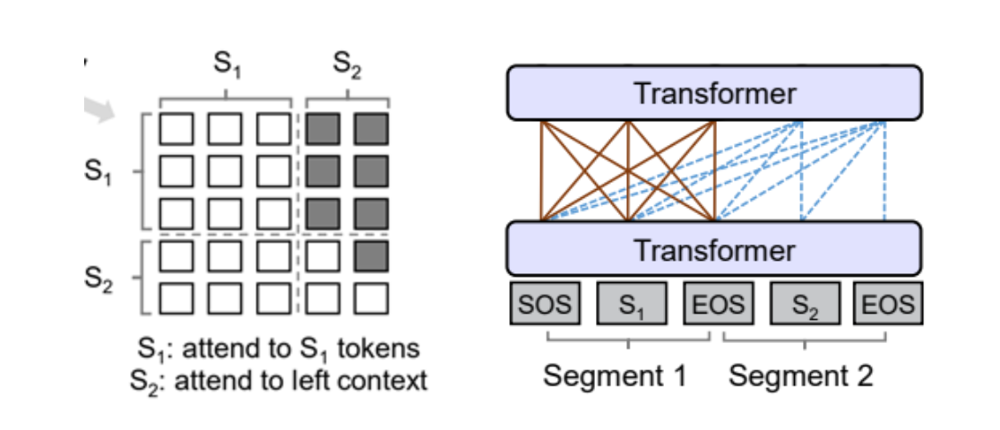
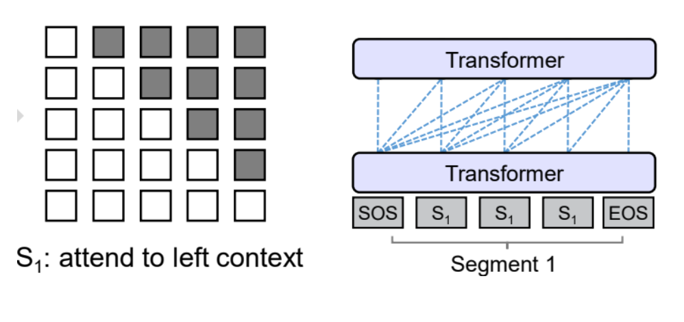

# **prefix LM** 和 **causal LM** 区别是什么

- **Prefix LM（前缀语言模型）**：看到“前缀”→ 模型可以用“前面的文字（前缀）”来预测后面的内容。
- **Causal LM（因果语言模型）**：看到“因果”→ 模型只能根据“过去”预测“未来”，**不能偷看未来**。

想象你在写作文：

- **Prefix LM（前缀型）**：
   你可以先看到“前面的内容（题目或开头）”，再用它去生成中间或后面的部分。
   但这个“前缀”也可能包括上下文提示、任务说明，比如“请回答下面的问题：XXX”。
   👉 像一个人拿到一段提示，再根据提示写答案。
   BERT、T5、ChatGLM 这类多任务模型常常用 Prefix LM。
- **Causal LM（因果型）**：
   你只能从**前面的句子**往后写，比如 GPT、ChatGPT 这种。
   不能回头修改，也不能偷看后面要说什么。
   👉 像一个人一边写作文一边即兴发挥。

| 对比项             | Prefix LM                  | Causal LM                      |
| ------------------ | -------------------------- | ------------------------------ |
| 输入时能看到的部分 | “前缀”部分（任务+上下文）  | 只能看“过去的token”            |
| 掩码（mask）类型   | 部分可见（前缀开放）       | 全自回归mask（未来被遮挡）     |
| 典型代表模型       | T5、ChatGLM、UL2           | GPT系列（GPT-2、GPT-3、GPT-4） |
| 主要用途           | 多任务（翻译、问答、摘要） | 纯生成（聊天、写作、推理）     |

## Prefix LM

Prefix LM其实是Encoder-Decoder模型的变体.

(1) 在标准的Encoder-Decoder模型中，Encoder和Decoder各自使用一个独立的Transformer

( 2) 而在Prefix LM，Encoder和Decoder则共享了同一个Transformer结构，在Transformer内部通过Attention Mask机制来实现。

与标准Encoder-Decoder类似，Prefix LM在Encoder部分采用Auto Encoding (AE-自编码)模式，即前缀序列中任意两个token都相互可见，而Decoder部分采用Auto Regressive (AR-自回归)模式，即待生成的token可以看到Encoder侧所有token(包括上下文)和Decoder侧已经生成的token，但不能看未来尚未产生的token。

下面的图很形象地解释了Prefix LM的Attention Mask机制(左)及流转过程(右)。

## Causal LM

Causal LM是因果语言模型，目前流行地大多数模型都是这种结构，别无他因，因为GPT系列模型内部结构就是它，还有开源界的LLaMa也是。

Causal LM只涉及到Encoder-Decoder中的Decoder部分，采用Auto Regressive模式，直白地说，就是根据历史的token来预测下一个token，也是在Attention Mask这里做的手脚。

