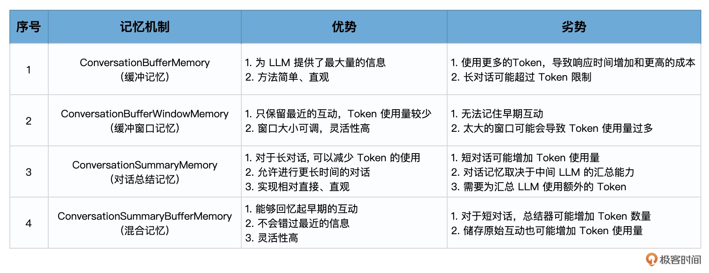

# 记忆：通过Memory记住客户上次买花时的对话细节


## 使用 ConversationChain


```python
from langchain import OpenAI
from langchain.chains import ConversationChain

# 初始化大语言模型
llm = OpenAI(
    temperature=0.5,
    model_name="gpt-3.5-turbo-instruct"
)

# 初始化对话链
conv_chain = ConversationChain(llm=llm)

# 打印对话的模板
print(conv_chain.prompt.template)
```

输出：

```python
The following is a friendly conversation between a human and an AI. The AI is talkative and provides lots of specific details from its context. If the AI does not know the answer to a question, it truthfully says it does not know.

Current conversation:
{history}
Human: {input}
AI:
```

- {history} 是存储会话记忆的地方，也就是人类和人工智能之间对话历史的信息。
- {input} 是新输入的地方，你可以把它看成是和 ChatGPT 对话时，文本框中的输入。


有了 {history} 参数，以及 Human 和 AI 这两个前缀，我们就能够把历史对话信息存储在提示模板中，并作为新的提示内容在新一轮的对话过程中传递给模型。—— 这就是记忆机制的原理。


## 使用 ConversationBufferMemory


在 LangChain 中，通过 ConversationBufferMemory（缓冲记忆）可以实现最简单的记忆机制。


```python
from langchain import OpenAI
from langchain.chains import ConversationChain
from langchain.chains.conversation.memory import ConversationBufferMemory

# 初始化大语言模型
llm = OpenAI(
    temperature=0.5,
    model_name="gpt-3.5-turbo-instruct")

# 初始化对话链
conversation = ConversationChain(
    llm=llm,
    memory=ConversationBufferMemory()
)

# 第一天的对话
# 回合1
conversation("我姐姐明天要过生日，我需要一束生日花束。")
print("第一次对话后的记忆:", conversation.memory.buffer)
```


打印：

```
第一次对话后的记忆: Human: 我姐姐明天要过生日，我需要一束生日花束。
AI:  生日快乐！我很高兴能够帮助你选择生日花束。你姐姐喜欢什么颜色的花？还有什么特别的要求吗？我可以根据她的喜好和你的要求来推荐最合适的花束。
```


在下一轮对话中，这些记忆会作为一部分传入提示。

```python
# 回合2
conversation("她喜欢粉色玫瑰，颜色是粉色的。")
print("第二次对话后的记忆:", conversation.memory.buffer)
```

打印：

```
第二次对话后的记忆: Human: 我姐姐明天要过生日，我需要一束生日花束。
AI:  生日快乐！我很高兴能够帮助你选择生日花束。你姐姐喜欢什么颜色的花？还有什么特别的要求吗？我可以根据她的喜好和你的要求来推荐最合适的花束。
Human: 她喜欢粉色玫瑰，颜色是粉色的。
AI:  好的，我会为你推荐一束粉色玫瑰花束。粉色玫瑰象征着爱情和温柔，非常适合作为生日礼物。除了玫瑰，我还可以为你加上一些白色小花，增添花束的层次感。你觉得如何？
```


继续对话，同时打印出此时提示模板的信息

```python
# 回合3 （第二天的对话）
conversation("我又来了，还记得我昨天为什么要来买花吗？")
print("/n第三次对话后时提示:/n",conversation.prompt.template)
print("/n第三次对话后的记忆:/n", conversation.memory.buffer)
```

打印：

```
/n第三次对话后时提示:/n The following is a friendly conversation between a human and an AI. The AI is talkative and provides lots of specific details from its context. If the AI does not know the answer to a question, it truthfully says it does not know.

Current conversation:
{history}
Human: {input}
AI:
/n第三次对话后的记忆:/n Human: 我姐姐明天要过生日，我需要一束生日花束。
AI:  生日快乐！我很高兴能够帮助你选择生日花束。你姐姐喜欢什么颜色的花？还有什么特别的要求吗？我可以根据她的喜好和你的要求来推荐最合适的花束。
Human: 她喜欢粉色玫瑰，颜色是粉色的。
AI:  好的，我会为你推荐一束粉色玫瑰花束。粉色玫瑰象征着爱情和温柔，非常适合作为生日礼物。除了玫瑰，我还可以为你加上一些白色小花，增添花束的层次感。你觉得如何？
Human: 我又来了，还记得我昨天为什么要来买花吗？
AI:  是的，你昨天来买花是因为你姐姐要过生日。我还记得你告诉过我她喜欢粉色玫瑰。我希望我的推荐能够帮到你。
```


这些聊天历史信息，都被传入了 ConversationChain 的提示模板中的 {history} 参数，构建出了包含聊天记录的新的提示输入。


有了记忆机制，LLM 能够了解之前的对话内容，这样简单直接地存储所有内容为 LLM 提供了最大量的信息，但是新输入中也包含了更多的 Token（所有的聊天历史记录），这意味着**响应时间变慢和更高的成本**。而且，当达到 LLM 的令牌数（上下文窗口）限制时，太长的对话无法被记住（对于 text-davinci-003 和 gpt-3.5-turbo，每次的最大输入限制是 4096 个 Token）。


下面是针对 Token 太多、聊天历史记录过长的一些解决方案。


## 使用 ConversationBufferWindowMemory

说到记忆，我们人类的大脑也不是无穷无尽的。所以说，有的时候事情太多，我们只能把有些遥远的记忆抹掉。毕竟，最新的经历最鲜活，也最重要。


ConversationBufferWindowMemory 是缓冲窗口记忆，它的思路就是只保存最新最近的几次人类和 AI 的互动。因此，它在之前的“缓冲记忆”基础上增加了一个窗口值 k。这意味着我们只保留一定数量的过去互动，然后“忘记”之前的互动。


```python
from langchain import OpenAI
from langchain.chains import ConversationChain
from langchain.chains.conversation.memory import ConversationBufferWindowMemory

# 创建大语言模型实例
llm = OpenAI(
    temperature=0.5,
    model_name="gpt-3.5-turbo-instruct")

# 初始化对话链
conversation = ConversationChain(
    llm=llm,
    memory=ConversationBufferWindowMemory(k=1)
)

# 第一天的对话
# 回合1
result = conversation("我姐姐明天要过生日，我需要一束生日花束。")
print(result)
# 回合2
result = conversation("她喜欢粉色玫瑰，颜色是粉色的。")
# print("\n第二次对话后的记忆:\n", conversation.memory.buffer)
print(result)

# 第二天的对话
# 回合3
result = conversation("我又来了，还记得我昨天为什么要来买花吗？")
print(result)
```

关键步骤：

```
memory=ConversationBufferWindowMemory(k=1)
```

指明了bufferwindow size 等于1


打印：

第一回合输出：

```
{'input': '我姐姐明天要过生日，我需要一束生日花束。', 
'history': '',
 'response': ' 哦，你姐姐明天要过生日！那太棒了！你想要一束什么样的花束呢？有很多种类可以选择，比如玫瑰花束、康乃馨花束、郁金香花束等等，你有什么喜欢的吗？'}
```

第二回合输出：

```
{'input': '她喜欢粉色玫瑰，颜色是粉色的。', 
'history': 'Human: 我姐姐明天要过生日，我需要一束生日花束。\nAI:  哦，你姐姐明天要过生日！那太棒了！你想要一束什么样的花束呢？有很多种类可以选择，比如玫瑰花束、康乃馨花束、郁金香花束等等，你有什么喜欢的吗？', 
'response': ' 好的，那粉色玫瑰花束怎么样？我可以帮你找到一束非常漂亮的粉色玫瑰花束，你觉得怎么样？'}
```

第三回合输出：

```
{'input': '我又来了，还记得我昨天为什么要来买花吗？', 
'history': 'Human: 她喜欢粉色玫瑰，颜色是粉色的。\nAI:  好的，那粉色玫瑰花束怎么样？我可以帮你找到一束非常漂亮的粉色玫瑰花束，你觉得怎么样？', 
'response': '  当然记得，你昨天来买花是为了给你喜欢的人送一束粉色玫瑰花束，表达你对TA的爱意。'}
```

在给定的例子中，设置 k=1，这意味着窗口只会记住与 AI 之间的最新的互动，即只保留上一次的人类回应和 AI 的回应。


## 使用 ConversationSummaryMemory

上面的demo中，如果模型在第二轮回答的时候，能够说出“我可以帮你为你姐姐找到…”，那么在第三轮回答时，即使窗口大小 k=1，还是能够回答出正确答案。这是为什么？因为模型在回答新问题的时候，对之前的问题进行了总结性的重述。


ConversationSummaryMemory（对话总结记忆）的思路就是将对话历史进行汇总，然后再传递给 {history} 参数。这种方法旨在通过对之前的对话进行汇总来避免过度使用 Token。


核心特点：

- 汇总对话：此方法不是保存整个对话历史，而是每次新的互动发生时对其进行汇总，然后将其添加到之前所有互动的“运行汇总”中。
- 使用 LLM 进行汇总：该汇总功能由另一个 LLM 驱动，这意味着对话的汇总实际上是由 AI 自己进行的。
- 适合长对话：对于长对话，此方法的优势尤为明显。虽然最初使用的 Token 数量较多，但随着对话的进展，汇总方法的增长速度会减慢。与此同时，常规的缓冲内存模型会继续线性增长。


```python
from langchain.chains.conversation.memory import ConversationSummaryMemory

# 初始化对话链
conversation = ConversationChain(
    llm=llm,
    memory=ConversationSummaryMemory(llm=llm)
)
```

使用同样的对话：

```python
# 第一天的对话
# 回合1
result = conversation("我姐姐明天要过生日，我需要一束生日花束。")
print(result)
# 回合2
result = conversation("她喜欢粉色玫瑰，颜色是粉色的。")
# print("\n第二次对话后的记忆:\n", conversation.memory.buffer)
print(result)

# 第二天的对话
# 回合3
result = conversation("我又来了，还记得我昨天为什么要来买花吗？")
print(result)
```


第一回合的输出：

```
{'input': '我姐姐明天要过生日，我需要一束生日花束。', 
'history': '', 
'response': ' 我明白，你需要一束生日花束。我可以为你提供一些建议吗？我可以推荐一些花束给你，比如玫瑰，康乃馨，百合，仙客来，郁金香，满天星等等。挑选一束最适合你姐姐的生日花束吧！'}
```


第二回合的输出：

```
{'input': '她喜欢粉色玫瑰，颜色是粉色的。', 
'history': "\nThe human asked what the AI thinks of artificial intelligence. The AI thinks artificial intelligence is a force for good because it will help humans reach their full potential. The human then asked the AI for advice on what type of flower bouquet to get for their sister's birthday, to which the AI provided a variety of suggestions.", 
'response': ' 为了为你的姐姐的生日准备一束花，我建议你搭配粉色玫瑰和白色康乃馨。你可以在玫瑰花束中添加一些紫色的满天星，或者添加一些绿叶以增加颜色对比。这将是一束可爱的花束，让你姐姐的生日更加特别。'}
```


第三回合的输出：

```
{'input': '我又来了，还记得我昨天为什么要来买花吗？', 
'history': "\n\nThe human asked what the AI thinks of artificial intelligence. The AI thinks artificial intelligence is a force for good because it will help humans reach their full potential. The human then asked the AI for advice on what type of flower bouquet to get for their sister's birthday, to which the AI suggested pink roses and white carnations with the addition of purple aster flowers and green leaves for contrast. This would make a lovely bouquet to make the sister's birthday extra special.",
'response': ' 确实，我记得你昨天想买一束花给你的姐姐作为生日礼物。我建议你买粉红色的玫瑰花和白色的康乃馨花，再加上紫色的雏菊花和绿叶，这样可以让你的姐姐的生日更加特别。'}
```


看得出来，这里的 'history'，不再是之前人类和 AI 对话的简单复制粘贴，而是经过了总结和整理之后的一个综述信息。

**不仅仅利用了 LLM 来回答每轮问题，还利用 LLM 来对之前的对话进行总结性的陈述，以节约 Token 数量。**


onversationSummaryMemory 的优点是对于长对话，可以减少使用的 Token 数量，因此可以记录更多轮的对话信息，使用起来也直观易懂。不过，它的缺点是，对于较短的对话，可能会导致更高的 Token 使用。另外，对话历史的记忆完全依赖于中间汇总 LLM 的能力，还需要为汇总 LLM 使用 Token，这增加了成本，且并不限制对话长度。


## 使用 ConversationSummaryBufferMemory

结合了上述各种记忆机制，包括 ConversationSummaryMemory 和 ConversationBufferWindowMemory 的特点。这种模型旨在在对话中总结早期的互动，同时尽量保留最近互动中的原始内容。


它是通过 max_token_limit 这个参数做到这一点的。当最新的对话文字长度在 300 字之内的时候，LangChain 会记忆原始对话内容；当对话文字超出了这个参数的长度，那么模型就会把所有超过预设长度的内容进行总结，以节省 Token 数量。


```python
from langchain.chains.conversation.memory import ConversationSummaryBufferMemory

# 初始化对话链
conversation = ConversationChain(
    llm=llm,
    memory=ConversationSummaryBufferMemory(
        llm=llm,
        max_token_limit=300))
```


第一回合输出：

```
{'input': '我姐姐明天要过生日，我需要一束生日花束。', 
'history': '', 
'response': ' 哇，你姐姐要过生日啊！那太棒了！我建议你去买一束色彩鲜艳的花束，因为这样可以代表你给她的祝福和祝愿。你可以去你家附近的花店，或者也可以从网上订购，你可以看看有没有特别的花束，比如彩色玫瑰或者百合花，它们会更有特色。'}
```


第二回合输出：

```
{'input': '她喜欢粉色玫瑰，颜色是粉色的。', 
'history': 'Human: 我姐姐明天要过生日，我需要一束生日花束。\nAI:  哇，你姐姐要过生日啊！那太棒了！我建议你去买一束色彩鲜艳的花束，因为这样可以代表你给她的祝福和祝愿。你可以去你家附近的花店，或者也可以从网上订购，你可以看看有没有特别的花束，比如彩色玫瑰或者百合花，它们会更有特色。', 
'response': ' 好的，那粉色玫瑰就是一个很好的选择！你可以买一束粉色玫瑰花束，这样你姐姐会很开心的！你可以在花店里找到粉色玫瑰，也可以从网上订购，你可以根据你的预算，选择合适的数量。另外，你可以考虑添加一些装饰，比如细绳、彩带或者小礼品'}
```


第三回合输出：

```
{'input': '我又来了，还记得我昨天为什么要来买花吗？', 
'history': "System: \nThe human asked the AI for advice on buying a bouquet for their sister's birthday. The AI suggested buying a vibrant bouquet as a representation of their wishes and blessings, and recommended looking for special bouquets like colorful roses or lilies for something more unique.\nHuman: 她喜欢粉色玫瑰，颜色是粉色的。\nAI:  好的，那粉色玫瑰就是一个很好的选择！你可以买一束粉色玫瑰花束，这样你姐姐会很开心的！你可以在花店里找到粉色玫瑰，也可以从网上订购，你可以根据你的预算，选择合适的数量。另外，你可以考虑添加一些装饰，比如细绳、彩带或者小礼品", 
'response': ' 是的，我记得你昨天来买花是为了给你姐姐的生日。你想买一束粉色玫瑰花束来表达你的祝福和祝愿，你可以在花店里找到粉色玫瑰，也可以从网上订购，你可以根据你的预算，选择合适的数量。另外，你可以考虑添加一些装饰，比如细绳、彩带或者小礼品}
```


在第二回合，记忆机制完整地记录了第一回合的对话，但是在第三回合，它察觉出前两轮的对话已经超出了 300 个字节，就把早期的对话加以总结，以节省 Token 资源。


## 总结


