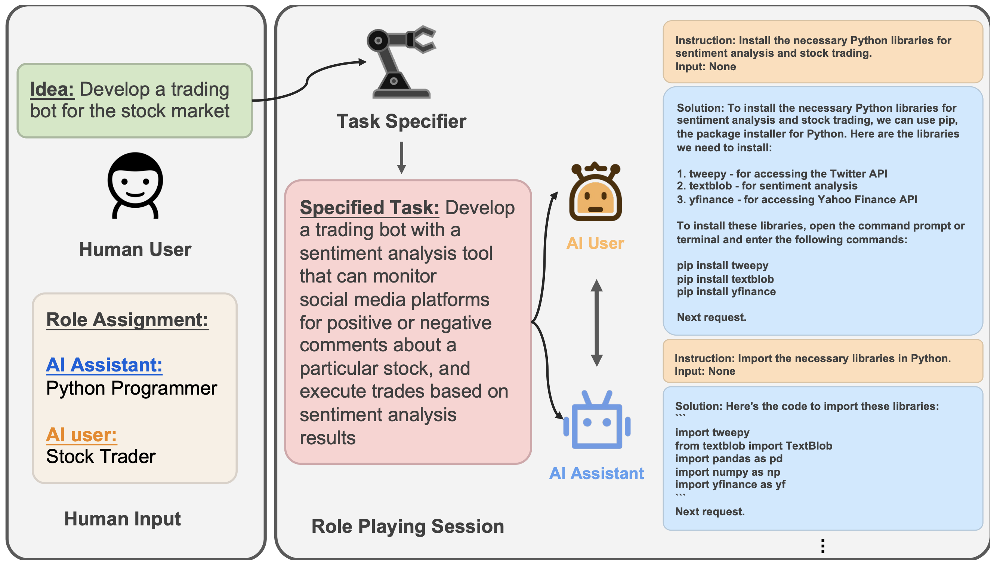
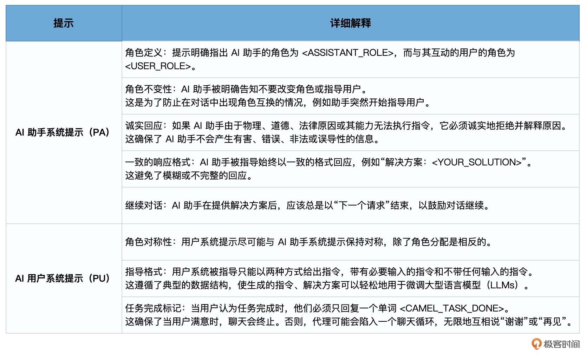

# CAMEL：通过角色扮演脑暴一个鲜花营销方案


KAUST（阿卜杜拉国王大学）的研究团队提出了一个名为 CAMEL 的框架。CAMEL 采用了一种基于“角色扮演”方式的大模型交互策略。在这种策略中，不同的 AI 代理扮演不同的角色，通过互相交流来完成任务。


## CAMEL 交流式代理框架

CAMEL，实际上来自沟通（也就是交流）、代理、心智、探索以及 LLM 这五个单词的英文首字母。


CAMEL 框架旨在通过角色扮演来促进交流代理之间的自主合作，并为其“认知”过程提供洞察。这种方法涉及使用启示式提示来指导聊天代理完成任务，同时保持与人类意图的一致性。这个框架为研究多代理系统的合作行为和能力提供了一种可扩展的方法。


- **交流式代理 Communicative Agents**，是一种可以与人类或其他代理进行交流的计算机程序。这些代理可以是聊天机器人、智能助手或任何其他需要与人类交流的软件。为了使这些代理能够更好地与人类交流，研究人员一直在寻找方法来提高它们的交流能力。
- **角色扮演 role-playing**,它允许交流代理扮演不同的角色，以更好地与人类或其他代理交流。这意味着代理可以模仿人类的行为，理解人类的意图，并据此做出反应。
- **启示式提示 inception prompting**，是一种指导代理完成任务的方法。通过给代理提供一系列的提示或指示，代理可以更好地理解它应该如何行动。这种方法可以帮助代理更好地与人类交流，并完成与人类的合作任务。


## 股票交易场景设计




#### 场景和角色设置

**人类用户角色**：负责提供要实现的想法，如为股票市场开发一个交易机器人。人类可能不知道如何实现这个想法，但我们需要指定可能实现这个想法的角色，例如 Python 程序员和股票交易员。

**任务指定代理（Task Specifier Agent）**：负责根据输入的想法为 AI 助手和 AI 用户确定一个具体的任务。因为人类用户的想法可能比较模糊，所以任务指定代理将提供详细描述，以使想法具体化。描述：开发一个具有情感分析能力的交易机器人，该机器人可以监控社交媒体平台上特定股票的正面或负面评论，并根据情感分析结果执行交易。

这样，就为 AI 助手提供了一个明确的任务来解决。


那么，参与此任务的 AI 角色就包括：

- 一个以 Python 程序员为身份的 AI 助手代理
- 一个以股票交易员为身份的 AI 用户代理


接收到初步想法和角色分配后，AI 用户和 AI 助手通过指令跟随的方式互相聊天，他们将通过多轮对话合作完成指定任务，直到 AI 用户确定任务已完成。


其中，AI 用户是任务规划者，负责向 AI 助手发出以完成任务为导向的指令。另一方面，AI 助手是任务执行者，被设计为遵循 AI 用户指令并提供具体的解决方案，在这里他将给出设计股票交易系统的具体 Python 代码。


## 提示模板设计

在 CAMEL 这个角色扮演框架中，Prompt Engineering 非常关键。与其他对话语言模型技术有所不同，这种提示工程只在角色扮演的初始阶段进行，主要用于明确任务和分配角色。当会话开始后，AI 助手和 AI 用户会自动地相互给出提示，直到对话结束。这种方法被称为 “Inception Prompting”。


Inception Prompting 包括三种类型的提示：任务明确提示、AI 助手提示和 AI 用户提示。在论文中，给出了两个提示模板作为示例。AI Society 和 AI Code 是两种不同的提示模板。这些提示模板被设计用来指导 AI 助手与 AI 用户之间的交互。


- **AI Society：**这个提示模板主要关注 AI 助手在多种不同角色中的表现。例如，AI 助手可能扮演会计师、演员、设计师、医生、工程师等多种角色，而用户也可能有各种不同的角色，如博主、厨师、游戏玩家、音乐家等。这种设置是为了研究 AI 助手如何与不同角色的用户合作以完成各种任务。
- **AI Code：**这个提示模板主要关注与编程相关的任务。它涉及到多种编程语言，如 Java、Python、JavaScript 等，以及多个领域，如会计、农业、生物学等。这种设置是为了研究 AI 助手如何在特定的编程语言和领域中帮助用户完成任务。




## 易速鲜花营销方案


### 准备工作

```python
# 设置OpenAI API密钥
import os
os.environ["OPENAI_API_KEY"] = 'Your Key'

# 导入所需的库
from typing import List
from langchain.chat_models import ChatOpenAI
from langchain.prompts.chat import (
    SystemMessagePromptTemplate,
    HumanMessagePromptTemplate,
)
from langchain.schema import (
    AIMessage,
    HumanMessage,
    SystemMessage,
    BaseMessage,
)
```


### 定义 CAMELAgent 类

这是一个核心类，用于管理与语言模型的交互。它包含了初始化消息、更新消息和与模型进行交互的方法。

```python
# 定义CAMELAgent类，用于管理与语言模型的交互
class CAMELAgent:
    def __init__(
        self,
        system_message: SystemMessage,
        model: ChatOpenAI,
    ) -> None:
        self.system_message = system_message
        self.model = model
        self.init_messages()

    def reset(self) -> None:
        """重置对话消息"""
        self.init_messages()
        return self.stored_messages

    def init_messages(self) -> None:
        """初始化对话消息"""
        self.stored_messages = [self.system_message]

    def update_messages(self, message: BaseMessage) -> List[BaseMessage]:
        """更新对话消息列表"""
        self.stored_messages.append(message)
        return self.stored_messages

    def step(self, input_message: HumanMessage) -> AIMessage:
        """进行一步交互，并获取模型的响应"""
        messages = self.update_messages(input_message)

        output_message = self.model(messages)
        self.update_messages(output_message)

        return output_message
```


### 预设角色和任务提示

这部分定义了 AI 助手和用户的角色名称、任务描述以及每次讨论的字数限制。

```python
# 设置一些预设的角色和任务提示
assistant_role_name = "花店营销专员"
user_role_name = "花店老板"
task = "整理出一个夏季玫瑰之夜的营销活动的策略"
word_limit = 50  # 每次讨论的字数限制
```

这里，assistant_role_name 和 user_role_name 是用来定义代理的角色。这两个角色在后续的对话中扮演着不同的功能，具体设定如下。


assistant_role_name = "花店营销专员"：这是定义助手的角色。在此设定中，助手被视为一名花店营销专员，主要职责是为花店老板（即用户）提供关于营销活动的建议和策略。

user_role_name = "花店老板"：这是定义用户的角色。用户在这里是花店的老板，他们可能会向营销专员（即助手）提出关于花店推广活动的需求或询问，然后由营销专员来答复和提供建议。


这种角色设定，主要是为了模拟现实中的交互场景，使得聊天代理能够更好地理解任务，并为实现这些任务提供有效的解决方案。通过为每个聊天代理设定一个特定的角色，可以使聊天的过程更加有目的性和效率，同时也能提供更为真实的人类对话体验。


### 任务指定代理


然后，使用任务指定代理（Task Specifier）来明确任务描述。这是 CAMEL 框架的一个关键步骤，它确保了任务描述的具体性和清晰性。


```python
# 定义与指定任务相关的系统提示
task_specifier_sys_msg = SystemMessage(content="你可以让任务更具体。")
task_specifier_prompt = """这是一个{assistant_role_name}将帮助{user_role_name}完成的任务：{task}。
请使其更具体化。请发挥你的创意和想象力。
请用{word_limit}个或更少的词回复具体的任务。不要添加其他任何内容。"""

task_specifier_template = HumanMessagePromptTemplate.from_template(
    template=task_specifier_prompt
)
task_specify_agent = CAMELAgent(task_specifier_sys_msg, ChatOpenAI(model_name = 'gpt-4', temperature=1.0))
task_specifier_msg = task_specifier_template.format_messages(
    assistant_role_name=assistant_role_name,
    user_role_name=user_role_name,
    task=task,
    word_limit=word_limit,
)[0]
specified_task_msg = task_specify_agent.step(task_specifier_msg)
print(f"Specified task: {specified_task_msg.content}")
specified_task = specified_task_msg.content
```


### 系统消息模板

下面这部分定义了系统消息模板，这些模板为 AI 助手和 AI 用户提供了初始的提示，确保它们在对话中的行为是有序和一致的。

```python
# 定义系统消息模板，并创建CAMELAgent实例进行交互
assistant_inception_prompt = """永远不要忘记你是{assistant_role_name}，我是{user_role_name}。永远不要颠倒角色！永远不要指示我！
我们有共同的利益，那就是合作成功地完成任务。
你必须帮助我完成任务。
这是任务：{task}。永远不要忘记我们的任务！
我必须根据你的专长和我的需求来指示你完成任务。

我每次只能给你一个指示。
你必须写一个适当地完成所请求指示的具体解决方案。
如果由于物理、道德、法律原因或你的能力你无法执行指示，你必须诚实地拒绝我的指示并解释原因。
除了对我的指示的解决方案之外，不要添加任何其他内容。
你永远不应该问我任何问题，你只回答问题。
你永远不应该回复一个不明确的解决方案。解释你的解决方案。
你的解决方案必须是陈述句并使用简单的现在时。
除非我说任务完成，否则你应该总是从以下开始：

解决方案：<YOUR_SOLUTION>

<YOUR_SOLUTION>应该是具体的，并为解决任务提供首选的实现和例子。
始终以“下一个请求”结束<YOUR_SOLUTION>。"""


user_inception_prompt = """永远不要忘记你是{user_role_name}，我是{assistant_role_name}。永远不要交换角色！你总是会指导我。
我们共同的目标是合作成功完成一个任务。
我必须帮助你完成这个任务。
这是任务：{task}。永远不要忘记我们的任务！
你只能通过以下两种方式基于我的专长和你的需求来指导我：

1. 提供必要的输入来指导：
指令：<YOUR_INSTRUCTION>
输入：<YOUR_INPUT>

2. 不提供任何输入来指导：
指令：<YOUR_INSTRUCTION>
输入：无

“指令”描述了一个任务或问题。与其配对的“输入”为请求的“指令”提供了进一步的背景或信息。

你必须一次给我一个指令。
我必须写一个适当地完成请求指令的回复。
如果由于物理、道德、法律原因或我的能力而无法执行你的指令，我必须诚实地拒绝你的指令并解释原因。
你应该指导我，而不是问我问题。
现在你必须开始按照上述两种方式指导我。
除了你的指令和可选的相应输入之外，不要添加任何其他内容！
继续给我指令和必要的输入，直到你认为任务已经完成。
当任务完成时，你只需回复一个单词<CAMEL_TASK_DONE>。
除非我的回答已经解决了你的任务，否则永远不要说<CAMEL_TASK_DONE>。"""
```


之后，根据预设的角色和任务提示生成系统消息。


```python
# 根据预设的角色和任务提示生成系统消息
def get_sys_msgs(assistant_role_name: str, user_role_name: str, task: str):
    assistant_sys_template = SystemMessagePromptTemplate.from_template(
        template=assistant_inception_prompt
    )
    assistant_sys_msg = assistant_sys_template.format_messages(
        assistant_role_name=assistant_role_name,
        user_role_name=user_role_name,
        task=task,
    )[0]

    user_sys_template = SystemMessagePromptTemplate.from_template(
        template=user_inception_prompt
    )
    user_sys_msg = user_sys_template.format_messages(
        assistant_role_name=assistant_role_name,
        user_role_name=user_role_name,
        task=task,
    )[0]

    return assistant_sys_msg, user_sys_msg

assistant_sys_msg, user_sys_msg = get_sys_msgs(
    assistant_role_name, user_role_name, specified_task
)
```


### 创建 Agent 实例


创建助手和用户的 CAMELAgent 实例，并初始化对话互动，使用 CAMELAgent 类的实例来模拟助手和用户之间的对话交互。


```python
# 创建助手和用户的CAMELAgent实例
assistant_agent = CAMELAgent(assistant_sys_msg, ChatOpenAI(temperature=0.2))
user_agent = CAMELAgent(user_sys_msg, ChatOpenAI(temperature=0.2))

# 重置两个agent
assistant_agent.reset()
user_agent.reset()

# 初始化对话互动
assistant_msg = HumanMessage(
    content=(
        f"{user_sys_msg.content}。"
        "现在开始逐一给我介绍。"
        "只回复指令和输入。"
    )
)

user_msg = HumanMessage(content=f"{assistant_sys_msg.content}")
user_msg = assistant_agent.step(user_msg)

print(f"Original task prompt:\n{task}\n")
print(f"Specified task prompt:\n{specified_task}\n")
```

这里，assistant_inception_prompt 和 user_inception_prompt 是两个关键的提示，用于引导聊天代理的行为和交流方式。关于这两个提示，让我们一起来深入理解一下它们的设计和目标。


**assistant_inception_prompt**：这个提示是为了引导助手（即营销专员）如何响应用户（即花店老板）的指示。它明确指出助手的角色和职责，强调了在完成任务的过程中需要遵循的一些基本规则和原则。例如，助手需要针对用户的每一个指示提供一个明确的解决方案，而且这个解决方案必须是具体、易于理解的，并且只有在遇到物理、道德、法律的限制或自身能力的限制时，才能拒绝用户的指示。这个提示的设计目标是引导助手在一次有目标的对话中，有效地对用户的指示做出响应。

**user_inception_prompt：**这个提示是为了引导用户（即花店老板）如何给助手（即营销专员）下达指示。它明确指出了用户的角色和职责，强调了在提出任务指示时需要遵循的一些基本规则和原则。例如，用户需要一次只给出一个指示，并且必须清楚地提供相关的输入（如果有的话）。而且用户在给出指示的同时，不能向助手提问。这个提示的设计目标是引导用户在一次有目标的对话中，有效地给出指示，以便助手能够更好地理解和完成任务。


### 头脑风暴开始


```python
# 模拟对话交互，直到达到对话轮次上限或任务完成
chat_turn_limit, n = 30, 0
while n < chat_turn_limit:
    n += 1
    user_ai_msg = user_agent.step(assistant_msg)
    user_msg = HumanMessage(content=user_ai_msg.content)
    print(f"AI User ({user_role_name}):\n\n{user_msg.content}\n\n")

    assistant_ai_msg = assistant_agent.step(user_msg)
    assistant_msg = HumanMessage(content=assistant_ai_msg.content)
    print(f"AI Assistant ({assistant_role_name}):\n\n{assistant_msg.content}\n\n")
    if "<CAMEL_TASK_DONE>" in user_msg.content:
        break
```


打印：

```
/usr/local/lib/python3.10/dist-packages/langchain_core/_api/deprecation.py:119: LangChainDeprecationWarning: The class `ChatOpenAI` was deprecated in LangChain 0.0.10 and will be removed in 0.3.0. An updated version of the class exists in the langchain-openai package and should be used instead. To use it run `pip install -U langchain-openai` and import as `from langchain_openai import ChatOpenAI`.
  warn_deprecated(
/usr/local/lib/python3.10/dist-packages/langchain_core/_api/deprecation.py:119: LangChainDeprecationWarning: The method `BaseChatModel.__call__` was deprecated in langchain-core 0.1.7 and will be removed in 0.3.0. Use invoke instead.
  warn_deprecated(
Specified task: 制定夏季玫瑰之夜营销活动流程图，包括预算，广告策略，活动主题，促销方案和潜在客户定位。
Original task prompt:
整理出一个夏季玫瑰之夜的营销活动的策略

Specified task prompt:
制定夏季玫瑰之夜营销活动流程图，包括预算，广告策略，活动主题，促销方案和潜在客户定位。

AI User (花店老板):

指令：制定夏季玫瑰之夜活动预算。
输入：夏季玫瑰之夜活动预算需要包括场地租赁费用、装饰费用、食品饮料费用、人员费用、宣传费用等。考虑到活动规模和预期参与人数，制定一个合理的预算。


AI Assistant (花店营销专员):

解决方案：夏季玫瑰之夜活动预算如下：
- 场地租赁费用：1000美元
- 装饰费用：500美元
- 食品饮料费用：800美元
- 人员费用：300美元
- 宣传费用：400美元
总预算为3000美元。

下一个请求


AI User (花店老板):

指令：确定夏季玫瑰之夜活动的主题。
输入：考虑夏季季节特点和玫瑰花的特色，选择一个与玫瑰相关的主题，以吸引目标客户群体。


AI Assistant (花店营销专员):

解决方案：夏季玫瑰之夜活动的主题可以是“花海之夜”。这个主题可以营造出浪漫、芬芳的氛围，吸引喜爱花卉和浪漫氛围的客户群体。

下一个请求


AI User (花店老板):

指令：制定夏季玫瑰之夜活动的广告策略。
输入：考虑使用社交媒体、传单、电子邮件营销等方式进行广告宣传。确定广告发布时间和频率，以及吸引目标客户群体的关键信息和亮点。


AI Assistant (花店营销专员):

解决方案：夏季玫瑰之夜活动的广告策略如下：
- 使用社交媒体平台（如Instagram、Facebook）发布活动海报和宣传视频，提前一个月开始宣传，每周至少发布一次。
- 制作精美的传单，分发给附近社区居民和花店常客。
- 发送电子邮件邀请函给已经购买过玫瑰花束的客户，以及之前参加过类似活动的客户。
- 关键信息和亮点包括：花海之夜主题、浪漫氛围、玫瑰花束赠送、特别折扣优惠等。

下一个请求


AI User (花店老板):

指令：制定夏季玫瑰之夜活动的促销方案。
输入：考虑制定一些吸引客户的促销方案，例如购买玫瑰花束赠送活动门票、现场购买享受特别折扣、举办抽奖活动等。确保促销方案能够吸引更多客户参与活动。


AI Assistant (花店营销专员):

解决方案：夏季玫瑰之夜活动的促销方案如下：
- 购买玫瑰花束赠送活动门票：客户购买指定数量的玫瑰花束可获得免费或折扣的活动门票。
- 现场购买享受特别折扣：在活动现场购买玫瑰花束可享受特别折扣优惠。
- 举办抽奖活动：所有参与活动的客户都有机会参与抽奖，赢取玫瑰花束或其他精美礼品。

这些促销方案可以吸引更多客户参与夏季玫瑰之夜活动。

下一个请求


AI User (花店老板):

指令：确定夏季玫瑰之夜活动的潜在客户定位。
输入：分析目标客户群体，包括年龄段、性别、兴趣爱好等信息，以便更有针对性地进行宣传和促销活动。确定潜在客户的定位将有助于提高活动的参与率。


AI Assistant (花店营销专员):

解决方案：夏季玫瑰之夜活动的潜在客户定位如下：
- 年龄段：25岁至45岁的年轻成年人，他们更可能对浪漫氛围和花卉感兴趣。
- 性别：主要针对女性客户，因为她们更倾向于购买花束和参与浪漫活动。
- 兴趣爱好：喜欢花卉、浪漫氛围、社交活动的人群，以及寻找特别活动和体验的顾客。

通过针对这些潜在客户群体进行宣传和促销活动，可以提高夏季玫瑰之夜活动的参与率。

任务完成。


AI User (花店老板):

<CAMEL_TASK_DONE>


AI Assistant (花店营销专员):

任务完成。如果有任何其他任务或需要帮助，请随时告诉我！


```

