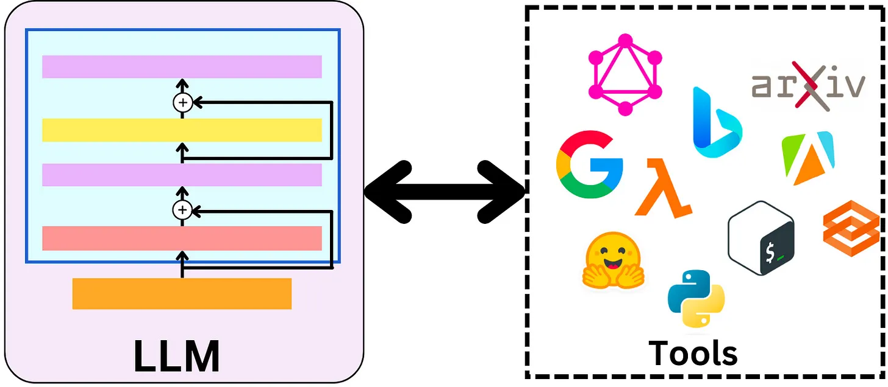

# LangChain中的Tool和Toolkits一览


## 工具是代理的武器


LangChain 之所以强大，第一是大模型的推理能力强大，第二则是工具的执行能力强大。工具是代理可以用来与世界交互的功能。这些工具可以是通用实用程序（例如搜索），也可以是其他链，甚至其他的代理。





### 调用方法


```python
from langchain.agents import load_tools
tool_names = [...]
tools = load_tools(tool_names)
```


某些工具（例如链、代理）可能需要 LLM 来初始化它们。

```python
from langchain.agents import load_tools
tool_names = [...]
llm = ...
tools = load_tools(tool_names, llm=llm)
```


## 使用 arXiv 工具开发科研助理


```
# 设置OpenAI API的密钥
import os 
os.environ["OPENAI_API_KEY"] = 'api here' 

# 导入库
from langchain.chat_models import ChatOpenAI
from langchain.agents import load_tools, initialize_agent, AgentType

# 初始化模型和工具
llm = ChatOpenAI(temperature=0.0)
tools = load_tools(
    ["arxiv"],
)

# 初始化链
agent_chain = initialize_agent(
    tools,
    llm,
    agent=AgentType.ZERO_SHOT_REACT_DESCRIPTION,
    verbose=True,
    handle_parsing_errors=True  # 处理输出解析错误
)

# 运行链
agent_chain.run("介绍一下2005.14165这篇论文的创新点?")
```


打印：


```
> Entering new AgentExecutor chain...
I should search for the paper with the identifier "2005.14165" on arxiv to find out its innovative points.
Action: arxiv
Action Input: 2005.14165
Observation: Published: 2020-07-22
Title: Language Models are Few-Shot Learners
Authors: Tom B. Brown, Benjamin Mann, Nick Ryder, Melanie Subbiah, Jared Kaplan, Prafulla Dhariwal, Arvind Neelakantan, Pranav Shyam, Girish Sastry, Amanda Askell, Sandhini Agarwal, Ariel Herbert-Voss, Gretchen Krueger, Tom Henighan, Rewon Child, Aditya Ramesh, Daniel M. Ziegler, Jeffrey Wu, Clemens Winter, Christopher Hesse, Mark Chen, Eric Sigler, Mateusz Litwin, Scott Gray, Benjamin Chess, Jack Clark, Christopher Berner, Sam McCandlish, Alec Radford, Ilya Sutskever, Dario Amodei
Summary: Recent work has demonstrated substantial gains on many NLP tasks and
benchmarks by pre-training on a large corpus of text followed by fine-tuning on
a specific task. While typically task-agnostic in architecture, this method
still requires task-specific fine-tuning datasets of thousands or tens of
thousands of examples. By contrast, humans can generally perform a new language
task from only a few examples or from simple instructions - something which
current NLP systems still largely struggle to do. Here we show that scaling up
language models greatly improves task-agnostic, few-shot performance, sometimes
even reaching competitiveness with prior state-of-the-art fine-tuning
approaches. Specifically, we train GPT-3, an autoregressive language model with
175 billion parameters, 10x more than any previous non-sparse language model,
and test its performance in the few-shot setting. For all tasks, GPT-3 is
applied without any gradient updates or fine-tuning, with tasks and few-shot
demonstrations specified purely via text interaction with the model. GPT-3
achieves strong performance on many NLP datasets, including translation,
question-answering, and cloze tasks, as well as several tasks that require
on-the-fly reasoning or domain adaptation, such as unscrambling words, using a
novel word in a sentence, or performing 3-digit arithmetic. At the same time,
we also identify some datasets where GPT-3's few-shot learning still struggles,
as well as some datasets where GPT-3 faces methodological issues related to
training on large web corpora. Finally, we find that GPT-3 can generate samples
of news articles which human evaluators have difficulty distinguishing from
articles written by humans. We discuss broader societal impacts of this finding
and of GPT-3 in general.
Thought:The innovative point of this paper is that it demonstrates how scaling up language models, specifically GPT-3 with 175 billion parameters, greatly improves task-agnostic, few-shot performance in natural language processing tasks. This means that the model can perform well on various tasks with only a few examples or simple instructions, without the need for extensive fine-tuning. 

Final Answer: The innovative point of paper 2005.14165 is the significant improvement in few-shot performance of language models, particularly GPT-3, without the need for extensive fine-tuning.

> Finished chain.
The innovative point of paper 2005.14165 is the significant improvement in few-shot performance of language models, particularly GPT-3, without the need for extensive fine-tuning.
```


