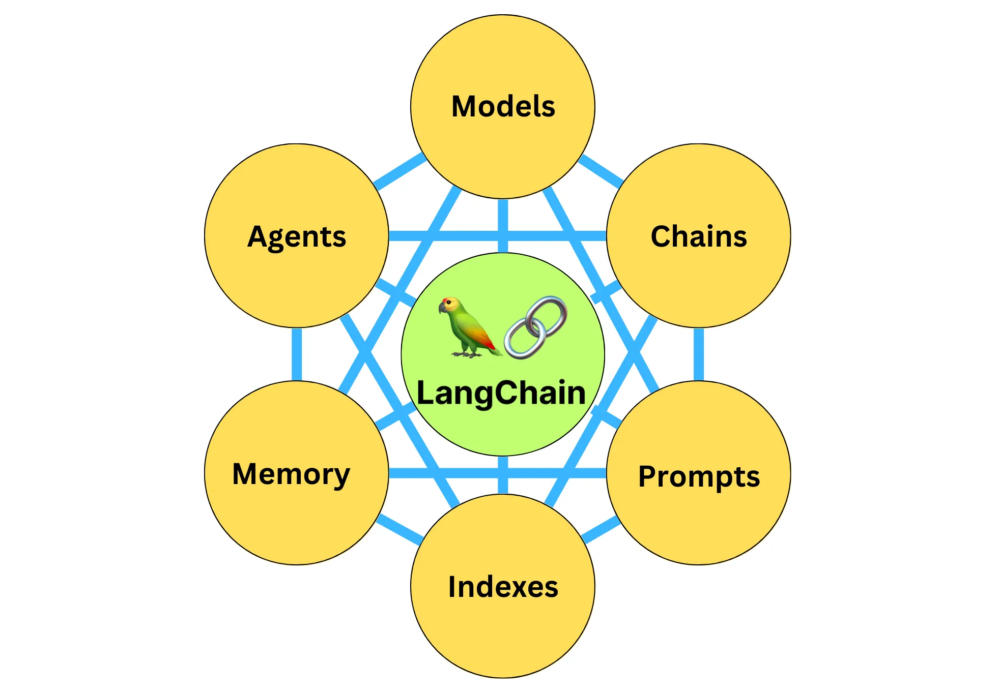

# Langchain 概念

作为一种专为开发基于语言模型的应用而设计的框架，通过 LangChain，我们不仅可以通过 API 调用如 ChatGPT、GPT-4、Llama 2 等大型语言模型，还可以实现更高级的功能。**LangChain 是一个全方位的、基于大语言模型这种预测能力的应用开发工具**，它的灵活性和模块化特性使得处理语言模型变得极其简便。不论你在何时何地，都能利用它流畅地调用语言模型，并基于语言模型的“预测”或者说“推理”能力开发新的应用。

## 两个特性：

- **数据感知：**能够将语言模型与其他数据源连接起来，从而实现对更丰富、更多样化数据的理解和利用。
- **具有代理性：**能够让语言模型与其环境进行交互，使得模型能够对其环境有更深入的理解，并能够进行有效的响应。

## 什么是大语言模型

大语言模型是一种人工智能模型，通常使用深度学习技术，比如神经网络，来理解和生成人类语言。这些模型的“大”在于它们的参数数量非常多，可以达到数十亿甚至更多，这使得它们能够理解和生成高度复杂的语言模式。

**你可以将大语言模型想象成一个巨大的预测机器，其训练过程主要基于“猜词**”：给定一段文本的开头，它的任务就是预测下一个词是什么。模型会根据大量的训练数据（例如在互联网上爬取的文本），试图理解词语和词组在语言中的用法和含义，以及它们如何组合形成意义。它会通过不断地学习和调整参数，使得自己的预测越来越准确。

比如我们给模型一个句子：“今天的天气真”，模型可能会预测出“好”作为下一个词，因为在它看过的大量训练数据中，“今天的天气真好”是一个常见的句子。这种预测并不只基于词语的统计关系，还包括对上下文的理解，甚至有时能体现出对世界常识的认知，比如它会理解到，人们通常会在天气好的时候进行户外活动。因此也就能够继续生成或者说推理出相关的内容。

