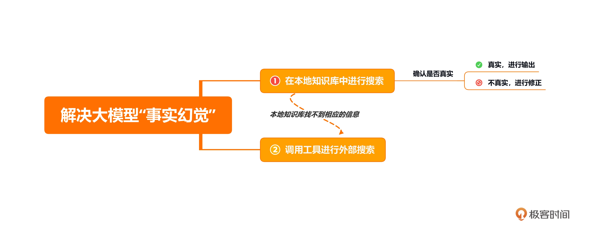
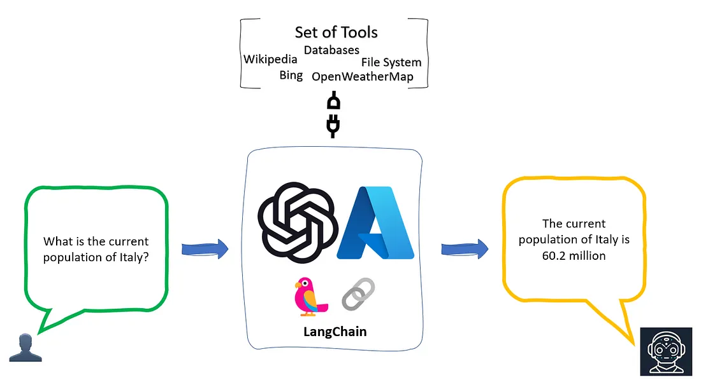
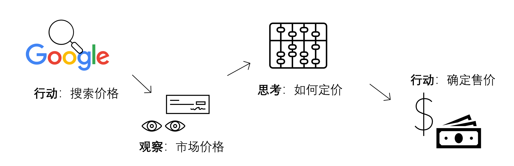
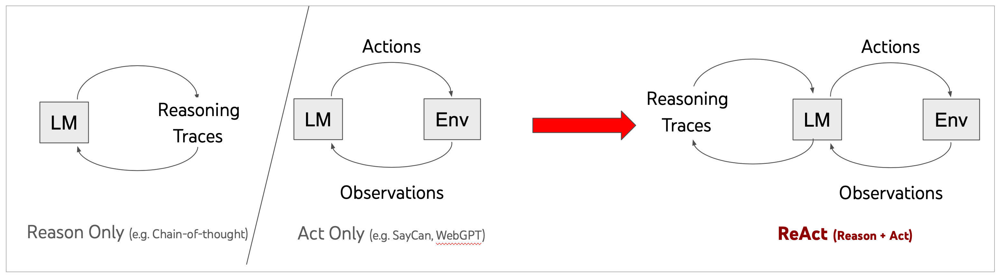
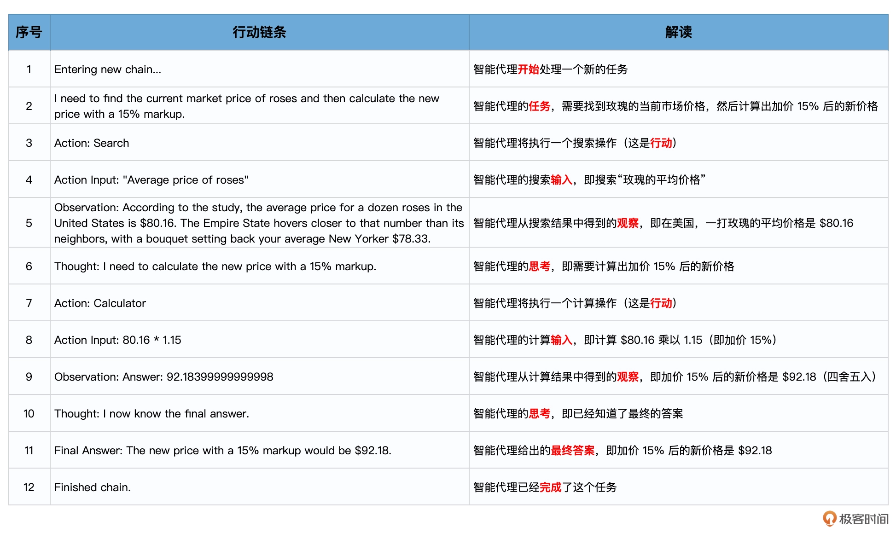

# 代理（上）：ReAct框架，推理与行动的协同


## 背景


仅仅应用思维链推理并不能解决大模型的固有问题：无法主动更新自己的知识，导致出现事实幻觉。也就是说，因为缺乏和外部世界的接触，大模型只拥有训练时见过的知识，以及提示信息中作为上下文提供的附加知识。


解决方案是可以让大模型先在本地知识库中进行搜索，检查一下提示中的信息的真实性，如果真实，再进行输出；如果不真实，则进行修正。如果本地知识库找不到相应的信息，可以调用工具进行外部搜索，来检查提示信息的真实性。




## 代理的作用


每当你遇到这种需要模型做自主判断、自行调用工具、自行决定下一步行动的时候，Agent（也就是代理）就出场了。


代理就像一个多功能的接口，它能够接触并使用一套工具。根据用户的输入，代理会决定调用哪些工具。它不仅可以同时使用多种工具，而且可以将一个工具的输出数据作为另一个工具的输入数据。


- **大模型：**提供逻辑的引擎，负责生成预测和处理输入。
- **与之交互的外部工具：**可能包括数据清洗工具、搜索引擎、应用程序等。
- **控制交互的代理：**调用适当的外部工具，并管理整个交互过程的流程。




上面的思路看似简单，其实很值得我们仔细琢磨。


这个过程有很多地方需要大模型自主判断下一步行为（也就是操作）要做什么，如果不加引导，那大模型本身是不具备这个能力的。比如下面这一系列的操作：

- 什么时候开始在本地知识库中搜索（这个比较简单，毕竟是第一个步骤，可以预设）？
- 怎么确定本地知识库的检索已经完成，可以开始下一步？
- 调用哪一种外部搜索工具（比如 Google 引擎）？
- 如何确定外部搜索工具返回了想要找的内容？
- 如何确定信息真实性的检索已经全部完成，可以开始下一步？


## ReAct 框架


比如说，你在运营花店的过程中，经常会经历天气变化而导致的鲜花售价变化，那么，每天早上你会如何为你的鲜花定价？


Google 上面查一查今天的鲜花成本价啊**（行动）**，也就是我预计的进货的价格，然后我会根据这个价格的高低**（观察）**，来确定我要加价多少**（思考）**，最后计算出一个售价**（行动）**！




这里的观察和思考，我们统称为推理（Reasoning）过程，推理指导着你的行动（Acting）。


**ReAct 框架的灵感正是来自“行动”和“推理”之间的协同作用，这种协同作用使得咱们人类能够学习新任务并做出决策或推理。**这个框架，也是大模型能够作为“智能代理”，自主、连续、交错地生成推理轨迹和任务特定操作的理论基础。

引导模型生成一个任务解决轨迹：观察环境 - 进行思考 - 采取行动，也就是观察 - 思考 - 行动。那么，再进一步进行简化，就变成了推理 - 行动，也就是 Reasoning-Acting 框架。

其中，Reasoning 包括了对当前环境和状态的观察，并生成推理轨迹。这使模型能够诱导、跟踪和更新操作计划，甚至处理异常情况。Acting 在于指导大模型采取下一步的行动，比如与外部源（如知识库或环境）进行交互并且收集信息，或者给出最终答案。

ReAct 的每一个推理过程都会被详细记录在案，这也改善大模型解决问题时的可解释性和可信度，而且这个框架在各种语言和决策任务中都得到了很好的效果。




LangChain 正是通过 Agent 类，将 ReAct 框架进行了完美封装和实现，这一下子就赋予了大模型极大的自主性（Autonomy），**你的大模型现在从一个仅仅可以通过自己内部知识进行对话聊天的 Bot，飞升为了一个有手有脚能使用工具的智能代理。**


## 通过代理实现 ReAct 框架


```python
pip install langchain langchain_community openai
```

```python
# 设置OpenAI和SERPAPI的API密钥
import os
os.environ["OPENAI_API_KEY"] = 'Your OpenAI API Key'
os.environ["SERPAPI_API_KEY"] = 'Your SerpAPI API Key'
```

```python
from langchain.agents import load_tools
from langchain.agents import initialize_agent
from langchain.agents import AgentType
from langchain.llms import OpenAI
```

```python
llm = OpenAI(temperature=0)
```

加载一些要使用的工具，包括 serpapi（这是调用 Google 搜索引擎的工具）以及 llm-math（这是通过 LLM 进行数学计算的工具）:

```python
tools = load_tools(["serpapi", "llm-math"], llm=llm)
```

使用工具、语言模型和代理类型来初始化代理。

```python
agent = initialize_agent(tools, llm, agent=AgentType.ZERO_SHOT_REACT_DESCRIPTION, verbose=True)
```


提出问题

```python
agent.run("目前市场上玫瑰花的平均价格是多少？如果我在此基础上加价15%卖出，应该如何定价？")
```


输出：

```
> Entering new  chain...
 I need to find the current market price of roses and then calculate the new price with a 15% markup.
Action: Search
Action Input: "Average price of roses"
Observation: According to the study, the average price for a dozen roses in the United States is $80.16. The Empire State hovers closer to that number than its neighbors, with a bouquet setting back your average New Yorker $78.33.
Thought: I need to calculate the new price with a 15% markup.
Action: Calculator
Action Input: 80.16 * 1.15
Observation: Answer: 92.18399999999998
Thought: I now know the final answer.
Final Answer: The new price with a 15% markup would be $92.18.
> Finished chain.
```


可以看到，ZERO_SHOT_REACT_DESCRIPTION 类型的智能代理在 LangChain 中，自动形成了一个完善的思考与行动链条，而且给出了正确的答案。


