# 代理（中）：AgentExecutor究竟是怎样驱动模型和工具完成任务的？


下面这个图，就展现出了 Agent 接到任务之后，自动进行推理，然后自主调用工具完成任务的过程。


**操作的序列并非硬编码在代码中，而是使用语言模型（如 GPT-3 或 GPT-4）来选择执行的操作序列。**


## Agent 的关键组件


**代理（Agent）：**这个类决定下一步执行什么操作。它由一个语言模型和一个提示（prompt）驱动。提示可能包含代理的性格（也就是给它分配角色，让它以特定方式进行响应）、任务的背景（用于给它提供更多任务类型的上下文）以及用于激发更好推理能力的提示策略（例如 ReAct）。LangChain 中包含很多种不同类型的代理。


**工具（Tools）：**工具是代理调用的函数。这里有两个重要的考虑因素：一是让代理能访问到正确的工具，二是以最有帮助的方式描述这些工具。如果你没有给代理提供正确的工具，它将无法完成任务。如果你没有正确地描述工具，代理将不知道如何使用它们。LangChain 提供了一系列的工具，同时你也可以定义自己的工具。 


**工具包（Toolkits）：**工具包是一组用于完成特定目标的彼此相关的工具，每个工具包中包含多个工具。比如 LangChain 的 Office365 工具包中就包含连接 Outlook、读取邮件列表、发送邮件等一系列工具。当然 LangChain 中还有很多其他工具包供你使用。


**代理执行器（AgentExecutor）：**代理执行器是代理的运行环境，它调用代理并执行代理选择的操作。执行器也负责处理多种复杂情况，包括处理代理选择了不存在的工具的情况、处理工具出错的情况、处理代理产生的无法解析成工具调用的输出的情况，以及在代理决策和工具调用进行观察和日志记录。


## AgentExecutor 的运行机制

上一章提到了：

```python
llm = OpenAI(temperature=0) # 大语言模型
tools = load_tools(["serpapi", "llm-math"], llm=llm) # 工具-搜索和数学运算
agent = initialize_agent(tools, llm, agent=AgentType.ZERO_SHOT_REACT_DESCRIPTION, verbose=True) # 代理
agent.run("目前市场上玫瑰花的平均价格是多少？如果我在此基础上加价15%卖出，应该如何定价？") # 运行代理
```

在这段代码中，模型、工具、代理的初始化，以及代理运行的过程都极为简洁。但是，LangChain 的内部封装的逻辑究竟是怎样的？


### 第一轮思考：模型决定搜索

深入 self.agent.plan 方法，来到了整个行为链条的第一步—— Plan,由 Agent 类的 Plan 方法来完成的。


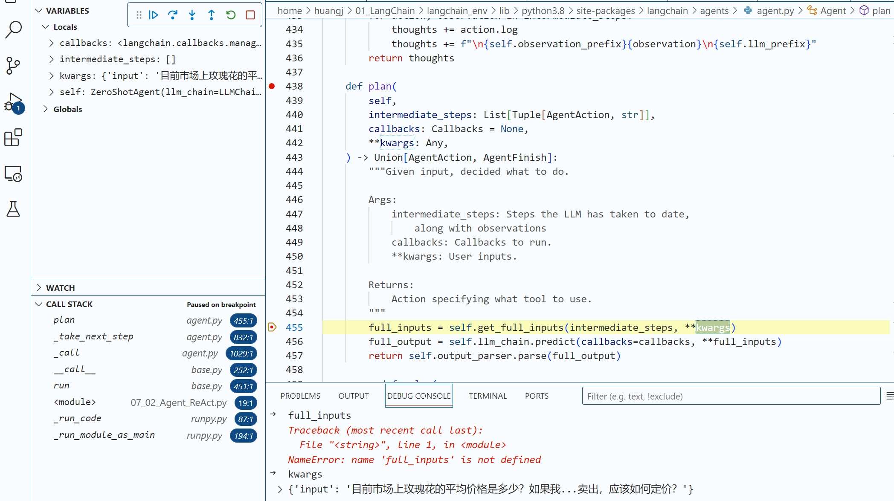


往前进一步，开始调用大模型了，LLMChain 类的 generate 方法中，可以看到提示的具体内容。

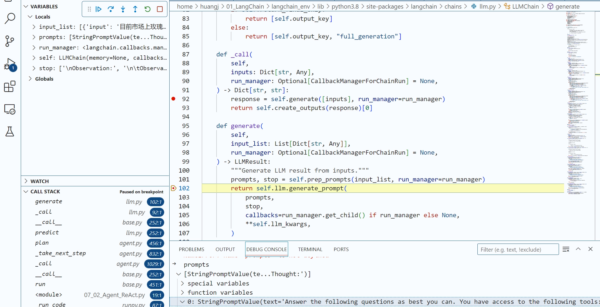


prompt内容：


> 0: StringPromptValue(text='Answer the following questions as best you can. You have access to the following tools:\n\n

这句提示是让模型尽量回答问题，并告诉模型拥有哪些工具。

> Search: A search engine. Useful for when you need to answer questions about current events. Input should be a search query.\n

这是向模型介绍第一个工具：搜索。

> Calculator: Useful for when you need to answer questions about math.\n\n

这是向模型介绍第二个工具：计算器。

> Use the following format:\n\n （指导模型使用下面的格式）
>
> Question: the input question you must answer\n （问题）
>
> Thought: you should always think about what to do\n （思考）
>
> Action: the action to take, should be one of [Search, Calculator]\n （行动）
>
> Action Input: the input to the action\n （行动的输入）
>
> Observation: the result of the action\n… （观察：行动的返回结果）
>
> (this Thought/Action/Action Input/Observation can repeat N times)\n （上面这个过程可以重复多次）
>
> Thought: I now know the final answer\n （思考：现在我知道最终答案了）
>
> Final Answer: the final answer to the original input question\n\n （最终答案）

上面，就是给模型的思考框架。

> Begin!\n\n

现在开始！

> Question: 目前市场上玫瑰花的平均价格是多少？如果我在此基础上加价 15% 卖出，应该如何定价？ \nThought:')

具体问题，也就是具体任务。


上面就是 Agent 之所以能够趋动大模型，进行**思考 - 行动 - 观察行动结果 - 再思考 - 再行动 - 再观察**这个循环的核心秘密。


有了这样的提示词，模型就会不停地思考、行动，直到模型判断出问题已经解决，给出最终答案，跳出循环。

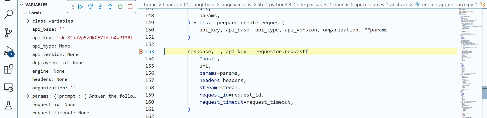


模型具体返回了什么结果:

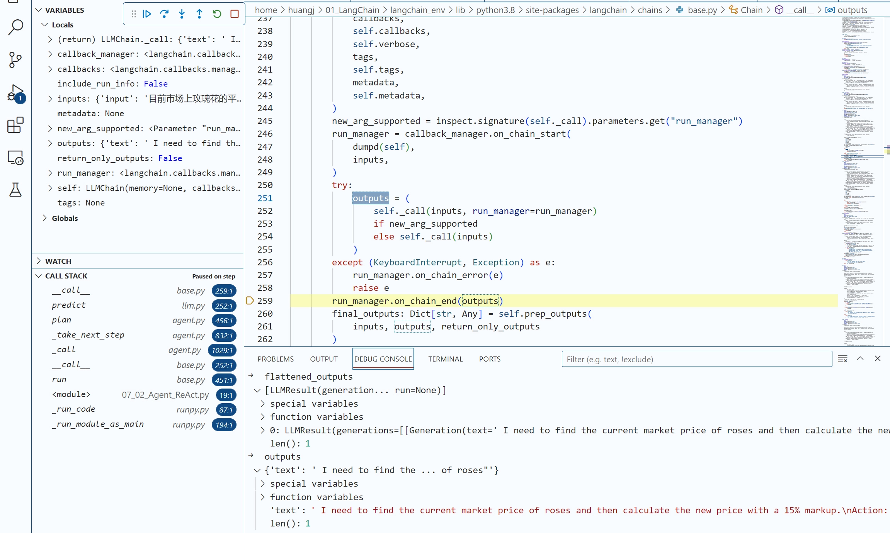


返回的内容：

> ‘text’: ’ I need to find the current market price of roses and then calculate the new price with a 15% markup.\n （Text：问题文本）
>
> Action: Search\n （行动：搜索）
>
> Action Input: “Average price of roses”’ （行动的输入：搜索玫瑰平均价格）


模型知道面对这个问题，**它自己根据现有知识解决不了，下一步行动是需要选择工具箱中的搜索工具。**而此时，命令行中也输出了模型的第一步计划——调用搜索工具。


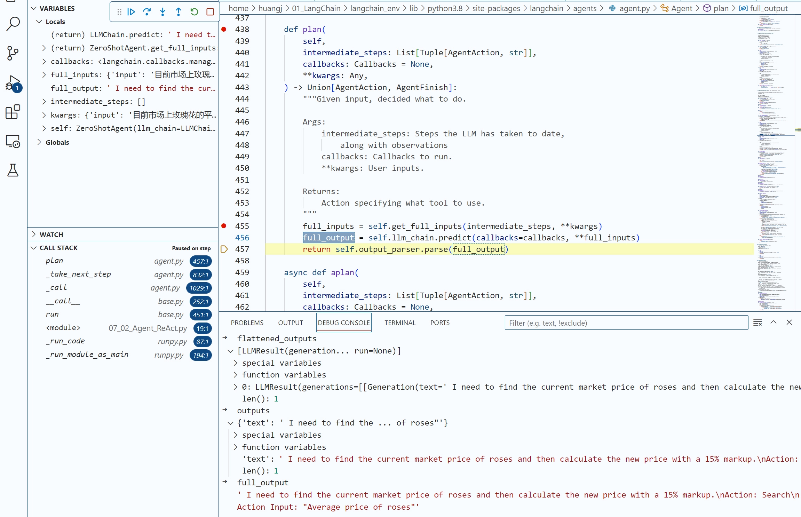

下面，就来到了 AgentExecutor 的 _take_next_step 的工具调用部分。在这里，因为模型返回了 Action 为 Search，OutputParse 解析了这个结果之后，LangChain 很清楚地知道，Search 工具会被调用。

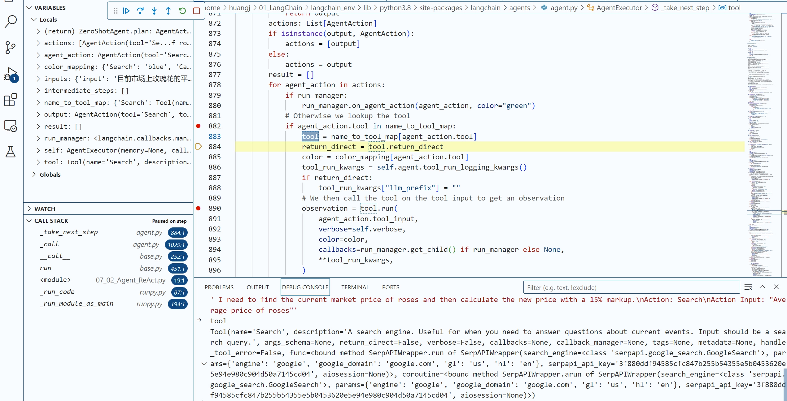

工具调用完成之后，我们就拥有了一个对当前工具调用的 Observation，也就是当前工具调用的结果。

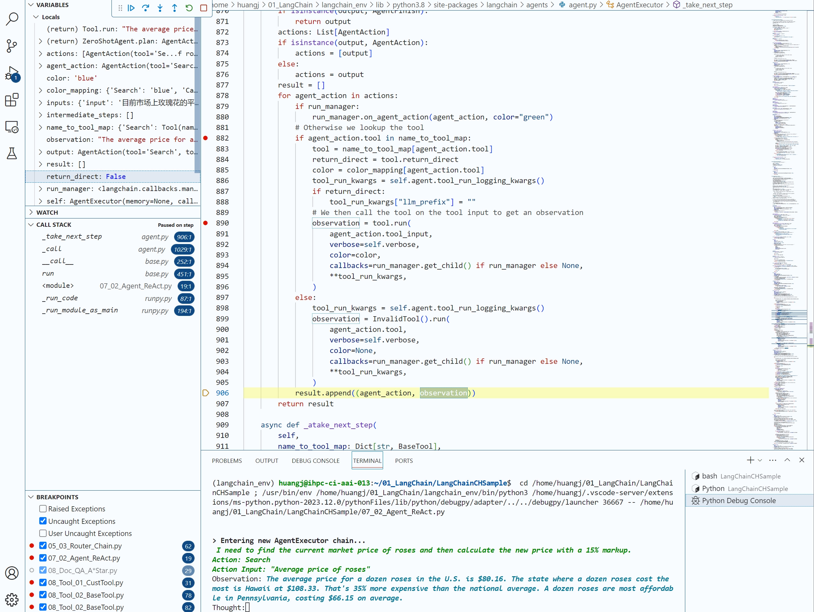


## 第二轮思考：模型决定计算


因为任务尚未完成，第二轮思考开始，程序重新进入了 Plan 环节。

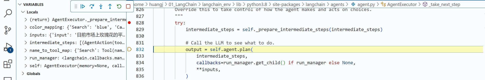


此时，LangChain 的 LLM Chain 根据目前的 input，也就是历史对话记录生成了新的提示信息

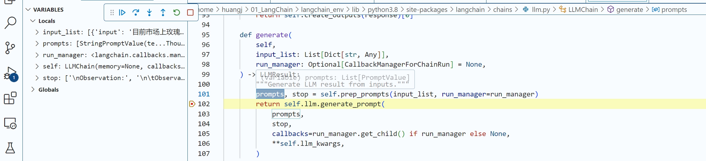


这里的prompt:


> 0: StringPromptValue(text='Answer the following questions as best you can. You have access to the following tools:\n\n

这句提示是让模型尽量回答问题，并告诉模型拥有哪些工具。

> Search: A search engine. Useful for when you need to answer questions about current events. Input should be a search query.\n

这是向模型介绍第一个工具：搜索。

> Calculator: Useful for when you need to answer questions about math.\n\n

这是向模型介绍第二个工具：计算器。

> Use the following format:\n\n （指导模型使用下面的格式）
>
> Question: the input question you must answer\n （问题）
>
> Thought: you should always think about what to do\n （思考）
>
> Action: the action to take, should be one of [Search, Calculator]\n 
>
> （行动）Action Input: the input to the action\n （行动的输入）
>
> Observation: the result of the action\n… （观察：行动的返回结果）
>
> (this Thought/Action/Action Input/Observation can repeat N times)\n （上面这个过程可以重复多次）
>
> Thought: I now know the final answer\n （思考：现在我知道最终答案了）
>
> Final Answer: the final answer to the original input question\n\n （最终答案）

思考过程

> Begin!\n\n

现在开始！

> Question: 目前市场上玫瑰花的平均价格是多少？如果我在此基础上加价 15% 卖出，应该如何定价？\n

具体问题，也就是具体任务。


大模型根据上面这个提示，返回了下面的 output 信息。

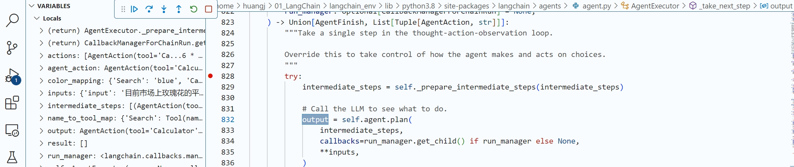


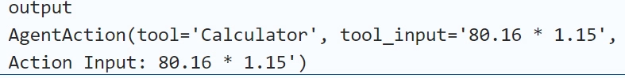

这个输出显示，模型告诉自己，“我需要计算新的 Price，在搜索结果的基础上加价 15%”，并确定 Action 为计算器，输入计算器工具的指令为 80.16*1.15。这是一个非常有逻辑性的思考。

有了上面的 Thought 做指引，AgentExecutor 调用了第二个工具：LLMMath。


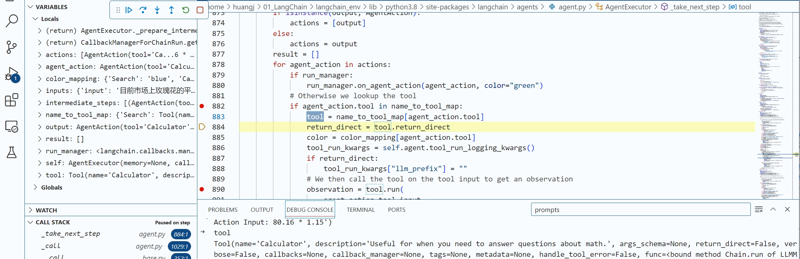


(解析内容略)


## 第三轮思考：模型完成任务


第三轮思考开始。此时，Executor 的 Plan 应该进一步把当前的新结果传递给大模型

(解析内容略)
