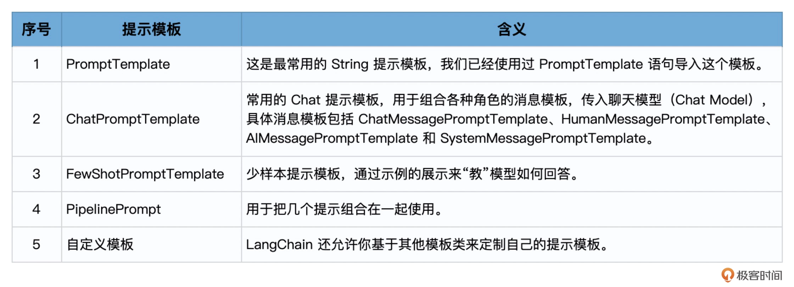

# 提示工程（上）：用少样本FewShotTemplate和ExampleSelector创建应景文案


## LangChain 提示模板的类型





导入方式：

```python

from langchain.prompts.prompt import PromptTemplate
from langchain.prompts import FewShotPromptTemplate
from langchain.prompts.pipeline import PipelinePromptTemplate
from langchain.prompts import ChatPromptTemplate
from langchain.prompts import (
    ChatMessagePromptTemplate,
    SystemMessagePromptTemplate,
    AIMessagePromptTemplate,
    HumanMessagePromptTemplate,
)
```


不指定 .prompts，直接从 LangChain 包也能导入模板。

```python
from langchain import PromptTemplate
```


## 使用 PromptTemplate

例子：

```python
from langchain import PromptTemplate

template = """\
你是业务咨询顾问。
你给一个销售{product}的电商公司，起一个好的名字？
"""
prompt = PromptTemplate.from_template(template)

print(prompt.format(product="鲜花"))
```

输出：

```python
你是业务咨询顾问。
你给一个销售鲜花的电商公司，起一个好的名字？
```

LangChain 中的模板的一个方便之处是 from_template 方法可以从传入的字符串中自动提取变量名称（如 product），而无需刻意指定。上面程序中的 product 自动成为了 format 方法中的一个参数。


也可以通过提示模板类的构造函数，在创建模板时手工指定 input_variables，示例如下：

```python
prompt = PromptTemplate(
    input_variables=["product", "market"], 
    template="你是业务咨询顾问。对于一个面向{market}市场的，专注于销售{product}的公司，你会推荐哪个名字？"
)
print(prompt.format(product="鲜花", market="高端"))
```

输出：

```
你是业务咨询顾问。对于一个面向高端市场的，专注于销售鲜花的公司，你会推荐哪个名字？
```


## 使用 ChatPromptTemplate


模板的不同之处是它们有对应的角色。

角色例子：

```python
import openai
openai.ChatCompletion.create(
  model="gpt-3.5-turbo",
  messages=[
        {"role": "system", "content": "You are a helpful assistant."},
        {"role": "user", "content": "Who won the world series in 2020?"},
        {"role": "assistant", "content": "The Los Angeles Dodgers won the World Series in 2020."},
        {"role": "user", "content": "Where was it played?"}
    ]
)
```

LangChain 的 ChatPromptTemplate 这一系列的模板，就是跟着这一系列角色而设计的。


场景例子：

```python
# 导入聊天消息类模板
from langchain.prompts import (
    ChatPromptTemplate,
    SystemMessagePromptTemplate,
    HumanMessagePromptTemplate,
)
# 模板的构建
template="你是一位专业顾问，负责为专注于{product}的公司起名。"
system_message_prompt = SystemMessagePromptTemplate.from_template(template)
human_template="公司主打产品是{product_detail}。"
human_message_prompt = HumanMessagePromptTemplate.from_template(human_template)
prompt_template = ChatPromptTemplate.from_messages([system_message_prompt, human_message_prompt])

# 格式化提示消息生成提示
prompt = prompt_template.format_prompt(product="鲜花装饰", product_detail="创新的鲜花设计。").to_messages()

# 下面调用模型，把提示传入模型，生成结果
import os
os.environ["OPENAI_API_KEY"] = '你的OpenAI Key'
from langchain.chat_models import ChatOpenAI
chat = ChatOpenAI()
result = chat(prompt)
print(result)
```

输出：

```python
content='1. 花语创意\n2. 花韵设计\n3. 花艺创新\n4. 花漾装饰\n5. 花语装点\n6. 花翩翩\n7. 花语之美\n8. 花馥馥\n9. 花语时尚\n10. 花之魅力' 
additional_kwargs={} 
example=False
```


重点语句：

**prompt_template = ChatPromptTemplate.from_messages([system_message_prompt, human_message_prompt])**


**prompt:**

[SystemMessage(content='你是一位专业顾问，负责为专注于鲜花装饰的公司起名。'), HumanMessage(content='公司主打产品是创新的鲜花设计。。')]


## FewShot 的思想起源


Few-Shot（少样本）、One-Shot（单样本）和与之对应的 Zero-Shot（零样本）的概念都起源于机器学习。如何让机器学习模型在极少量甚至没有示例的情况下学习到新的概念或类别，对于许多现实世界的问题是非常有价值的，因为我们往往无法获取到大量的标签化数据。


## 使用 FewShotPromptTemplate


### 创建示例样本


```python
# 1. 创建一些示例
samples = [
  {
    "flower_type": "玫瑰",
    "occasion": "爱情",
    "ad_copy": "玫瑰，浪漫的象征，是你向心爱的人表达爱意的最佳选择。"
  },
  {
    "flower_type": "康乃馨",
    "occasion": "母亲节",
    "ad_copy": "康乃馨代表着母爱的纯洁与伟大，是母亲节赠送给母亲的完美礼物。"
  },
  {
    "flower_type": "百合",
    "occasion": "庆祝",
    "ad_copy": "百合象征着纯洁与高雅，是你庆祝特殊时刻的理想选择。"
  },
  {
    "flower_type": "向日葵",
    "occasion": "鼓励",
    "ad_copy": "向日葵象征着坚韧和乐观，是你鼓励亲朋好友的最好方式。"
  }
]
```


### 创建提示模板

```python
# 2. 创建一个提示模板
from langchain.prompts.prompt import PromptTemplate
template="鲜花类型: {flower_type}\n场合: {occasion}\n文案: {ad_copy}"
prompt_sample = PromptTemplate(input_variables=["flower_type", "occasion", "ad_copy"], 
                               template=template)
print(prompt_sample.format(**samples[0]))
```


输出模板的输出如下：

```
鲜花类型: 玫瑰
场合: 爱情
文案: 玫瑰，浪漫的象征，是你向心爱的人表达爱意的最佳选择。
```


其中prompt_sample打印为:

```
input_variables=['ad_copy', 'flower_type', 'occasion'] template='鲜花类型: {flower_type}\n场合: {occasion}\n文案: {ad_copy}'
```


### 创建 FewShotPromptTemplate 对象


```python
# 3. 创建一个FewShotPromptTemplate对象
from langchain.prompts.few_shot import FewShotPromptTemplate
prompt = FewShotPromptTemplate(
    examples=samples,
    example_prompt=prompt_sample,
    suffix="鲜花类型: {flower_type}\n场合: {occasion}",
    input_variables=["flower_type", "occasion"]
)
print(prompt.format(flower_type="野玫瑰", occasion="爱情"))
```


输出：


```
鲜花类型: 玫瑰
场合: 爱情
文案: 玫瑰，浪漫的象征，是你向心爱的人表达爱意的最佳选择。

鲜花类型: 康乃馨
场合: 母亲节
文案: 康乃馨代表着母爱的纯洁与伟大，是母亲节赠送给母亲的完美礼物。

鲜花类型: 百合
场合: 庆祝
文案: 百合象征着纯洁与高雅，是你庆祝特殊时刻的理想选择。

鲜花类型: 向日葵
场合: 鼓励
文案: 向日葵象征着坚韧和乐观，是你鼓励亲朋好友的最好方式。

鲜花类型: 野玫瑰
场合: 爱情
```


其中prompt输出为:

```python
input_variables=['flower_type', 'occasion'] 
examples=[{'flower_type': '玫瑰', 'occasion': '爱情', 'ad_copy': '玫瑰，浪漫的象征，是你向心爱的人表达爱意的最佳选择。'}, 
          {'flower_type': '康乃馨', 'occasion': '母亲节', 'ad_copy': '康乃馨代表着母爱的纯洁与伟大，是母亲节赠送给母亲的完美礼物。'}, 
          {'flower_type': '百合', 'occasion': '庆祝', 'ad_copy': '百合象征着纯洁与高雅，是你庆祝特殊时刻的理想选择。'}, 
          {'flower_type': '向日葵', 'occasion': '鼓励', 'ad_copy': '向日葵象征着坚韧和乐观，是你鼓励亲朋好友的最好方式。'}] 
example_prompt=PromptTemplate(input_variables=['ad_copy', 'flower_type', 'occasion'],
                              template='鲜花类型: {flower_type}\n场合: {occasion}\n文案: {ad_copy}') 
suffix='鲜花类型: {flower_type}\n场合: {occasion}'
```

可以看到没有“野玫瑰”，野玫瑰是prompt.format 加入的


### 调用大模型创建新文案

```python
# 4. 把提示传递给大模型
import os
os.environ["OPENAI_API_KEY"] = '你的Open AI Key'
from langchain.llms import OpenAI
model = OpenAI(model_name='gpt-3.5-turbo-instruct')
result = model(prompt.format(flower_type="野玫瑰", occasion="爱情"))
print(result)
```

输出：

```
文案: 野玫瑰代表着爱情的坚贞，是你向心爱的人表达爱意的最佳礼物。
```


## 使用示例选择器


如果我们的示例很多，那么一次性把所有示例发送给模型是不现实而且低效的。另外，每次都包含太多的 Token 也会浪费流量（OpenAI 是按照 Token 数来收取费用）。


LangChain 给我们提供了示例选择器，来选择最合适的样本。（注意，因为示例选择器使用向量相似度比较的功能，此处需要安装向量数据库，这里我使用的是开源的 Chroma，你也可以选择之前用过的 Qdrant。）


```python
# 5. 使用示例选择器
from langchain.prompts.example_selector import SemanticSimilarityExampleSelector
from langchain.vectorstores import Chroma
from langchain.embeddings import OpenAIEmbeddings

# 初始化示例选择器
example_selector = SemanticSimilarityExampleSelector.from_examples(
    samples,
    OpenAIEmbeddings(),
    Chroma,
    k=1
)

# 创建一个使用示例选择器的FewShotPromptTemplate对象
prompt = FewShotPromptTemplate(
    example_selector=example_selector, 
    example_prompt=prompt_sample, 
    suffix="鲜花类型: {flower_type}\n场合: {occasion}", 
    input_variables=["flower_type", "occasion"]
)
print(prompt.format(flower_type="红玫瑰", occasion="爱情"))
```

输出：

```
鲜花类型: 玫瑰
场合: 爱情
文案: 玫瑰，浪漫的象征，是你向心爱的人表达爱意的最佳选择。

鲜花类型: 红玫瑰
场合: 爱情
```


在这个步骤中，它首先创建了一个 **SemanticSimilarityExampleSelector 对象**，这个对象可以根据语义相似性选择最相关的示例。然后，它创建了一个新的 FewShotPromptTemplate 对象，这个对象使用了上一步创建的选择器来选择最相关的示例生成提示。


#### 部分参数打印：

prompt_sample：

```python
input_variables=['ad_copy', 'flower_type', 'occasion'] template='鲜花类型: {flower_type}\n场合: {occasion}\n文案: {ad_copy}'
```

