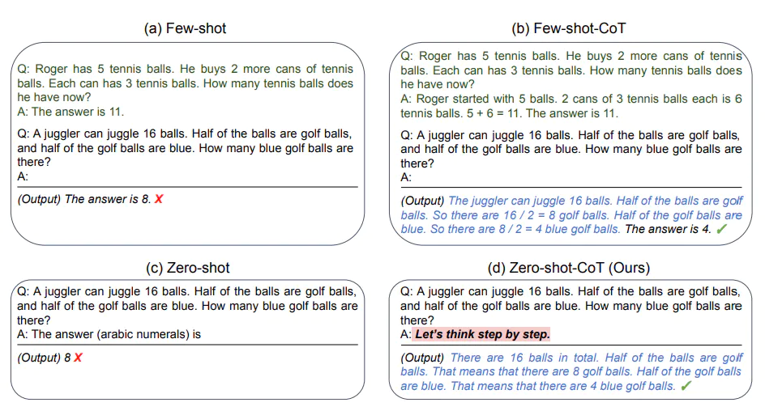

# 05｜提示工程（下）：用思维链和思维树提升模型思考质量


## 什么是 Chain of Thought

CoT 这个概念来源于学术界，是谷歌大脑的 Jason Wei 等人于 2022 年在论文《Chain-of-Thought Prompting Elicits Reasoning in Large Language Models（自我一致性提升了语言模型中的思维链推理能力）》中提出来的概念。

**如果生成一系列的中间推理步骤，就能够显著提高大型语言模型进行复杂推理的能力。**


## Few-Shot CoT

Few-Shot CoT 简单的在提示中提供了一些链式思考示例（Chain-of-Thought Prompting），足够大的语言模型的推理能力就能够被增强。简单说，就是给出一两个示例，然后在示例中写清楚推导的过程。


论文中给出了一个大模型通过思维链做数学题的示例。图左和图右，大模型都读入了 OneShot 示例，但是图左只给出了答案，而图右则在 OneShot 示例中给出了解题的具体思路。结果，只给出了答案的模型推理错误，而给出解题思路后，同一个模型生成了正确的答案


## Zero-Shot CoT

在 Zero-Shot CoT 中，你只要简单地告诉模型“让我们一步步的思考（Let’s think step by step）”，模型就能够给出更好的答案！


模型回答之前，先告诉它“你是一个很有经验的 XX 专家”，模型应该就会在开始胡说八道之前三思。





## Chain of Thought 实战


### 项目需求

在这个示例中，你正在开发一个 AI 运营助手，我们要展示 AI 如何根据用户的需求推理和生成答案。然后，AI 根据当前的用户请求进行推理，提供了具体的花卉建议并解释了为什么选择这些建议。


在这个过程中，AI 需要理解客户的需求之后，按部就班的思考，然后给出最符合逻辑的回答。


### CoT 的模板设计


思维链模板:


> 作为一个为花店电商公司工作的 AI 助手，我的目标是帮助客户根据他们的喜好做出明智的决定。
>
> 
>
> 我会按部就班的思考，先理解客户的需求，然后考虑各种鲜花的涵义，最后根据这个需求，给出我的推荐。
>
> 
>
> 同时，我也会向客户解释我这样推荐的原因。
>
> 
>
> **示例 1：**
>
> 人类：我想找一种象征爱情的花。
>
> AI：首先，我理解你正在寻找一种可以象征爱情的花。在许多文化中，红玫瑰被视为爱情的象征，这是因为它们的红色通常与热情和浓烈的感情联系在一起。因此，考虑到这一点，我会推荐红玫瑰。红玫瑰不仅能够象征爱情，同时也可以传达出强烈的感情，这是你在寻找的。
>
> 
>
> **示例 2：**
>
> 人类：我想要一些独特和奇特的花。
>
> AI：从你的需求中，我理解你想要的是独一无二和引人注目的花朵。兰花是一种非常独特并且颜色鲜艳的花，它们在世界上的许多地方都被视为奢侈品和美的象征。因此，我建议你考虑兰花。选择兰花可以满足你对独特和奇特的要求，而且，兰花的美丽和它们所代表的力量和奢侈也可能会吸引你。


AI 的模板开始于对其角色的阐述，并给出了一些先前的对话示例（Few-Shot Learning）来帮助 AI 理解如何处理这种类型的请求。这些示例展示了 AI 如何根据思维链进行思考，给出深思熟虑之后的答案。


### 程序的完整框架

```python
# 设置环境变量和API密钥
import os
os.environ["OPENAI_API_KEY"] = '你的OpenAI API Key'

# 创建聊天模型
from langchain.chat_models import ChatOpenAI
llm = ChatOpenAI(temperature=0)

# 设定 AI 的角色和目标
role_template = "你是一个为花店电商公司工作的AI助手, 你的目标是帮助客户根据他们的喜好做出明智的决定"

# CoT 的关键部分，AI 解释推理过程，并加入一些先前的对话示例（Few-Shot Learning）
cot_template = """
作为一个为花店电商公司工作的AI助手，我的目标是帮助客户根据他们的喜好做出明智的决定。 

我会按部就班的思考，先理解客户的需求，然后考虑各种鲜花的涵义，最后根据这个需求，给出我的推荐。
同时，我也会向客户解释我这样推荐的原因。

示例 1:
  人类：我想找一种象征爱情的花。
  AI：首先，我理解你正在寻找一种可以象征爱情的花。在许多文化中，红玫瑰被视为爱情的象征，这是因为它们的红色通常与热情和浓烈的感情联系在一起。因此，考虑到这一点，我会推荐红玫瑰。红玫瑰不仅能够象征爱情，同时也可以传达出强烈的感情，这是你在寻找的。

示例 2:
  人类：我想要一些独特和奇特的花。
  AI：从你的需求中，我理解你想要的是独一无二和引人注目的花朵。兰花是一种非常独特并且颜色鲜艳的花，它们在世界上的许多地方都被视为奢侈品和美的象征。因此，我建议你考虑兰花。选择兰花可以满足你对独特和奇特的要求，而且，兰花的美丽和它们所代表的力量和奢侈也可能会吸引你。
"""
from langchain.prompts import ChatPromptTemplate, HumanMessagePromptTemplate, SystemMessagePromptTemplate
system_prompt_role = SystemMessagePromptTemplate.from_template(role_template)
system_prompt_cot = SystemMessagePromptTemplate.from_template(cot_template)

# 用户的询问
human_template = "{human_input}"
human_prompt = HumanMessagePromptTemplate.from_template(human_template)

# 将以上所有信息结合为一个聊天提示
chat_prompt = ChatPromptTemplate.from_messages([system_prompt_role, system_prompt_cot, human_prompt])

prompt = chat_prompt.format_prompt(human_input="我想为我的女朋友购买一些花。她喜欢粉色和紫色。你有什么建议吗?").to_messages()

# 接收用户的询问，返回回答结果
response = llm(prompt)
print(response)
```


打印：

```
content='根据你女朋友喜欢粉色和紫色的喜好，我会推荐以下几种花给你：\n\n1. 
**粉色康乃馨（Carnation）
**：康乃馨是一种美丽且经典的花朵，粉色的康乃馨通常象征着母爱、友谊和善良。它们的花语也包括关怀和感激之情，是一种很适合送给女朋友的花。\n\n2. 
**紫色勿忘我（Forget-Me-Not）
**：勿忘我是一种小巧可爱的花朵，紫色的勿忘我通常象征着真爱和忠诚。这种花也代表着永恒的爱情和美好的回忆，是表达真挚感情的不错选择。\n\n3. 
**粉色玫瑰（Pink Rose）
**：粉色玫瑰是一种温柔和浪漫的花朵，通常代表着感恩、喜悦和幸福。送粉色玫瑰给女朋友可以表达你对她的感激和爱意。\n\n
综上所述，你可以考虑选择粉色康乃馨、紫色勿忘我或粉色玫瑰作为送给女朋友的花束。这些花朵都能很好地体现她喜欢的粉色和紫色，并传达出你的爱意和关怀。祝你的礼物能给女朋友带来惊喜和温暖！' 
response_metadata={'token_usage': {'completion_tokens': 468, 'prompt_tokens': 607, 'total_tokens': 1075}, 
'model_name': 'gpt-3.5-turbo', 'system_fingerprint': None, 'finish_reason': 'stop', 'logprobs': None} id='run-441385fa-8649-4070-89a6-a0b61a0c2701-0'
```


**关键步骤：**

```
chat_prompt = ChatPromptTemplate.from_messages([system_prompt_role, system_prompt_cot, human_prompt])
```


## Tree of Thought


CoT 这种思想，为大模型带来了更好的答案，然而，对于需要探索或预判战略的复杂任务来说，传统或简单的提示技巧是不够的。


ToT 是一种解决复杂问题的框架，它在需要多步骤推理的任务中，引导语言模型搜索一棵由连贯的语言序列（解决问题的中间步骤）组成的思维树，而不是简单地生成一个答案。ToT 框架的核心思想是：让模型生成和评估其思维的能力，并将其与搜索算法（如广度优先搜索和深度优先搜索）结合起来，进行系统性地探索和验证。


ToT 框架为每个任务定义具体的思维步骤和每个步骤的候选项数量。例如，要解决一个数学推理任务，先把它分解为 3 个思维步骤，并为每个步骤提出多个方案，并保留最优的 5 个候选方案。然后在多条思维路径中搜寻最优的解决方案。


这种方法的优势在于，模型可以通过观察和评估其自身的思维过程，更好地解决问题，而不仅仅是基于输入生成输出。这对于需要深度推理的复杂任务非常有用。此外，通过引入强化学习、集束搜索等技术，可以进一步提高搜索策略的性能，并让模型在解决新问题或面临未知情况时有更好的表现。


下面我们应用 ToT 的思想，给出一个鲜花运营方面的示例


> AI（使用 ToT 框架）： 
>
> 
>
> **思维步骤 1：**理解顾客的需求。
>
> 顾客想为妻子购买鲜花。
>
> 顾客的妻子喜欢淡雅的颜色和花香。
>
> 
>
>  **思维步骤 2：**考虑可能的鲜花选择。
>
> 候选 1：百合，因为它有淡雅的颜色和花香。
>
> 候选 2：玫瑰，选择淡粉色或白色，它们通常有花香。
>
> 候选 3：紫罗兰，它有淡雅的颜色和花香。
>
> 候选 4：桔梗，它的颜色淡雅但不一定有花香。
>
> 候选 5：康乃馨，选择淡色系列，它们有淡雅的花香。 
>
> 
>
> **思维步骤 3：**根据顾客的需求筛选最佳选择。
>
> 百合和紫罗兰都符合顾客的需求，因为它们都有淡雅的颜色和花香。
>
> 淡粉色或白色的玫瑰也是一个不错的选择。
>
> 桔梗可能不是最佳选择，因为它可能没有花香。
>
> 康乃馨是一个可考虑的选择。 
>
> 
>
> **思维步骤 4：**给出建议。
>
> “考虑到您妻子喜欢淡雅的颜色和花香，我建议您可以选择百合或紫罗兰。淡粉色或白色的玫瑰也是一个很好的选择。希望这些建议能帮助您做出决策！