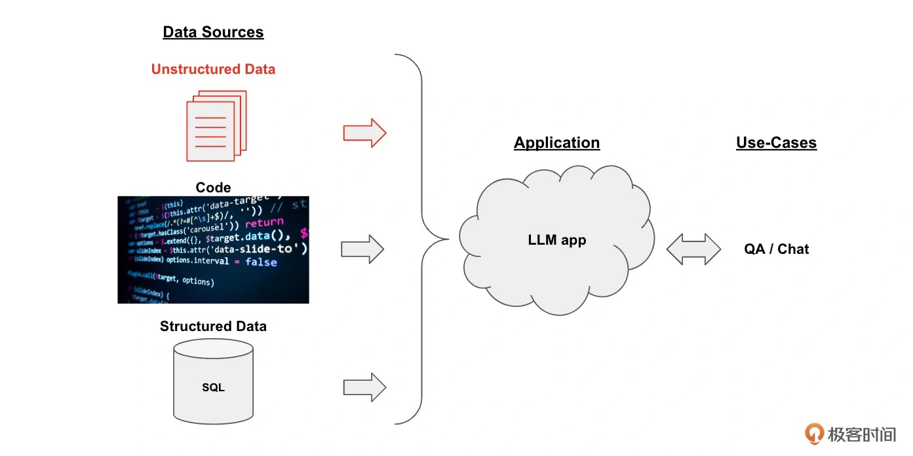
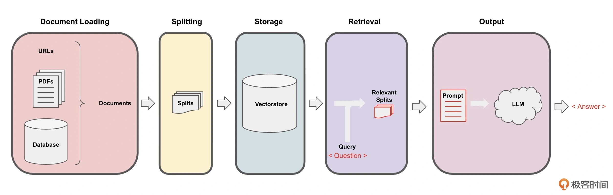

# 用LangChain快速构建基于“易速鲜花”本地知识库的智能问答系统


## 背景

“易速鲜花”作为一个大型在线鲜花销售平台，有自己的业务流程和规范，也拥有针对员工的 SOP 手册。新员工入职培训时，会分享相关的信息。但是，这些信息分散于内部网和 HR 部门目录各处，有时不便查询；有时因为文档过于冗长，员工无法第一时间找到想要的内容；有时公司政策已更新，但是员工手头的文档还是旧版内容。


基于上述需求，我们将开发一套基于各种内部知识手册的 “Doc-QA” 系统。这个系统将充分利用 LangChain 框架，处理从员工手册中产生的各种问题。这个问答系统能够理解员工的问题，并基于最新的员工手册，给出精准的答案。


## 框架


下面这张图片描述了通过 LangChain 框架实现一个知识库文档系统的整体框架。





整个框架分为这样三个部分:


- **数据源（Data Sources）**：数据可以有很多种，包括 PDF 在内的非结构化的数据（Unstructured Data）、SQL 在内的结构化的数据（Structured Data），以及 Python、Java 之类的代码（Code）。在这个示例中，我们聚焦于对非结构化数据的处理。
- **大模型应用（Application，即 LLM App）**：以大模型为逻辑引擎，生成我们所需要的回答。
- **用例（Use-Cases）**：大模型生成的回答可以构建出 QA/ 聊天机器人等系统。


### 核心实现机制


下图所示的数据处理管道（Pipeline）。





具体流程分为下面 5 步。


- Loading：文档加载器把 Documents **加载**为以 LangChain 能够读取的形式。
- Splitting：文本分割器把 Documents **切分**为指定大小的分割，我把它们称为“文档块”或者“文档片”。
- Storage：将上一步中分割好的“文档块”以“嵌入”（Embedding）的形式**存储**到向量数据库（Vector DB）中，形成一个个的“嵌入片”。
- Retrieval：应用程序从存储中**检索**分割后的文档（例如通过比较余弦相似度，找到与输入问题类似的嵌入片）。
- Output：把问题和相似的嵌入片传递给语言模型（LLM），使用包含问题和检索到的分割的提示**生成答案**。


## 数据的准备和载入


用 LangChain 中的 document_loaders 来加载各种格式的文本文件。在这一步中，我们从 pdf、word 和 txt 文件中加载文本，然后将这些文本存储在一个列表中。


```python
import os
os.environ["OPENAI_API_KEY"] = '你的Open AI API Key'

# 1.Load 导入Document Loaders
from langchain.document_loaders import PyPDFLoader
from langchain.document_loaders import Docx2txtLoader
from langchain.document_loaders import TextLoader

# 加载Documents
base_dir = 'OneFlower' # 文档的存放目录
documents = []
for file in os.listdir(base_dir): 
    # 构建完整的文件路径
    file_path = os.path.join(base_dir, file)
    if file.endswith('.pdf'):
        loader = PyPDFLoader(file_path)
        documents.extend(loader.load())
    elif file.endswith('.docx'): 
        loader = Docx2txtLoader(file_path)
        documents.extend(loader.load())
    elif file.endswith('.txt'):
        loader = TextLoader(file_path)
        documents.extend(loader.load())
```


读取后的文档内容如下：

```
[Document(page_content='易速鲜花网站是一个服务型的网站，提供的是一个平台和在这个平台上的服务。纵观整个互联网，最能盈利的网站就是那些提供服务的网站。在经过
```


## 文本的分割

接下来需要将加载的文本分割成更小的块，以便进行嵌入和向量存储。这个步骤中，我们使用 LangChain 中的 **RecursiveCharacterTextSplitter** 来分割文本。


```python
# 2.Split 将Documents切分成块以便后续进行嵌入和向量存储
from langchain.text_splitter import RecursiveCharacterTextSplitter
text_splitter = RecursiveCharacterTextSplitter(chunk_size=200, chunk_overlap=10)
chunked_documents = text_splitter.split_documents(documents)
```

文档被切成了一个个 200 字符左右的文档块。这一步，是为把它们存储进下面的向量数据库做准备。


## 向量数据库存储


将这些分割后的文本转换成嵌入的形式，并将其存储在一个向量数据库中。在这个例子中，我们使用了 OpenAIEmbeddings 来生成嵌入，然后使用 Qdrant 这个向量数据库来存储嵌入.


```python
# 3.Store 将分割嵌入并存储在矢量数据库Qdrant中
from langchain.vectorstores import Qdrant
from langchain.embeddings import OpenAIEmbeddings
vectorstore = Qdrant.from_documents(
    documents=chunked_documents, # 以分块的文档
    embedding=OpenAIEmbeddings(), # 用OpenAI的Embedding Model做嵌入
    location=":memory:",  # in-memory 存储
    collection_name="my_documents",) # 指定collection_name
```


1. `location=":memory:"`：这个参数设置Qdrant的存储位置为内存中。这意味着所有数据都将存储在RAM中，而不是持久化到硬盘。这通常可以提供更快的数据访问速度，但在程序关闭后数据将会丢失。
2. `collection_name="my_documents"`：这里指定一个集合名称“my_documents”，在Qdrant中用于存储和管理这批文档的向量。


## 相关信息的获取


创建一个聊天模型。然后需要创建一个 RetrievalQA 链，它是一个检索式问答模型，用于生成问题的答案。


- LLM 是大模型，负责回答问题。
- retriever（vectorstore.as_retriever()）负责根据问题检索相关的文档，找到具体的“嵌入片”。这些“嵌入片”对应的“文档块”就会作为知识信息，和问题一起传递进入大模型。本地文档中检索而得的知识很重要，因为从互联网信息中训练而来的大模型不可能拥有“易速鲜花”作为一个私营企业的内部知识


```python
# 4. Retrieval 准备模型和Retrieval链
import logging # 导入Logging工具
from langchain.chat_models import ChatOpenAI # ChatOpenAI模型
from langchain.retrievers.multi_query import MultiQueryRetriever # MultiQueryRetriever工具
from langchain.chains import RetrievalQA # RetrievalQA链

# 设置Logging
logging.basicConfig()
logging.getLogger('langchain.retrievers.multi_query').setLevel(logging.INFO)

# 实例化一个大模型工具 - OpenAI的GPT-3.5
llm = ChatOpenAI(model_name="gpt-3.5-turbo", temperature=0)

# 实例化一个MultiQueryRetriever
retriever_from_llm = MultiQueryRetriever.from_llm(retriever=vectorstore.as_retriever(), llm=llm)

# 实例化一个RetrievalQA链
qa_chain = RetrievalQA.from_chain_type(llm,retriever=retriever_from_llm)
```


关键内容解释

1. `retriever_from_llm = MultiQueryRetriever.from_llm(retriever=vectorstore.as_retriever(), llm=llm)`：
   - 这一行代码初始化一个`MultiQueryRetriever`实例。这种检索器可以使用多个查询来提高检索的精确性或覆盖面。
   - `retriever=vectorstore.as_retriever()`：这个参数把之前创建的`vectorstore`（向量存储系统）转化为一个检索器，这样它就可以用来执行搜索操作。
   - `llm=llm`：这里的`llm`可能代表一个大型语言模型（Large Language Model），用于处理查询和可能的后处理操作。
2. `qa_chain = RetrievalQA.from_chain_type(llm, retriever=retriever_from_llm)`：
   - 这一行代码创建一个`RetrievalQA`实例，即检索问答系统。这个系统结合了语言模型和检索器的能力，专门用于处理问答任务。
   - `llm`作为参数传递，表明问答系统将使用这个大型语言模型来理解问题并生成回答。
   - `retriever=retriever_from_llm`表明这个问答系统将使用先前创建的`MultiQueryRetriever`来从文档集合中检索相关信息，这些信息将用于生成或支持回答


## 生成回答并展示


使用之前创建的 RetrievalQA 链来获取相关的文档和生成答案。然后，将这些信息返回给用户，显示在网页上。


```python
# 5. Output 问答系统的UI实现
from flask import Flask, request, render_template
app = Flask(__name__) # Flask APP

@app.route('/', methods=['GET', 'POST'])
def home():
    if request.method == 'POST':

        # 接收用户输入作为问题
        question = request.form.get('question')        
        
        # RetrievalQA链 - 读入问题，生成答案
        result = qa_chain({"query": question})
        
        # 把大模型的回答结果返回网页进行渲染
        return render_template('index.html', result=result)
    
    return render_template('index.html')

if __name__ == "__main__":
    app.run(host='0.0.0.0',debug=True,port=5000)
```

