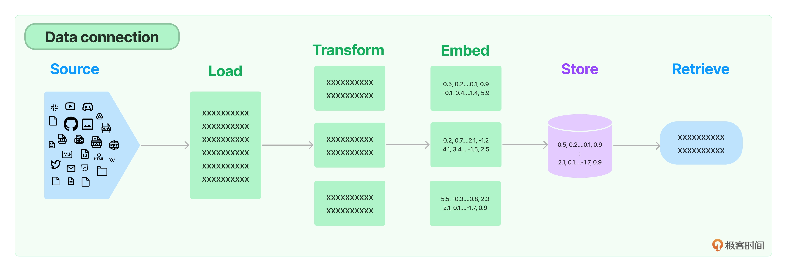
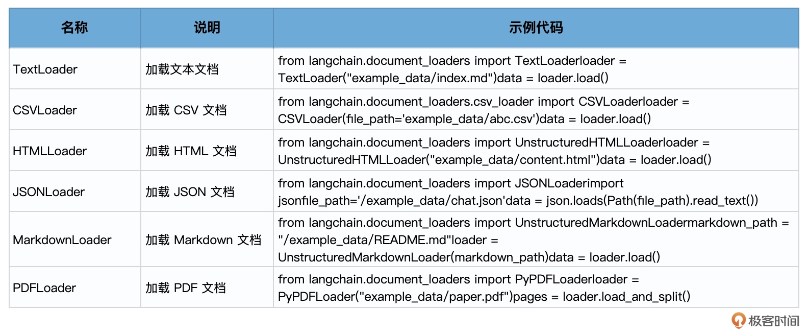
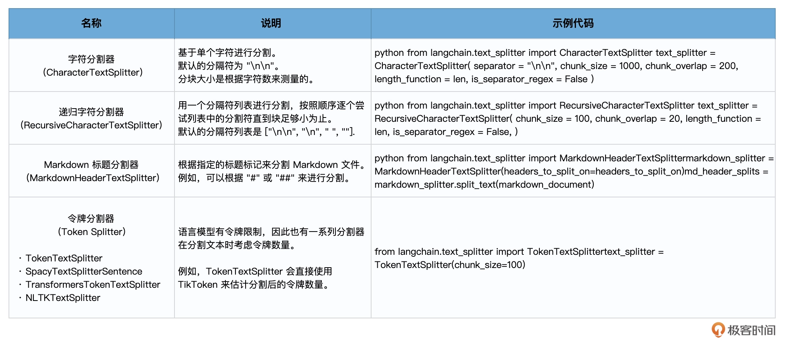
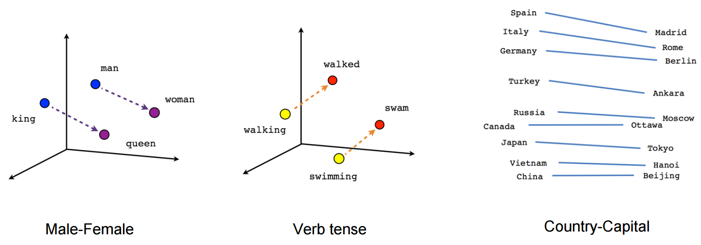
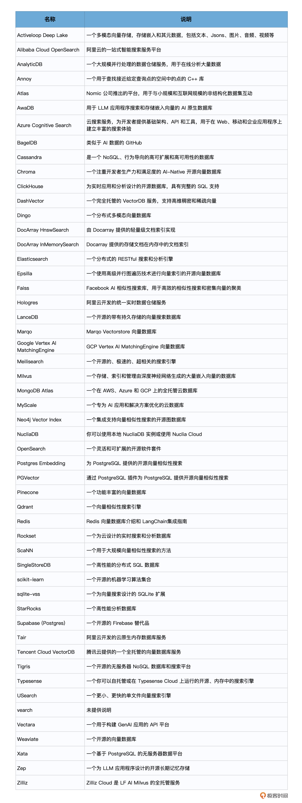
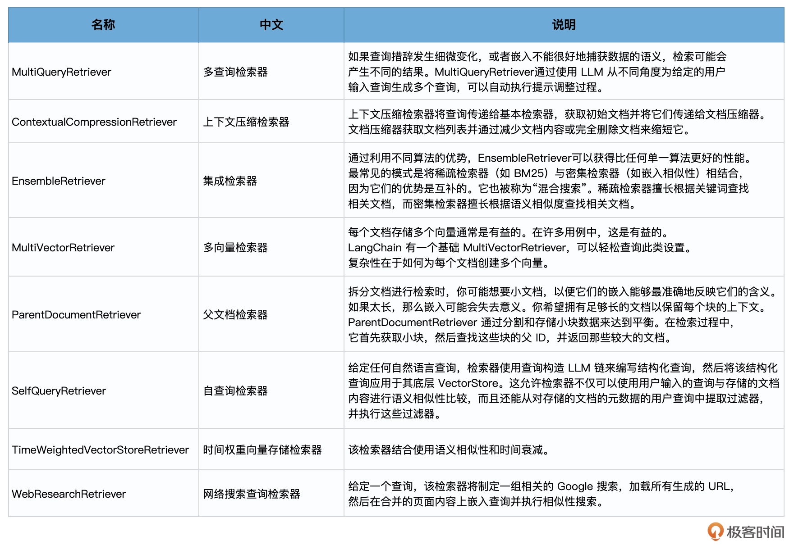

# 检索增强生成：通过RAG助力鲜花运营

什么是 RAG？其全称为 Retrieval-Augmented Generation，即检索增强生成，它结合了检索和生成的能力，为文本序列生成任务引入外部知识。RAG 将传统的语言生成模型与大规模的外部知识库相结合，使模型在生成响应或文本时可以动态地从这些知识库中检索相关信息。这种结合方法旨在增强模型的生成能力，使其能够产生更为丰富、准确和有根据的内容，特别是在需要具体细节或外部事实支持的场合。


RAG 的工作原理可以概括为几个步骤。

1. **检索：**对于给定的输入（问题），模型首先使用检索系统从大型文档集合中查找相关的文档或段落。这个检索系统通常基于密集向量搜索，例如 ChromaDB、Faiss 这样的向量数据库。
2. **上下文编码：**找到相关的文档或段落后，模型将它们与原始输入（问题）一起编码。
3. **生成：**使用编码的上下文信息，模型生成输出（答案）。这通常当然是通过大模型完成的。


RAG 的一个关键特点是，它不仅仅依赖于训练数据中的信息，还可以从大型外部知识库中检索信息。这使得 RAG 模型特别适合处理在训练数据中未出现的问题。





### 文档加载

RAG 的第一步是文档加载。LangChain 提供了多种类型的文档加载器，以加载各种类型的文档（HTML、PDF、代码），并与该领域的其他主要提供商如 Airbyte 和 Unstructured.IO 进行了集成。





### 文本转换

加载文档后，下一个步骤是对文本进行转换，而最常见的文本转换就是把**长文档分割成更小的块（或者是片，或者是节点**），以适合模型的上下文窗口。LangChain 有许多内置的文档转换器，可以轻松地拆分、组合、过滤和以其他方式操作文档。


### 文本分割器

LangChain 中，文本分割器的工作原理如下：

1. 将文本分成小的、具有语义意义的块（通常是句子）。

2. 开始将这些小块组合成一个更大的块，直到达到一定的大小。

3. 一旦达到该大小，一个块就形成了，可以开始创建新文本块。这个新文本块和刚刚生成的块要有一些重叠，以保持块之间的上下文。

   

因此，LangChain 提供的各种文本拆分器可以帮助你从下面几个角度设定你的分割策略和参数：

1. 文本如何分割
2. 块的大小
3. 块之间重叠文本的长度


文本分割器的说明和示例如下：





### 文本嵌入

文本块形成之后，我们就通过 LLM 来做嵌入（Embeddings），将文本转换为数值表示，使得计算机可以更容易地处理和比较文本。OpenAI、Cohere、Hugging Face 中都有能做文本嵌入的模型。




LangChain 中的 Embeddings 类是设计用于与文本嵌入模型交互的类。这个类为所有这些提供者提供标准接口。

```python
# 初始化Embedding类
from langchain.embeddings import OpenAIEmbeddings
embeddings_model = OpenAIEmbeddings()
```


提供两种方法：

1. 第一种是 embed_documents 方法，为文档创建嵌入。这个方法接收多个文本作为输入，意味着你可以一次性将多个文档转换为它们的向量表示。
2. 第二种是 embed_query 方法，为查询创建嵌入。这个方法只接收一个文本作为输入，通常是用户的搜索查询。


**为什么需要两种方法？**虽然看起来这两种方法都是为了文本嵌入，但是 LangChain 将它们分开了。原因是一些嵌入提供者对于文档和查询使用的是不同的嵌入方法。文档是要被搜索的内容，而查询是实际的搜索请求。这两者可能因为其性质和目的，而需要不同的处理或优化。


embed_documents 方法的示例代码如下：

```python
embeddings = embeddings_model.embed_documents(
    [
        "您好，有什么需要帮忙的吗？",
        "哦，你好！昨天我订的花几天送达",
        "请您提供一些订单号？",
        "12345678",
    ]
)
len(embeddings), len(embeddings[0])
```

输出：

```
(4, 1536)
```


embed_query 方法的示例代码如下：

```python
embedded_query = embeddings_model.embed_query("刚才对话中的订单号是多少?")
embedded_query[:3]
```

输出：

```
[-0.0029746221837547455, -0.007710168602107487, 0.00923260021751183]
```


`embeddings_model.embed_documents` 和 `embeddings_model.embed_query` 是用于生成文本嵌入的方法，它们的主要区别在于应用的场景和输入的性质。


#### embeddings_model.embed_documents
功能：

- 生成一组文档的嵌入表示。

输入：

- 接受一个包含多个文本字符串的列表。例如，文档或句子列表。

输出：

- 返回一个列表，其中每个元素都是一个嵌入向量，对应于输入列表中的每个文本。

适用场景：

- 当你有多个文档或句子需要生成嵌入时使用。例如，处理一组客户聊天记录、多个文档的内容、或大量独立的句子


#### embeddings_model.embed_query

功能：

- 生成一个查询的嵌入表示。

输入：

- 接受一个单独的查询字符串。

输出：

- 返回一个嵌入向量，对应于输入的查询。


### 存储嵌入


计算嵌入可能是一个时间消耗大的过程。为了加速这一过程，我们可以将计算出的嵌入存储或临时缓存，这样在下次需要它们时，就可以直接读取，无需重新计算。


### 缓存存储


CacheBackedEmbeddings 是一个支持缓存的嵌入式包装器，它可以将嵌入缓存在键值存储中。具体操作是：对文本进行哈希处理，并将此哈希值用作缓存的键。

要初始化一个 CacheBackedEmbeddings，主要的方式是使用 from_bytes_store。其需要以下参数：

- underlying_embedder：实际计算嵌入的嵌入器。
- document_embedding_cache：用于存储文档嵌入的缓存。
- namespace（可选）：用于文档缓存的命名空间，避免与其他缓存发生冲突。


#### 不同的缓存策略如下：

- InMemoryStore：在内存中缓存嵌入。主要用于单元测试或原型设计。如果需要长期存储嵌入，请勿使用此缓存。
- LocalFileStore：在本地文件系统中存储嵌入。适用于那些不想依赖外部数据库或存储解决方案的情况。
- RedisStore：在 Redis 数据库中缓存嵌入。当需要一个高速且可扩展的缓存解决方案时，这是一个很好的选择。

示例：

```python
# 导入内存存储库，该库允许我们在RAM中临时存储数据
from langchain.storage import InMemoryStore

# 创建一个InMemoryStore的实例
store = InMemoryStore()

# 导入与嵌入相关的库。OpenAIEmbeddings是用于生成嵌入的工具，而CacheBackedEmbeddings允许我们缓存这些嵌入
from langchain.embeddings import OpenAIEmbeddings, CacheBackedEmbeddings

# 创建一个OpenAIEmbeddings的实例，这将用于实际计算文档的嵌入
underlying_embeddings = OpenAIEmbeddings()

# 创建一个CacheBackedEmbeddings的实例。
# 这将为underlying_embeddings提供缓存功能，嵌入会被存储在上面创建的InMemoryStore中。
# 我们还为缓存指定了一个命名空间，以确保不同的嵌入模型之间不会出现冲突。 
embedder = CacheBackedEmbeddings.from_bytes_store(
    underlying_embeddings,  # 实际生成嵌入的工具
    store,  # 嵌入的缓存位置
    namespace=underlying_embeddings.model  # 嵌入缓存的命名空间
)

# 使用embedder为两段文本生成嵌入。
# 结果，即嵌入向量，将被存储在上面定义的内存存储中。
embeddings = embedder.embed_documents(["你好", "智能鲜花客服"])
```


### 向量数据库（向量存储）

更常见的存储向量的方式是通过向量数据库（Vector Store）来保存它们。LangChain 支持非常多种向量数据库，其中有很多是开源的，也有很多是商用的。比如 Elasticsearch、Faiss、Chroma 和 Qdrant 等等。




**选择的规则：**

1. 数据规模和速度需求：考虑你的数据量大小以及查询速度的要求。一些向量数据库在处理大规模数据时更加出色，而另一些在低延迟查询中表现更好。
2. 持久性和可靠性：根据你的应用场景，确定你是否需要数据的高可用性、备份和故障转移功能。
3. 易用性和社区支持：考虑向量数据库的学习曲线、文档的完整性以及社区的活跃度。
4. 成本：考虑总体拥有成本，包括许可、硬件、运营和维护成本。
5. 特性：考虑你是否需要特定的功能，例如多模态搜索等。
6. 安全性：确保向量数据库符合你的安全和合规要求。


### 数据检索


在 LangChain 中，Retriever，也就是检索器，是数据检索模块的核心入口，它通过非结构化查询返回相关的文档。


#### 向量存储检索器


向量存储检索器是最常见的，它主要支持向量检索。当然 LangChain 也有支持其他类型存储格式的检索器。


下面实现一个端到端的数据检索功能，我们通过 VectorstoreIndexCreator 来创建索引，并在索引的 query 方法中，通过 vectorstore 类的 as_retriever 方法，把向量数据库（Vector Store）直接作为检索器，来完成检索任务。


```python
# 设置OpenAI的API密钥
import os
os.environ["OPENAI_API_KEY"] = 'Your OpenAI Key'

# 导入文档加载器模块，并使用TextLoader来加载文本文件
from langchain.document_loaders import TextLoader
loader = TextLoader('LangChainSamples/OneFlower/易速鲜花花语大全.txt', encoding='utf8')

# 使用VectorstoreIndexCreator来从加载器创建索引
from langchain.indexes import VectorstoreIndexCreator
index = VectorstoreIndexCreator().from_loaders([loader])

# 定义查询字符串, 使用创建的索引执行查询
query = "玫瑰花的花语是什么？"
result = index.query(query)
print(result) # 打印查询结果
```

输出：

```
玫瑰花的花语是爱情、热情、美丽。
```


#### 各种类型的检索器




### 索引


简单的说，索引是一种高效地管理和定位文档信息的方法，确保每个文档具有唯一标识并便于检索。


但在复杂的信息检索任务中，有效地管理和索引文档是关键的一步。提供的索引 API 为开发者带来了一个高效且直观的解决方案。具体来说，它的优势包括：

- 避免重复内容：确保你的向量存储中不会有冗余数据。
- 只更新更改的内容：能检测哪些内容已更新，避免不必要的重写。
- 省时省钱：不对未更改的内容重新计算嵌入，从而减少了计算资源的消耗。
- 优化搜索结果：减少重复和不相关的数据，从而提高搜索的准确性。


LangChain 利用了记录管理器（RecordManager）来跟踪哪些文档已经被写入向量存储。


在进行索引时，API 会对每个文档进行哈希处理，确保每个文档都有一个唯一的标识。这个哈希值不仅仅基于文档的内容，还考虑了文档的元数据。


一旦哈希完成，以下信息会被保存在记录管理器中：

- 文档哈希：基于文档内容和元数据计算出的唯一标识。
- 写入时间：记录文档何时被添加到向量存储中。
- 源 ID：这是一个元数据字段，表示文档的原始来源