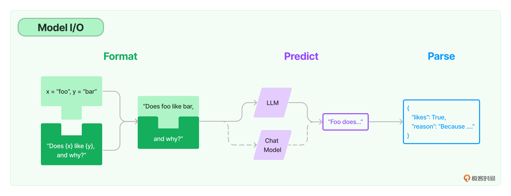
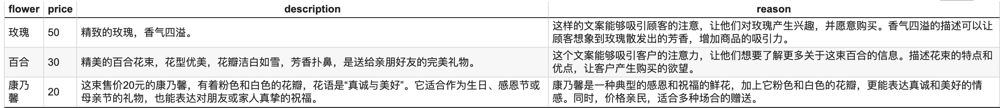

# 模型I/O：输入提示、调用模型、解析输出


## Model I/O


我们可以把对模型的使用过程拆解成三块，分别是**输入提示**（对应图中的 Format）、**调用模型**（对应图中的 Predict）和**输出解析**（对应图中的 Parse）。这三块形成了一个整体，因此在 LangChain 中这个过程被统称为 Model I/O（Input/Output）。




- **提示模板**：使用模型的第一个环节是把提示信息输入到模型中，你可以创建 LangChain 模板，根据实际需求动态选择不同的输入，针对特定的任务和应用调整输入。
- **语言模型**：LangChain 允许你通过通用接口来调用语言模型。这意味着无论你要使用的是哪种语言模型，都可以通过同一种方式进行调用，这样就提高了灵活性和便利性。
- **输出解析**：LangChain 还提供了从模型输出中提取信息的功能。通过输出解析器，你可以精确地从模型的输出中获取需要的信息，而不需要处理冗余或不相关的数据，更重要的是还可以把大模型给回的非结构化文本，转换成程序可以处理的结构化数据。


## 提示模板

作用：

1. 给予模型清晰明确的指示
2. 让模型慢慢地思考


### 例子

我们希望为销售的每一种鲜花生成一段简介文案，那么每当你的员工或者顾客想了解某种鲜花时，调用该模板就会生成适合的文字。


这个提示模板的生成方式如下：

```python
# 导入LangChain中的提示模板
from langchain.prompts import PromptTemplate
# 创建原始模板
template = """您是一位专业的鲜花店文案撰写员。\n
对于售价为 {price} 元的 {flower_name} ，您能提供一个吸引人的简短描述吗？
"""
# 根据原始模板创建LangChain提示模板
prompt = PromptTemplate.from_template(template) 
# 打印LangChain提示模板的内容
print(prompt)
```


提示模板的具体内容如下：

```python
input_variables=['flower_name', 'price'] 
output_parser=None partial_variables={} 
template='/\n您是一位专业的鲜花店文案撰写员。
\n对于售价为 {price} 元的 {flower_name} ，您能提供一个吸引人的简短描述吗？\n'
template_format='f-string' 
validate_template=True
```


rom_template 是一个类方法，它允许我们直接从一个字符串模板中创建一个 PromptTemplate 对象。打印出这个 PromptTemplate 对象，你可以看到这个对象中的信息包括输入的变量（在这个例子中就是 flower_name 和 price）、输出解析器（这个例子中没有指定）、模板的格式（这个例子中为'f-string'）、是否验证模板（这个例子中设置为 True）。


PromptTemplate 的 from_template 方法就是将一个原始的模板字符串转化为一个更丰富、更方便操作的 PromptTemplate 对象，这个对象就是 LangChain 中的提示模板。。LangChain 提供了多个类和函数，也为各种应用场景设计了很多内置模板，使构建和使用提示变得容易。


## 语言模型


LangChain 中支持的模型有三大类。


**大语言模型（LLM）** ，也叫 Text Model，这些模型将文本字符串作为输入，并返回文本字符串作为输出。Open AI 的 text-davinci-003、Facebook 的 LLaMA、ANTHROPIC 的 Claude，都是典型的 LLM。


**聊天模型（Chat Model）**，主要代表 Open AI 的 ChatGPT 系列模型。这些模型通常由语言模型支持，但它们的 API 更加结构化。具体来说，这些模型将聊天消息列表作为输入，并返回聊天消息。


**文本嵌入模型（Embedding Model）**，这些模型将文本作为输入并返回浮点数列表，也就是 Embedding。而文本嵌入模型如 OpenAI 的 text-embedding-ada-002，我们之前已经见过了。文本嵌入模型负责把文档存入向量数据库，和我们这里探讨的提示工程关系不大。


调用语言模型，让模型帮我们写文案，并且返回文案的结果:


```python
# 设置OpenAI API Key
import os
os.environ["OPENAI_API_KEY"] = '你的Open AI API Key'

# 导入LangChain中的OpenAI模型接口
from langchain_openai import OpenAI
# 创建模型实例
model = OpenAI(model_name='gpt-3.5-turbo-instruct')
# 输入提示
input = prompt.format(flower_name=["玫瑰"], price='50')
# 得到模型的输出
output = model.invoke(input)
# 打印输出内容
print(output)  
```

输出：

```
让你心动！50元就可以拥有这支充满浪漫气息的玫瑰花束，让TA感受你的真心爱意。
```


### 复用

复用提示模板，我们可以同时生成多个鲜花的文案。


```python
# 导入LangChain中的提示模板
from langchain import PromptTemplate
# 创建原始模板
template = """您是一位专业的鲜花店文案撰写员。\n
对于售价为 {price} 元的 {flower_name} ，您能提供一个吸引人的简短描述吗？
"""
# 根据原始模板创建LangChain提示模板
prompt = PromptTemplate.from_template(template) 
# 打印LangChain提示模板的内容
print(prompt)

# 设置OpenAI API Key
import os
os.environ["OPENAI_API_KEY"] = '你的Open AI API Key'

# 导入LangChain中的OpenAI模型接口
from langchain import OpenAI
# 创建模型实例
model = OpenAI(model_name='gpt-3.5-turbo-instruct')

# 多种花的列表
flowers = ["玫瑰", "百合", "康乃馨"]
prices = ["50", "30", "20"]

# 生成多种花的文案
for flower, price in zip(flowers, prices):
    # 使用提示模板生成输入
    input_prompt = prompt.format(flower_name=flower, price=price)

    # 得到模型的输出
    output = model.invoke(input_prompt)

    # 打印输出内容
    print(output)
```

输出：

```
这支玫瑰，深邃的红色，传递着浓浓的深情与浪漫，令人回味无穷！
百合：美丽的花朵，多彩的爱恋！30元让你拥有它！
康乃馨—20元，象征爱的祝福，送给你最真挚的祝福。
```


### 优势


我们只需要定义一次模板，就可以用它来生成各种不同的提示。对比单纯使用 f-string 来格式化文本，这种方法更加简洁，也更容易维护。而 LangChain 在提示模板中，还整合了 output_parser、template_format 以及是否需要 validate_template 等功能。


## 输出解析

LangChain 提供的解析模型输出的功能，使你能够更容易地从模型输出中获取结构化的信息，这将大大加快基于语言模型进行应用开发的效率。


比如说，在这个文案中，如果你希望模型返回两个字段：

- description：鲜花的说明文本
- reason：解释一下为何要这样写上面的文案


```python
# 导入OpenAI Key
import os
os.environ["OPENAI_API_KEY"] = '你的OpenAI API Key'

# 导入LangChain中的提示模板
from langchain.prompts import PromptTemplate
# 创建原始提示模板
prompt_template = """您是一位专业的鲜花店文案撰写员。
对于售价为 {price} 元的 {flower_name} ，您能提供一个吸引人的简短描述吗？
{format_instructions}"""

# 通过LangChain调用模型
from langchain_openai import OpenAI
# 创建模型实例
model = OpenAI(model_name='gpt-3.5-turbo-instruct')

# 导入结构化输出解析器和ResponseSchema
from langchain.output_parsers import StructuredOutputParser, ResponseSchema
# 定义我们想要接收的响应模式
response_schemas = [
    ResponseSchema(name="description", description="鲜花的描述文案"),
    ResponseSchema(name="reason", description="问什么要这样写这个文案")
]
# 创建输出解析器
output_parser = StructuredOutputParser.from_response_schemas(response_schemas)

# 获取格式指示
format_instructions = output_parser.get_format_instructions()
# 根据原始模板创建提示，同时在提示中加入输出解析器的说明
prompt = PromptTemplate.from_template(prompt_template, 
                partial_variables={"format_instructions": format_instructions}) 

# 数据准备
flowers = ["玫瑰", "百合", "康乃馨"]
prices = ["50", "30", "20"]

# 创建一个空的DataFrame用于存储结果
import pandas as pd
df = pd.DataFrame(columns=["flower", "price", "description", "reason"]) # 先声明列名

for flower, price in zip(flowers, prices):
    # 根据提示准备模型的输入
    input = prompt.format(flower_name=flower, price=price)

    # 获取模型的输出
    output = model.invoke(input)
    
    # 解析模型的输出（这是一个字典结构）
    parsed_output = output_parser.parse(output)

    # 在解析后的输出中添加“flower”和“price”
    parsed_output['flower'] = flower
    parsed_output['price'] = price

    # 将解析后的输出添加到DataFrame中
    df.loc[len(df)] = parsed_output  

# 打印字典
print(df.to_dict(orient='records'))

# 保存DataFrame到CSV文件
df.to_csv("flowers_with_descriptions.csv", index=False)
```

输出：

```
[{'flower': '玫瑰', 'price': '50', 'description': 'Luxuriate in the beauty of this 50 yuan rose, with its deep red petals and delicate aroma.', 'reason': 'This description emphasizes the elegance and beauty of the rose, which will be sure to draw attention.'}, 
{'flower': '百合', 'price': '30', 'description': '30元的百合，象征着坚定的爱情，带给你的是温暖而持久的情感！', 'reason': '百合是象征爱情的花，写出这样的描述能让顾客更容易感受到百合所带来的爱意。'}, 
{'flower': '康乃馨', 'price': '20', 'description': 'This beautiful carnation is the perfect way to show your love and appreciation. Its vibrant pink color is sure to brighten up any room!', 'reason': 'The description is short, clear and appealing, emphasizing the beauty and color of the carnation while also invoking a sense of love and appreciation.'}]
```


输出的csv 文件如下：




#### 关键代码解释


**format_instructions：**

打印后内容如下：

````
The output should be a markdown code snippet formatted in the following schema, including the leading and trailing "```json" and "```":

```json
{
	"description": string  // 鲜花的描述文案
	"reason": string  // 问什么要这样写这个文案
}
```
````


**output:**

````


```json
{
	"description": "这束50元的玫瑰是来自南法的精致品种，花瓣柔软如丝，散发着淡淡的花香。它能让你的爱意传达得更加深情，成为最佳的表白选择。",
	"reason": "这样的描述能够吸引顾客对这束玫瑰的品质和产地产生兴趣，同时强调它的特殊之处和用途，让顾客觉得这束玫瑰不仅仅是一束普通的花，而是具有情感和美好寓意的礼物。"
}
```


```json
{
	"description": "百合，一种代表纯洁与美丽的花朵。她细长挺拔的花茎上绽放着六片洁白的花瓣，像是一群优雅的少女在舞蹈。它们的芳香能够散发出温柔的气息，带给人们宁静和平的心情。",
	"reason": "百合花的花语是纯洁、高贵，适合作为送礼或者装饰用途。这段描述能够吸引顾客对百合花的美丽外表和独特的花语产生兴趣，增加顾客对该鲜花的购买意愿。"
}
```

```json
{
	"description": "这束优雅的康乃馨，花瓣轻盈柔软，花香幽远，令人心旷神怡。清新的颜色和精致的造型，让它成为送给亲朋好友的完美礼物。",
	"reason": "康乃馨是一种具有浪漫气息和美好寓意的鲜花，它的花语是“永恒的爱”和“幸福”。它的花瓣柔软轻盈，花香幽远，能够让人感受到温暖和舒适。通过简短的描述，能够吸引顾客的眼球，让他们更加想要购买这束鲜花。" 
}
```
````


**parsed_output(添加flower 和 price之前):**

```
{'description': '这束粉色的玫瑰，带着浪漫的气息，散发出温柔的芳香，是表达爱意的最佳选择。', 'reason': '这段文案简洁明了，用词精准，能够准确地描述出鲜花的特点，并且针对目标客户（想要表达爱意）的需求进行了切合。同时，浪漫的气息和温柔的芳香也能够吸引目标客户的注意力。'}
{'description': '这朵清新的百合，花瓣洁白如雪，散发着淡淡的花香，是爱情和纯洁的象征。它的优雅和美丽，能让人心生向往，带来温馨和美好的情绪。', 'reason': '百合是一种非常受欢迎的花卉，所以在描述时要突出它的优雅和美丽，让顾客产生向往和渴望。同时，要强调它代表的爱情和纯洁的含义，让顾客感受到它的特殊意义。'}
{'description': '优雅温馨的康乃馨，花瓣细腻，芬芳馥郁，寓意着爱与美好，是送给心爱的人最恰当的礼物。', 'reason': '康乃馨拥有深厚的爱情和温馨的情感象征意义，这样的文案能够让消费者更容易理解和接受这种花的特性，从而增加销量。同时，简短的描述也能够吸引消费者的注意力，让他们更愿意购买这种美丽的花朵。'}
```


**parsed_output(添加flower 和 price之后):**

```
{'description': '这支50元的玫瑰，绽放着鲜艳的红色，花朵饱满、花瓣娇嫩，散发着迷人的花香，是最佳的表达爱意的选择。', 'reason': '这样的描述能够吸引顾客的注意力，让顾客产生对这支玫瑰的美好印象，从而增加购买的欲望。同时也能够突出玫瑰的特点，让顾客了解它的价值，从而愿意为它付出50元的价格。', 'flower': '玫瑰', 'price': '50'}
{'description': '优雅的百合花，花瓣柔美，散发出清新的花香，是表达真挚爱意的完美选择。', 'reason': '百合花具有优雅的外观和清新的花香，适合用来表达真挚的爱意，吸引顾客的注意力，促成销售。', 'flower': '百合', 'price': '30'}
{'description': '这束售价20元的康乃馨，花色鲜艳，花朵饱满，散发出迷人的清香，是表达爱意或感谢的完美选择。', 'reason': '康乃馨是一种花色丰富、花朵美丽的鲜花，具有浓郁的浪漫气息。价格亲民，适合大多数人的消费能力，同时又能表达出浓浓的情感，是鲜花店中备受欢迎的选择。因此，这样的描述能够吸引顾客的注意力，激发他们购买的欲望。', 'flower': '康乃馨', 'price': '20'}
```


**df.to_dict：**


`df.to_dict(orient='records')` 这个代码片段是用于将 pandas DataFrame 转换成字典列表的方法。每个字典代表 DataFrame 中的一行。这里解释一下各个部分：

- `df`：这是一个 pandas 的 DataFrame 对象。
- `.to_dict()`：这是一个方法，用于将 DataFrame 转换为字典格式。
- `orient='records'`：这个参数指定了转换的方向或样式。`'records'` 表示输出结果是一个字典列表，其中每个字典都包含一行的数据，键是列名，值是相应的数据项。


例如，如果你有一个如下的 DataFrame：

|      | A    | B    |
| ---- | ---- | ---- |
| 0    | 1    | 2    |
| 1    | 3    | 4    |


`df.to_dict(orient='records')` 这个代码片段是用于将 pandas DataFrame 转换成字典列表的方法。每个字典代表 DataFrame 中的一行。这里解释一下各个部分：

- `df`：这是一个 pandas 的 DataFrame 对象。
- `.to_dict()`：这是一个方法，用于将 DataFrame 转换为字典格式。
- `orient='records'`：这个参数指定了转换的方向或样式。`'records'` 表示输出结果是一个字典列表，其中每个字典都包含一行的数据，键是列名，值是相应的数据项。

例如，如果你有一个如下的 DataFrame：

|      | A    | B    |
| ---- | ---- | ---- |
| 0    | 1    | 2    |
| 1    | 3    | 4    |

使用 `df.to_dict(orient='records')` 将会产生以下输出：

```python
[{'A': 1, 'B': 2}, {'A': 3, 'B': 4}]
```

