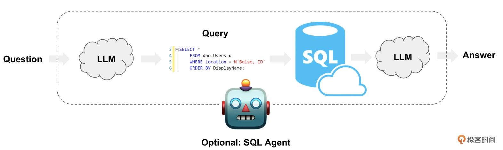
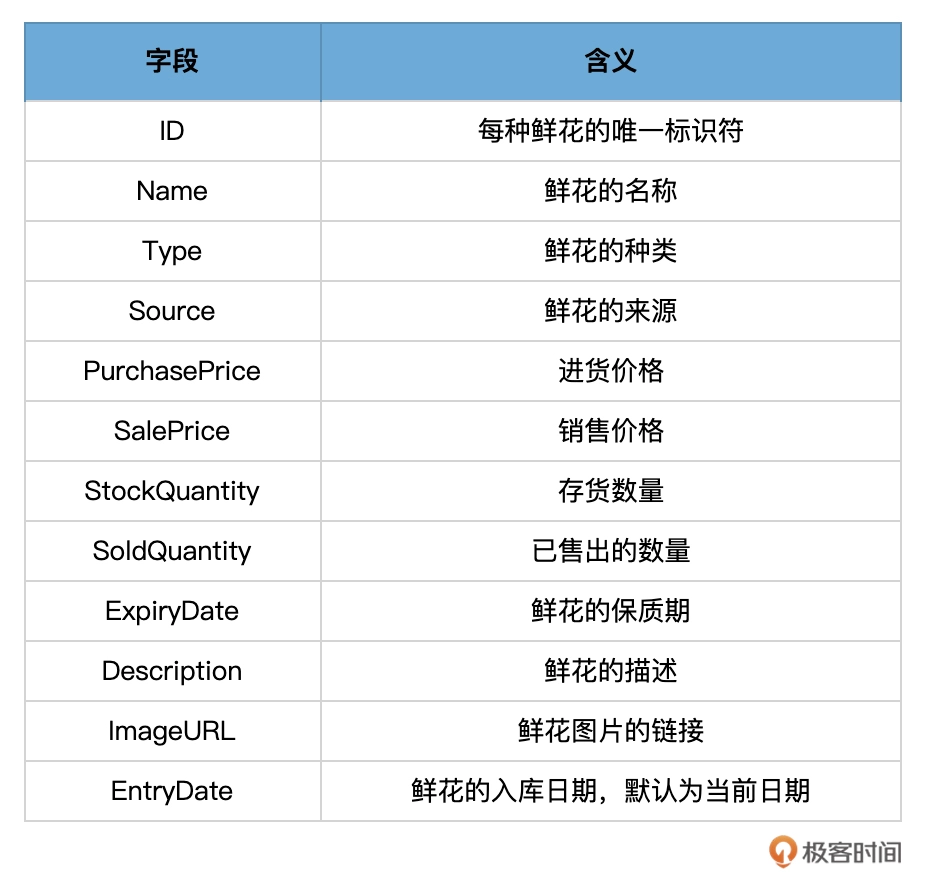
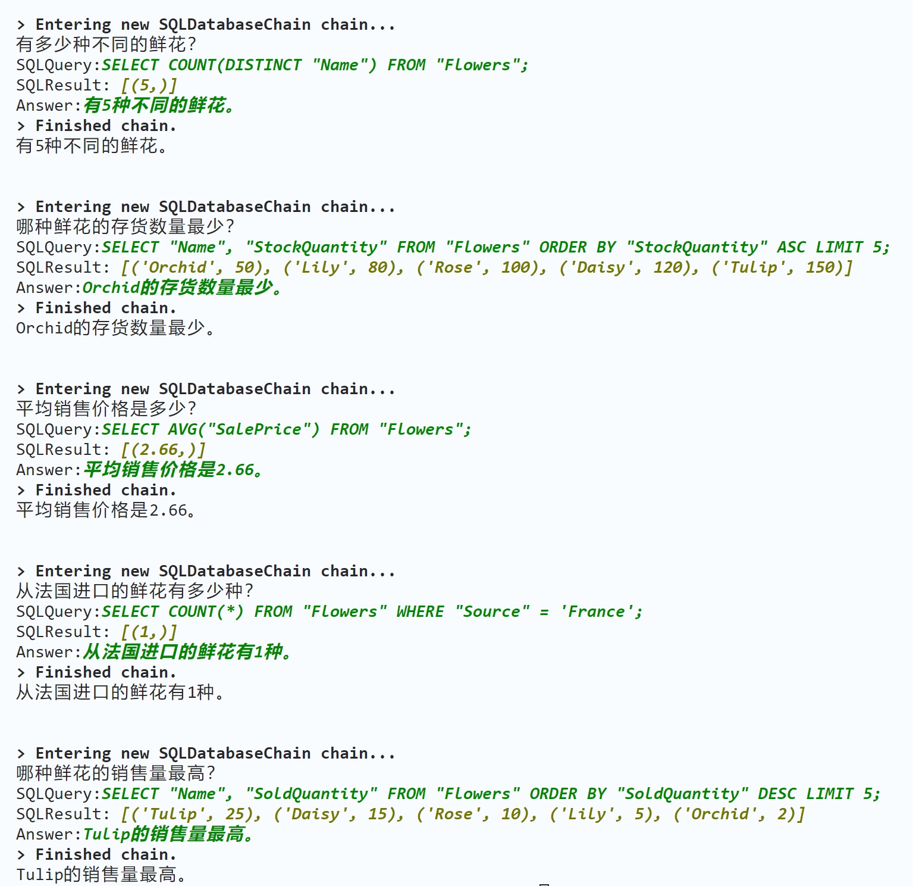
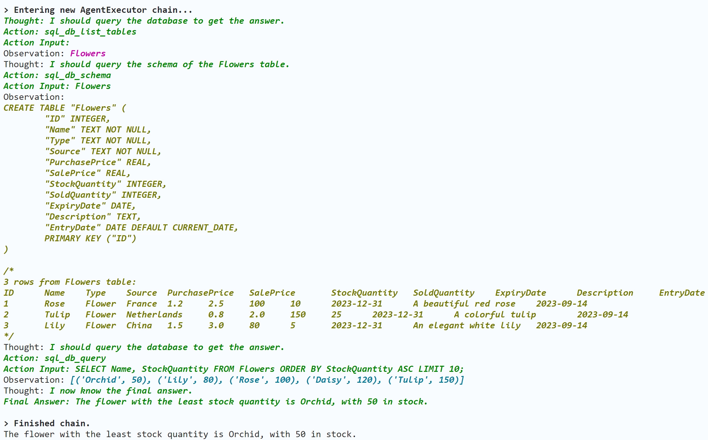
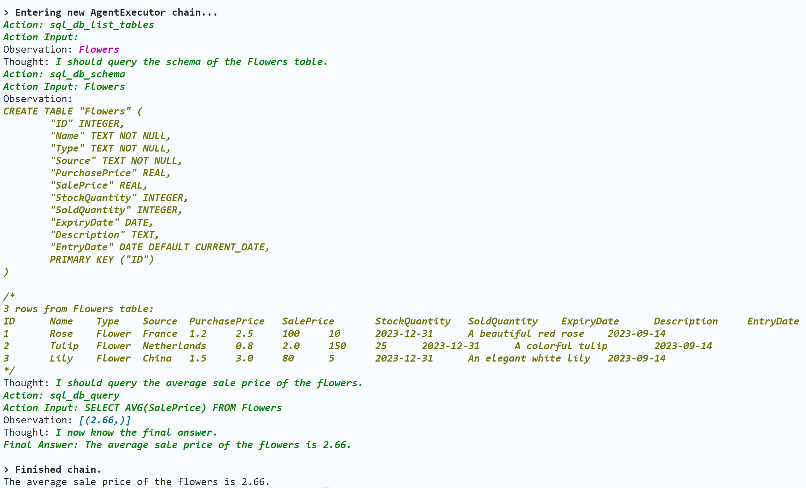

#  连接数据库：通过链和代理查询鲜花信息


## 新的数据库查询范式

以 LLM 为驱动引擎，从自然语言的（模糊）询问，到自然语言的查询结果输出的流程:




这种范式结合了自然语言处理和传统数据库查询的功能，为用户提供了一个更为直观和高效的交互方式。下面我来解释下这个过程。


1. 提出问题：用户用自然语言提出一个问题，例如“去年的总销售额是多少？”。
2. LLM 理解并转译：LLM 首先会解析这个问题，理解其背后的意图和所需的信息。接着，模型会根据解析的内容，生成相应的 SQL 查询语句，例如 “SELECT SUM(sales) FROM sales_data WHERE year = ‘last_year’;”。
3. 执行 SQL 查询：生成的 SQL 查询语句会被发送到相应的数据库进行执行。数据库处理这个查询，并返回所需的数据结果。
4. LLM 接收并解释结果：当数据库返回查询结果后，LLM 会接收到这些数据。然后，LLM 会开始解析这些数据，并将其转化为更容易被人类理解的答案格式。
5. 提供答案：最后，LLM 将结果转化为自然语言答案，并返回给用户。例如“去年的总销售额为 1,000,000 元”。


## 实战案例背景信息

我们的所有业务数据都存储在数据库中，而目标则是通过自然语言来为销售的每一种鲜花数据创建各种查询。这样，无论是员工还是顾客，当他们想了解某种鲜花的价格时，都可以快速地生成适当的查询语句。


**这就大大简化了查询过程和难度。**


- 应用可以被简单地用作一个查询工具
- 其次，这个模板也可以被整合到一个聊天机器人或客服机器人中。顾客可以直接向机器人询问：“红玫瑰的价格是多少？”


## 创建数据库表


```python
# 导入sqlite3库
import sqlite3

# 连接到数据库
conn = sqlite3.connect('FlowerShop.db')
cursor = conn.cursor()

# 执行SQL命令来创建Flowers表
cursor.execute('''
        CREATE TABLE Flowers (
            ID INTEGER PRIMARY KEY, 
            Name TEXT NOT NULL, 
            Type TEXT NOT NULL, 
            Source TEXT NOT NULL, 
            PurchasePrice REAL, 
            SalePrice REAL,
            StockQuantity INTEGER, 
            SoldQuantity INTEGER, 
            ExpiryDate DATE,  
            Description TEXT, 
            EntryDate DATE DEFAULT CURRENT_DATE 
        );
    ''')

# 插入5种鲜花的数据
flowers = [
    ('Rose', 'Flower', 'France', 1.2, 2.5, 100, 10, '2023-12-31', 'A beautiful red rose'),
    ('Tulip', 'Flower', 'Netherlands', 0.8, 2.0, 150, 25, '2023-12-31', 'A colorful tulip'),
    ('Lily', 'Flower', 'China', 1.5, 3.0, 80, 5, '2023-12-31', 'An elegant white lily'),
    ('Daisy', 'Flower', 'USA', 0.7, 1.8, 120, 15, '2023-12-31', 'A cheerful daisy flower'),
    ('Orchid', 'Flower', 'Brazil', 2.0, 4.0, 50, 2, '2023-12-31', 'A delicate purple orchid')
]

for flower in flowers:
    cursor.execute('''
        INSERT INTO Flowers (Name, Type, Source, PurchasePrice, SalePrice, StockQuantity, SoldQuantity, ExpiryDate, Description) 
        VALUES (?, ?, ?, ?, ?, ?, ?, ?, ?);
    ''', flower)

# 提交更改
conn.commit()

# 关闭数据库连接
conn.close()
```




## 用 Chain 查询数据库


```python
pip install langchain-experimental
```


```python
# 导入langchain的实用工具和相关的模块
from langchain.utilities import SQLDatabase
from langchain.llms import OpenAI
from langchain_experimental.sql import SQLDatabaseChain

# 连接到FlowerShop数据库（之前我们使用的是Chinook.db）
db = SQLDatabase.from_uri("sqlite:///FlowerShop.db")

# 创建OpenAI的低级语言模型（LLM）实例，这里我们设置温度为0，意味着模型输出会更加确定性
llm = OpenAI(temperature=0, verbose=True)

# 创建SQL数据库链实例，它允许我们使用LLM来查询SQL数据库
db_chain = SQLDatabaseChain.from_llm(llm, db, verbose=True)

# 运行与鲜花运营相关的问题
response = db_chain.run("有多少种不同的鲜花？")
print(response)

response = db_chain.run("哪种鲜花的存货数量最少？")
print(response)

response = db_chain.run("平均销售价格是多少？")
print(response)

response = db_chain.run("从法国进口的鲜花有多少种？")
print(response)

response = db_chain.run("哪种鲜花的销售量最高？")
print(response)
```


打印：





## 用 Agent 查询数据库


除了通过 Chain 完成数据库查询之外，LangChain 还可以通过 SQL Agent 来完成查询任务。相比 SQLDatabaseChain，使用 SQL 代理有一些优点。


- 它可以根据数据库的架构以及数据库的内容回答问题（例如它会检索特定表的描述）。
- 它具有纠错能力，当执行生成的查询遇到错误时，它能够捕获该错误，然后正确地重新生成并执行新的查询。


LangChain 使用 create_sql_agent 函数来初始化代理，通过这个函数创建的 SQL 代理包含 SQLDatabaseToolkit，这个工具箱中包含以下工具：

- 创建并执行查询
- 检查查询语法
- 检索数据表的描述

```python
from langchain.utilities import SQLDatabase
from langchain.llms import OpenAI
from langchain.agents import create_sql_agent
from langchain.agents.agent_toolkits import SQLDatabaseToolkit
from langchain.agents.agent_types import AgentType

# 连接到FlowerShop数据库
db = SQLDatabase.from_uri("sqlite:///FlowerShop.db")
llm = OpenAI(temperature=0, verbose=True)

# 创建SQL Agent
agent_executor = create_sql_agent(
    llm=llm,
    toolkit=SQLDatabaseToolkit(db=db, llm=llm),
    verbose=True,
    agent_type=AgentType.ZERO_SHOT_REACT_DESCRIPTION,
)

# 使用Agent执行SQL查询

questions = [
    "哪种鲜花的存货数量最少？",
    "平均销售价格是多少？",
]

for question in questions:
    response = agent_executor.run(question)
    print(response)
```


问题1的回答：



问题2的回答：

