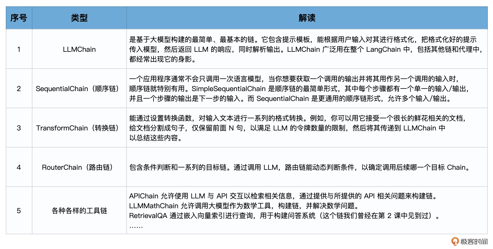

# 链（上）：写一篇完美鲜花推文？用SequencialChain链接不同的组件


LangChain 中提供了很多种类型的预置链，目的是使各种各样的任务实现起来更加方便、规范。





## LLMChain：最简单的链


LLMChain 围绕着语言模型推理功能又添加了一些功能，整合了 PromptTemplate、语言模型（LLM 或聊天模型）和 Output Parser，相当于把 Model I/O 放在一个链中整体操作。它使用提示模板格式化输入，将格式化的字符串传递给 LLM，并返回 LLM 输出。


举例来说，如果我想让大模型告诉我某种花的花语，如果不使用链，代码如下：


```python
#----第一步 创建提示
# 导入LangChain中的提示模板
from langchain import PromptTemplate
# 原始字符串模板
template = "{flower}的花语是?"
# 创建LangChain模板
prompt_temp = PromptTemplate.from_template(template) 
# 根据模板创建提示
prompt = prompt_temp.format(flower='玫瑰')
# 打印提示的内容
print(prompt)

#----第二步 创建并调用模型 
# 导入LangChain中的OpenAI模型接口
from langchain import OpenAI
# 创建模型实例
model = OpenAI(temperature=0)
# 传入提示，调用模型，返回结果
result = model(prompt)
print(result)
```


输出：

```
玫瑰的花语是?
爱情、浪漫、美丽、永恒、誓言、坚贞不渝。
```


此时 Model I/O 的实现分为两个部分，提示模板的构建和模型的调用独立处理。


如果使用链，代码结构则显得更简洁。


```python
# 导入所需的库
from langchain import PromptTemplate, OpenAI, LLMChain
# 原始字符串模板
template = "{flower}的花语是?"
# 创建模型实例
llm = OpenAI(temperature=0)
# 创建LLMChain
llm_chain = LLMChain(
    llm=llm,
    prompt=PromptTemplate.from_template(template))
# 调用LLMChain，返回结果
result = llm_chain("玫瑰")
print(result)
```

输出：

```
{'flower': '玫瑰', 'text': '\n\n爱情、美丽、浪漫、温柔、热情、欢乐、尊敬、感激、祝福、纯洁、永恒。'}
```


## 链的调用方式


### 直接调用


```python
prompt = PromptTemplate(
    input_variables=["flower", "season"],
    template="{flower}在{season}的花语是?",
)
llm_chain = LLMChain(llm=llm, prompt=prompt)
print(llm_chain({
    'flower': "玫瑰",
    'season': "夏季" }))
```

输出：

```python
{'flower': '玫瑰', 'season': '夏季', 'text': '\n\n玫瑰在夏季的花语是爱的誓言，热情，美丽，坚定的爱情。'}
```


### 通过 run 方法


```python
llm_chain({"flower": "玫瑰", "season": "冬季"})
```

等价于：

```python
llm_chain.run({"flower": "玫瑰", "season": "冬季"})
```


### 通过 predict 方法


```python
llm_chain.predict(flower="玫瑰", season="冬季")
```


### 通过 apply 方法

apply 方法允许我们针对输入列表运行链，一次处理多个输入。

```python
# apply允许您针对输入列表运行链
input_list = [
    {"flower": "玫瑰",'season': "夏季"},
    {"flower": "百合",'season': "春季"},
    {"flower": "郁金香",'season': "秋季"}
]
result = llm_chain.apply(input_list)
print(result)
```


输出：

```python
'''[{'text': '\n\n玫瑰在夏季的花语是“恋爱”、“热情”和“浪漫”。'}, 
{'text': '\n\n百合在春季的花语是“爱情”和“友谊”。'},
 {'text': '\n\n郁金香在秋季的花语表达的是“热情”、“思念”、“爱恋”、“回忆”和“持久的爱”。'}]'''
```


### 通过 generate 方法

generate 方法类似于 apply，只不过它返回一个 LLMResult 对象，而不是字符串。LLMResult 通常包含模型生成文本过程中的一些相关信息，例如令牌数量、模型名称等。


```
result = llm_chain.generate(input_list)
print(result)
```


输出：


```python
generations=[[Generation(text='\n\n玫瑰在夏季的花语是“热情”、“爱情”和“幸福”。', 
generation_info={'finish_reason': 'stop', 'logprobs': None})], 
[Generation(text='\n\n春季的花语是爱情、幸福、美满、坚贞不渝。', 
generation_info={'finish_reason': 'stop', 'logprobs': None})], 
[Generation(text='\n\n秋季的花语是“思念”。银色的百合象征着“真爱”，而淡紫色的郁金香则象征着“思念”，因为它们在秋天里绽放的时候，犹如在思念着夏天的温暖。', 
generation_info={'finish_reason': 'stop', 'logprobs': None})]] 
llm_output={'token_usage': {'completion_tokens': 243, 'total_tokens': 301, 'prompt_tokens': 58}, 'model_name': 'gpt-3.5-turbo-instruct'} 
run=[RunInfo(run_id=UUID('13058cca-881d-4b76-b0cf-0f9c831af6c4')), 
RunInfo(run_id=UUID('7f38e33e-bab5-4d03-b77c-f50cd195affb')), 
RunInfo(run_id=UUID('7a1e45fd-77ee-4133-aab0-431147186db8'))]
```


## Sequential Chain：顺序链


个示例中，我们的目标是这样的：

- 第一步，我们假设大模型是一个植物学家，让他给出某种特定鲜花的知识和介绍。
- 第二步，我们假设大模型是一个鲜花评论者，让他参考上面植物学家的文字输出，对鲜花进行评论。
- 第三步，我们假设大模型是易速鲜花的社交媒体运营经理，让他参考上面植物学家和鲜花评论者的文字输出，来写一篇鲜花运营文案。


#### 首先，导入所有需要的库。

```
# 设置OpenAI API密钥
import os
os.environ["OPENAI_API_KEY"] = '你的OpenAI API Key'

from langchain.llms import OpenAI
from langchain.chains import LLMChain
from langchain.prompts import PromptTemplate
from langchain.chains import SequentialChain
```


#### 然后，添加第一个 LLMChain，生成鲜花的知识性说明。

```python
# 这是第一个LLMChain，用于生成鲜花的介绍，输入为花的名称和种类
llm = OpenAI(temperature=.7)
template = """
你是一个植物学家。给定花的名称和类型，你需要为这种花写一个200字左右的介绍。

花名: {name}
颜色: {color}
植物学家: 这是关于上述花的介绍:"""
prompt_template = PromptTemplate(input_variables=["name", "color"], template=template)
introduction_chain = LLMChain(llm=llm, prompt=prompt_template, output_key="introduction")
```


#### 接着，添加第二个 LLMChain，根据鲜花的知识性说明生成评论。


通过 input_variables=["introduction"] 和上一个chain的output_key="introduction" 连起来。

```python
# 这是第二个LLMChain，用于根据鲜花的介绍写出鲜花的评论
llm = OpenAI(temperature=.7)
template = """
你是一位鲜花评论家。给定一种花的介绍，你需要为这种花写一篇200字左右的评论。

鲜花介绍:
{introduction}
花评人对上述花的评论:"""
prompt_template = PromptTemplate(input_variables=["introduction"], template=template)
review_chain = LLMChain(llm=llm, prompt=prompt_template, output_key="review")
```


#### 接着，添加第三个 LLMChain，根据鲜花的介绍和评论写出一篇自媒体的文案


```python
# 这是第三个LLMChain，用于根据鲜花的介绍和评论写出一篇自媒体的文案
template = """
你是一家花店的社交媒体经理。给定一种花的介绍和评论，你需要为这种花写一篇社交媒体的帖子，300字左右。

鲜花介绍:
{introduction}
花评人对上述花的评论:
{review}

社交媒体帖子:
"""
prompt_template = PromptTemplate(input_variables=["introduction", "review"], template=template)
social_post_chain = LLMChain(llm=llm, prompt=prompt_template, output_key="social_post_text")
```


#### 最后，添加 SequentialChain，把前面三个链串起来。


chains=[introduction_chain, review_chain, social_post_chain] 指明了chain的链接方式。

```python
# 这是总的链，我们按顺序运行这三个链
overall_chain = SequentialChain(
    chains=[introduction_chain, review_chain, social_post_chain],
    input_variables=["name", "color"],
    output_variables=["introduction","review","social_post_text"],
    verbose=True)

# 运行链，并打印结果
result = overall_chain({"name":"玫瑰", "color": "黑色"})
print(result)
```


最终的输出如下：

```python
> Entering new  chain...

> Finished chain.
{'name': '玫瑰', 'color': '黑色', 
'introduction': '\n\n黑色玫瑰，这是一种对传统玫瑰花的独特颠覆，它的出现挑战了我们对玫瑰颜色的固有认知。它的花瓣如煤炭般黑亮，反射出独特的微光，而花蕊则是金黄色的，宛如夜空中的一颗星，强烈的颜色对比营造出一种前所未有的视觉效果。在植物学中，黑色玫瑰的出现无疑提供了一种新的研究方向，对于我们理解花朵色彩形成的机制有着重要的科学价值。', 
'review': '\n\n黑色玫瑰，这不仅仅是一种花朵，更是一种完全颠覆传统的艺术表现形式。黑色的花瓣仿佛在诉说一种不可言喻的悲伤与神秘，而黄色的蕊瓣犹如漆黑夜空中的一抹亮色，给人带来无尽的想象。它将悲伤与欢乐，神秘与明亮完美地结合在一起，这是一种全新的视觉享受，也是一种对生活理解的深度表达。', 
'social_post_text': '\n欢迎来到我们的自媒体平台，今天，我们要向您展示的是我们的全新产品——黑色玫瑰。这不仅仅是一种花，这是一种对传统观念的挑战，一种视觉艺术的革新，更是一种生活态度的象征。
这种别样的玫瑰花，其黑色花瓣宛如漆黑夜空中闪烁的繁星，富有神秘的深度感，给人一种前所未有的视觉冲击力。这种黑色，它不是冷酷、不是绝望，而是充满着独特的魅力和力量。而位于黑色花瓣之中的金黄色花蕊，则犹如星星中的灵魂，默默闪烁，给人带来无尽的遐想，充满活力与生机。
黑色玫瑰的存在，不仅挑战了我们对于玫瑰传统颜色的认知，它更是一种生动的生命象征，象征着那些坚韧、独特、勇敢面对生活的人们。黑色的花瓣中透露出一种坚韧的力量，而金黄的花蕊则是生活中的希望，二者的结合恰好象征了生活中的喜怒哀乐，体现了人生的百态。'}
```

