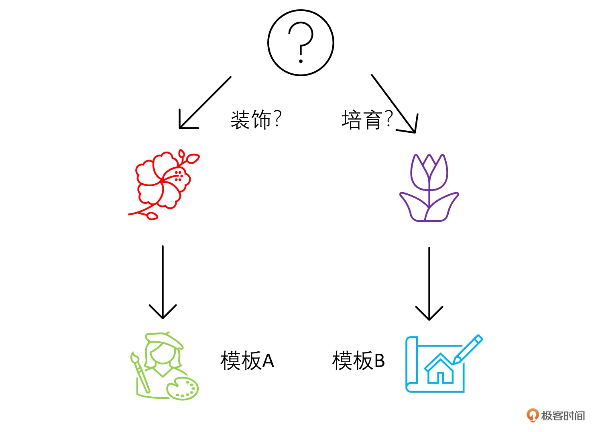

# 链（下）：想学“育花”还是“插花”？用RouterChain确定客户意图


## 场景假设


这里假设咱们的鲜花运营智能客服 ChatBot 通常会接到两大类问题。

1. **鲜花养护**（保持花的健康、如何浇水、施肥等）
2. **鲜花装饰**（如何搭配花、如何装饰场地等）


如果接到的是第一类问题，你要给 ChatBot A 指示；如果接到第二类的问题，你要给 ChatBot B 指示。




LangChain 会通过 RouterChain 来自动引导大语言模型选择不同的模板。


## 整体框架

outerChain，也叫路由链，能动态选择用于给定输入的下一个链。我们会根据用户的问题内容，首先使用路由器链确定问题更适合哪个处理模板，然后将问题发送到该处理模板进行回答。如果问题不适合任何已定义的处理模板，它会被发送到默认链。


在这里，我们会用 LLMRouterChain 和 MultiPromptChain（也是一种路由链）组合实现路由功能，该 MultiPromptChain 会调用 LLMRouterChain 选择与给定问题最相关的提示，然后使用该提示回答问题。


**具体步骤如下：**


1. 构建处理模板：为鲜花护理和鲜花装饰分别定义两个字符串模板。
2. 提示信息：使用一个列表来组织和存储这两个处理模板的关键信息，如模板的键、描述和实际内容。
3. 初始化语言模型：导入并实例化语言模型。
4. 构建目标链：根据提示信息中的每个模板构建了对应的 LLMChain，并存储在一个字典中。
5. 构建 LLM 路由链：这是决策的核心部分。首先，它根据提示信息构建了一个路由模板，然后使用这个模板创建了一个 LLMRouterChain。
6. 构建默认链：如果输入不适合任何已定义的处理模板，这个默认链会被触发。
7. 构建多提示链：使用 MultiPromptChain 将 LLM 路由链、目标链和默认链组合在一起，形成一个完整的决策系统。


## 具体实现


### 构建提示信息的模板

首先，我们针对两种场景，构建两个提示信息的模板。

```python
# 构建两个场景的模板
flower_care_template = """你是一个经验丰富的园丁，擅长解答关于养花育花的问题。
                        下面是需要你来回答的问题:
                        {input}"""

flower_deco_template = """你是一位网红插花大师，擅长解答关于鲜花装饰的问题。
                        下面是需要你来回答的问题:
                        {input}"""

# 构建提示信息
prompt_infos = [
    {
        "key": "flower_care",
        "description": "适合回答关于鲜花护理的问题",
        "template": flower_care_template,
    },
    {
        "key": "flower_decoration",
        "description": "适合回答关于鲜花装饰的问题",
        "template": flower_deco_template,
    }]
```


### 初始化语言模型

```python
# 初始化语言模型
from langchain.llms import OpenAI
import os
os.environ["OPENAI_API_KEY"] = '你的OpenAI Key'
llm = OpenAI()
```


### 构建目标链

```python
# 构建目标链
from langchain.chains.llm import LLMChain
from langchain.prompts import PromptTemplate
chain_map = {}
for info in prompt_infos:
    prompt = PromptTemplate(template=info['template'], 
                            input_variables=["input"])   # 创建一个提示模板对象，使用 info 中的模板字符串和输入变量
    print("目标提示:\n",prompt)
    chain = LLMChain(llm=llm, prompt=prompt,verbose=True)
    chain_map[info["key"]] = chain
```

PS: info 的结构如下：

```python
info: {
'key': 'flower_care', 
'description': '适合回答关于鲜花护理的问题', 
'template': '你是一个经验丰富的园丁，擅长解答关于养花育花的问题。\n                       
下面是需要你来回答的问题:\n                        {input}'}
```


目标链提示打印如下：

```python
目标提示:
input_variables=['input'] 
output_parser=None partial_variables={} 
template='你是一个经验丰富的园丁，擅长解答关于养花育花的问题。\n                        下面是需要你来回答的问题:\n                        
{input}' template_format='f-string' 
validate_template=True

目标提示:
input_variables=['input'] 
output_parser=None partial_variables={} 
template='你是一位网红插花大师，擅长解答关于鲜花装饰的问题。\n                        下面是需要你来回答的问题:\n                        
{input}' template_format='f-string' 
validate_template=True
```


**chain_map**打印如下：

```python
{
  'flower_care': LLMChain(verbose=True, 
                         prompt=PromptTemplate(
                                    input_variables=['input'], 
                                    template='你是一个经验丰富的园丁，擅长解答关于养花育花的问题。\n下面是需要你来回答的问题:\n{input}'), 
                         llm=OpenAI(client=<openai.resources.completions.Completions object at 0x7d0b60a03d60>, 
                                    async_client=<openai.resources.completions.AsyncCompletions object at 0x7d0b60a2f1f0>, 
                                    openai_api_key='...', openai_proxy='')),
  'flower_decoration': LLMChain(verbose=True, 
                          prompt=PromptTemplate(
                                    input_variables=['input'], 
                                    template='你是一位网红插花大师，擅长解答关于鲜花装饰的问题。\n下面是需要你来回答的问题:\n{input}'), 
                          llm=OpenAI(client=<openai.resources.completions.Completions object at 0x7d0b60a03d60>, 
                                    async_client=<openai.resources.completions.AsyncCompletions object at 0x7d0b60a2f1f0>, 
                                    openai_api_key='...', openai_proxy=''))
}
```


## 构建路由链


```python
# 构建路由链
from langchain.chains.router.llm_router import LLMRouterChain, RouterOutputParser
from langchain.chains.router.multi_prompt_prompt import MULTI_PROMPT_ROUTER_TEMPLATE as RounterTemplate
destinations = [f"{p['key']}: {p['description']}" for p in prompt_infos]
router_template = RounterTemplate.format(destinations="\n".join(destinations))

print("路由模板:\n",router_template)
router_prompt = PromptTemplate(
    template=router_template,
    input_variables=["input"],
    output_parser=RouterOutputParser(),)

print("路由提示:\n",router_prompt)
router_chain = LLMRouterChain.from_llm(llm, 
                                       router_prompt,
                                       verbose=True)
```

解释：

1. `destinations 打印出来为：

   ```
   ['flower_care: 适合回答关于鲜花护理的问题', 'flower_decoration: 适合回答关于鲜花装饰的问题']
   ```


输出：

~~~python
路由模板:
 Given a raw text input to a language model select the model prompt best suited for the input. You will be given the names of the available prompts and a description of what the prompt is best suited for. You may also revise the original input if you think that revising it will ultimately lead to a better response from the language model.

<< FORMATTING >>
Return a markdown code snippet with a JSON object formatted to look like:
```json
{{
    "destination": string \ name of the prompt to use or "DEFAULT"
    "next_inputs": string \ a potentially modified version of the original input
}}
```

REMEMBER: "destination" MUST be one of the candidate prompt names specified below OR it can be "DEFAULT" if the input is not well suited for any of the candidate prompts.
REMEMBER: "next_inputs" can just be the original input if you don't think any modifications are needed.

<< CANDIDATE PROMPTS >>
flower_care: 适合回答关于鲜花护理的问题
flower_decoration: 适合回答关于鲜花装饰的问题

<< INPUT >>
{input}

<< OUTPUT >>


路由提示:
input_variables=['input'] output_parser=RouterOutputParser(default_destination='DEFAULT', next_inputs_type=<class 'str'>, next_inputs_inner_key='input') 
partial_variables={} 
template='Given a raw text input to a language model select the model prompt best suited for the input. You will be given the names of the available prompts and a description of what the prompt is best suited for. You may also revise the original input if you think that revising it will ultimately lead to a better response from the language model.\n\n
<< FORMATTING >>\n
Return a markdown code snippet with a JSON object formatted to look like:\n```json\n{{\n "destination": string \\ name of the prompt to use or "DEFAULT"\n    "next_inputs": string \\ a potentially modified version of the original input\n}}\n```\n\n
REMEMBER: "destination" MUST be one of the candidate prompt names specified below OR it can be "DEFAULT" if the input is not well suited for any of the candidate prompts.\n
REMEMBER: "next_inputs" can just be the original input if you don\'t think any modifications are needed.\n\n<< CANDIDATE PROMPTS >>\n
flower_care: 适合回答关于鲜花护理的问题\n
flower_decoration: 适合回答关于鲜花装饰的问题\n\n
<< INPUT >>\n{input}\n\n<< OUTPUT >>\n' 
template_format='f-string' 
validate_template=True
~~~


### 路由模板的解释


> Given a raw text input to a language model select the model prompt best suited for the input.

这是一个简单的引导语句，告诉模型你将给它一个输入，它需要根据这个输入选择最适合的模型提示。


> You will be given the names of the available prompts and a description of what the prompt is best suited for.

这里进一步提醒模型，它将获得各种模型提示的名称和描述。


> You may also revise the original input if you think that revising it will ultimately lead to a better response from the language model.

这是一个可选的步骤，告诉模型它可以更改原始输入以获得更好的响应。


> << FORMATTING >>
> Return a markdown code snippet with a JSON object formatted to look like:
>
> ```json
> {{
>     "destination": string \ name of the prompt to use or "DEFAULT"
>     "next_inputs": string \ a potentially modified version of the original input
> }}
> ```

表示模型的输出应该是一个 Markdown 代码片段，其中包含一个特定格式的 JSON 对象。


> REMEMBER: "destination" MUST be one of the candidate prompt names specified below OR it can be "DEFAULT" if the input is not well suited for any of the candidate prompts.
> REMEMBER: "next_inputs" can just be the original input if you don't think any modifications are needed.

上面是一个重要的指导，提醒模型 “destination” 字段的值必须是下面列出的提示之一或是 “DEFAULT”。下面是再次强调，除非模型认为有必要，否则原始输入不需要修改。


> << CANDIDATE PROMPTS >>
> flower_care: 适合回答关于鲜花护理的问题
> flower_decoration: 适合回答关于鲜花装饰的问题

列出了两个示例模型提示及其描述：

- “flower_care: 适合回答关于鲜花护理的问题”，适合处理与花卉护理相关的问题。
- “flower_decoration: 适合回答关于鲜花装饰的问题”，适合处理与花卉装饰相关的问题。


> << INPUT >>
> {input}
>
> << OUTPUT >>

这部分为模型提供了一个格式化的框架，其中它将接收一个名为 {input} 的输入，并在此后的部分输出结果。


### 路由提示的解释

路由提示 (router_prompt）则根据路由模板，生成了具体传递给 LLM 的路由提示信息。


- 其中 input_variables 指定模板接收的输入变量名，这里只有 "input"。
- output_parser 是一个用于解析模型输出的对象，它有一个默认的目的地和一个指向下一输入的键。
- template 是实际的路由模板，用于给模型提供指示。这就是刚才详细解释的模板内容。
- template_format 指定模板的格式，这里是 "f-string"。
- validate_template 是一个布尔值，如果为 True，则会在使用模板前验证其有效性。


## 构建默认链


```python
# 构建默认链
from langchain.chains import ConversationChain
default_chain = ConversationChain(llm=llm, 
                                  output_key="text",
                                  verbose=True)
```


## 构建多提示链


使用 MultiPromptChain 类把前几个链整合在一起，实现路由功能。

```python
# 构建多提示链
from langchain.chains.router import MultiPromptChain
chain = MultiPromptChain(
    router_chain=router_chain,
    destination_chains=chain_map,
    default_chain=default_chain,
    verbose=True)
```


## 运行路由链


### 测试A

```python
print(chain.run("如何为玫瑰浇水？"))
```

输出：

```python


> Entering new MultiPromptChain chain...


> Entering new LLMRouterChain chain...

> Finished chain.
flower_care: {'input': '如何为玫瑰浇水？'}

> Entering new LLMChain chain...
Prompt after formatting:
你是一个经验丰富的园丁，擅长解答关于养花育花的问题。
                        下面是需要你来回答的问题:
                        如何为玫瑰浇水？

> Finished chain.

> Finished chain.

首先，要选择适合玫瑰生长的土壤，并保持土壤的湿润度。其次，要根据玫瑰生长的阶段和气候情况来确定浇水的频率和量。一般来说，夏季干燥炎热的天气，每周浇水2-3次，每次保持土壤湿润，但不要过量。冬季和春季天气较凉，每周浇水1-2次即可。

其次，浇水时要注意避免叶子和花朵受到水浸泡，避免引发病害。可以选择早晨或傍晚时浇水，这样可以避免太阳直射造成水分蒸发过快。

另外，可以在浇水时给玫瑰施加
```


### 测试B

```python
print(chain.run("如何为婚礼场地装饰花朵？"))
```

输出：

```python
> Entering new MultiPromptChain chain...


> Entering new LLMRouterChain chain...

> Finished chain.
flower_decoration: {'input': '如何为婚礼场地装饰花朵？'}

> Entering new LLMChain chain...
Prompt after formatting:
你是一位网红插花大师，擅长解答关于鲜花装饰的问题。
                        下面是需要你来回答的问题:
                        如何为婚礼场地装饰花朵？

> Finished chain.

> Finished chain.

对于婚礼场地的花朵装饰，首先要考虑的是场地的大小和布置。如果是室外的场地，可以选择一些大型的花束或者花环来装饰整个场地，营造浪漫的氛围。如果是室内的场地，可以根据场地的主题来选择花束的风格和色彩。

其次，要考虑花卉的选择。一般来说，婚礼场地的花卉可以选择一些具有浪漫气息的花朵，比如玫瑰、郁金香、康乃馨等。可以选择一些白色、粉色或者淡紫色的花朵来营造温馨浪漫的氛围。

接着，要考虑花卉的摆放位置。可以根据场地的布置
```


### 测试C

```python
print(chain.run("如何考入哈佛大学？"))
```

输出

```python
> Entering new MultiPromptChain chain...


> Entering new LLMRouterChain chain...

> Finished chain.
None: {'input': '如何考入哈佛大学？'}

> Entering new ConversationChain chain...
Prompt after formatting:
The following is a friendly conversation between a human and an AI. The AI is talkative and provides lots of specific details from its context. If the AI does not know the answer to a question, it truthfully says it does not know.

Current conversation:

Human: 如何考入哈佛大学？
AI:

> Finished chain.

> Finished chain.
 考入哈佛大学需要具备一定的学术成就和综合素质。首先，你需要具备优秀的学习成绩，尤其是在数学、英语和科学方面。其次，你需要有突出的领导能力和社会责任感，可以通过参加学校的社团活动、义工工作等来展示。另外，哈佛大学也看重学生的个性和创新精神，因此你可以通过参加艺术或科研项目等来提升自己的综合素质。最后，你还需要通过SAT或ACT等标准化考试来展示你的学术能力。总的来说，考入哈佛大学需要全方位的准备和努力，但也不要忘记保持平衡，保持身心健康也是非常重要的。你有什么其他的问题

```

这三个测试，分别被路由到了三个不同的目标链，其中两个是我们预设的“专家类型”目标链，而第三个问题：如何考入哈佛大学？被模型一眼看穿，并不属于任何鲜花运营业务场景，路由链把它抛入了一个 “default chain” —— ConversationChain 去解决。
