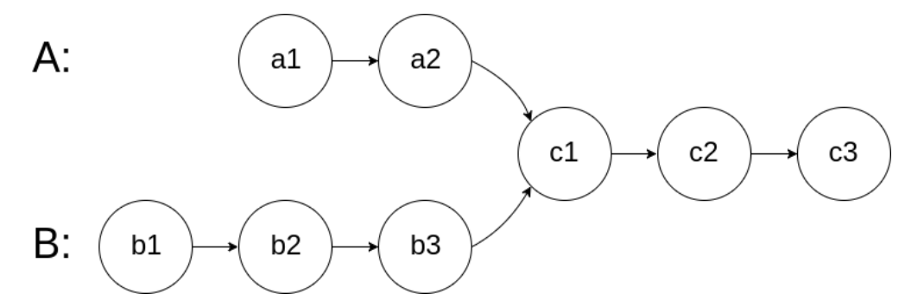
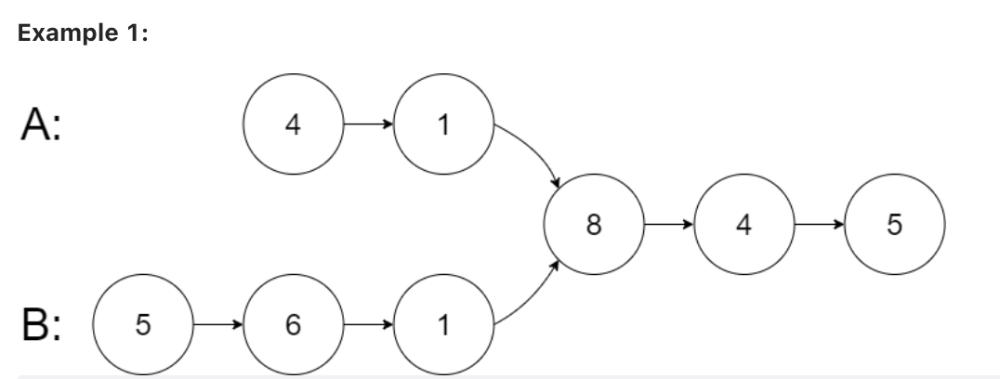
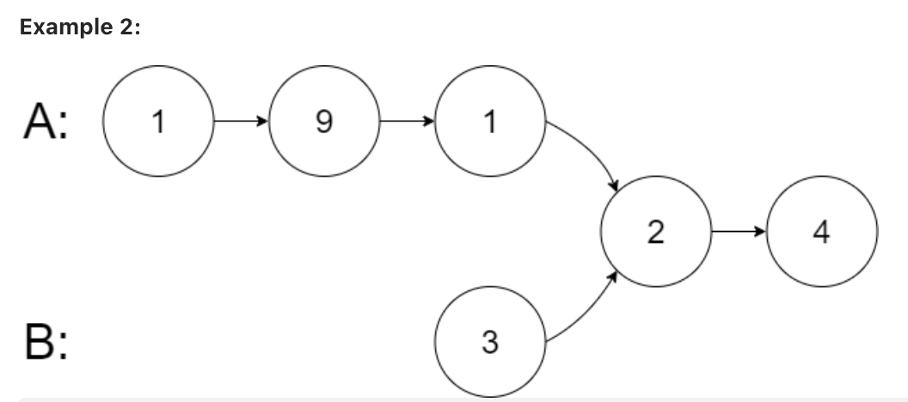

# 160. Intersection of Two Linked Lists

Given the heads of two singly linked-lists headA and headB, return the node at which the two lists intersect. If the two linked lists have no intersection at all, return null.

For example, the following two linked lists begin to intersect at node c1:

The test cases are generated such that there are no cycles anywhere in the entire linked structure.

Note that the linked lists must retain their original structure after the function returns.

Custom Judge:

The inputs to the judge are given as follows (your program is not given these inputs):

intersectVal - The value of the node where the intersection occurs. This is 0 if there is no intersected node.

* listA - The first linked list.
* listB - The second linked list.
* skipA - The number of nodes to skip ahead in listA (starting from the head) to get to the intersected node.
* skipB - The number of nodes to skip ahead in listB (starting from the head) to get to the intersected node.

The judge will then create the linked structure based on these inputs and pass the two heads, headA and headB to your program. If you correctly return the intersected node, then your solution will be accepted.

	Input: intersectVal = 8, listA = [4,1,8,4,5], listB = [5,6,1,8,4,5], skipA = 2, skipB = 3
	Output: Intersected at '8'
	Explanation: The intersected node's value is 8 (note that this must not be 0 if the two lists intersect).
	From the head of A, it reads as [4,1,8,4,5]. From the head of B, it reads as [5,6,1,8,4,5]. There are 2 nodes before the intersected node in A; There are 3 nodes before the intersected node in B.

	Input: intersectVal = 2, listA = [1,9,1,2,4], listB = [3,2,4], skipA = 3, skipB = 1
	Output: Intersected at '2'
	Explanation: The intersected node's value is 2 (note that this must not be 0 if the two lists intersect).
	From the head of A, it reads as [1,9,1,2,4]. From the head of B, it reads as [3,2,4]. There are 3 nodes before the intersected node in A; There are 1 node before the intersected node in B.

## 代码（两层枚举）

	# Definition for singly-linked list.
	# class ListNode:
	#     def __init__(self, x):
	#         self.val = x
	#         self.next = None
	
	class Solution:
	    def getIntersectionNode(self, headA: ListNode, headB: ListNode) -> ListNode:
	        h1 = headA
	        while h1:
	            h2 = headB
	            while h2:
	                if h1 == h2:
	                    return h1
	                h2 = h2.next
	            h1 = h1.next
	        
## 解释

一个朴素的解法自然是两层枚举，逐个检查哪个节点相同

时间复杂度：O(n * m)O(n∗m)
空间复杂度：O(1)O(1)