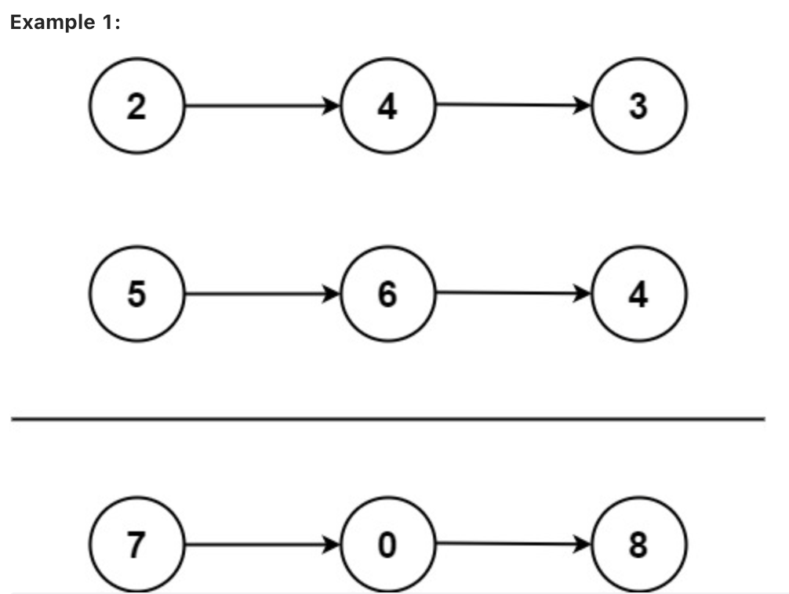

# 2. Add Two Numbers

You are given two non-empty linked lists representing two non-negative integers. The digits are stored in reverse order, and each of their nodes contains a single digit. Add the two numbers and return the sum as a linked list.

You may assume the two numbers do not contain any leading zero, except the number 0 itself.

	Input: l1 = [2,4,3], l2 = [5,6,4]
	Output: [7,0,8]
	Explanation: 342 + 465 = 807.

Example 2:
	
		Input: l1 = [0], l2 = [0]
		Output: [0]
		
Example 3:
	
		Input: l1 = [9,9,9,9,9,9,9], l2 = [9,9,9,9]
		Output: [8,9,9,9,0,0,0,1]

## 解释

数字是reversed order， 意思是[2,4,3] 表示的是342

## 代码

	# Definition for singly-linked list.
	# class ListNode:
	#     def __init__(self, val=0, next=None):
	#         self.val = val
	#         self.next = next
	class Solution:
	    def addTwoNumbers(self, l1: Optional[ListNode], l2: Optional[ListNode]) -> Optional[ListNode]:
	        
	        head = cur = ListNode(0)
	        carry = 0
	
	        while carry or l1 or l2:
	            #加法的两个数字
	            v1 = l1.val if l1 else 0
	            v2 = l2.val if l2 else 0
	            
	            #运算集指针往后移动
	            l1 = l1.next if l1 else None
	            l2 = l2.next if l2 else None
	            
	            # 除数和余数
	            carry, value = divmod(carry + v1 + v2, 10)
	            
	            #结果集存储结果，并且指针往后移动
	            cur.next = ListNode(value)
	            cur = cur.next
	
	        return head.next

