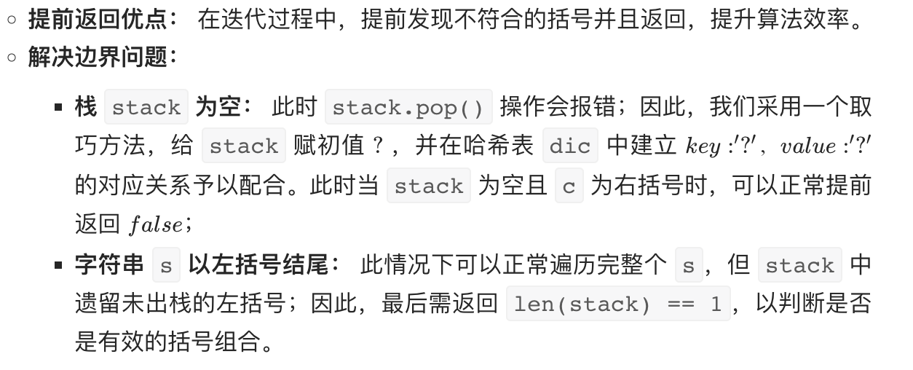

# 20. Valid Parentheses 有效的括号

## 题目

Given a string s containing just the characters '(', ')', '{', '}', '[' and ']', determine if the input string is valid.

An input string is valid if:

Open brackets must be closed by the same type of brackets.
Open brackets must be closed in the correct order.

给定一个只包括 '('，')'，'{'，'}'，'['，']' 的字符串 s ，判断字符串是否有效。

有效字符串需满足：

左括号必须用相同类型的右括号闭合。
左括号必须以正确的顺序闭合。
 

示例 1：

	输入：s = "()"
	输出：true
示例 2：

	输入：s = "()[]{}"
	输出：true
示例 3：

	输入：s = "(]"
	输出：false
示例 4：

	输入：s = "([)]"
	输出：false
示例 5：

	输入：s = "{[]}"
	输出：true

## 代码

	class Solution:
	    def isValid(self, s: str) -> bool:
	        dic = {'{': '}',  '[': ']', '(': ')', '?': '?'}
	
	        # 避免stack为空
	        stack = ['?']
	        for c in s:  
	            # 如果参数是dic的key  
	            if c in dic: 
	                stack.append(c)
	            elif dic[stack.pop()] != c:
	                return False
	
	        return len(stack) == 1

##解题思路：

###算法原理

* 栈先入后出特点恰好与本题括号排序特点一致，即若遇到左括号入栈，遇到右括号时将对应栈顶左括号出栈，则遍历完所有括号后 stack 仍然为空；
* 建立哈希表 dic 构建左右括号对应关系：keykey 左括号，valuevalue 右括号；这样查询 22 个括号是否对应只需 O(1)O(1) 时间复杂度；建立栈 stack，遍历字符串 s 并按照算法流程一一判断。
 
### 算法流程

* 如果 c 是左括号，则入栈 push；
* 否则通过哈希表判断括号对应关系，若 stack 栈顶出栈括号stack.pop() 与当前遍历括号 c 不对应，则提前返回 false

###提前返回 false

### 复杂度分析

* 时间复杂度 O(N)O(N)：正确的括号组合需要遍历1遍 s；
* 空间复杂度 O(N)O(N)：哈希表和栈使用线性的空间大小。

