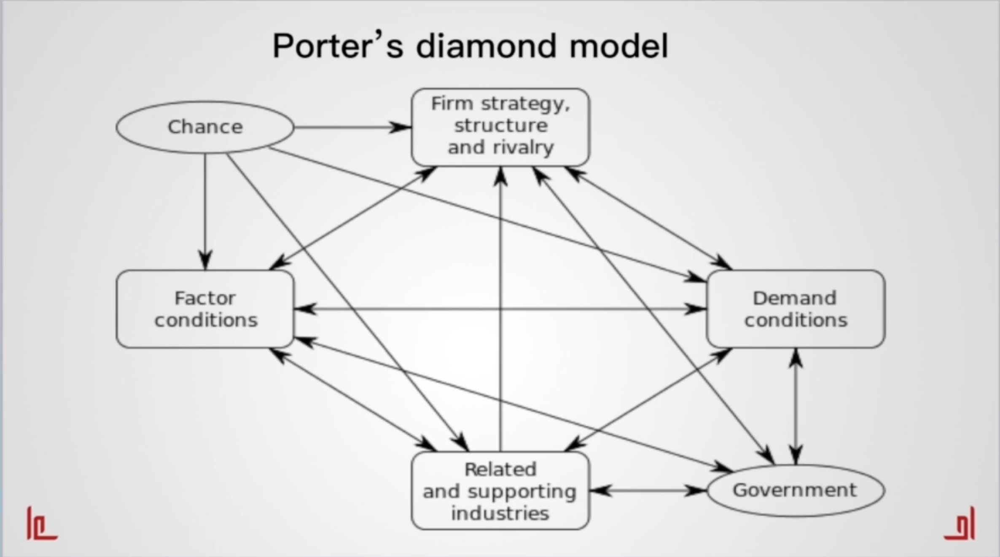

# 企业的竞争优势

波特的钻石模型（Porter's Diamond Model）是由美国学者迈克尔·波特（Michael Porter）提出的一个分析国际竞争力的框架。该模型旨在解释为什么某些国家在特定行业中具有竞争优势，而其他国家则不具备相同的优势。波特提出，一个国家的竞争优势不仅取决于其所在行业的个别企业，还受到国家因素的影响。

波特的钻石模型包括以下四个要素：

1. **因素条件（Factor Conditions）**：这指的是国家内部的生产要素，如劳动力、土地、资本和基础设施等。这些要素条件会影响到企业的生产成本、质量和创新能力。比如，高度发达的教育体系和技术基础设施可能会促进创新和技术升级，提高企业竞争力。
2. **需求条件（Demand Conditions）**：这是指国内市场的需求情况，包括需求规模、需求结构和需求水平。强大的国内需求可以刺激企业不断改进产品和服务，满足国际市场的需求。例如，消费者对高品质产品的需求会推动企业提升质量标准。
3. **相关支持产业（Related and Supporting Industries）**：这包括相关产业和支持产业的发展水平。相互支持的产业集群可以提供便利和资源，促进创新和提高效率。例如，供应链上的合作伙伴关系和技术支持企业可以帮助提高产业整体竞争力。
4. **企业战略、结构和竞争力（Firm Strategy, Structure, and Rivalry）**：这指的是企业之间的竞争态势，包括企业的战略选择、组织结构和竞争行为。激烈的竞争可能会激发企业创新，提高生产效率和产品质量。同时，政府政策和法律法规也会影响到企业的竞争行为。