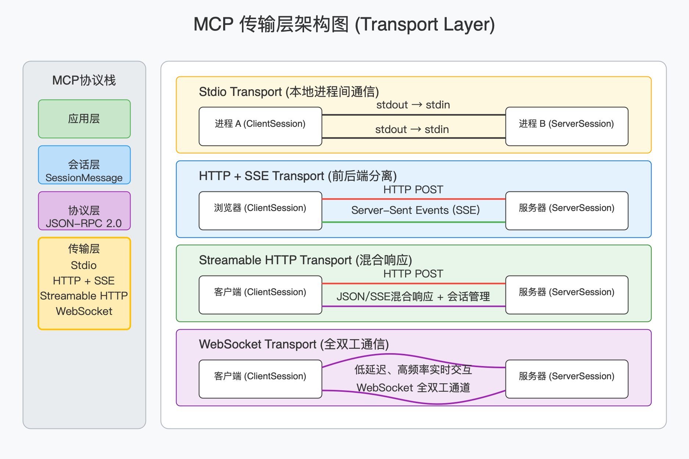

# MCP底层架构

## 协议层（Protocol layer）

#### MCP 架构中的 Host、Client 和 Server

在 MCP 架构中，**“Host” 指的是最终承载大模型和用户界面的应用**，比如桌面端的 Claude 客户端、IDE 插件或自研的聊天机器人后台。一个 Host 启动时，会在内部创建一个 MCP Client 实例，这个 Client 负责与外部的 MCP Server 建立一对一的连接（通常通过 stdio、HTTP+SSE 或其他支持的传输层）。

**接入层面的 “Client” 正是这个 MCP 客户端**，它把上层业务或大模型交互中产生的“请求”（例如“列出可用工具”“执行代码分析”）打包成符合 JSON-RPC 2.0 的消息，再通过底层传输通道发给 Server；同时，它也能接收来自 Server 的 Notification（如“工具状态更新”），并把所得数据交回给 Host，以便拼接到模型的 Prompt 中或做二次处理。

而 **MCP “Server” 则是真正提供上下文内容和工具执行能力的进程或服务。**它在启动时会注册一系列接口（Resource 列表、工具调用、文件系统访问、外部 API 调用等），并监听来自 Client 的 JSON-RPC 消息。当收到“调用某个工具”这样的请求时，Server 会校验参数、调用相应逻辑，将结果封装成 Result 消息回传；如果出现异常，则返回带有标准错误码（如 ParseError、InvalidParamsMethodNotFound） 的 Error 响应。

整个交互流程可以分为三个阶段：

1. 握手初始化：Host 的 MCP Client 向 Server 发起 initialize 请求，双方交换协议版本与能力列表，并用 initialized 通知确认；
2.  正常通信：Client/Server 可双向发起 Request–Response（同步调用）或单向 Notification（异步事件），大模型应用只需按需调用 Client 的接口；
3.  优雅收尾：通信完成后，任意一端可调用 close() 或因底层通道断开而触发连接关闭。

## 协议传输层（Transport layer）

MCP 的传输方式 (Transport layer)MCP 支持多种传输方式以适配不同场景：

1. Stdio Transport：这是最轻量的 stdio 通道，借助标准输入 / 输出即可完成同机进程间的双向通信，适合本地进程间的通信。
2. HTTP + SSE Transport：基于 HTTP 的单向推流与单向发送组合（SSE + POST），适合浏览器前端与微服务后端的分离部署。服务器端使用 Server-Sent Events 推送消息给客户端。客户端通过 HTTP POST 发送请求。
3. Streamable HTTP Transport：更完善的 Streamable HTTP 场景中，POST 请求能返回 JSON 或切换到 SSE 流，在同一路径上混合使用 HTTP POST（发送请求）和 SSE（接收流式响应），支持 mcp-session-id 会话管理、断点续传以及 JSON/SSE 混合响应。
4. WebSocket Transport：基于 WebSocket 全双工通道，建立后客户端和服务端都可以随时推送 JSON-RPC 消息。适合低延迟、高频率的实时双向交互，以及真正的全双工 WebSocket 通道，为低延迟、高频双向交互提供最佳性能。

#### 标准输入／输出（stdio）

在 MCP 中，最轻量的本地进程间通信方式就是通过标准输入／输出（stdio）来传递 JSON-RPC 消息：你只需要在主机（Host）和工具进程之间把 stdout 接入对方的 stdin，就能用同一套 BaseSession 协议去读写消息，而不必开启任何网络端口。

##### 什么是 stdio

在操作系统和 C 语言标准库的语境里，stdio（Standard I/O，标准输入／输出）指的是一组预定义的、用于进程与外界交换数据的“流”（stream）接口。每个运行中的进程在启动时都会自动打开三条标准流：

- stdin（标准输入）：文件描述符 0，默认从键盘或上游程序的输出中读取数据。
- stdout（标准输出）：文件描述符 1，默认将程序的正常输出写到终端或下游程序的输入中。
- stderr（标准错误）：文件描述符 2，默认将错误信息写到终端，通常不与 stdout 混用，以便错误可以单独重定向或捕获。

##### SSE 传输

Server-Sent Events（简称 SSE）是一种通过 HTTP 建立单向持久连接，让服务器可以不断地“推送”文本事件到浏览器或客户端的技术。与 WebSocket 的双向通信不同，SSE 只需客户端发起一次 GET 请求，随后服务器即可不断地以 text/event-stream 格式发送数据——保持 TCP 连接打开，事件到来便立即下发，无需客户端反复轮询。浏览器端原生支持 SSE，通过 EventSource 接口就能方便地接收服务器推送。

##### StreamableHTTP

StreamableHTTP 比前面讲到的纯粹用标准输入 / 输出的 stdio 和简单的 SSE 客户端 / 服务端模块更“全面”——它在一个模块里集成了客户端–服务器双向通信 POST 和 GET（SSE）。

- 客户端每次要发送 JSON-RPC 请求或通知时，通过 HTTP POST 将消息发到服务器。
- 服务器要向客户端推送消息（包括响应、通知、甚至新的请求），就用 Server-Sent Events 在同一个 URL 上保持长连接，不断下发事件。

##### WebSocket 传输

WebSocket 传输则正好补足了 HTTP + SSE 的单向推送限制，为 MCP 提供了一个真正的双向、全双工的网络通道。与以 POST/GET 分别负责写和读不同，WebSocket 在握手完成后，客户端与服务器之间会建立一条始终打开的 TCP 连接，双方都可以随时向对方发送文本帧——在 MCP 的场景下，这些文本帧承载的就是序列化后的 JSON-RPC 消息。

