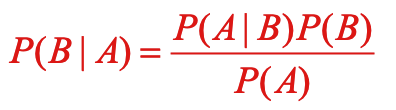
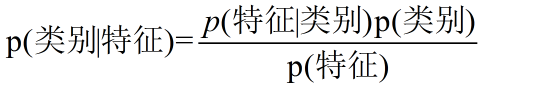
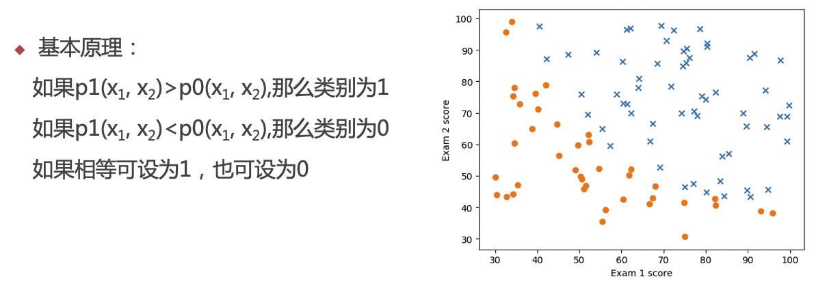
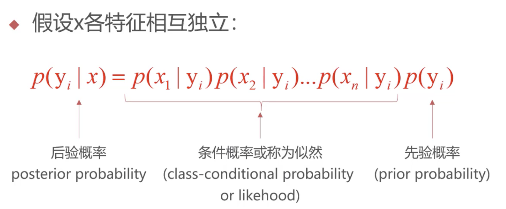
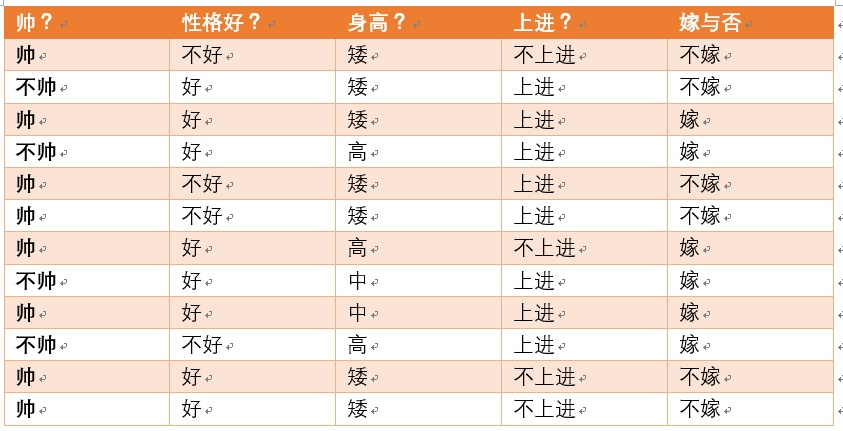
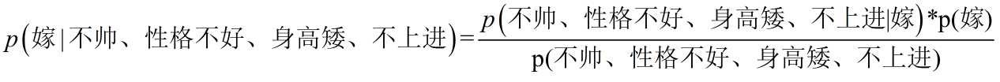

# 朴素贝叶斯 (Naive Bayes)

参考资料：https://zhuanlan.zhihu.com/p/26262151

## 贝叶斯条件概率公式

贝叶斯算法属于有监督的分类算法

## 原理

朴素贝叶斯算法是假设各个特征之间相互独立。现实生活中的特征取值非常之多。如果特征不是相互独立，最后就会导致计算量非常大，所以需要特征独立。在数据量很大的时候，根据中心极限定理，频率是等于概率的。

## 机器学习的应用

###先验概率（prior probability）：

是指根据以往经验和分析得到的概率。即没有考虑原因，在获得数据和依据之前就对概率进行了猜测，得到了概率。

###似然函数（likelihood function）：
似然用来描述已知随机变量输出结果时，未知参数的可能取值。似然函数关注的是由已知的结果和某固有属性的关系，而不是结果或者原因的概率，所以称似然是对固有属性的拟合，所以不能称之为概率。

###后验概率（Posterior probability）：
是在相关证据或者背景给定并纳入考虑之后的条件概率。是由因及果的概率。

## 通俗例子

## 朴素贝叶斯分类的优缺点

###优点：

（1） 算法逻辑简单,易于实现

（2）分类过程中时空开销小

###缺点：

理论上，朴素贝叶斯模型与其他分类方法相比具有最小的误差率。但是实际上并非总是如此，这是因为朴素贝叶斯模型假设属性之间相互独立，这个假设在实际应用中往往是不成立的，在属性个数比较多或者属性之间相关性较大时，分类效果不好。

而在属性相关性较小时，朴素贝叶斯性能最为良好。对于这一点，有半朴素贝叶斯之类的算法通过考虑部分关联性适度改进。