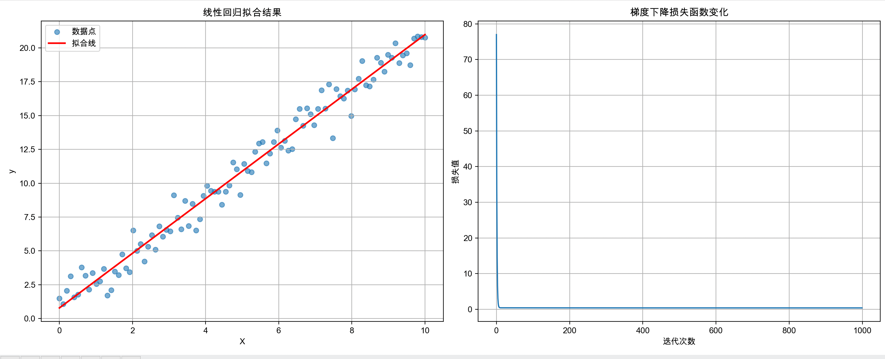

# 梯度下降


## 通俗解释


### 想象一下

你站在一座雾气很大的山顶上，想要走到山谷里最低的地方（最低点就是“最优解”）。
 但是因为雾太大，你看不清远处，只能感受到你脚下的坡度（就是“梯度”）。

------

### 梯度下降的步骤

1. **感受坡度**：你先用脚感觉一下，哪边是下坡、哪边是上坡。
    （数学里，就是计算当前位置的“梯度”）
2. **往下走一步**：你不会一下子冲下去，而是走一小步，往坡度下降的方向走。
    （这一步的大小就是“学习率”）
3. **重复这个过程**：走一步，再感受坡度，再走一步……
    （不断迭代）
4. **最终到达谷底**：当坡度几乎为零的时候，说明你走到山谷底了。
    （找到最优解）

------

### 要点

- **梯度 = 坡度** → 指示方向。
- **学习率 = 步子大小** → 步子太大可能跳过谷底，太小走得太慢。
- **下降 = 往下坡走** → 一步步逼近最低点。


### 关键名词解释

##  什么是特征矩阵？

特征矩阵就是把 **所有样本的数据** 组织成一个大表格，放在一个二维数组（矩阵）里。

- **行 (row)** → 一个样本的数据。
- **列 (column)** → 每个样本的一个特征（属性）。

| 面积 (m²) | 房间数 | 距离地铁 (km) |
| --------- | ------ | ------------- |
| 80        | 2      | 1.2           |
| 120       | 3      | 0.5           |
| 60        | 1      | 2.0           |


## 代码

```python
# -*- coding: utf-8 -*-
import numpy as np
import matplotlib.pyplot as plt
import matplotlib
matplotlib.rcParams['font.sans-serif'] = ['SimHei', 'Arial Unicode MS', 'DejaVu Sans']  # 设置中文字体
matplotlib.rcParams['axes.unicode_minus'] = False  # 解决负号显示问题

class GradientDescent:
    """
    简单的梯度下降算法实现
    用于学习线性回归的参数
    """
    
    def __init__(self, learning_rate=0.01, max_iterations=1000):
        """
        初始化梯度下降参数
        
        参数:
        learning_rate: 学习率，控制每次更新的步长
        max_iterations: 最大迭代次数
        """
        self.learning_rate = learning_rate
        self.max_iterations = max_iterations
        self.cost_history = []  # 记录每次迭代的损失值
        
    def compute_cost(self, X, y, theta):
        """
        计算损失函数（均方误差）
        
        参数:
        X: 特征矩阵 (m x n)
        y: 目标值 (m x 1)
        theta: 参数向量 (n x 1)
        
        返回:
        损失值
        """
        m = len(y)  # 样本数量
        predictions = X.dot(theta)  # 预测值
        cost = (1/(2*m)) * np.sum((predictions - y)**2)  # 均方误差
        return cost
    
    def compute_gradient(self, X, y, theta):
        """
        计算梯度
        
        参数:
        X: 特征矩阵 (m x n)
        y: 目标值 (m x 1)
        theta: 参数向量 (n x 1)
        
        返回:
        梯度向量
        """
        m = len(y)  # 样本数量
        predictions = X.dot(theta)  # 预测值
        gradient = (1/m) * X.T.dot(predictions - y)  # 梯度计算
        return gradient
    
    def fit(self, X, y):
        """
        训练模型
        
        参数:
        X: 特征矩阵 (m x n)
        y: 目标值 (m x 1)
        
        返回:
        训练好的参数 theta
        """
        # 初始化参数（全零）
        theta = np.zeros((X.shape[1], 1))
        
        print("开始梯度下降训练...")
        print(f"学习率: {self.learning_rate}")
        print(f"最大迭代次数: {self.max_iterations}")
        print("-" * 40)
        
        # 梯度下降主循环
        for i in range(self.max_iterations):
            # 计算当前损失
            cost = self.compute_cost(X, y, theta)
            self.cost_history.append(cost)
            
            # 计算梯度
            gradient = self.compute_gradient(X, y, theta)
            
            # 更新参数
            theta = theta - self.learning_rate * gradient
            
            # 每100次迭代打印一次进度
            if i % 100 == 0:
                print(f"迭代 {i}: 损失 = {cost:.6f}")
        
        print(f"训练完成！最终损失: {self.cost_history[-1]:.6f}")
        return theta
    
    def predict(self, X, theta):
        """
        使用训练好的参数进行预测
        
        参数:
        X: 特征矩阵
        theta: 训练好的参数
        
        返回:
        预测值
        """
        return X.dot(theta)
    
    def plot_cost_history(self):
        """
        绘制损失函数变化曲线
        """
        plt.figure(figsize=(10, 6))
        plt.plot(self.cost_history)
        plt.title('梯度下降损失函数变化')
        plt.xlabel('迭代次数')
        plt.ylabel('损失值')
        plt.grid(True)
        plt.show()


def generate_sample_data():
    """
    生成示例数据
    创建一个简单的线性关系: y = 2x + 1 + 噪声
    """
    np.random.seed(42)  # 设置随机种子，确保结果可重现
    
    # 生成特征数据
    X = np.linspace(0, 10, 100).reshape(-1, 1)  # 100个样本，1个特征
    
    # 生成目标数据 (y = 2x + 1 + 噪声)
    true_theta = np.array([[1], [2]])  # [截距, 斜率]
    X_with_bias = np.column_stack([np.ones(X.shape[0]), X])  # 添加偏置项
    y = X_with_bias.dot(true_theta) + np.random.normal(0, 1, X.shape[0]).reshape(-1, 1)
    
    return X_with_bias, y, true_theta


def main():
    """
    主函数：演示梯度下降的使用
    """
    print("=" * 50)
    print("梯度下降算法演示")
    print("=" * 50)
    
    # 生成示例数据
    print("1. 生成示例数据...")
    X, y, true_theta = generate_sample_data()
    print(f"数据形状: X={X.shape}, y={y.shape}")
    print(f"真实参数: 截距={true_theta[0][0]:.2f}, 斜率={true_theta[1][0]:.2f}")
    print()
    
    # 创建梯度下降对象
    print("2. 初始化梯度下降...")
    gd = GradientDescent(learning_rate=0.01, max_iterations=1000)
    print()
    
    # 训练模型
    print("3. 开始训练...")
    learned_theta = gd.fit(X, y)
    print()
    
    # 显示结果
    print("4. 训练结果:")
    print(f"学习到的参数: 截距={learned_theta[0][0]:.4f}, 斜率={learned_theta[1][0]:.4f}")
    print(f"真实参数:     截距={true_theta[0][0]:.4f}, 斜率={true_theta[1][0]:.4f}")
    print()
    
    # 计算预测误差
    predictions = gd.predict(X, learned_theta)
    mse = np.mean((predictions - y)**2)
    print(f"均方误差: {mse:.6f}")
    print()
    
    # 绘制结果
    print("5. 绘制结果...")
    
    # 创建子图
    fig, (ax1, ax2) = plt.subplots(1, 2, figsize=(15, 6))
    
    # 左图：数据点和拟合线
    ax1.scatter(X[:, 1], y, alpha=0.6, label='数据点')
    ax1.plot(X[:, 1], predictions, 'r-', linewidth=2, label='拟合线')
    ax1.set_xlabel('X')
    ax1.set_ylabel('y')
    ax1.set_title('线性回归拟合结果')
    ax1.legend()
    ax1.grid(True)
    
    # 右图：损失函数变化
    ax2.plot(gd.cost_history)
    ax2.set_xlabel('迭代次数')
    ax2.set_ylabel('损失值')
    ax2.set_title('梯度下降损失函数变化')
    ax2.grid(True)
    
    plt.tight_layout()
    plt.show()
    
    print("演示完成！")


if __name__ == "__main__":
    main()

```


打印

```
迭代 0: 损失 = 77.009240
迭代 100: 损失 = 0.427754
迭代 200: 损失 = 0.419803
迭代 300: 损失 = 0.414965
迭代 400: 损失 = 0.412023
迭代 500: 损失 = 0.410233
迭代 600: 损失 = 0.409144
迭代 700: 损失 = 0.408481
迭代 800: 损失 = 0.408078
迭代 900: 损失 = 0.407833
训练完成！最终损失: 0.407685
```


## 图片


