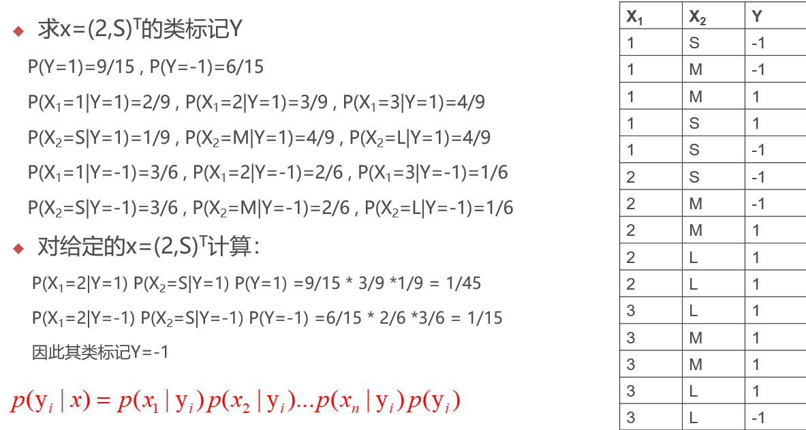

# 朴素贝叶斯 Demo

## 示例

## 代码

	# coding=utf-8
	#朴素贝叶斯原生代码实现
	import numpy as np
	
	def loaddata():
	    X = np.array([[1,'S'],[1,'M'],[1,'M'],[1,'S'],
	         [1, 'S'], [2, 'S'], [2, 'M'], [2, 'M'],
	         [2, 'L'], [2, 'L'], [3, 'L'], [3, 'M'],
	         [3, 'M'], [3, 'L'], [3, 'L']])
	    y = np.array([-1,-1,1,1,-1,-1,-1,1,1,1,1,1,1,1,-1])
	    return X, y
	
	def Train(trainset,train_labels):
	
	    m = trainset.shape[0] #数据量 15
	    n = trainset.shape[1] #特征数 2
	
	    prior_probability = {}# 先验概率 key是类别值，value是类别的概率值
	    conditional_probability ={}# 条件概率 key的构造：类别，特征,特征值
	    labels = set(train_labels) # 创造一个无序不重复函数
	
	    # 计算先验概率(此时没有除以总数据量m)
	    for label in labels:
	        prior_probability[label] = len(y[y == label])
	        #y[y == label] 输出[1 1 1 1 1 1 1 1 1], [-1 -1 -1 -1 -1 -1]
	
	    #计算条件概率，概率分子的部分（   比如P(Y=1)=9/15 的 9）
	    for i in range(m):
	        for j in range(n):
	            # key的构造：类别，特征,特征值
	            key = str(y[i])+','+str(j)+','+str(trainset[i][j])  #y,(0表示x1,1表示x2),feature的值  -1,0,1   -1,1,S    -1,0,1   -1,1,M ......
	
	            if key in conditional_probability:  #如果该数据已经出现，则计数器加1
	                conditional_probability[key] += 1
	            else:                               #如果该数据没有出现，则初始化数值为1
	                conditional_probability[key] = 1
	    #conditional_probability = {'-1,0,1': 3, '-1,1,S': 3, '-1,1,M': 2, '1,0,1': 2, '1,1,M': 4, '1,1,S': 1, '-1,0,2': 2, '1,0,2': 3, '1,1,L': 4, '1,0,3': 4, '-1,0,3': 1, '-1,1,L': 1}
	
	    conditional_probability_final = {}#因字典在循环时不能改变，故定义新字典保存值
	    for key in conditional_probability:  # key跟上面的conditional_probability内容一样
	        label = key.split(',')[0]  #  label =-1 -1 -1 1 1 1 -1 1 1 1 -1 -1
	        conditional_probability_final[key] = conditional_probability[key]/prior_probability[int(label)]  # （   比如P(Y=1)=9/15 的 9/15）
	
	    # 最终的先验概率(此时除以总数据量m)
	    for label in labels:
	        prior_probability[label] = prior_probability[label]/m  #0.6 0.4
	    return prior_probability,conditional_probability_final,labels
	
	def predict(data):
	    result={}
	    for label in train_labels_set:
	        temp=1.0
	        for j in range(len(data)):
	            key = str(label)+','+str(j)+','+str(data[j])
	            temp = temp*conditional_probability[key]
	        result[label] = temp * prior_probability[label]
	    print('result=',result)
	
	    return sorted(result.items(), key=lambda x: x[1],reverse=True)[0][0]
	
	
	X,y = loaddata()
	prior_probability,conditional_probability,train_labels_set = Train(X,y)
	
	print('prior_probability='+str(prior_probability))
	print('conditional_probability='+str(conditional_probability))
	y_hat = predict([2,'S'])
	print('y_hat=',y_hat)