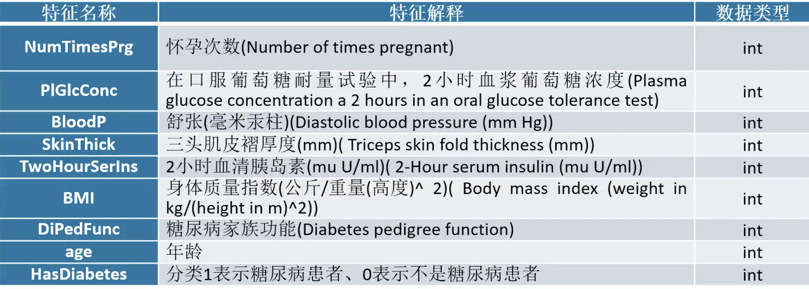
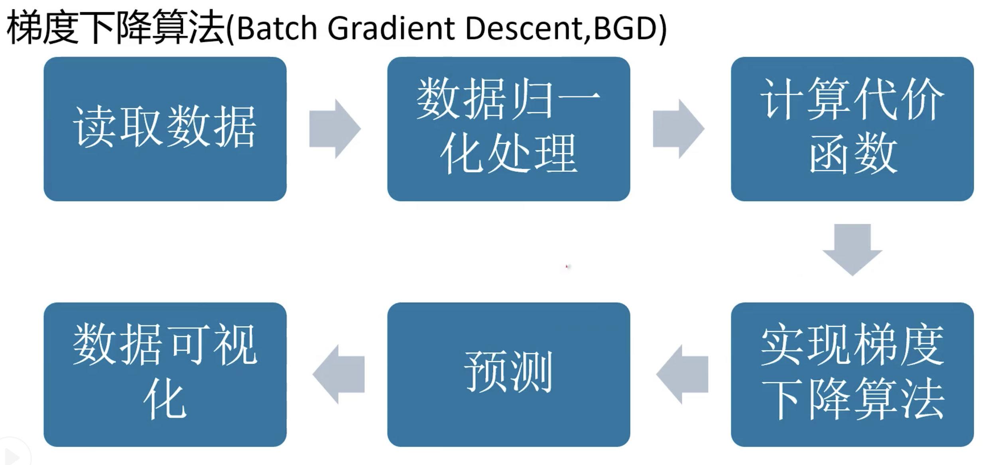
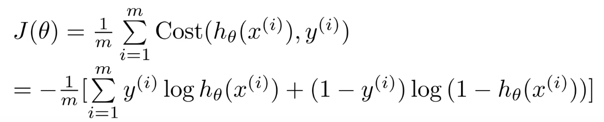
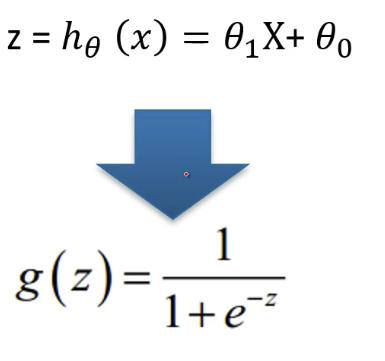
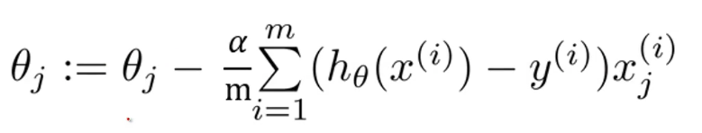

# 梯度下降算法实现逻辑回归

## 数据集

## 推导过程

## 代价函数

## Sigmoid以及theta

## 梯度下降算法

不断迭代

## 代码

	import numpy as np
	import matplotlib.pyplot as plt
	from sklearn.model_selection import train_test_split
	from sklearn.metrics import precision_score,recall_score,roc_curve,accuracy_score
	
	
	def process_data(path):
	    data = np.loadtxt(path,delimiter=",",skiprows=1,dtype=np.float)
	    X = data [:,:-1]
	    Y = data [:,-1]
	    # 数据归一化
	    mu = X.mean(0) # 每一列的平均值
	    std = X.std(0) # 每一列的标准差
	    X=(X-mu)/std # 归一化
	
	    #划分测试集及训练集
	    train_x,test_x,train_y,test_y =train_test_split(X,Y,train_size=0.7)
	    return train_x,test_x,train_y,test_y
	
	#计算sigmoid
	def sigmoid (z):
	    return 1/(1+np.exp(-z))
	
	#计算损失函数
	def computeCost(X,Y,theta):
	    h = sigmoid(np.dot(X,theta))
	    J = -(Y*np.log(h)) + (1-Y)*np.log(1-h)
	    J = J.mean()
	    return  J
	
	
	#梯度下降， alpha学习率，num_iters迭代次数
	def gradientDescent(X,Y,theta,alpha,num_iters):
	    J_history = []  # 每一次的损失值
	    m = len(X)  # 当前数据集的数量
	    for i in range(num_iters):
	        h = sigmoid(np.dot(X,theta))
	        theta= theta-alpha*np.dot(X.T,(h-Y))/m
	        J = computeCost(X,Y,theta)
	        J_history.append(J)
	        print("第%d次的损失值为：%f"%(i+1,J))
	        return theta, J_history
	
	## 主函数
	if __name__ == '__main__':
	    X_train, X_test, y_train, y_test = process_data("pima-indians-diabetes.data.csv")
	    y_train = y_train.reshape((-1, 1))  # 注意，这里一定要变为N*1的二维数组，由一维变为多维
	    y_test = y_test.reshape((-1, 1))  # 注意，这里一定要变为N*1的二维数组，由一维变为多维
	    # 2.初始化theta值
	    theta = np.ones([X_train.shape[1], 1])
	    # 3.设置初始
	    alpha = 0.03
	    num_iters = 2000
	    theta, J_history = gradientDescent(X_train, y_train, theta, alpha, num_iters)
	    # 4.预测
	    pred_y = sigmoid(np.dot(X_test, theta))
	
	    pred_y[pred_y > 0.5] = 1
	    pred_y[pred_y <= 0.5] = 0
	    print("预测准确率为：", np.sum(pred_y == y_test) / len(y_test))
	
	    plt.rcParams['font.sans-serif'] = ['SimHei']
	    plt.rcParams["axes.unicode_minus"] = False
	
	    plt.plot(np.arange(len(J_history)), J_history, c="r")
	    plt.xlabel("epoch")
	    plt.ylabel("Cost")
	    plt.show()
	
	    # 6.评价指标
	    print("准确性评价指标：", accuracy_score(y_test, pred_y))
	    print("精确率评价指标：", precision_score(y_test, pred_y))
	    print("召回率评价指标：", recall_score(y_test, pred_y))
	    # 图表展示
	    fpr, tpr, thresholds = roc_curve(y_test, pred_y)
	    plt.xlim(0, 1)  # 设定x轴的范围
	    plt.ylim(0.0, 1.1)  # 设定y轴的范围
	    plt.rcParams['font.sans-serif'] = ['SimHei']  # 显示中文标签
	    plt.rcParams['axes.unicode_minus'] = False  # 这两行需要手动设置
	    plt.title("ROC曲线")
	    plt.xlabel("假正率FPR")
	    plt.ylabel("真阳率TPR")
	    plt.plot(fpr, tpr, linewidth=2, linestyle="-", color="red")
	    plt.show()