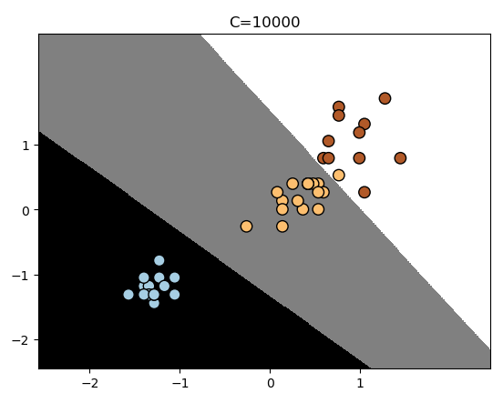

# 鸢尾花Demo

## 代码

	import numpy as np
	import pandas as pd
	import matplotlib.pyplot as plt
	from sklearn.model_selection import train_test_split
	from sklearn.linear_model import LogisticRegression
	def process_data(path):
	    data = pd.read_csv(path)
	    class_dict = {"Iris-setosa": 0, "Iris-versicolor": 1, "Iris-virginica": 2} #三种花，分别映射为种类1、2、3
	    data["species"] = data["species"].map(class_dict) # 将species这一个column按映射替换
	
	    X=data.iloc[:,2:-1]#这里暂时使用第3~4个特征(petal_length,petal_width)，为的是通过图表展示
	    y=data.iloc[:,-1] # iloc函数：通过行号来取行数据
	
	    #将X,Y转换为numpy
	    X = np.array(X,dtype=np.float)
	    y = np.array(y,dtype=np.float)
	    mu = X.mean(0)
	    std = X.std(0)
	    X = (X-mu)/std
	    X_train, X_test, y_train, y_test = train_test_split(X, y, test_size=0.3, random_state=0)
	    return X_train, X_test, y_train, y_test
	
	def plot_classifier(model,X,y):
	    x_min,x_max=min(X[:,0])-1.0,max(X[:,0])+1.0  # petal_length, +1和-1是为了扩大显示范围
	    y_min,y_max=min(X[:,1])-1.0,max(X[:,1])+1.0  # petal_width
	    step_size=0.01#设置网格数据的步长
	    #定义网格
	    x_values,y_values=np.meshgrid(np.arange(x_min,x_max,step_size),np.arange(y_min,y_max,step_size)) #np.meshgrid生成网格点坐标矩阵
	    #计算出分类器对所有数据点的分类结果
	    mesh_out = model.predict(np.c_[x_values.ravel(),y_values.ravel()])  #.ravel()表示多维的数组降为1维， np.c_是按行连接两个矩阵，就是把两矩阵左右相加，要求行数相等。
	
	    #数据维度变形
	    mesh_out = mesh_out.reshape(x_values.shape)  #mesh_out需要跟x_value的行列数量一致
	    #用彩色区域画出各个类型的边界
	    plt.figure()
	    plt.pcolormesh(x_values,y_values,mesh_out,cmap=plt.cm.gray) #cmap用来设置颜色
	    plt.scatter(X[:,0],X[:,1],c=y,s=80,edgecolors="black",linewidths=1,cmap=plt.cm.Paired)
	    plt.xlim(x_values.min(),x_values.max())
	    plt.ylim(y_values.min(),y_values.max())
	    plt.title("C=10000")
	    #设置X轴与Y轴
	    plt.xticks((np.arange(int(min(X[:,0])-1),int(max(X[:,0])+1),1.0))) #ticks表示的是刻度
	    plt.yticks((np.arange(int(min(X[:,0])-1),int(max(X[:,0])+1),1.0)))
	    plt.show()
	
	## 使用OVR方法分类
	def logisticReg_OVR(X_train, X_test, y_train, y_test):
	    log_reg=LogisticRegression() #不输入参数时，默认情况下是OVR方式
	    log_reg.fit(X_train,y_train)
	    y_pred = log_reg.predict(X_test)
	
	    # 评价指标
	    print(np.sum(y_pred==y_test)/len(y_test))
	    #绘图
	    plot_classifier(log_reg,X_test,y_test)
	
	## 使用OVO方法分类
	def logisticReg_OVO(X_train, X_test, y_train, y_test):
	    log_reg=LogisticRegression(multi_class="multinomial",solver="newton-cg",C=10000) #不输入参数时，默认情况下是OVR方式，multinomial表示是多分类，newton-cg设置OVO形式
	    log_reg.fit(X_train,y_train)
	    y_pred = log_reg.predict(X_test)
	
	    # 评价指标
	    print(np.sum(y_pred==y_test)/len(y_test))
	    #绘图
	    plot_classifier(log_reg,X_test,y_test)
	
	if __name__ == "__main__":
	    X_train, X_test, y_train, y_test=process_data("iris.txt")
	    #logisticReg_OVR(X_train, X_test, y_train, y_test)
	    logisticReg_OVO(X_train, X_test, y_train, y_test)

## 输出

	0.9777777777777777

