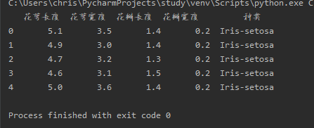
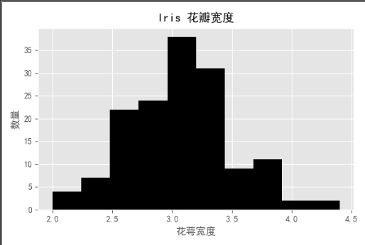
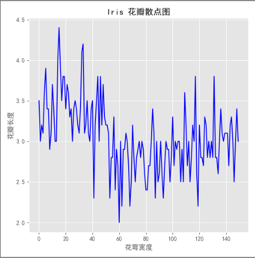

#房价预测

## 分析步骤

### 分析是否满足内存要求

	import pandas as pd
	
	housing = pd.read_csv('E:\housing/housing.csv')
	
	print(housing.info())

输出：

	<class 'pandas.core.frame.DataFrame'>
	RangeIndex: 20640 entries, 0 to 20639
	Data columns (total 10 columns):
	longitude             20640 non-null float64
	latitude              20640 non-null float64
	housing_median_age    20640 non-null float64
	total_rooms           20640 non-null float64
	total_bedrooms        20433 non-null float64
	population            20640 non-null float64
	households            20640 non-null float64
	median_income         20640 non-null float64
	median_house_value    20640 non-null float64
	ocean_proximity       20640 non-null object
	dtypes: float64(9), object(1)
	memory usage: 1.6+ MB
	None

分析memory usage来判断内存是否满足

non-null： 表示没有空项目

#### 分析数据情况
	
	import pandas as pd
	import matplotlib.pyplot as plt
	housing = pd.read_csv('E:\housing/housing.csv')
	
	print(housing.describe())
	housing = pd.read_csv('E:\housing/housing.csv')
	housing.hist(bins=50, figsize=(29,15))
	plt.show()

输出：

	          longitude      latitude  ...  median_income  median_house_value
	count  20640.000000  20640.000000  ...   20640.000000        20640.000000
	mean    -119.569704     35.631861  ...       3.870671       206855.816909
	std        2.003532      2.135952  ...       1.899822       115395.615874
	min     -124.350000     32.540000  ...       0.499900        14999.000000
	25%     -121.800000     33.930000  ...       2.563400       119600.000000
	50%     -118.490000     34.260000  ...       3.534800       179700.000000
	75%     -118.010000     37.710000  ...       4.743250       264725.000000
	max     -114.310000     41.950000  ...      15.000100       500001.000000

std： 表示方差。方差过大则需要注意是否有异常数据。需要在建模的时候处理

从图上可以先了解一下数据的一个分布情况

#### 根据地理信息可视化

	import pandas as pd
	import numpy as np
	import matplotlib.pyplot as plt
	from sklearn.model_selection import train_test_split, StratifiedKFold, StratifiedShuffleSplit
	
	# 导入数据
	housing = pd.read_csv('E:\housing/housing.csv')
	
	# 根据重要特征分离数据
	housing['income_cat'] = np.ceil(housing.median_income/1.5) # 将分布变得更加集中
	housing.income_cat.where(housing.income_cat<5, 5, inplace=True)  # 将小于5的保留，大于等于5的分为一类
	
	# 分离数据
	split = StratifiedShuffleSplit(n_splits=1, test_size=0.2, random_state=42)
	
	# 按照 housing.income_cat为比例，分离数据为测试集和训练集
	for train_index, test_index in split.split(housing, housing.income_cat):  #
	    strat_train_set = housing.loc[train_index]
	    strat_test_set = housing.loc[test_index]
	
	# 因为housing.income_cat是一个临时引入的比例，不是数据，所以需要在数据分离后去掉
	for set_ in (strat_train_set,strat_test_set):
	    set_.drop("income_cat",axis=1, inplace= True)
	
	# 根据经纬度找规律
	housing_train = strat_train_set.copy()
	housing_train.plot(kind="scatter", x="longitude",y="latitude", alpha =0.1,
	                   s = housing.population/100, label= "polulation",figsize =(10,7),
	                   c = "polulation", cmap = plt.get_cmap('jet'), colorbar=True,
	                   sharex= False
	                   )
	# s =  scalar 标量值。 housing.population/100 因为人口数量比较多，数字太大影响效果，所以除以100
	# c：颜色
	# cmap = plt.get_cmap('jet') 设置渐变色
	# sharex ： 设置是否需要共享x
	
	plt.show()

上图是地图，每一个点代表一个房产。

#### 数据相关性（单个）

	import pandas as pd
	import numpy as np
	import matplotlib.pyplot as plt
	from sklearn.model_selection import train_test_split, StratifiedKFold, StratifiedShuffleSplit
	
	# 导入数据
	housing = pd.read_csv('E:\housing/housing.csv')
	
	# 根据重要特征分离数据
	housing['income_cat'] = np.ceil(housing.median_income/1.5) # 将分布变得更加集中
	housing.income_cat.where(housing.income_cat<5, 5, inplace=True)  # 将小于5的保留，大于等于5的分为一类
	
	# 分离数据
	split = StratifiedShuffleSplit(n_splits=1, test_size=0.2, random_state=42)
	
	# 按照 housing.income_cat为比例，分离数据为测试集和训练集
	for train_index, test_index in split.split(housing, housing.income_cat):  #
	    strat_train_set = housing.loc[train_index]
	    strat_test_set = housing.loc[test_index]
	
	# 因为housing.income_cat是一个临时引入的比例，不是数据，所以需要在数据分离后去掉
	for set_ in (strat_train_set,strat_test_set):
	    set_.drop("income_cat",axis=1, inplace= True)
	
	
	# 查看数据之间的关系
	corr_matrix = housing.corr()
	relation = corr_matrix.median_house_value.sort_values(ascending= False)
	print(relation)

输出：

	median_house_value    1.000000
	median_income         0.688075
	income_cat            0.643892
	total_rooms           0.134153
	housing_median_age    0.105623
	households            0.065843
	total_bedrooms        0.049686
	population           -0.024650
	longitude            -0.045967
	latitude             -0.144160
	Name: median_house_value, dtype: float64

上面的例子以median_house_value为例，查看各个数据特征之间的关系。  **co-relation的范围是-1 到 1 。 1为相关， -1为负相关**。

#### 数据相关性（多个）

	import pandas as pd
	import numpy as np
	import matplotlib.pyplot as plt
	from sklearn.model_selection import train_test_split, StratifiedKFold, StratifiedShuffleSplit
	from pandas.plotting import  scatter_matrix
	
	# 导入数据
	housing = pd.read_csv('E:\housing/housing.csv')
	
	# 根据重要特征分离数据
	housing['income_cat'] = np.ceil(housing.median_income/1.5) # 将分布变得更加集中
	housing.income_cat.where(housing.income_cat<5, 5, inplace=True)  # 将小于5的保留，大于等于5的分为一类
	
	# 分离数据
	split = StratifiedShuffleSplit(n_splits=1, test_size=0.2, random_state=42)
	
	# 按照 housing.income_cat为比例，分离数据为测试集和训练集
	for train_index, test_index in split.split(housing, housing.income_cat):  #
	    strat_train_set = housing.loc[train_index]
	    strat_test_set = housing.loc[test_index]
	
	# 因为housing.income_cat是一个临时引入的比例，不是数据，所以需要在数据分离后去掉
	for set_ in (strat_train_set,strat_test_set):
	    set_.drop("income_cat",axis=1, inplace= True)
	
	
	#多个要素
	attributes = ["median_house_value","median_income","total_rooms","housing_median_age"]
	scatter_matrix(housing[attributes],figsize=(12,8))
	plt.show()

可以从图上看出规律。

#### 特征工程

特征工程是指按照业务需要可以自己造数据要素

	import pandas as pd
	import numpy as np
	import matplotlib.pyplot as plt
	from sklearn.model_selection import train_test_split, StratifiedKFold, StratifiedShuffleSplit
	from pandas.plotting import  scatter_matrix
	
	# 导入数据
	housing = pd.read_csv('E:\housing/housing.csv')
	
	# 根据重要特征分离数据
	housing['income_cat'] = np.ceil(housing.median_income/1.5) # 将分布变得更加集中
	housing.income_cat.where(housing.income_cat<5, 5, inplace=True)  # 将小于5的保留，大于等于5的分为一类
	
	# 分离数据
	split = StratifiedShuffleSplit(n_splits=1, test_size=0.2, random_state=42)
	
	# 按照 housing.income_cat为比例，分离数据为测试集和训练集
	for train_index, test_index in split.split(housing, housing.income_cat):  #
	    strat_train_set = housing.loc[train_index]
	    strat_test_set = housing.loc[test_index]
	
	# 因为housing.income_cat是一个临时引入的比例，不是数据，所以需要在数据分离后去掉
	for set_ in (strat_train_set,strat_test_set):
	    set_.drop("income_cat",axis=1, inplace= True)
	
	
	# 特征工程
	housing["roons_per_household"] =housing.total_rooms/housing.households #家庭平均房间数
	housing["bedrooms_per_room"] = housing.total_bedrooms/housing.total_rooms # 卧室占比
	housing["population_per_household"] = housing.population/housing.households # 家庭平均人数
	
	#计算相关性
	corr_matrix = housing.corr()
	relation = corr_matrix.median_house_value.sort_values(ascending=False)
	print(relation)
	

输出：

	median_house_value          1.000000
	median_income               0.688075
	income_cat                  0.643892
	roons_per_household         0.151948
	total_rooms                 0.134153
	housing_median_age          0.105623
	households                  0.065843
	total_bedrooms              0.049686
	population_per_household   -0.023737
	population                 -0.024650
	longitude                  -0.045967
	latitude                   -0.144160
	bedrooms_per_room          -0.255880
	Name: median_house_value, dtype: float64

#### 数据标签

将验证集的数据分为两部分：x和y。x是数据特征，y是预测数据。

	import pandas as pd
	import numpy as np
	import matplotlib.pyplot as plt
	from sklearn.model_selection import train_test_split, StratifiedKFold, StratifiedShuffleSplit
	from pandas.plotting import  scatter_matrix
	
	# 导入数据
	housing = pd.read_csv('E:\housing/housing.csv')
	
	# 根据重要特征分离数据
	housing['income_cat'] = np.ceil(housing.median_income/1.5) # 将分布变得更加集中
	housing.income_cat.where(housing.income_cat<5, 5, inplace=True)  # 将小于5的保留，大于等于5的分为一类
	
	# 分离数据
	split = StratifiedShuffleSplit(n_splits=1, test_size=0.2, random_state=42)
	
	# 按照 housing.income_cat为比例，分离数据为测试集和训练集
	for train_index, test_index in split.split(housing, housing.income_cat):  #
	    strat_train_set = housing.loc[train_index]
	    strat_test_set = housing.loc[test_index]
	
	# 因为housing.income_cat是一个临时引入的比例，不是数据，所以需要在数据分离后去掉
	for set_ in (strat_train_set,strat_test_set):
	    set_.drop("income_cat",axis=1, inplace= True)
	
	
	# 特征工程
	housing["roons_per_household"] =housing.total_rooms/housing.households #家庭平均房间数
	housing["bedrooms_per_room"] = housing.total_bedrooms/housing.total_rooms # 卧室占比
	housing["population_per_household"] = housing.population/housing.households # 家庭平均人数
	
	#s数据和标签
	housing = strat_test_set.drop("median_house_value",axis=1) #数据特征
	housing_labels = strat_test_set.median_house_value.copy() #预测数据

#### 数据清洗

常见有两种方法：1.直接删除有空值的行， 2，用中位数填充。 推荐使用中位数方法

	import pandas as pd
	import numpy as np
	import matplotlib.pyplot as plt
	from sklearn.model_selection import train_test_split, StratifiedKFold, StratifiedShuffleSplit
	from pandas.plotting import  scatter_matrix
	
	# 导入数据
	housing = pd.read_csv('E:\housing/housing.csv')
	
	# 根据重要特征分离数据
	housing['income_cat'] = np.ceil(housing.median_income/1.5) # 将分布变得更加集中
	housing.income_cat.where(housing.income_cat<5, 5, inplace=True)  # 将小于5的保留，大于等于5的分为一类
	
	# 分离数据
	split = StratifiedShuffleSplit(n_splits=1, test_size=0.2, random_state=42)
	
	# 按照 housing.income_cat为比例，分离数据为测试集和训练集
	for train_index, test_index in split.split(housing, housing.income_cat):  #
	    strat_train_set = housing.loc[train_index]
	    strat_test_set = housing.loc[test_index]
	
	# 因为housing.income_cat是一个临时引入的比例，不是数据，所以需要在数据分离后去掉
	for set_ in (strat_train_set,strat_test_set):
	    set_.drop("income_cat",axis=1, inplace= True)
	
	
	# 特征工程
	housing["roons_per_household"] =housing.total_rooms/housing.households #家庭平均房间数
	housing["bedrooms_per_room"] = housing.total_bedrooms/housing.total_rooms # 卧室占比
	housing["population_per_household"] = housing.population/housing.households # 家庭平均人数
	
	#s数据和标签
	housing = strat_test_set.drop("median_house_value",axis=1)
	housing_labels = strat_test_set.median_house_value.copy()
	
	# 数据清洗
	## 方法一：删掉所有空值的列,使用dropna()方法
	
	## 方法二：用中位数填充空值
	median = housing.total_bedrooms.median()
	housing_clean = housing.copy()
	housing_clean.total_bedrooms.fillna(median,inplace=True)
	
	## 其他操作： 将不能处理的行drop掉
	housing_clean = housing_clean.drop('ocean_proximity',axis=1)

#### 文本清理

文本类的数据无法放在模型中，需要处理为数字。以ocean_proximity参数为例：

	print(housing_clean.ocean_proximity.value_counts() )

得到

	<1H OCEAN     1860
	INLAND        1288
	NEAR OCEAN     534
	NEAR BAY       443
	ISLAND           3

使用One-hot 独占码，将文本类种类分为数字

	import pandas as pd
	import numpy as np
	import matplotlib.pyplot as plt
	from sklearn.model_selection import train_test_split, StratifiedKFold, StratifiedShuffleSplit
	from pandas.plotting import  scatter_matrix
	from sklearn.preprocessing import  OneHotEncoder
	
	# 导入数据
	housing = pd.read_csv('E:\housing/housing.csv')
	
	# 根据重要特征分离数据
	housing['income_cat'] = np.ceil(housing.median_income/1.5) # 将分布变得更加集中
	housing.income_cat.where(housing.income_cat<5, 5, inplace=True)  # 将小于5的保留，大于等于5的分为一类
	
	# 分离数据
	split = StratifiedShuffleSplit(n_splits=1, test_size=0.2, random_state=42)
	
	# 按照 housing.income_cat为比例，分离数据为测试集和训练集
	for train_index, test_index in split.split(housing, housing.income_cat):  #
	    strat_train_set = housing.loc[train_index]
	    strat_test_set = housing.loc[test_index]
	
	# 因为housing.income_cat是一个临时引入的比例，不是数据，所以需要在数据分离后去掉
	for set_ in (strat_train_set,strat_test_set):
	    set_.drop("income_cat",axis=1, inplace= True)
	
	
	# 特征工程
	housing["roons_per_household"] =housing.total_rooms/housing.households #家庭平均房间数
	housing["bedrooms_per_room"] = housing.total_bedrooms/housing.total_rooms # 卧室占比
	housing["population_per_household"] = housing.population/housing.households # 家庭平均人数
	
	#s数据和标签
	housing = strat_test_set.drop("median_house_value",axis=1)
	housing_labels = strat_test_set.median_house_value.copy()
	
	# 数据清洗
	## 方法一：删掉所有空值的列,使用dropna()方法
	
	## 方法二：用中位数填充空值
	median = housing.total_bedrooms.median()
	housing_clean = housing.copy()
	housing_clean.total_bedrooms.fillna(median,inplace=True)
	
	## 数据清洗之文本处理、
	
	### 将文本分成[0,1,0...]等one-hot独热码
	housing_cat = housing.ocean_proximity
	housing_cat_encoded, housing_categories = housing_cat.factorize()
	encoder = OneHotEncoder(categories='auto')
	housing_cat_1hot=encoder.fit_transform(housing_cat_encoded.reshape(-1,1))  # （-1.1）表示行不知道，列为1

#### 特征组合

	import pandas as pd
	import numpy as np
	import matplotlib.pyplot as plt
	from sklearn.model_selection import train_test_split, StratifiedKFold, StratifiedShuffleSplit
	from pandas.plotting import  scatter_matrix
	from sklearn.preprocessing import  OneHotEncoder
	from sklearn.base import BaseEstimator,TransformerMixin  #特征组合用
	
	# 导入数据
	housing = pd.read_csv('E:\housing/housing.csv')
	
	# 根据重要特征分离数据
	housing['income_cat'] = np.ceil(housing.median_income/1.5) # 将分布变得更加集中
	housing.income_cat.where(housing.income_cat<5, 5, inplace=True)  # 将小于5的保留，大于等于5的分为一类
	
	# 分离数据
	split = StratifiedShuffleSplit(n_splits=1, test_size=0.2, random_state=42)
	
	# 按照 housing.income_cat为比例，分离数据为测试集和训练集
	for train_index, test_index in split.split(housing, housing.income_cat):  #
	    strat_train_set = housing.loc[train_index]
	    strat_test_set = housing.loc[test_index]
	
	# 因为housing.income_cat是一个临时引入的比例，不是数据，所以需要在数据分离后去掉
	for set_ in (strat_train_set,strat_test_set):
	    set_.drop("income_cat",axis=1, inplace= True)
	
	# 特征组合
	##从colomn 0开始取下标
	rooms_ix = 3 # 第4列
	bedroom_ix = 4
	population_ix = 5
	household_ix =6
	
	class CombineFeature(BaseEstimator,TransformerMixin):
	    def __init__(self,add_bedroom_per_room = True):  #构造函数, 默认add_bedroom_per_room这个参数是True
	        self.add_bedroom_per_room = add_bedroom_per_room
	    def fit(self,X,y=None):
	        return self
	    def transform(self,X,y=None):
	        rooms_per_household = X[:,rooms_ix]/X[:,household_ix]
	        population_per_household = X[:,population_ix]/X[:,household_ix]
	        if self.add_bedroom_per_room:
	            bedroom_per_room = X[:,bedroom_ix]/X[:,rooms_ix]
	            return np.c_[X,rooms_per_household,population_per_household,
	                         bedroom_per_room]
	        else:
	            return np.c_[X,rooms_per_household,population_per_household]
	
	combine_feature = CombineFeature(add_bedroom_per_room=False)
	housing_add_feature = combine_feature.transform(housing.values)
	
	housing_add_feature = pd.DataFrame(housing_add_feature,columns=list(housing.columns)+["rooms_per_household","population_per_household"])
	print(housing_add_feature.head())

#### 管道操作

将多个步骤封装好

	import pandas as pd
	import numpy as np
	import matplotlib.pyplot as plt
	from sklearn.model_selection import train_test_split, StratifiedKFold, StratifiedShuffleSplit
	from pandas.plotting import  scatter_matrix
	from sklearn.preprocessing import OneHotEncoder, Imputer
	from sklearn.base import BaseEstimator,TransformerMixin  #特征组合用
	from sklearn.pipeline import Pipeline
	from sklearn.preprocessing import StandardScaler
	
	# 导入数据
	housing = pd.read_csv('E:\housing/housing.csv')
	
	# 根据重要特征分离数据
	housing['income_cat'] = np.ceil(housing.median_income/1.5) # 将分布变得更加集中
	housing.income_cat.where(housing.income_cat<5, 5, inplace=True)  # 将小于5的保留，大于等于5的分为一类
	
	# 分离数据
	split = StratifiedShuffleSplit(n_splits=1, test_size=0.2, random_state=42)
	
	# 按照 housing.income_cat为比例，分离数据为测试集和训练集
	for train_index, test_index in split.split(housing, housing.income_cat):  #
	    strat_train_set = housing.loc[train_index]
	    strat_test_set = housing.loc[test_index]
	
	# 因为housing.income_cat是一个临时引入的比例，不是数据，所以需要在数据分离后去掉
	for set_ in (strat_train_set,strat_test_set):
	    set_.drop("income_cat",axis=1, inplace= True)
	
	
	# 特征工程
	housing["roons_per_household"] =housing.total_rooms/housing.households #家庭平均房间数
	housing["bedrooms_per_room"] = housing.total_bedrooms/housing.total_rooms # 卧室占比
	housing["population_per_household"] = housing.population/housing.households # 家庭平均人数
	
	#s数据和标签
	housing = strat_test_set.drop("median_house_value",axis=1)
	housing_labels = strat_test_set.median_house_value.copy()
	
	# 数据清洗
	## 方法一：删掉所有空值的列,使用dropna()方法
	
	## 方法二：用中位数填充空值
	median = housing.total_bedrooms.median()
	housing_clean = housing.copy()
	housing_clean.total_bedrooms.fillna(median,inplace=True)
	
	## 数据清洗之文本处理、
	
	### 将文本分成[0,1,0...]等one-hot独热码
	housing_cat = housing.ocean_proximity
	housing_cat_encoded, housing_categories = housing_cat.factorize()
	encoder = OneHotEncoder(categories='auto')
	housing_cat_1hot=encoder.fit_transform(housing_cat_encoded.reshape(-1,1))  # （-1.1）表示行不知道，列为1
	
	# 特征组合
	##从colomn 0开始取下标
	rooms_ix = 3 # 第4列
	bedroom_ix = 4
	population_ix = 5
	household_ix =6
	
	class CombineFeature(BaseEstimator,TransformerMixin):
	    def __init__(self,add_bedroom_per_room = True):  #构造函数, 默认add_bedroom_per_room这个参数是True
	        self.add_bedroom_per_room = add_bedroom_per_room
	    def fit(self,X,y=None):
	        return self
	    def transform(self,X,y=None):
	        rooms_per_household = X[:,rooms_ix]/X[:,household_ix]
	        population_per_household = X[:,population_ix]/X[:,household_ix]
	        if self.add_bedroom_per_room:
	            bedroom_per_room = X[:,bedroom_ix]/X[:,rooms_ix]
	            return np.c_[X,rooms_per_household,population_per_household,
	                         bedroom_per_room]
	        else:
	            return np.c_[X,rooms_per_household,population_per_household]
	
	combine_feature = CombineFeature(add_bedroom_per_room=False)
	housing_add_feature = combine_feature.transform(housing.values)
	
	housing_add_feature = pd.DataFrame(housing_add_feature,columns=list(housing.columns)+["rooms_per_household","population_per_household"])
	print(housing_add_feature.head())
	
	# Pipeline
	housing_num  = housing.drop("ocean_proximity",axis=1)
	
	num_pipeline = Pipeline([
	        ('imputer', Imputer(strategy="median")),
	        ('feature_combine', CombineFeature()),
	        ('std_scaler', StandardScaler()),
	    ])
	
	housing_num_tr = num_pipeline.fit_transform(housing_num)
	print(housing_num_tr)
	
	# Create a class to select numerical or categorical columns \n",
	# since Scikit-Learn doesn't handle DataFrames yet\n",
	class DataFrameSelector(BaseEstimator, TransformerMixin):
	    def __init__(self, feature_names):
	        self.feature_names = feature_names
	    def fit(self, X, y=None):
	        return self
	    def transform(self, X):
	        return X[self.feature_names].values
	
	
	from sklearn.base import BaseEstimator, TransformerMixin
	from sklearn.utils import check_array
	from sklearn.preprocessing import LabelEncoder
	from scipy import sparse
	
	class CategoricalEncoder(BaseEstimator, TransformerMixin):
	    def __init__(self, encoding='onehot', categories='auto', dtype=np.float64,
	                 handle_unknown='error'):
	        self.encoding = encoding
	        self.categories = categories
	        self.dtype = dtype
	        self.handle_unknown = handle_unknown
	
	    def fit(self, X, y=None):
	
	        if self.encoding not in ['onehot', 'onehot-dense', 'ordinal']:
	            template = ("encoding should be either 'onehot', 'onehot-dense' "
	                        "or 'ordinal', got %s")
	            raise ValueError(template % self.handle_unknown)
	
	        if self.handle_unknown not in ['error', 'ignore']:
	            template = ("handle_unknown should be either 'error' or "
	                        "'ignore', got %s")
	            raise ValueError(template % self.handle_unknown)
	
	        if self.encoding == 'ordinal' and self.handle_unknown == 'ignore':
	            raise ValueError("handle_unknown='ignore' is not supported for"
	                             " encoding='ordinal'")
	
	        X = check_array(X, dtype=np.object, accept_sparse='csc', copy=True)
	        n_samples, n_features = X.shape
	
	        self._label_encoders_ = [LabelEncoder() for _ in range(n_features)]
	
	        for i in range(n_features):
	            le = self._label_encoders_[i]
	            Xi = X[:, i]
	            if self.categories == 'auto':
	                le.fit(Xi)
	            else:
	                valid_mask = np.in1d(Xi, self.categories[i])
	                if not np.all(valid_mask):
	                    if self.handle_unknown == 'error':
	                        diff = np.unique(Xi[~valid_mask])
	                        msg = ("Found unknown categories {0} in column {1}"
	                               " during fit".format(diff, i))
	                        raise ValueError(msg)
	                le.classes_ = np.array(np.sort(self.categories[i]))
	
	        self.categories_ = [le.classes_ for le in self._label_encoders_]
	
	        return self
	
	    def transform(self, X):
	        X = check_array(X, accept_sparse='csc', dtype=np.object, copy=True)
	        n_samples, n_features = X.shape
	        X_int = np.zeros_like(X, dtype=np.int)
	        X_mask = np.ones_like(X, dtype=np.bool)
	
	        for i in range(n_features):
	            valid_mask = np.in1d(X[:, i], self.categories_[i])
	
	            if not np.all(valid_mask):
	                if self.handle_unknown == 'error':
	                    diff = np.unique(X[~valid_mask, i])
	                    msg = ("Found unknown categories {0} in column {1}"
	                           " during transform".format(diff, i))
	                    raise ValueError(msg)
	                else:
	                    # Set the problematic rows to an acceptable value and
	                    # continue `The rows are marked `X_mask` and will be
	                    # removed later.
	                    X_mask[:, i] = valid_mask
	                    X[:, i][~valid_mask] = self.categories_[i][0]
	            X_int[:, i] = self._label_encoders_[i].transform(X[:, i])
	
	        if self.encoding == 'ordinal':
	            return X_int.astype(self.dtype, copy=False)
	
	        mask = X_mask.ravel()
	        n_values = [cats.shape[0] for cats in self.categories_]
	        n_values = np.array([0] + n_values)
	        indices = np.cumsum(n_values)
	
	        column_indices = (X_int + indices[:-1]).ravel()[mask]
	        row_indices = np.repeat(np.arange(n_samples, dtype=np.int32),
	                                n_features)[mask]
	        data = np.ones(n_samples * n_features)[mask]
	
	        out = sparse.csc_matrix((data, (row_indices, column_indices)),
	                                shape=(n_samples, indices[-1]),
	                                dtype=self.dtype).tocsr()
	        if self.encoding == 'onehot-dense':
	            return out.toarray()
	        else:
	            return out
	
	
	num_attribs = list(housing_num)
	cat_attribs = ["ocean_proximity"]
	
	num_pipeline = Pipeline([
	        ('selector', DataFrameSelector(num_attribs)),
	        ('imputer', Imputer(strategy="median")),
	        ('feature_add', CombineFeature()),
	        ('std_scaler', StandardScaler()),
	    ])
	
	cat_pipeline = Pipeline([
	        ('selector', DataFrameSelector(cat_attribs)),
	        ('cat_encoder', CategoricalEncoder(encoding="onehot-dense")),
	    ])

#### 线性回归

	import pandas as pd
	import numpy as np
	from sklearn.model_selection import train_test_split, StratifiedKFold, StratifiedShuffleSplit
	from sklearn.preprocessing import OneHotEncoder
	from sklearn.impute import SimpleImputer
	from sklearn.pipeline import Pipeline
	from sklearn.preprocessing import StandardScaler
	from sklearn.linear_model import LinearRegression
	from sklearn.pipeline import FeatureUnion
	from sklearn.base import BaseEstimator, TransformerMixin
	from sklearn.utils import check_array
	from sklearn.preprocessing import LabelEncoder
	from scipy import sparse
	from sklearn import metrics
	
	
	# 导入数据
	housing = pd.read_csv('E:\housing/housing.csv')
	
	# 根据重要特征分离数据
	housing['income_cat'] = np.ceil(housing.median_income/1.5) # 将分布变得更加集中
	housing.income_cat.where(housing.income_cat<5, 5, inplace=True)  # 将小于5的保留，大于等于5的分为一类
	
	# 分离数据
	split = StratifiedShuffleSplit(n_splits=1, test_size=0.2, random_state=42)
	
	# 按照 housing.income_cat为比例，分离数据为测试集和训练集
	for train_index, test_index in split.split(housing, housing.income_cat):  #
	    strat_train_set = housing.loc[train_index]
	    strat_test_set = housing.loc[test_index]
	
	# 因为housing.income_cat是一个临时引入的比例，不是数据，所以需要在数据分离后去掉
	for set_ in (strat_train_set,strat_test_set):
	    set_.drop("income_cat",axis=1, inplace= True)
	
	
	# 特征工程
	housing["roons_per_household"] =housing.total_rooms/housing.households #家庭平均房间数
	housing["bedrooms_per_room"] = housing.total_bedrooms/housing.total_rooms # 卧室占比
	housing["population_per_household"] = housing.population/housing.households # 家庭平均人数
	
	#s数据和标签
	housing = strat_test_set.drop("median_house_value",axis=1)  #median_house_value是predict数据，所以需要drop掉
	housing_labels = strat_test_set.median_house_value.copy()
	
	# 数据清洗
	##用中位数填充空值
	median = housing.total_bedrooms.median()
	housing_clean = housing.copy()
	housing_clean.total_bedrooms.fillna(median,inplace=True)
	
	# 特征组合
	##从colomn 0开始取下标
	rooms_ix = 3 # 第4列
	bedroom_ix = 4
	population_ix = 5
	household_ix =6
	
	class CombineFeature(BaseEstimator,TransformerMixin):
	    def __init__(self,add_bedroom_per_room = True):  #构造函数, 默认add_bedroom_per_room这个参数是True
	        self.add_bedroom_per_room = add_bedroom_per_room
	    def fit(self,X,y=None):
	        return self
	    def transform(self,X,y=None):
	        rooms_per_household = X[:,rooms_ix]/X[:,household_ix]
	        population_per_household = X[:,population_ix]/X[:,household_ix]
	        if self.add_bedroom_per_room:
	            bedroom_per_room = X[:,bedroom_ix]/X[:,rooms_ix]
	            return np.c_[X,rooms_per_household,population_per_household,  #np.r_是按列连接两个矩阵，就是把两矩阵上下相加，要求列数相等
	                         bedroom_per_room]
	        else:
	            return np.c_[X,rooms_per_household,population_per_household]
	
	# 管道Pipeline
	
	## Create a class to select numerical or categorical columns \n",
	## since Scikit-Learn doesn't handle DataFrames yet\n",
	class DataFrameSelector(BaseEstimator, TransformerMixin):
	    def __init__(self, feature_names):
	        self.feature_names = feature_names
	    def fit(self, X, y=None):
	        return self
	    def transform(self, X):
	        return X[self.feature_names].values
	
	
	class CategoricalEncoder(BaseEstimator, TransformerMixin):
	    def __init__(self, encoding='onehot', categories='auto', dtype=np.float64,
	                 handle_unknown='error'):
	        self.encoding = encoding
	        self.categories = categories
	        self.dtype = dtype
	        self.handle_unknown = handle_unknown
	
	    def fit(self, X, y=None):
	
	        if self.encoding not in ['onehot', 'onehot-dense', 'ordinal']:
	            template = ("encoding should be either 'onehot', 'onehot-dense' "
	                        "or 'ordinal', got %s")
	            raise ValueError(template % self.handle_unknown)
	
	        if self.handle_unknown not in ['error', 'ignore']:
	            template = ("handle_unknown should be either 'error' or "
	                        "'ignore', got %s")
	            raise ValueError(template % self.handle_unknown)
	
	        if self.encoding == 'ordinal' and self.handle_unknown == 'ignore':
	            raise ValueError("handle_unknown='ignore' is not supported for"
	                             " encoding='ordinal'")
	
	        X = check_array(X, dtype=np.object, accept_sparse='csc', copy=True)
	        n_samples, n_features = X.shape
	
	        self._label_encoders_ = [LabelEncoder() for _ in range(n_features)]
	
	        for i in range(n_features):
	            le = self._label_encoders_[i]
	            Xi = X[:, i]
	            if self.categories == 'auto':
	                le.fit(Xi)
	            else:
	                valid_mask = np.in1d(Xi, self.categories[i])
	                if not np.all(valid_mask):
	                    if self.handle_unknown == 'error':
	                        diff = np.unique(Xi[~valid_mask])
	                        msg = ("Found unknown categories {0} in column {1}"
	                               " during fit".format(diff, i))
	                        raise ValueError(msg)
	                le.classes_ = np.array(np.sort(self.categories[i]))
	
	        self.categories_ = [le.classes_ for le in self._label_encoders_]
	
	        return self
	
	    def transform(self, X):
	        X = check_array(X, accept_sparse='csc', dtype=np.object, copy=True)
	        n_samples, n_features = X.shape
	        X_int = np.zeros_like(X, dtype=np.int)
	        X_mask = np.ones_like(X, dtype=np.bool)
	
	        for i in range(n_features):
	            valid_mask = np.in1d(X[:, i], self.categories_[i])
	
	            if not np.all(valid_mask):
	                if self.handle_unknown == 'error':
	                    diff = np.unique(X[~valid_mask, i])
	                    msg = ("Found unknown categories {0} in column {1}"
	                           " during transform".format(diff, i))
	                    raise ValueError(msg)
	                else:
	                    # Set the problematic rows to an acceptable value and
	                    # continue `The rows are marked `X_mask` and will be
	                    # removed later.
	                    X_mask[:, i] = valid_mask
	                    X[:, i][~valid_mask] = self.categories_[i][0]
	            X_int[:, i] = self._label_encoders_[i].transform(X[:, i])
	
	        if self.encoding == 'ordinal':
	            return X_int.astype(self.dtype, copy=False)
	
	        mask = X_mask.ravel()
	        n_values = [cats.shape[0] for cats in self.categories_]
	        n_values = np.array([0] + n_values)
	        indices = np.cumsum(n_values)
	
	        column_indices = (X_int + indices[:-1]).ravel()[mask]
	        row_indices = np.repeat(np.arange(n_samples, dtype=np.int32),
	                                n_features)[mask]
	        data = np.ones(n_samples * n_features)[mask]
	
	        out = sparse.csc_matrix((data, (row_indices, column_indices)),
	                                shape=(n_samples, indices[-1]),
	                                dtype=self.dtype).tocsr()
	        if self.encoding == 'onehot-dense':
	            return out.toarray()
	        else:
	            return out
	
	
	housing_num  = housing.drop("ocean_proximity",axis=1) # housing_num:只包含数字的数据
	num_attribs = list(housing_num)  #纯数字的数据特征 ['longitude', 'latitude', 'housing_median_age', 'total_rooms', 'total_bedrooms', 'population', 'households', 'median_income']
	cat_attribs = ["ocean_proximity"]
	
	# 带数字的列的处理方法
	num_pipeline = Pipeline([
	        ('selector', DataFrameSelector(num_attribs)), # 将对应的列选中
	        ('imputer', SimpleImputer(strategy="median")), # 将空值用中位数填充
	        ('feature_add', CombineFeature()), # 组合特征
	        ('std_scaler', StandardScaler()), # 数据标准化：用的标准化方式是,减去平均值，然后通过标准差映射到均至为0的空间内。
	    ])
	
	# 带数字的列的处理方法
	cat_pipeline = Pipeline([
	        ('selector', DataFrameSelector(cat_attribs)),
	        ('cat_encoder', CategoricalEncoder(encoding="onehot-dense")), #转换为one hot
	    ])
	
	# 总体调度
	full_pipeline = FeatureUnion(transformer_list=[
	        ("num_pipeline", num_pipeline),
	        ("cat_pipeline", cat_pipeline),
	    ])
	
	housing_prepared = full_pipeline.fit_transform(housing)
	
	# 建模（线性回归）
	lin_reg = LinearRegression()
	lin_reg.fit(housing_prepared, housing_labels)
	
	
	# 简单验证
	some_data =housing.iloc[:5]
	some_data_labels = housing_labels[:5]
	some_data_prepatred = full_pipeline.transform(some_data)
	
	from sklearn.metrics import  mean_squared_error
	housing_prediction = lin_reg.predict(housing_prepared)
	lin_mse = mean_squared_error(housing_prediction, housing_labels)
	print(lin_mse)

输出：

4460398509.296077

MSE太大，证明这个模型不好

