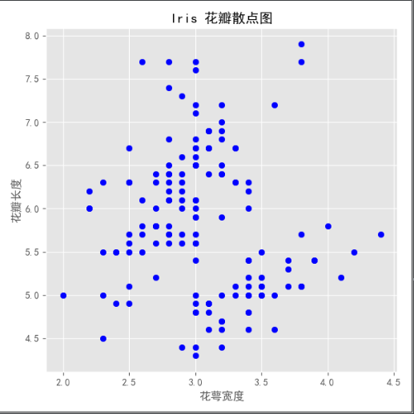
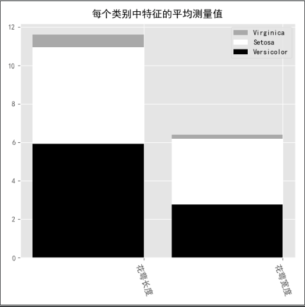

# 识别手写数字

## 导入数据

	from sklearn.datasets import fetch_openml
	import matplotlib
	import matplotlib.pyplot as plt
	
	# 导入样本数据
	mnist= fetch_openml("mnist_784") # 加载 mnist数据集
	
	X = mnist['data'] # 手写数字
	Y = mnist['target']  # 标签
	
	mnist.data.shape #(70000, 784)   70000张图，784是每个图像的面积
	
	#测试样本数据
	digit = X[600]
	digit_iamge = digit.reshape(28,28) # 28*28 = 784，将面积转换为一个矩形，用于展示图片
	plt.imshow(digit_iamge,cmap= matplotlib.cm.binary, interpolation="nearest")
	plt.show()

## 测试集和训练集

	from sklearn.datasets import fetch_openml
	import numpy as np
	
	# 导入样本数据
	mnist= fetch_openml("mnist_784") # 加载 mnist数据集
	
	X = mnist['data'] # 手写数字, 是一个矩阵
	y = mnist['target']  # 标签，是一列
	
	# 测试集和训练集
	X_train, X_test = X[:60000], X[60000:]
	y_train, y_test = y[:60000], y[60000:]
	shuffle_index = np.random.permutation(60000)
	X_train= X_train[shuffle_index]
	y_train= y_train[shuffle_index

## 二分类问题

	from sklearn.datasets import fetch_openml
	import numpy as np
	import matplotlib
	import matplotlib.pyplot as plt
	
	# 导入样本数据
	mnist = fetch_openml('mnist_784', version=1) # 加载 mnist数据集
	
	X = mnist['data'] # 手写数字, 是一个矩阵
	y = mnist['target']  # 标签，是一列
	y = y.astype(np.uint8) # 可以看到这个label的数值是 string，我们需要将它们转换成int：
	
	# 测试集和训练集
	X_train, X_test, y_train, y_test = X[:60000], X[60000:], y[:60000], y[60000:] #该数据集已经做过shuffle，所以不需要再做处理
	
	# 二分类问题
	y_train_5 = (y_train == 5)
	y_test_5 = (y_test == 5)
	
	from sklearn.linear_model import SGDClassifier
	
	sgd_clf = SGDClassifier(random_state=42)
	sgd_clf.fit(X_train, y_train_5)
	
	ans = sgd_clf.predict([X_test[0], X_test[1], X_test[2]]) #测试这几个手写体是不是5
	print(ans)

输出：

	[False False False]

## Confusion Matrics 混淆矩阵

以预测数字5为例：

只有Ture negative 和 Ture Positive是预测准确的

	from sklearn.datasets import fetch_openml
	import numpy as np
	import matplotlib
	import matplotlib.pyplot as plt
	
	# 导入样本数据
	mnist = fetch_openml('mnist_784', version=1) # 加载 mnist数据集
	
	X = mnist['data'] # 手写数字, 是一个矩阵
	y = mnist['target']  # 标签，是一列
	y = y.astype(np.uint8) # 可以看到这个label的数值是 string，我们需要将它们转换成int：
	
	# 测试集和训练集
	X_train, X_test, y_train, y_test = X[:60000], X[60000:], y[:60000], y[60000:] #该数据集已经做过shuffle，所以不需要再做处理
	
	# 二分类问题
	y_train_5 = (y_train == 5)
	y_test_5 = (y_test == 5)
	
	from sklearn.linear_model import SGDClassifier
	
	sgd_clf = SGDClassifier(random_state=42)
	sgd_clf.fit(X_train, y_train_5)
	
	binary_prediect = sgd_clf.predict([X_test[0], X_test[1], X_test[2]]) #测试这几个手写体是不是5
	
	# 交叉验证评估模型
	from sklearn.model_selection import cross_val_score
	cv_score = cross_val_score(sgd_clf, X_train,y_train_5, cv=3,scoring="accuracy") # cv是指做cross validation的次数
	
	# 混淆模型
	from sklearn.model_selection import cross_val_predict
	y_train_pred = cross_val_predict(sgd_clf, X_train, y_train_5, cv=3)
	
	from sklearn.metrics import confusion_matrix
	confution_scores = confusion_matrix(y_train_5, y_train_pred)
	print(confution_scores)

输出：

	[[53892   687]
	 [ 1891  3530]]

### 召回率（recall），准确率(precision)

	## 就散准确率和召回率
	from sklearn.metrics import precision_score, recall_score
	pre_score = precision_score(y_train_5,y_train_pred)
	rec_score = recall_score(y_train_5,y_train_pred)
	print(pre_score)
	print(rec_score)

输出：

	0.8370879772350012
	0.6511713705958311

## F1-Score

F1-Score可以有效平衡准确率和召回率。

## 多分类模型

	## ova one verse all
	sgd_clf.fit(X_train, y_train)
	predict_value = sgd_clf.predict([X_test[0]]) # 直接给出数字