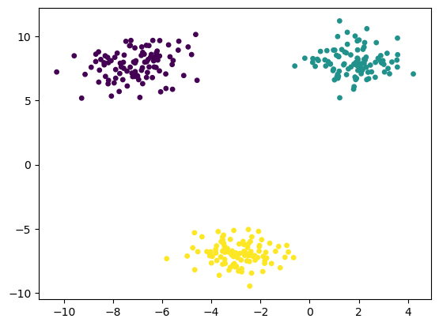

```python
import numpy as np
import matplotlib.pyplot as plt
from sklearn.datasets import make_blobs
```


```python
x,y = make_blobs(
    n_samples=300, #样本数
    n_features=2, #几维数据
    centers=3,  #几组数据
    cluster_std =1, #标准差
    center_box = (-10,10), #取值范围
    random_state = 233, #随机数种子
    return_centers = False #增加类别中心值返回值
)
```


```python
plt.scatter(x[:,0],x[:,1],c=y, s=15)
plt.show()
```


    

    


```python
# 数据集划分
```


```python
from sklearn.model_selection import train_test_split
```


```python
x_train,x_test,y_train,y_test = train_test_split(x,y,train_size=0.7,random_state=233)
```
