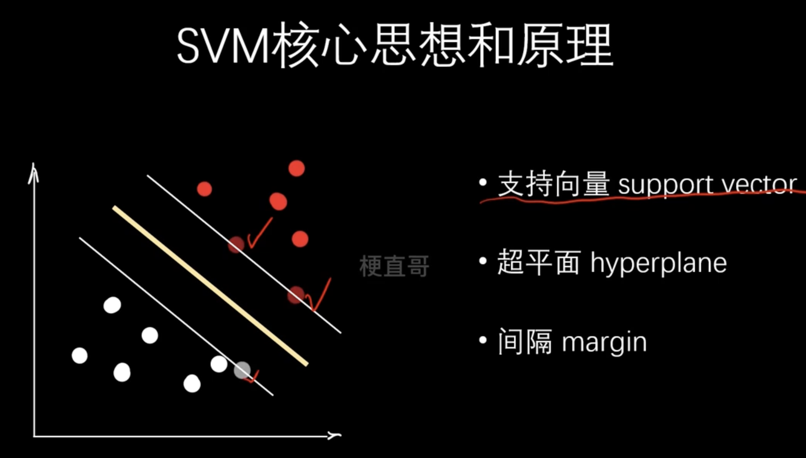
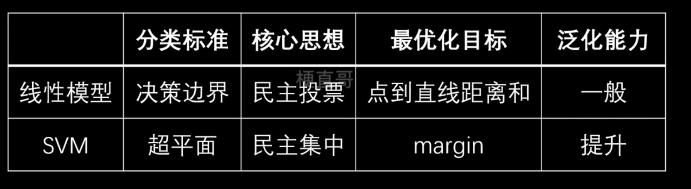

# SVM核心思想和原理

## 为什么需要SVM

作为线性模型，有多个答案满足需求。这种情况叫ill-posed problem（不适定问题）。线性模型通过Loss function计算。模型的泛化能力弱。

## SVM核心思想

- 支持向量 support vector
- 超平面 hyperplane
- 间隔 margin

边界的几个点决定了分界线，所以打勾的几个点为support vector， 超平面为分割两边的support vector的面，最优的hyperplane是两边有最大的margin。

## SVM和线性模型的区别

民主集中：更看重关键点的作用

margin：更看重支持向量之间的距离

