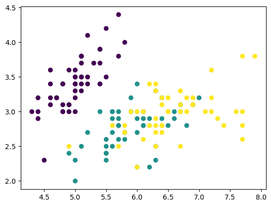
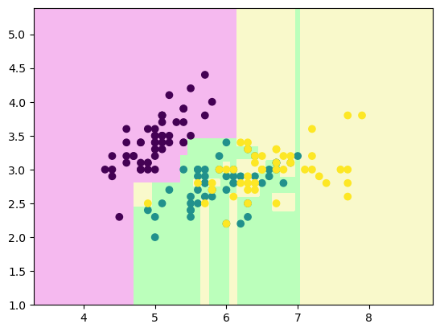
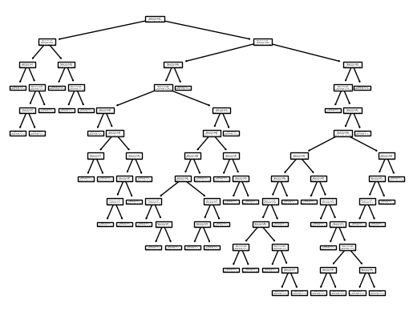
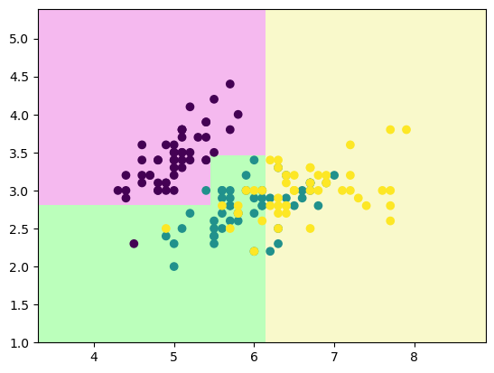

# 准备数据


```python
from sklearn.datasets import load_iris
import numpy as np

iris = load_iris()

x = iris.data[:,0:2] # 取第二个和第三个特征
y = iris.target
```


```python
import matplotlib.pyplot as plt
plt.scatter(x[:,0],x[:,1], c=y)
plt.show()
```


    

    


```python
from sklearn.tree import DecisionTreeClassifier
clf = DecisionTreeClassifier()
clf.fit(x,y)
```


<style>#sk-container-id-1 {color: black;background-color: white;}#sk-container-id-1 pre{padding: 0;}#sk-container-id-1 div.sk-toggleable {background-color: white;}#sk-container-id-1 label.sk-toggleable__label {cursor: pointer;display: block;width: 100%;margin-bottom: 0;padding: 0.3em;box-sizing: border-box;text-align: center;}#sk-container-id-1 label.sk-toggleable__label-arrow:before {content: "▸";float: left;margin-right: 0.25em;color: #696969;}#sk-container-id-1 label.sk-toggleable__label-arrow:hover:before {color: black;}#sk-container-id-1 div.sk-estimator:hover label.sk-toggleable__label-arrow:before {color: black;}#sk-container-id-1 div.sk-toggleable__content {max-height: 0;max-width: 0;overflow: hidden;text-align: left;background-color: #f0f8ff;}#sk-container-id-1 div.sk-toggleable__content pre {margin: 0.2em;color: black;border-radius: 0.25em;background-color: #f0f8ff;}#sk-container-id-1 input.sk-toggleable__control:checked~div.sk-toggleable__content {max-height: 200px;max-width: 100%;overflow: auto;}#sk-container-id-1 input.sk-toggleable__control:checked~label.sk-toggleable__label-arrow:before {content: "▾";}#sk-container-id-1 div.sk-estimator input.sk-toggleable__control:checked~label.sk-toggleable__label {background-color: #d4ebff;}#sk-container-id-1 div.sk-label input.sk-toggleable__control:checked~label.sk-toggleable__label {background-color: #d4ebff;}#sk-container-id-1 input.sk-hidden--visually {border: 0;clip: rect(1px 1px 1px 1px);clip: rect(1px, 1px, 1px, 1px);height: 1px;margin: -1px;overflow: hidden;padding: 0;position: absolute;width: 1px;}#sk-container-id-1 div.sk-estimator {font-family: monospace;background-color: #f0f8ff;border: 1px dotted black;border-radius: 0.25em;box-sizing: border-box;margin-bottom: 0.5em;}#sk-container-id-1 div.sk-estimator:hover {background-color: #d4ebff;}#sk-container-id-1 div.sk-parallel-item::after {content: "";width: 100%;border-bottom: 1px solid gray;flex-grow: 1;}#sk-container-id-1 div.sk-label:hover label.sk-toggleable__label {background-color: #d4ebff;}#sk-container-id-1 div.sk-serial::before {content: "";position: absolute;border-left: 1px solid gray;box-sizing: border-box;top: 0;bottom: 0;left: 50%;z-index: 0;}#sk-container-id-1 div.sk-serial {display: flex;flex-direction: column;align-items: center;background-color: white;padding-right: 0.2em;padding-left: 0.2em;position: relative;}#sk-container-id-1 div.sk-item {position: relative;z-index: 1;}#sk-container-id-1 div.sk-parallel {display: flex;align-items: stretch;justify-content: center;background-color: white;position: relative;}#sk-container-id-1 div.sk-item::before, #sk-container-id-1 div.sk-parallel-item::before {content: "";position: absolute;border-left: 1px solid gray;box-sizing: border-box;top: 0;bottom: 0;left: 50%;z-index: -1;}#sk-container-id-1 div.sk-parallel-item {display: flex;flex-direction: column;z-index: 1;position: relative;background-color: white;}#sk-container-id-1 div.sk-parallel-item:first-child::after {align-self: flex-end;width: 50%;}#sk-container-id-1 div.sk-parallel-item:last-child::after {align-self: flex-start;width: 50%;}#sk-container-id-1 div.sk-parallel-item:only-child::after {width: 0;}#sk-container-id-1 div.sk-dashed-wrapped {border: 1px dashed gray;margin: 0 0.4em 0.5em 0.4em;box-sizing: border-box;padding-bottom: 0.4em;background-color: white;}#sk-container-id-1 div.sk-label label {font-family: monospace;font-weight: bold;display: inline-block;line-height: 1.2em;}#sk-container-id-1 div.sk-label-container {text-align: center;}#sk-container-id-1 div.sk-container {/* jupyter's `normalize.less` sets `[hidden] { display: none; }` but bootstrap.min.css set `[hidden] { display: none !important; }` so we also need the `!important` here to be able to override the default hidden behavior on the sphinx rendered scikit-learn.org. See: https://github.com/scikit-learn/scikit-learn/issues/21755 */display: inline-block !important;position: relative;}#sk-container-id-1 div.sk-text-repr-fallback {display: none;}</style><div id="sk-container-id-1" class="sk-top-container"><div class="sk-text-repr-fallback"><pre>DecisionTreeClassifier()</pre><b>In a Jupyter environment, please rerun this cell to show the HTML representation or trust the notebook. <br />On GitHub, the HTML representation is unable to render, please try loading this page with nbviewer.org.</b></div><div class="sk-container" hidden><div class="sk-item"><div class="sk-estimator sk-toggleable"><input class="sk-toggleable__control sk-hidden--visually" id="sk-estimator-id-1" type="checkbox" checked><label for="sk-estimator-id-1" class="sk-toggleable__label sk-toggleable__label-arrow">DecisionTreeClassifier</label><div class="sk-toggleable__content"><pre>DecisionTreeClassifier()</pre></div></div></div></div></div>


```python
def decision_boundary_plot(X, y, clf):
    axis_x1_min, axis_x1_max = X[:,0].min() - 1, X[:,0].max() + 1
    axis_x2_min, axis_x2_max = X[:,1].min() - 1, X[:,1].max() + 1
    
    x1, x2 = np.meshgrid( np.arange(axis_x1_min,axis_x1_max, 0.01) , np.arange(axis_x2_min,axis_x2_max, 0.01))
    z = clf.predict(np.c_[x1.ravel(),x2.ravel()])
    z = z.reshape(x1.shape)
    
    from matplotlib.colors import ListedColormap
    custom_cmap = ListedColormap(['#F5B9EF','#BBFFBB','#F9F9CB'])
 
    plt.contourf(x1, x2, z, cmap=custom_cmap)
    plt.scatter(X[:,0], X[:,1], c=y)
    plt.show()
```


```python
decision_boundary_plot(x,y,clf)
```


    

    


上图可知，产生了过拟合


```python
from sklearn.tree import plot_tree
plot_tree(clf)
```


    [Text(0.36890243902439024, 0.9615384615384616, 'x[0] <= 5.45\ngini = 0.667\nsamples = 150\nvalue = [50, 50, 50]'),
     Text(0.0975609756097561, 0.8846153846153846, 'x[1] <= 2.8\ngini = 0.237\nsamples = 52\nvalue = [45, 6, 1]'),
     Text(0.04878048780487805, 0.8076923076923077, 'x[0] <= 4.7\ngini = 0.449\nsamples = 7\nvalue = [1, 5, 1]'),
     Text(0.024390243902439025, 0.7307692307692307, 'gini = 0.0\nsamples = 1\nvalue = [1, 0, 0]'),
     Text(0.07317073170731707, 0.7307692307692307, 'x[0] <= 4.95\ngini = 0.278\nsamples = 6\nvalue = [0, 5, 1]'),
     Text(0.04878048780487805, 0.6538461538461539, 'x[1] <= 2.45\ngini = 0.5\nsamples = 2\nvalue = [0, 1, 1]'),
     Text(0.024390243902439025, 0.5769230769230769, 'gini = 0.0\nsamples = 1\nvalue = [0, 1, 0]'),
     Text(0.07317073170731707, 0.5769230769230769, 'gini = 0.0\nsamples = 1\nvalue = [0, 0, 1]'),
     Text(0.0975609756097561, 0.6538461538461539, 'gini = 0.0\nsamples = 4\nvalue = [0, 4, 0]'),
     Text(0.14634146341463414, 0.8076923076923077, 'x[0] <= 5.35\ngini = 0.043\nsamples = 45\nvalue = [44, 1, 0]'),
     Text(0.12195121951219512, 0.7307692307692307, 'gini = 0.0\nsamples = 39\nvalue = [39, 0, 0]'),
     Text(0.17073170731707318, 0.7307692307692307, 'x[1] <= 3.2\ngini = 0.278\nsamples = 6\nvalue = [5, 1, 0]'),
     Text(0.14634146341463414, 0.6538461538461539, 'gini = 0.0\nsamples = 1\nvalue = [0, 1, 0]'),
     Text(0.1951219512195122, 0.6538461538461539, 'gini = 0.0\nsamples = 5\nvalue = [5, 0, 0]'),
     Text(0.6402439024390244, 0.8846153846153846, 'x[0] <= 6.15\ngini = 0.546\nsamples = 98\nvalue = [5, 44, 49]'),
     Text(0.4146341463414634, 0.8076923076923077, 'x[1] <= 3.45\ngini = 0.508\nsamples = 43\nvalue = [5, 28, 10]'),
     Text(0.3902439024390244, 0.7307692307692307, 'x[0] <= 5.75\ngini = 0.388\nsamples = 38\nvalue = [0, 28, 10]'),
     Text(0.24390243902439024, 0.6538461538461539, 'x[0] <= 5.55\ngini = 0.208\nsamples = 17\nvalue = [0, 15, 2]'),
     Text(0.21951219512195122, 0.5769230769230769, 'gini = 0.0\nsamples = 5\nvalue = [0, 5, 0]'),
     Text(0.2682926829268293, 0.5769230769230769, 'x[1] <= 2.55\ngini = 0.278\nsamples = 12\nvalue = [0, 10, 2]'),
     Text(0.21951219512195122, 0.5, 'x[0] <= 5.65\ngini = 0.5\nsamples = 2\nvalue = [0, 1, 1]'),
     Text(0.1951219512195122, 0.4230769230769231, 'gini = 0.0\nsamples = 1\nvalue = [0, 1, 0]'),
     Text(0.24390243902439024, 0.4230769230769231, 'gini = 0.0\nsamples = 1\nvalue = [0, 0, 1]'),
     Text(0.3170731707317073, 0.5, 'x[0] <= 5.65\ngini = 0.18\nsamples = 10\nvalue = [0, 9, 1]'),
     Text(0.2926829268292683, 0.4230769230769231, 'x[1] <= 2.85\ngini = 0.32\nsamples = 5\nvalue = [0, 4, 1]'),
     Text(0.2682926829268293, 0.34615384615384615, 'x[1] <= 2.75\ngini = 0.5\nsamples = 2\nvalue = [0, 1, 1]'),
     Text(0.24390243902439024, 0.2692307692307692, 'gini = 0.0\nsamples = 1\nvalue = [0, 1, 0]'),
     Text(0.2926829268292683, 0.2692307692307692, 'gini = 0.0\nsamples = 1\nvalue = [0, 0, 1]'),
     Text(0.3170731707317073, 0.34615384615384615, 'gini = 0.0\nsamples = 3\nvalue = [0, 3, 0]'),
     Text(0.34146341463414637, 0.4230769230769231, 'gini = 0.0\nsamples = 5\nvalue = [0, 5, 0]'),
     Text(0.5365853658536586, 0.6538461538461539, 'x[1] <= 3.1\ngini = 0.472\nsamples = 21\nvalue = [0, 13, 8]'),
     Text(0.5121951219512195, 0.5769230769230769, 'x[1] <= 2.95\ngini = 0.488\nsamples = 19\nvalue = [0, 11, 8]'),
     Text(0.4634146341463415, 0.5, 'x[1] <= 2.85\ngini = 0.459\nsamples = 14\nvalue = [0, 9, 5]'),
     Text(0.43902439024390244, 0.4230769230769231, 'x[0] <= 5.9\ngini = 0.486\nsamples = 12\nvalue = [0, 7, 5]'),
     Text(0.36585365853658536, 0.34615384615384615, 'x[1] <= 2.65\ngini = 0.5\nsamples = 6\nvalue = [0, 3, 3]'),
     Text(0.34146341463414637, 0.2692307692307692, 'gini = 0.0\nsamples = 1\nvalue = [0, 1, 0]'),
     Text(0.3902439024390244, 0.2692307692307692, 'x[1] <= 2.75\ngini = 0.48\nsamples = 5\nvalue = [0, 2, 3]'),
     Text(0.36585365853658536, 0.19230769230769232, 'gini = 0.5\nsamples = 4\nvalue = [0, 2, 2]'),
     Text(0.4146341463414634, 0.19230769230769232, 'gini = 0.0\nsamples = 1\nvalue = [0, 0, 1]'),
     Text(0.5121951219512195, 0.34615384615384615, 'x[1] <= 2.65\ngini = 0.444\nsamples = 6\nvalue = [0, 4, 2]'),
     Text(0.4878048780487805, 0.2692307692307692, 'x[0] <= 6.05\ngini = 0.444\nsamples = 3\nvalue = [0, 1, 2]'),
     Text(0.4634146341463415, 0.19230769230769232, 'gini = 0.5\nsamples = 2\nvalue = [0, 1, 1]'),
     Text(0.5121951219512195, 0.19230769230769232, 'gini = 0.0\nsamples = 1\nvalue = [0, 0, 1]'),
     Text(0.5365853658536586, 0.2692307692307692, 'gini = 0.0\nsamples = 3\nvalue = [0, 3, 0]'),
     Text(0.4878048780487805, 0.4230769230769231, 'gini = 0.0\nsamples = 2\nvalue = [0, 2, 0]'),
     Text(0.5609756097560976, 0.5, 'x[0] <= 5.95\ngini = 0.48\nsamples = 5\nvalue = [0, 2, 3]'),
     Text(0.5365853658536586, 0.4230769230769231, 'gini = 0.5\nsamples = 2\nvalue = [0, 1, 1]'),
     Text(0.5853658536585366, 0.4230769230769231, 'x[0] <= 6.05\ngini = 0.444\nsamples = 3\nvalue = [0, 1, 2]'),
     Text(0.5609756097560976, 0.34615384615384615, 'gini = 0.0\nsamples = 1\nvalue = [0, 0, 1]'),
     Text(0.6097560975609756, 0.34615384615384615, 'gini = 0.5\nsamples = 2\nvalue = [0, 1, 1]'),
     Text(0.5609756097560976, 0.5769230769230769, 'gini = 0.0\nsamples = 2\nvalue = [0, 2, 0]'),
     Text(0.43902439024390244, 0.7307692307692307, 'gini = 0.0\nsamples = 5\nvalue = [5, 0, 0]'),
     Text(0.8658536585365854, 0.8076923076923077, 'x[0] <= 7.05\ngini = 0.413\nsamples = 55\nvalue = [0, 16, 39]'),
     Text(0.8414634146341463, 0.7307692307692307, 'x[1] <= 2.4\ngini = 0.467\nsamples = 43\nvalue = [0, 16, 27]'),
     Text(0.8170731707317073, 0.6538461538461539, 'gini = 0.0\nsamples = 2\nvalue = [0, 2, 0]'),
     Text(0.8658536585365854, 0.6538461538461539, 'x[0] <= 6.95\ngini = 0.45\nsamples = 41\nvalue = [0, 14, 27]'),
     Text(0.8414634146341463, 0.5769230769230769, 'x[1] <= 3.15\ngini = 0.439\nsamples = 40\nvalue = [0, 13, 27]'),
     Text(0.7317073170731707, 0.5, 'x[0] <= 6.55\ngini = 0.471\nsamples = 29\nvalue = [0, 11, 18]'),
     Text(0.6829268292682927, 0.4230769230769231, 'x[1] <= 2.95\ngini = 0.375\nsamples = 16\nvalue = [0, 4, 12]'),
     Text(0.6585365853658537, 0.34615384615384615, 'x[0] <= 6.45\ngini = 0.444\nsamples = 12\nvalue = [0, 4, 8]'),
     Text(0.6341463414634146, 0.2692307692307692, 'x[1] <= 2.85\ngini = 0.397\nsamples = 11\nvalue = [0, 3, 8]'),
     Text(0.5853658536585366, 0.19230769230769232, 'x[1] <= 2.6\ngini = 0.219\nsamples = 8\nvalue = [0, 1, 7]'),
     Text(0.5609756097560976, 0.11538461538461539, 'gini = 0.5\nsamples = 2\nvalue = [0, 1, 1]'),
     Text(0.6097560975609756, 0.11538461538461539, 'gini = 0.0\nsamples = 6\nvalue = [0, 0, 6]'),
     Text(0.6829268292682927, 0.19230769230769232, 'x[0] <= 6.25\ngini = 0.444\nsamples = 3\nvalue = [0, 2, 1]'),
     Text(0.6585365853658537, 0.11538461538461539, 'gini = 0.0\nsamples = 1\nvalue = [0, 1, 0]'),
     Text(0.7073170731707317, 0.11538461538461539, 'x[0] <= 6.35\ngini = 0.5\nsamples = 2\nvalue = [0, 1, 1]'),
     Text(0.6829268292682927, 0.038461538461538464, 'gini = 0.0\nsamples = 1\nvalue = [0, 0, 1]'),
     Text(0.7317073170731707, 0.038461538461538464, 'gini = 0.0\nsamples = 1\nvalue = [0, 1, 0]'),
     Text(0.6829268292682927, 0.2692307692307692, 'gini = 0.0\nsamples = 1\nvalue = [0, 1, 0]'),
     Text(0.7073170731707317, 0.34615384615384615, 'gini = 0.0\nsamples = 4\nvalue = [0, 0, 4]'),
     Text(0.7804878048780488, 0.4230769230769231, 'x[0] <= 6.65\ngini = 0.497\nsamples = 13\nvalue = [0, 7, 6]'),
     Text(0.7560975609756098, 0.34615384615384615, 'gini = 0.0\nsamples = 2\nvalue = [0, 2, 0]'),
     Text(0.8048780487804879, 0.34615384615384615, 'x[1] <= 2.65\ngini = 0.496\nsamples = 11\nvalue = [0, 5, 6]'),
     Text(0.7804878048780488, 0.2692307692307692, 'gini = 0.0\nsamples = 1\nvalue = [0, 0, 1]'),
     Text(0.8292682926829268, 0.2692307692307692, 'x[1] <= 2.9\ngini = 0.5\nsamples = 10\nvalue = [0, 5, 5]'),
     Text(0.8048780487804879, 0.19230769230769232, 'gini = 0.0\nsamples = 1\nvalue = [0, 1, 0]'),
     Text(0.8536585365853658, 0.19230769230769232, 'x[0] <= 6.75\ngini = 0.494\nsamples = 9\nvalue = [0, 4, 5]'),
     Text(0.8048780487804879, 0.11538461538461539, 'x[1] <= 3.05\ngini = 0.48\nsamples = 5\nvalue = [0, 3, 2]'),
     Text(0.7804878048780488, 0.038461538461538464, 'gini = 0.5\nsamples = 2\nvalue = [0, 1, 1]'),
     Text(0.8292682926829268, 0.038461538461538464, 'gini = 0.444\nsamples = 3\nvalue = [0, 2, 1]'),
     Text(0.9024390243902439, 0.11538461538461539, 'x[1] <= 3.05\ngini = 0.375\nsamples = 4\nvalue = [0, 1, 3]'),
     Text(0.8780487804878049, 0.038461538461538464, 'gini = 0.0\nsamples = 1\nvalue = [0, 0, 1]'),
     Text(0.926829268292683, 0.038461538461538464, 'gini = 0.444\nsamples = 3\nvalue = [0, 1, 2]'),
     Text(0.9512195121951219, 0.5, 'x[0] <= 6.45\ngini = 0.298\nsamples = 11\nvalue = [0, 2, 9]'),
     Text(0.926829268292683, 0.4230769230769231, 'x[1] <= 3.35\ngini = 0.444\nsamples = 6\nvalue = [0, 2, 4]'),
     Text(0.9024390243902439, 0.34615384615384615, 'x[0] <= 6.35\ngini = 0.5\nsamples = 4\nvalue = [0, 2, 2]'),
     Text(0.8780487804878049, 0.2692307692307692, 'gini = 0.5\nsamples = 2\nvalue = [0, 1, 1]'),
     Text(0.926829268292683, 0.2692307692307692, 'gini = 0.5\nsamples = 2\nvalue = [0, 1, 1]'),
     Text(0.9512195121951219, 0.34615384615384615, 'gini = 0.0\nsamples = 2\nvalue = [0, 0, 2]'),
     Text(0.975609756097561, 0.4230769230769231, 'gini = 0.0\nsamples = 5\nvalue = [0, 0, 5]'),
     Text(0.8902439024390244, 0.5769230769230769, 'gini = 0.0\nsamples = 1\nvalue = [0, 1, 0]'),
     Text(0.8902439024390244, 0.7307692307692307, 'gini = 0.0\nsamples = 12\nvalue = [0, 0, 12]')]


    

    


上图可知，决策树非常复杂，产生了过拟合

# 决策树剪枝(调整超参)


```python
clf= DecisionTreeClassifier(max_depth=4, min_samples_split=20, min_samples_leaf=5)
clf.fit(x,y)
decision_boundary_plot(x,y,clf)
```


    

    

