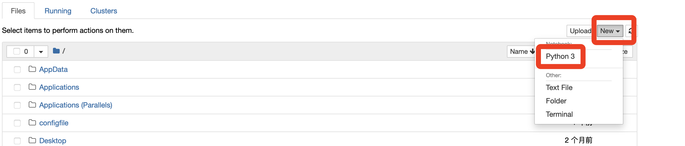
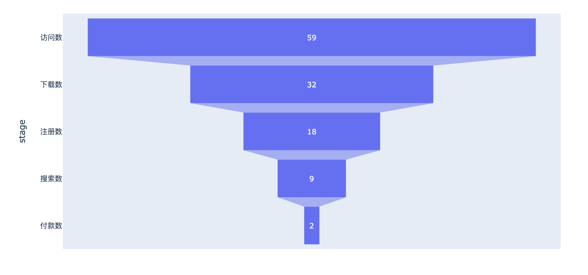

# 1. 搭建环境

## 安装Anaconda

Python + Anaconda + Jupyter Notebook关系:

## 启动Jupyter Notebook

## 简单Demo

	pip install plotly
	import plotly.express as px #导入Plotly.express工具，命名为px
	data = dict( #准备漏斗数据
	    number=[59, 32, 18, 9, 2],
	    stage=["访问数", "下载数", "注册数", "搜索数", "付款数"])
	fig = px.funnel(data, x='number', y='stage') #把数据传进漏斗图
	fig.show() #显示漏斗图
	
	