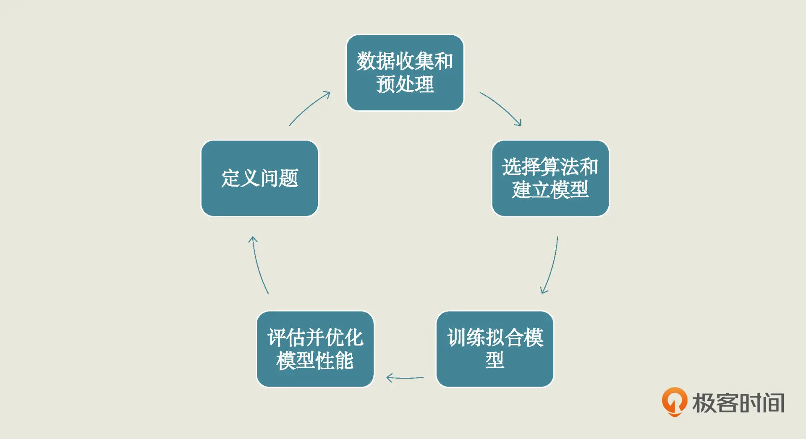
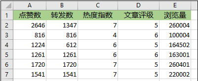
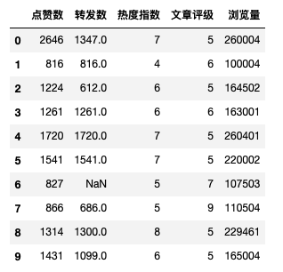
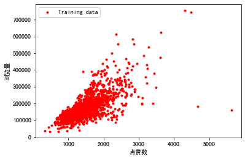
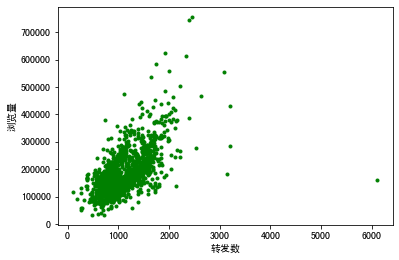
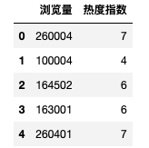
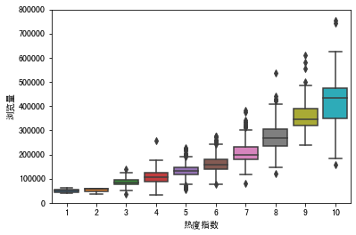

# 2.怎么定义问题和预处理数据

## 开发步骤

## 需求

建立一个机器学习模型，根据点赞数和转发数等指标，估计一篇文章能实现多大的浏览量。

因为要估计浏览量，所以在这个数据集中：点赞数、转发数、热度指数、文章评级，这 4 个字段都是特征，浏览量就是标签。这里我们已经有要估计的标签了，所以这是一个监督学习问题。再加上我们的标签是连续性的数值，因此它是一个回归问题

## 实战

import pandas as pd
df_ads= pd.read_csv('/Users/zheyiwang/Downloads/易速鲜花微信软文.csv')   
df_ads.head()
#导入数据可视化所需要的库
import matplotlib.pyplot as plt # Matplotlib – Python画图工具库
import seaborn as sns # Seaborn – 统计学数据可视化工具库

plt.plot(df_ads['点赞数'],df_ads['浏览量'],'r.',label='Training data')
plt.xlabel('点赞数') # x轴Label
plt.ylabel('浏览量') # y轴Label
plt.legend()
plt.show()

## 代码

	import pandas as pd
	df_ads= pd.read_csv('/Users/zheyiwang/Downloads/易速鲜花微信软文.csv')   
	df_ads.head(10)
	

	#导入数据可视化所需要的库
	import matplotlib.pyplot as plt # Matplotlib – Python画图工具库
	import seaborn as sns # Seaborn – 统计学数据可视化工具库
	
	plt.plot(df_ads['点赞数'],df_ads['浏览量'],'r.',label='Training data')
	plt.xlabel('点赞数') # x轴Label
	plt.ylabel('浏览量') # y轴Label
	plt.legend()
	plt.show()
	
	

	plt.plot(df_ads['转发数'],df_ads['浏览量'],'g.',label='Training data')
	plt.xlabel('转发数')
	plt.ylabel('浏览量')
	plt.legend
	plt.show
	
			

	data = pd.concat([df_ads['浏览量'], df_ads['热度指数']], axis=1) # 浏览量和热度指数
	data.head()

	

	fig = sns.boxplot(x='热度指数', y="浏览量", data=data) # 用seaborn的箱线图画图
	fig.axis(ymin=0, ymax=800000); #设定y轴坐标
	
		

	df_ads.isna().sum() # NaN出现的次数

显示：

	点赞数      0
	转发数     37
	热度指数     0
	文章评级     0
	浏览量      0
	dtype: int64	

代码：
	
	df_ads = df_ads.dropna() # 把出现了NaN的数据行删掉
	X = df_ads.drop(['浏览量'],axis=1) # 特征集，Drop掉标签相关字段
	y = df_ads.浏览量 # 标签集
	X.head() # 显示前几行数据	
	
其余见《爆款文章.ipynb》