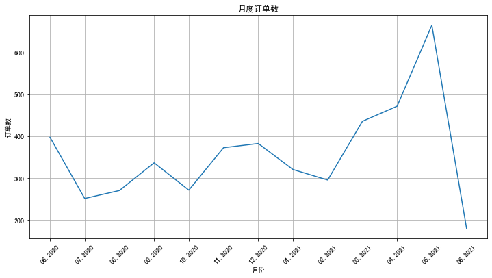

```python
import pandas as pd
```


```python
df_sales = pd.read_csv('/Users/zheyiwang/Downloads/易速鲜花订单记录.csv')
df_sales.head(10)
```


<div>
<style scoped>
    .dataframe tbody tr th:only-of-type {
        vertical-align: middle;
    }

    .dataframe tbody tr th {
        vertical-align: top;
    }

    .dataframe thead th {
        text-align: right;
    }
</style>
<table border="1" class="dataframe">
  <thead>
    <tr style="text-align: right;">
      <th></th>
      <th>订单号</th>
      <th>产品码</th>
      <th>消费日期</th>
      <th>产品说明</th>
      <th>数量</th>
      <th>单价</th>
      <th>用户码</th>
      <th>城市</th>
    </tr>
  </thead>
  <tbody>
    <tr>
      <th>0</th>
      <td>536374</td>
      <td>21258</td>
      <td>6/1/2020 9:09</td>
      <td>五彩玫瑰五支装</td>
      <td>32</td>
      <td>10.95</td>
      <td>15100</td>
      <td>北京</td>
    </tr>
    <tr>
      <th>1</th>
      <td>536376</td>
      <td>22114</td>
      <td>6/1/2020 9:32</td>
      <td>茉莉花白色25枝</td>
      <td>48</td>
      <td>3.45</td>
      <td>15291</td>
      <td>上海</td>
    </tr>
    <tr>
      <th>2</th>
      <td>536376</td>
      <td>21733</td>
      <td>6/1/2020 9:32</td>
      <td>教师节向日葵3枝尤加利5枝</td>
      <td>64</td>
      <td>2.55</td>
      <td>15291</td>
      <td>上海</td>
    </tr>
    <tr>
      <th>3</th>
      <td>536378</td>
      <td>22386</td>
      <td>6/1/2020 9:37</td>
      <td>百合粉色10花苞</td>
      <td>10</td>
      <td>1.95</td>
      <td>14688</td>
      <td>北京</td>
    </tr>
    <tr>
      <th>4</th>
      <td>536378</td>
      <td>85099C</td>
      <td>6/1/2020 9:37</td>
      <td>橙黄香槟色康乃馨</td>
      <td>10</td>
      <td>1.95</td>
      <td>14688</td>
      <td>北京</td>
    </tr>
    <tr>
      <th>5</th>
      <td>536378</td>
      <td>21033</td>
      <td>6/1/2020 9:37</td>
      <td>满天星干花花束</td>
      <td>10</td>
      <td>2.95</td>
      <td>14688</td>
      <td>北京</td>
    </tr>
    <tr>
      <th>6</th>
      <td>536378</td>
      <td>20723</td>
      <td>6/1/2020 9:37</td>
      <td>产品说明掩码</td>
      <td>10</td>
      <td>0.85</td>
      <td>14688</td>
      <td>北京</td>
    </tr>
    <tr>
      <th>7</th>
      <td>536378</td>
      <td>84997B</td>
      <td>6/1/2020 9:37</td>
      <td>产品说明掩码</td>
      <td>12</td>
      <td>3.75</td>
      <td>14688</td>
      <td>北京</td>
    </tr>
    <tr>
      <th>8</th>
      <td>536378</td>
      <td>84997C</td>
      <td>6/1/2020 9:37</td>
      <td>产品说明掩码</td>
      <td>6</td>
      <td>3.75</td>
      <td>14688</td>
      <td>北京</td>
    </tr>
    <tr>
      <th>9</th>
      <td>536378</td>
      <td>21094</td>
      <td>6/1/2020 9:37</td>
      <td>产品说明掩码</td>
      <td>12</td>
      <td>0.85</td>
      <td>14688</td>
      <td>北京</td>
    </tr>
  </tbody>
</table>
</div>


```python
#整体的数据可视化
```


```python
%matplotlib inline
import matplotlib.pyplot as plt
#构建月度订单数的Dataframe
df_sales['消费日期']= pd.to_datetime(df_sales['消费日期']) #转化日期格式
df_orders_monthly = df_sales.set_index('消费日期')['订单号'].resample('M').nunique()  #'M' indicates month
df_orders_monthly
```


    消费日期
    2020-06-30    398
    2020-07-31    252
    2020-08-31    271
    2020-09-30    337
    2020-10-31    272
    2020-11-30    373
    2020-12-31    383
    2021-01-31    321
    2021-02-28    296
    2021-03-31    436
    2021-04-30    472
    2021-05-31    665
    2021-06-30    181
    Freq: M, Name: 订单号, dtype: int64


```python
df_orders_monthly.values
```


    array([398, 252, 271, 337, 272, 373, 383, 321, 296, 436, 472, 665, 181])


```python
df_orders_monthly.index
```


    DatetimeIndex(['2020-06-30', '2020-07-31', '2020-08-31', '2020-09-30',
                   '2020-10-31', '2020-11-30', '2020-12-31', '2021-01-31',
                   '2021-02-28', '2021-03-31', '2021-04-30', '2021-05-31',
                   '2021-06-30'],
                  dtype='datetime64[ns]', name='消费日期', freq='M')


```python
#设定绘图的画布
ax = pd.DataFrame(df_orders_monthly.values).plot(grid=True,figsize=(12,6),legend=False)
ax.set_xlabel('月份') # X轴label
ax.set_ylabel('订单数') # Y轴Label
ax.set_title('月度订单数') # 图题

#设定X轴月份显示格式
plt.xticks( 
    range(len(df_orders_monthly.index)), 
    [x.strftime('%m.%Y') for x in df_orders_monthly.index], 
    rotation=45)


plt.show() # 绘图
```


    

    


```python
#在最后一个月，也就是 2021 年 6 月，订单量突然大幅下降。其实这是因为运营人员拉这个表的时候，正是 6 月的第一个礼拜。所以，6 月的数据虽然不全，但并不会影响我们对用户 RFM 值的分析
```


```python
df_sales = df_sales.drop_duplicates()#删除重复的数据行
```


```python
df_sales.describe() #df_sales的统计信息
```


<div>
<style scoped>
    .dataframe tbody tr th:only-of-type {
        vertical-align: middle;
    }

    .dataframe tbody tr th {
        vertical-align: top;
    }

    .dataframe thead th {
        text-align: right;
    }
</style>
<table border="1" class="dataframe">
  <thead>
    <tr style="text-align: right;">
      <th></th>
      <th>数量</th>
      <th>单价</th>
      <th>用户码</th>
    </tr>
  </thead>
  <tbody>
    <tr>
      <th>count</th>
      <td>85920.000000</td>
      <td>85920.000000</td>
      <td>85920.000000</td>
    </tr>
    <tr>
      <th>mean</th>
      <td>10.115747</td>
      <td>3.599711</td>
      <td>15338.080389</td>
    </tr>
    <tr>
      <th>std</th>
      <td>49.114285</td>
      <td>134.410498</td>
      <td>391.309086</td>
    </tr>
    <tr>
      <th>min</th>
      <td>-9360.000000</td>
      <td>0.000000</td>
      <td>14681.000000</td>
    </tr>
    <tr>
      <th>25%</th>
      <td>2.000000</td>
      <td>1.250000</td>
      <td>15022.000000</td>
    </tr>
    <tr>
      <th>50%</th>
      <td>4.000000</td>
      <td>1.950000</td>
      <td>15334.000000</td>
    </tr>
    <tr>
      <th>75%</th>
      <td>12.000000</td>
      <td>3.750000</td>
      <td>15673.000000</td>
    </tr>
    <tr>
      <th>max</th>
      <td>3114.000000</td>
      <td>38970.000000</td>
      <td>16019.000000</td>
    </tr>
  </tbody>
</table>
</div>


```python
#在图中你可以看到这个数据集中，共有 8 万多行的数据（count 统计数据条目的数量），每条数据的平均采购数量是 10（mean 统计均值），商品平均单价是 3.575 元左右。
```


```python
#在概览中我们发现，（订单中产品的）数量的最小值（min）是一个负数（-9360），这显然是不符合逻辑的，所以我们要把这种脏数据清洗掉。具体的处理方式是，用 loc 属性通过字段名（也就是列名）访问数据集，同时只保留“数量”字段大于 0 的数据行：
```


```python
df_sales = df_sales.loc[df_sales['数量'] > 0] #清洗掉数量小于等于0的数据
```


```python
df_sales.describe() #df_sales的统计信息
```


<div>
<style scoped>
    .dataframe tbody tr th:only-of-type {
        vertical-align: middle;
    }

    .dataframe tbody tr th {
        vertical-align: top;
    }

    .dataframe thead th {
        text-align: right;
    }
</style>
<table border="1" class="dataframe">
  <thead>
    <tr style="text-align: right;">
      <th></th>
      <th>数量</th>
      <th>单价</th>
      <th>用户码</th>
    </tr>
  </thead>
  <tbody>
    <tr>
      <th>count</th>
      <td>84112.000000</td>
      <td>84112.000000</td>
      <td>84112.000000</td>
    </tr>
    <tr>
      <th>mean</th>
      <td>10.760236</td>
      <td>3.005032</td>
      <td>15337.732963</td>
    </tr>
    <tr>
      <th>std</th>
      <td>34.018906</td>
      <td>15.365085</td>
      <td>392.074855</td>
    </tr>
    <tr>
      <th>min</th>
      <td>1.000000</td>
      <td>0.000000</td>
      <td>14681.000000</td>
    </tr>
    <tr>
      <th>25%</th>
      <td>2.000000</td>
      <td>1.250000</td>
      <td>15021.000000</td>
    </tr>
    <tr>
      <th>50%</th>
      <td>5.000000</td>
      <td>1.950000</td>
      <td>15333.000000</td>
    </tr>
    <tr>
      <th>75%</th>
      <td>12.000000</td>
      <td>3.750000</td>
      <td>15674.000000</td>
    </tr>
    <tr>
      <th>max</th>
      <td>3114.000000</td>
      <td>3155.950000</td>
      <td>16019.000000</td>
    </tr>
  </tbody>
</table>
</div>


```python
df_sales['总价'] = df_sales['数量'] * df_sales['单价'] #计算每单的总价
df_sales.head() #显示头几行数据       
```


<div>
<style scoped>
    .dataframe tbody tr th:only-of-type {
        vertical-align: middle;
    }

    .dataframe tbody tr th {
        vertical-align: top;
    }

    .dataframe thead th {
        text-align: right;
    }
</style>
<table border="1" class="dataframe">
  <thead>
    <tr style="text-align: right;">
      <th></th>
      <th>订单号</th>
      <th>产品码</th>
      <th>消费日期</th>
      <th>产品说明</th>
      <th>数量</th>
      <th>单价</th>
      <th>用户码</th>
      <th>城市</th>
      <th>总价</th>
    </tr>
  </thead>
  <tbody>
    <tr>
      <th>0</th>
      <td>536374</td>
      <td>21258</td>
      <td>2020-06-01 09:09:00</td>
      <td>五彩玫瑰五支装</td>
      <td>32</td>
      <td>10.95</td>
      <td>15100</td>
      <td>北京</td>
      <td>350.4</td>
    </tr>
    <tr>
      <th>1</th>
      <td>536376</td>
      <td>22114</td>
      <td>2020-06-01 09:32:00</td>
      <td>茉莉花白色25枝</td>
      <td>48</td>
      <td>3.45</td>
      <td>15291</td>
      <td>上海</td>
      <td>165.6</td>
    </tr>
    <tr>
      <th>2</th>
      <td>536376</td>
      <td>21733</td>
      <td>2020-06-01 09:32:00</td>
      <td>教师节向日葵3枝尤加利5枝</td>
      <td>64</td>
      <td>2.55</td>
      <td>15291</td>
      <td>上海</td>
      <td>163.2</td>
    </tr>
    <tr>
      <th>3</th>
      <td>536378</td>
      <td>22386</td>
      <td>2020-06-01 09:37:00</td>
      <td>百合粉色10花苞</td>
      <td>10</td>
      <td>1.95</td>
      <td>14688</td>
      <td>北京</td>
      <td>19.5</td>
    </tr>
    <tr>
      <th>4</th>
      <td>536378</td>
      <td>85099C</td>
      <td>2020-06-01 09:37:00</td>
      <td>橙黄香槟色康乃馨</td>
      <td>10</td>
      <td>1.95</td>
      <td>14688</td>
      <td>北京</td>
      <td>19.5</td>
    </tr>
  </tbody>
</table>
</div>


```python
#一个用户上一次购物的日期，也就是最新的消费日期，就可以转化成这个用户的 R 值；
#一个用户下的所有订单次数之和，就是消费频率值，也就是该用户的 F 值；
#把一个用户所有订单的总价加起来，就是消费金额值，也就是该用户的 M 值。
```


```python
# 1.构建用户层级表
```


```python
df_user = pd.DataFrame(df_sales['用户码'].unique()) #生成以用户码为主键的结构df_user
df_user.columns = ['用户码'] #设定字段名
df_user = df_user.sort_values(by='用户码',ascending=True).reset_index(drop=True) #按用户码排序
df_user.head(5)
```


<div>
<style scoped>
    .dataframe tbody tr th:only-of-type {
        vertical-align: middle;
    }

    .dataframe tbody tr th {
        vertical-align: top;
    }

    .dataframe thead th {
        text-align: right;
    }
</style>
<table border="1" class="dataframe">
  <thead>
    <tr style="text-align: right;">
      <th></th>
      <th>用户码</th>
    </tr>
  </thead>
  <tbody>
    <tr>
      <th>0</th>
      <td>14681</td>
    </tr>
    <tr>
      <th>1</th>
      <td>14682</td>
    </tr>
    <tr>
      <th>2</th>
      <td>14684</td>
    </tr>
    <tr>
      <th>3</th>
      <td>14687</td>
    </tr>
    <tr>
      <th>4</th>
      <td>14688</td>
    </tr>
  </tbody>
</table>
</div>


```python
# 2.求出 R 值
```


```python
df_sales.head(5)
```


<div>
<style scoped>
    .dataframe tbody tr th:only-of-type {
        vertical-align: middle;
    }

    .dataframe tbody tr th {
        vertical-align: top;
    }

    .dataframe thead th {
        text-align: right;
    }
</style>
<table border="1" class="dataframe">
  <thead>
    <tr style="text-align: right;">
      <th></th>
      <th>订单号</th>
      <th>产品码</th>
      <th>消费日期</th>
      <th>产品说明</th>
      <th>数量</th>
      <th>单价</th>
      <th>用户码</th>
      <th>城市</th>
      <th>总价</th>
    </tr>
  </thead>
  <tbody>
    <tr>
      <th>0</th>
      <td>536374</td>
      <td>21258</td>
      <td>2020-06-01 09:09:00</td>
      <td>五彩玫瑰五支装</td>
      <td>32</td>
      <td>10.95</td>
      <td>15100</td>
      <td>北京</td>
      <td>350.4</td>
    </tr>
    <tr>
      <th>1</th>
      <td>536376</td>
      <td>22114</td>
      <td>2020-06-01 09:32:00</td>
      <td>茉莉花白色25枝</td>
      <td>48</td>
      <td>3.45</td>
      <td>15291</td>
      <td>上海</td>
      <td>165.6</td>
    </tr>
    <tr>
      <th>2</th>
      <td>536376</td>
      <td>21733</td>
      <td>2020-06-01 09:32:00</td>
      <td>教师节向日葵3枝尤加利5枝</td>
      <td>64</td>
      <td>2.55</td>
      <td>15291</td>
      <td>上海</td>
      <td>163.2</td>
    </tr>
    <tr>
      <th>3</th>
      <td>536378</td>
      <td>22386</td>
      <td>2020-06-01 09:37:00</td>
      <td>百合粉色10花苞</td>
      <td>10</td>
      <td>1.95</td>
      <td>14688</td>
      <td>北京</td>
      <td>19.5</td>
    </tr>
    <tr>
      <th>4</th>
      <td>536378</td>
      <td>85099C</td>
      <td>2020-06-01 09:37:00</td>
      <td>橙黄香槟色康乃馨</td>
      <td>10</td>
      <td>1.95</td>
      <td>14688</td>
      <td>北京</td>
      <td>19.5</td>
    </tr>
  </tbody>
</table>
</div>


```python
df_sales['消费日期'] = pd.to_datetime(df_sales['消费日期']) #转化日期格式
df_recent_buy = df_sales.groupby('用户码').消费日期.max().reset_index() #构建消费日期信息
df_recent_buy.columns = ['用户码','最近日期'] #设定字段名
df_recent_buy.head(5)
```


<div>
<style scoped>
    .dataframe tbody tr th:only-of-type {
        vertical-align: middle;
    }

    .dataframe tbody tr th {
        vertical-align: top;
    }

    .dataframe thead th {
        text-align: right;
    }
</style>
<table border="1" class="dataframe">
  <thead>
    <tr style="text-align: right;">
      <th></th>
      <th>用户码</th>
      <th>最近日期</th>
    </tr>
  </thead>
  <tbody>
    <tr>
      <th>0</th>
      <td>14681</td>
      <td>2021-03-30 15:52:00</td>
    </tr>
    <tr>
      <th>1</th>
      <td>14682</td>
      <td>2020-12-04 12:12:00</td>
    </tr>
    <tr>
      <th>2</th>
      <td>14684</td>
      <td>2021-05-15 11:33:00</td>
    </tr>
    <tr>
      <th>3</th>
      <td>14687</td>
      <td>2021-02-23 11:59:00</td>
    </tr>
    <tr>
      <th>4</th>
      <td>14688</td>
      <td>2021-06-02 12:26:00</td>
    </tr>
  </tbody>
</table>
</div>


```python
df_recent_buy['R值'] = (df_recent_buy['最近日期'].max() - df_recent_buy['最近日期']).dt.days #计算最新日期与上次消费日期的天数
df_recent_buy.head() #显示df_user头几行数据
```


<div>
<style scoped>
    .dataframe tbody tr th:only-of-type {
        vertical-align: middle;
    }

    .dataframe tbody tr th {
        vertical-align: top;
    }

    .dataframe thead th {
        text-align: right;
    }
</style>
<table border="1" class="dataframe">
  <thead>
    <tr style="text-align: right;">
      <th></th>
      <th>用户码</th>
      <th>最近日期</th>
      <th>R值</th>
    </tr>
  </thead>
  <tbody>
    <tr>
      <th>0</th>
      <td>14681</td>
      <td>2021-03-30 15:52:00</td>
      <td>70</td>
    </tr>
    <tr>
      <th>1</th>
      <td>14682</td>
      <td>2020-12-04 12:12:00</td>
      <td>187</td>
    </tr>
    <tr>
      <th>2</th>
      <td>14684</td>
      <td>2021-05-15 11:33:00</td>
      <td>25</td>
    </tr>
    <tr>
      <th>3</th>
      <td>14687</td>
      <td>2021-02-23 11:59:00</td>
      <td>106</td>
    </tr>
    <tr>
      <th>4</th>
      <td>14688</td>
      <td>2021-06-02 12:26:00</td>
      <td>7</td>
    </tr>
  </tbody>
</table>
</div>


```python
df_user = pd.merge(df_user, df_recent_buy[['用户码','R值']], on='用户码') #把上次消费距最新日期的天数（R值）合并至df_user结构
df_user.head() #显示df_user头几行数据
```


<div>
<style scoped>
    .dataframe tbody tr th:only-of-type {
        vertical-align: middle;
    }

    .dataframe tbody tr th {
        vertical-align: top;
    }

    .dataframe thead th {
        text-align: right;
    }
</style>
<table border="1" class="dataframe">
  <thead>
    <tr style="text-align: right;">
      <th></th>
      <th>用户码</th>
      <th>R值</th>
    </tr>
  </thead>
  <tbody>
    <tr>
      <th>0</th>
      <td>14681</td>
      <td>70</td>
    </tr>
    <tr>
      <th>1</th>
      <td>14682</td>
      <td>187</td>
    </tr>
    <tr>
      <th>2</th>
      <td>14684</td>
      <td>25</td>
    </tr>
    <tr>
      <th>3</th>
      <td>14687</td>
      <td>106</td>
    </tr>
    <tr>
      <th>4</th>
      <td>14688</td>
      <td>7</td>
    </tr>
  </tbody>
</table>
</div>


```python
#R 值越大，说明该用户最近一次购物日距离当前日期越久，那么这样的用户就越是处于休眠状态。从表中可以看出来，编号为 14682 的用户已经有 187 天没有购物了。所以我们就可以判断这个用户呈现休眠态，很可能已经被别的购物平台所吸引了，也就是流失了。
```


```python
# 3.求出 F 值
```


```python
df_frequency = df_sales.groupby('用户码').消费日期.count().reset_index() #计算每个用户消费次数，构建df_frequency对象
df_frequency.columns = ['用户码','F值'] #设定字段名称
df_user = pd.merge(df_user, df_frequency, on='用户码') #把消费频率整合至df_user结构
df_user.head() #显示头几行数据
```


<div>
<style scoped>
    .dataframe tbody tr th:only-of-type {
        vertical-align: middle;
    }

    .dataframe tbody tr th {
        vertical-align: top;
    }

    .dataframe thead th {
        text-align: right;
    }
</style>
<table border="1" class="dataframe">
  <thead>
    <tr style="text-align: right;">
      <th></th>
      <th>用户码</th>
      <th>R值</th>
      <th>F值</th>
    </tr>
  </thead>
  <tbody>
    <tr>
      <th>0</th>
      <td>14681</td>
      <td>70</td>
      <td>7</td>
    </tr>
    <tr>
      <th>1</th>
      <td>14682</td>
      <td>187</td>
      <td>2</td>
    </tr>
    <tr>
      <th>2</th>
      <td>14684</td>
      <td>25</td>
      <td>390</td>
    </tr>
    <tr>
      <th>3</th>
      <td>14687</td>
      <td>106</td>
      <td>15</td>
    </tr>
    <tr>
      <th>4</th>
      <td>14688</td>
      <td>7</td>
      <td>324</td>
    </tr>
  </tbody>
</table>
</div>


```python
#这段代码的核心就是通过给消费日期做 count() 计数，来求出每一个用户的消费次数。最后，我们得到的输出结果如下
```


```python
# 4.求出 M 值
```


```python
df_revenue = df_sales.groupby('用户码').总价.sum().reset_index() #根据消费总额，构建df_revenue对象
df_revenue.columns = ['用户码','M值'] #设定字段名称
df_user = pd.merge(df_user, df_revenue, on='用户码') #把消费金额整合至df_user结构
df_user.head() #显示头几行数据
```


<div>
<style scoped>
    .dataframe tbody tr th:only-of-type {
        vertical-align: middle;
    }

    .dataframe tbody tr th {
        vertical-align: top;
    }

    .dataframe thead th {
        text-align: right;
    }
</style>
<table border="1" class="dataframe">
  <thead>
    <tr style="text-align: right;">
      <th></th>
      <th>用户码</th>
      <th>R值</th>
      <th>F值</th>
      <th>M值</th>
    </tr>
  </thead>
  <tbody>
    <tr>
      <th>0</th>
      <td>14681</td>
      <td>70</td>
      <td>7</td>
      <td>498.95</td>
    </tr>
    <tr>
      <th>1</th>
      <td>14682</td>
      <td>187</td>
      <td>2</td>
      <td>52.00</td>
    </tr>
    <tr>
      <th>2</th>
      <td>14684</td>
      <td>25</td>
      <td>390</td>
      <td>1201.51</td>
    </tr>
    <tr>
      <th>3</th>
      <td>14687</td>
      <td>106</td>
      <td>15</td>
      <td>628.38</td>
    </tr>
    <tr>
      <th>4</th>
      <td>14688</td>
      <td>7</td>
      <td>324</td>
      <td>5579.10</td>
    </tr>
  </tbody>
</table>
</div>


