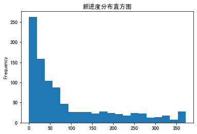
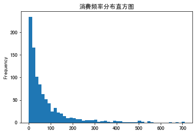
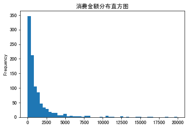
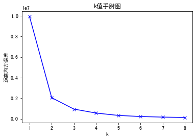
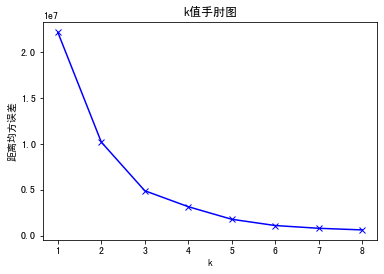
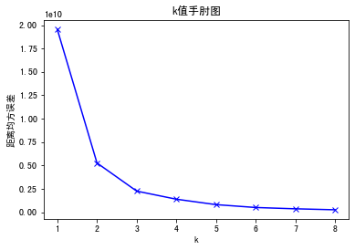
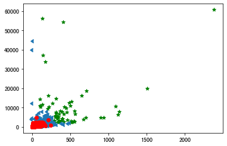

```python
import pandas as pd
```


```python
df_sales = pd.read_csv('/Users/zheyiwang/Downloads/易速鲜花订单记录.csv')
```


```python
# 数据清洗
```


```python
df_sales = df_sales.dropna()
df_sales = df_sales.loc[df_sales['数量']>0]
df_sales['消费日期'] = pd.to_datetime(df_sales['消费日期'] )
df_sales['总价'] = df_sales['单价']*df_sales['数量']
df_sales.head(5)

```


<div>
<style scoped>
    .dataframe tbody tr th:only-of-type {
        vertical-align: middle;
    }

    .dataframe tbody tr th {
        vertical-align: top;
    }

    .dataframe thead th {
        text-align: right;
    }
</style>
<table border="1" class="dataframe">
  <thead>
    <tr style="text-align: right;">
      <th></th>
      <th>订单号</th>
      <th>产品码</th>
      <th>消费日期</th>
      <th>产品说明</th>
      <th>数量</th>
      <th>单价</th>
      <th>用户码</th>
      <th>城市</th>
      <th>总价</th>
    </tr>
  </thead>
  <tbody>
    <tr>
      <th>0</th>
      <td>536374</td>
      <td>21258</td>
      <td>2020-06-01 09:09:00</td>
      <td>五彩玫瑰五支装</td>
      <td>32</td>
      <td>10.95</td>
      <td>15100</td>
      <td>北京</td>
      <td>350.4</td>
    </tr>
    <tr>
      <th>1</th>
      <td>536376</td>
      <td>22114</td>
      <td>2020-06-01 09:32:00</td>
      <td>茉莉花白色25枝</td>
      <td>48</td>
      <td>3.45</td>
      <td>15291</td>
      <td>上海</td>
      <td>165.6</td>
    </tr>
    <tr>
      <th>2</th>
      <td>536376</td>
      <td>21733</td>
      <td>2020-06-01 09:32:00</td>
      <td>教师节向日葵3枝尤加利5枝</td>
      <td>64</td>
      <td>2.55</td>
      <td>15291</td>
      <td>上海</td>
      <td>163.2</td>
    </tr>
    <tr>
      <th>3</th>
      <td>536378</td>
      <td>22386</td>
      <td>2020-06-01 09:37:00</td>
      <td>百合粉色10花苞</td>
      <td>10</td>
      <td>1.95</td>
      <td>14688</td>
      <td>北京</td>
      <td>19.5</td>
    </tr>
    <tr>
      <th>4</th>
      <td>536378</td>
      <td>85099C</td>
      <td>2020-06-01 09:37:00</td>
      <td>橙黄香槟色康乃馨</td>
      <td>10</td>
      <td>1.95</td>
      <td>14688</td>
      <td>北京</td>
      <td>19.5</td>
    </tr>
  </tbody>
</table>
</div>


```python
# 用户码
```


```python
df_user = pd.DataFrame(df_sales['用户码'].unique())
df_user.columns = ['用户码']
df_user = df_user.sort_values(by='用户码').reset_index(drop=True)
df_user.head(5)
```


<div>
<style scoped>
    .dataframe tbody tr th:only-of-type {
        vertical-align: middle;
    }

    .dataframe tbody tr th {
        vertical-align: top;
    }

    .dataframe thead th {
        text-align: right;
    }
</style>
<table border="1" class="dataframe">
  <thead>
    <tr style="text-align: right;">
      <th></th>
      <th>用户码</th>
    </tr>
  </thead>
  <tbody>
    <tr>
      <th>0</th>
      <td>14681</td>
    </tr>
    <tr>
      <th>1</th>
      <td>14682</td>
    </tr>
    <tr>
      <th>2</th>
      <td>14684</td>
    </tr>
    <tr>
      <th>3</th>
      <td>14687</td>
    </tr>
    <tr>
      <th>4</th>
      <td>14688</td>
    </tr>
  </tbody>
</table>
</div>


```python
# R值
```


```python
df_recent_buy = df_sales.groupby('用户码').消费日期.max().reset_index()
df_recent_buy.columns = ['用户码','最近消费日期']
df_recent_buy['R值']= (df_recent_buy.最近消费日期.max()-df_recent_buy.最近消费日期).dt.days
df_recent_buy.head(5)
df_user = pd.merge(df_user,df_recent_buy[['用户码','R值']],on='用户码')
df_user.head(5)
```


<div>
<style scoped>
    .dataframe tbody tr th:only-of-type {
        vertical-align: middle;
    }

    .dataframe tbody tr th {
        vertical-align: top;
    }

    .dataframe thead th {
        text-align: right;
    }
</style>
<table border="1" class="dataframe">
  <thead>
    <tr style="text-align: right;">
      <th></th>
      <th>用户码</th>
      <th>R值</th>
    </tr>
  </thead>
  <tbody>
    <tr>
      <th>0</th>
      <td>14681</td>
      <td>70</td>
    </tr>
    <tr>
      <th>1</th>
      <td>14682</td>
      <td>187</td>
    </tr>
    <tr>
      <th>2</th>
      <td>14684</td>
      <td>25</td>
    </tr>
    <tr>
      <th>3</th>
      <td>14687</td>
      <td>106</td>
    </tr>
    <tr>
      <th>4</th>
      <td>14688</td>
      <td>7</td>
    </tr>
  </tbody>
</table>
</div>


```python
#F值
```


```python
df_frenquncy = df_sales.groupby('用户码').消费日期.count().reset_index()
df_frenquncy.columns = ['用户码','F值']
df_user= pd.merge(df_user,df_frenquncy,on='用户码')
df_user.head(5)
```


<div>
<style scoped>
    .dataframe tbody tr th:only-of-type {
        vertical-align: middle;
    }

    .dataframe tbody tr th {
        vertical-align: top;
    }

    .dataframe thead th {
        text-align: right;
    }
</style>
<table border="1" class="dataframe">
  <thead>
    <tr style="text-align: right;">
      <th></th>
      <th>用户码</th>
      <th>R值</th>
      <th>F值</th>
    </tr>
  </thead>
  <tbody>
    <tr>
      <th>0</th>
      <td>14681</td>
      <td>70</td>
      <td>7</td>
    </tr>
    <tr>
      <th>1</th>
      <td>14682</td>
      <td>187</td>
      <td>2</td>
    </tr>
    <tr>
      <th>2</th>
      <td>14684</td>
      <td>25</td>
      <td>421</td>
    </tr>
    <tr>
      <th>3</th>
      <td>14687</td>
      <td>106</td>
      <td>15</td>
    </tr>
    <tr>
      <th>4</th>
      <td>14688</td>
      <td>7</td>
      <td>327</td>
    </tr>
  </tbody>
</table>
</div>


```python
#M值
```


```python
df_revenue = df_sales.groupby('用户码').总价.sum().reset_index()
df_revenue.columns = ['用户码','M值']
df_user= pd.merge(df_user,df_revenue,on='用户码')
df_user.head(5)
```


<div>
<style scoped>
    .dataframe tbody tr th:only-of-type {
        vertical-align: middle;
    }

    .dataframe tbody tr th {
        vertical-align: top;
    }

    .dataframe thead th {
        text-align: right;
    }
</style>
<table border="1" class="dataframe">
  <thead>
    <tr style="text-align: right;">
      <th></th>
      <th>用户码</th>
      <th>R值</th>
      <th>F值</th>
      <th>M值</th>
    </tr>
  </thead>
  <tbody>
    <tr>
      <th>0</th>
      <td>14681</td>
      <td>70</td>
      <td>7</td>
      <td>498.95</td>
    </tr>
    <tr>
      <th>1</th>
      <td>14682</td>
      <td>187</td>
      <td>2</td>
      <td>52.00</td>
    </tr>
    <tr>
      <th>2</th>
      <td>14684</td>
      <td>25</td>
      <td>421</td>
      <td>1236.28</td>
    </tr>
    <tr>
      <th>3</th>
      <td>14687</td>
      <td>106</td>
      <td>15</td>
      <td>628.38</td>
    </tr>
    <tr>
      <th>4</th>
      <td>14688</td>
      <td>7</td>
      <td>327</td>
      <td>5630.87</td>
    </tr>
  </tbody>
</table>
</div>


```python
# 绘制图形
```


```python
df_user['R值'].plot(kind ='hist',bins=20,title='新进度分布直方图')
```


    <AxesSubplot:title={'center':'新进度分布直方图'}, ylabel='Frequency'>


    

    


```python
df_user.query('F值 < 800')['F值'].plot(kind='hist', bins=50, title = '消费频率分布直方图') #F值直方图
```


    <AxesSubplot:title={'center':'消费频率分布直方图'}, ylabel='Frequency'>


    

    


```python
df_user.query('M值 < 20000')['M值'].plot(kind='hist', bins=50, title = '消费金额分布直方图') #M值直方图
```


    <AxesSubplot:title={'center':'消费金额分布直方图'}, ylabel='Frequency'>


    

    


```python
# R 值的手肘点
```


```python
from sklearn.cluster import KMeans
from matplotlib import pyplot as plt
def show_elbow(df):
    distance_list = []
    K = range(1,9)
    
    for k in K:
        kmeans = KMeans(n_clusters=k,max_iter=100)
        kmeans = kmeans.fit(df)
        distance_list.append(kmeans.inertia_)
    plt.plot(K, distance_list, 'bx-') #绘图 
    plt.xlabel('k') #X轴 
    plt.ylabel('距离均方误差') #Y轴 
    plt.title('k值手肘图') #标题
    
```


```python
show_elbow(df_user[['R值']]) #显示R值聚类K值手肘图
```


    

    


```python
show_elbow(df_user[['F值']]) #显示F值聚类K值手肘图
```


    

    


```python
show_elbow(df_user[['M值']]) #显示M值聚类K值手肘图
```


    

    


```python
# 可以看到，R、F、M 值的拐点大概都在 2 到 4 之间附近，这就意味着我们把用户分成 2、3、4 个组都行。这里我选择 3 作为 R 值的簇的个数，选择 4 作为 F 值的簇的个数，选择 3 作为 M 值的簇的个数。
```


```python
# 创建和训练模型
```


```python
from sklearn.cluster import KMeans #导入KMeans模块
kmeans_R = KMeans(n_clusters=3) #设定K=3
kmeans_F = KMeans(n_clusters=4) #设定K=4
kmeans_M = KMeans(n_clusters=4) #设定K=4
```


```python
kmeans_R.fit(df_user[['R值']]) #拟合模型
kmeans_F.fit(df_user[['F值']]) #拟合模型
kmeans_M.fit(df_user[['M值']]) #拟合模型
```


    KMeans(n_clusters=4)


```python
#使用模型进行聚类，并给用户分组
```


```python
df_user['R值层级'] = kmeans_R.predict(df_user[['R值']]) #通过聚类模型求出R值的层级
df_user.head() #显示头几行数据
```


<div>
<style scoped>
    .dataframe tbody tr th:only-of-type {
        vertical-align: middle;
    }

    .dataframe tbody tr th {
        vertical-align: top;
    }

    .dataframe thead th {
        text-align: right;
    }
</style>
<table border="1" class="dataframe">
  <thead>
    <tr style="text-align: right;">
      <th></th>
      <th>用户码</th>
      <th>R值</th>
      <th>F值</th>
      <th>M值</th>
      <th>R值层级</th>
    </tr>
  </thead>
  <tbody>
    <tr>
      <th>0</th>
      <td>14681</td>
      <td>70</td>
      <td>7</td>
      <td>498.95</td>
      <td>1</td>
    </tr>
    <tr>
      <th>1</th>
      <td>14682</td>
      <td>187</td>
      <td>2</td>
      <td>52.00</td>
      <td>0</td>
    </tr>
    <tr>
      <th>2</th>
      <td>14684</td>
      <td>25</td>
      <td>421</td>
      <td>1236.28</td>
      <td>1</td>
    </tr>
    <tr>
      <th>3</th>
      <td>14687</td>
      <td>106</td>
      <td>15</td>
      <td>628.38</td>
      <td>0</td>
    </tr>
    <tr>
      <th>4</th>
      <td>14688</td>
      <td>7</td>
      <td>327</td>
      <td>5630.87</td>
      <td>1</td>
    </tr>
  </tbody>
</table>
</div>


```python
df_user.groupby('R值层级')['R值'].describe() #R值层级分组统计信息
```


<div>
<style scoped>
    .dataframe tbody tr th:only-of-type {
        vertical-align: middle;
    }

    .dataframe tbody tr th {
        vertical-align: top;
    }

    .dataframe thead th {
        text-align: right;
    }
</style>
<table border="1" class="dataframe">
  <thead>
    <tr style="text-align: right;">
      <th></th>
      <th>count</th>
      <th>mean</th>
      <th>std</th>
      <th>min</th>
      <th>25%</th>
      <th>50%</th>
      <th>75%</th>
      <th>max</th>
    </tr>
    <tr>
      <th>R值层级</th>
      <th></th>
      <th></th>
      <th></th>
      <th></th>
      <th></th>
      <th></th>
      <th></th>
      <th></th>
    </tr>
  </thead>
  <tbody>
    <tr>
      <th>0</th>
      <td>178.0</td>
      <td>157.162921</td>
      <td>37.340870</td>
      <td>95.0</td>
      <td>126.00</td>
      <td>156.5</td>
      <td>188.75</td>
      <td>225.0</td>
    </tr>
    <tr>
      <th>1</th>
      <td>664.0</td>
      <td>32.088855</td>
      <td>25.141763</td>
      <td>0.0</td>
      <td>10.00</td>
      <td>25.0</td>
      <td>50.00</td>
      <td>94.0</td>
    </tr>
    <tr>
      <th>2</th>
      <td>138.0</td>
      <td>298.094203</td>
      <td>45.436550</td>
      <td>231.0</td>
      <td>255.25</td>
      <td>292.5</td>
      <td>334.50</td>
      <td>372.0</td>
    </tr>
  </tbody>
</table>
</div>


```python
#定义一个order_cluster函数为聚类排序
def order_cluster(cluster_name, target_name,df,ascending=False):
    df_new = df.groupby(cluster_name)[target_name].mean().reset_index() #按聚类结果分组，创建df_new对象
    df_new = df_new.sort_values(by=target_name,ascending=ascending).reset_index(drop=True) #排序
    df_new['index'] = df_new.index #创建索引字段
    df_new = pd.merge(df,df_new[[cluster_name,'index']], on=cluster_name) #基于聚类名称把df_new还原为df对象，并添加索引字段
    df_new = df_new.drop([cluster_name],axis=1) #删除聚类名称
    df_new = df_new.rename(columns={"index":cluster_name}) #将索引字段重命名为聚类名称字段
    return df_new #返回排序后的df_new对象
```


```python
df_user = order_cluster('R值层级', 'R值', df_user, False) #调用簇排序函数
df_user = df_user.sort_values(by='用户码',ascending=True).reset_index(drop=True) #根据用户码排序
df_user.head() #显示头几行数据
```


<div>
<style scoped>
    .dataframe tbody tr th:only-of-type {
        vertical-align: middle;
    }

    .dataframe tbody tr th {
        vertical-align: top;
    }

    .dataframe thead th {
        text-align: right;
    }
</style>
<table border="1" class="dataframe">
  <thead>
    <tr style="text-align: right;">
      <th></th>
      <th>用户码</th>
      <th>R值</th>
      <th>F值</th>
      <th>M值</th>
      <th>R值层级</th>
    </tr>
  </thead>
  <tbody>
    <tr>
      <th>0</th>
      <td>14681</td>
      <td>70</td>
      <td>7</td>
      <td>498.95</td>
      <td>2</td>
    </tr>
    <tr>
      <th>1</th>
      <td>14682</td>
      <td>187</td>
      <td>2</td>
      <td>52.00</td>
      <td>1</td>
    </tr>
    <tr>
      <th>2</th>
      <td>14684</td>
      <td>25</td>
      <td>421</td>
      <td>1236.28</td>
      <td>2</td>
    </tr>
    <tr>
      <th>3</th>
      <td>14687</td>
      <td>106</td>
      <td>15</td>
      <td>628.38</td>
      <td>1</td>
    </tr>
    <tr>
      <th>4</th>
      <td>14688</td>
      <td>7</td>
      <td>327</td>
      <td>5630.87</td>
      <td>2</td>
    </tr>
  </tbody>
</table>
</div>


```python
df_user.groupby('R值层级')['R值'].describe() #R值层级分组统计信息
```


<div>
<style scoped>
    .dataframe tbody tr th:only-of-type {
        vertical-align: middle;
    }

    .dataframe tbody tr th {
        vertical-align: top;
    }

    .dataframe thead th {
        text-align: right;
    }
</style>
<table border="1" class="dataframe">
  <thead>
    <tr style="text-align: right;">
      <th></th>
      <th>count</th>
      <th>mean</th>
      <th>std</th>
      <th>min</th>
      <th>25%</th>
      <th>50%</th>
      <th>75%</th>
      <th>max</th>
    </tr>
    <tr>
      <th>R值层级</th>
      <th></th>
      <th></th>
      <th></th>
      <th></th>
      <th></th>
      <th></th>
      <th></th>
      <th></th>
    </tr>
  </thead>
  <tbody>
    <tr>
      <th>0</th>
      <td>138.0</td>
      <td>298.094203</td>
      <td>45.436550</td>
      <td>231.0</td>
      <td>255.25</td>
      <td>292.5</td>
      <td>334.50</td>
      <td>372.0</td>
    </tr>
    <tr>
      <th>1</th>
      <td>178.0</td>
      <td>157.162921</td>
      <td>37.340870</td>
      <td>95.0</td>
      <td>126.00</td>
      <td>156.5</td>
      <td>188.75</td>
      <td>225.0</td>
    </tr>
    <tr>
      <th>2</th>
      <td>664.0</td>
      <td>32.088855</td>
      <td>25.141763</td>
      <td>0.0</td>
      <td>10.00</td>
      <td>25.0</td>
      <td>50.00</td>
      <td>94.0</td>
    </tr>
  </tbody>
</table>
</div>


```python
df_user['F值层级'] = kmeans_F.predict(df_user[['F值']]) #通过聚类模型求出F值的层级
df_user = order_cluster('F值层级', 'F值',df_user,True) #调用簇排序函数
df_user.groupby('F值层级')['F值'].describe() #F值层级分组统计信息
```


<div>
<style scoped>
    .dataframe tbody tr th:only-of-type {
        vertical-align: middle;
    }

    .dataframe tbody tr th {
        vertical-align: top;
    }

    .dataframe thead th {
        text-align: right;
    }
</style>
<table border="1" class="dataframe">
  <thead>
    <tr style="text-align: right;">
      <th></th>
      <th>count</th>
      <th>mean</th>
      <th>std</th>
      <th>min</th>
      <th>25%</th>
      <th>50%</th>
      <th>75%</th>
      <th>max</th>
    </tr>
    <tr>
      <th>F值层级</th>
      <th></th>
      <th></th>
      <th></th>
      <th></th>
      <th></th>
      <th></th>
      <th></th>
      <th></th>
    </tr>
  </thead>
  <tbody>
    <tr>
      <th>0</th>
      <td>718.0</td>
      <td>32.399721</td>
      <td>24.333294</td>
      <td>1.0</td>
      <td>12.00</td>
      <td>27.0</td>
      <td>49.00</td>
      <td>92.0</td>
    </tr>
    <tr>
      <th>1</th>
      <td>202.0</td>
      <td>153.193069</td>
      <td>49.685452</td>
      <td>93.0</td>
      <td>114.25</td>
      <td>139.5</td>
      <td>187.25</td>
      <td>278.0</td>
    </tr>
    <tr>
      <th>2</th>
      <td>53.0</td>
      <td>416.584906</td>
      <td>111.990974</td>
      <td>286.0</td>
      <td>327.00</td>
      <td>388.0</td>
      <td>498.00</td>
      <td>710.0</td>
    </tr>
    <tr>
      <th>3</th>
      <td>7.0</td>
      <td>1295.285714</td>
      <td>516.333456</td>
      <td>899.0</td>
      <td>1013.50</td>
      <td>1119.0</td>
      <td>1321.50</td>
      <td>2379.0</td>
    </tr>
  </tbody>
</table>
</div>


```python
df_user = df_user.sort_values(by='用户码',ascending=True).reset_index(drop=True) #根据用户码排序
df_user.head()
```


<div>
<style scoped>
    .dataframe tbody tr th:only-of-type {
        vertical-align: middle;
    }

    .dataframe tbody tr th {
        vertical-align: top;
    }

    .dataframe thead th {
        text-align: right;
    }
</style>
<table border="1" class="dataframe">
  <thead>
    <tr style="text-align: right;">
      <th></th>
      <th>用户码</th>
      <th>R值</th>
      <th>F值</th>
      <th>M值</th>
      <th>R值层级</th>
      <th>F值层级</th>
    </tr>
  </thead>
  <tbody>
    <tr>
      <th>0</th>
      <td>14681</td>
      <td>70</td>
      <td>7</td>
      <td>498.95</td>
      <td>2</td>
      <td>0</td>
    </tr>
    <tr>
      <th>1</th>
      <td>14682</td>
      <td>187</td>
      <td>2</td>
      <td>52.00</td>
      <td>1</td>
      <td>0</td>
    </tr>
    <tr>
      <th>2</th>
      <td>14684</td>
      <td>25</td>
      <td>421</td>
      <td>1236.28</td>
      <td>2</td>
      <td>2</td>
    </tr>
    <tr>
      <th>3</th>
      <td>14687</td>
      <td>106</td>
      <td>15</td>
      <td>628.38</td>
      <td>1</td>
      <td>0</td>
    </tr>
    <tr>
      <th>4</th>
      <td>14688</td>
      <td>7</td>
      <td>327</td>
      <td>5630.87</td>
      <td>2</td>
      <td>2</td>
    </tr>
  </tbody>
</table>
</div>


```python
df_user['M值层级'] = kmeans_M.predict(df_user[['M值']]) #通过聚类模型求出M值的层级
df_user = order_cluster('M值层级', 'M值',df_user,True) #调用簇排序函数
df_user.groupby('M值层级')['M值'].describe() #M值层级分组统计信息
df_user = df_user.sort_values(by='用户码',ascending=True).reset_index(drop=True) #根据用户码排序
df_user.head() #显示头几行数据
```


<div>
<style scoped>
    .dataframe tbody tr th:only-of-type {
        vertical-align: middle;
    }

    .dataframe tbody tr th {
        vertical-align: top;
    }

    .dataframe thead th {
        text-align: right;
    }
</style>
<table border="1" class="dataframe">
  <thead>
    <tr style="text-align: right;">
      <th></th>
      <th>用户码</th>
      <th>R值</th>
      <th>F值</th>
      <th>M值</th>
      <th>R值层级</th>
      <th>F值层级</th>
      <th>M值层级</th>
    </tr>
  </thead>
  <tbody>
    <tr>
      <th>0</th>
      <td>14681</td>
      <td>70</td>
      <td>7</td>
      <td>498.95</td>
      <td>2</td>
      <td>0</td>
      <td>0</td>
    </tr>
    <tr>
      <th>1</th>
      <td>14682</td>
      <td>187</td>
      <td>2</td>
      <td>52.00</td>
      <td>1</td>
      <td>0</td>
      <td>0</td>
    </tr>
    <tr>
      <th>2</th>
      <td>14684</td>
      <td>25</td>
      <td>421</td>
      <td>1236.28</td>
      <td>2</td>
      <td>2</td>
      <td>0</td>
    </tr>
    <tr>
      <th>3</th>
      <td>14687</td>
      <td>106</td>
      <td>15</td>
      <td>628.38</td>
      <td>1</td>
      <td>0</td>
      <td>0</td>
    </tr>
    <tr>
      <th>4</th>
      <td>14688</td>
      <td>7</td>
      <td>327</td>
      <td>5630.87</td>
      <td>2</td>
      <td>2</td>
      <td>1</td>
    </tr>
  </tbody>
</table>
</div>


```python
# 为用户整体分组画像
```


```python
df_user['总分'] = df_user['R值层级'] + df_user['F值层级'] + df_user['M值层级'] #求出每个用户RFM总分
```


```python
#在df_user对象中添加总体价值这个字段
df_user.loc[(df_user['总分']<=2) & (df_user['总分']>=0), '总体价值'] = '低价值' 
df_user.loc[(df_user['总分']<=4) & (df_user['总分']>=3), '总体价值'] = '中价值' 
df_user.loc[(df_user['总分']<=8) & (df_user['总分']>=5), '总体价值'] = '高价值'
df_user #显示df_user
```


<div>
<style scoped>
    .dataframe tbody tr th:only-of-type {
        vertical-align: middle;
    }

    .dataframe tbody tr th {
        vertical-align: top;
    }

    .dataframe thead th {
        text-align: right;
    }
</style>
<table border="1" class="dataframe">
  <thead>
    <tr style="text-align: right;">
      <th></th>
      <th>用户码</th>
      <th>R值</th>
      <th>F值</th>
      <th>M值</th>
      <th>R值层级</th>
      <th>F值层级</th>
      <th>M值层级</th>
      <th>总分</th>
      <th>总体价值</th>
    </tr>
  </thead>
  <tbody>
    <tr>
      <th>0</th>
      <td>14681</td>
      <td>70</td>
      <td>7</td>
      <td>498.95</td>
      <td>2</td>
      <td>0</td>
      <td>0</td>
      <td>2</td>
      <td>低价值</td>
    </tr>
    <tr>
      <th>1</th>
      <td>14682</td>
      <td>187</td>
      <td>2</td>
      <td>52.00</td>
      <td>1</td>
      <td>0</td>
      <td>0</td>
      <td>1</td>
      <td>低价值</td>
    </tr>
    <tr>
      <th>2</th>
      <td>14684</td>
      <td>25</td>
      <td>421</td>
      <td>1236.28</td>
      <td>2</td>
      <td>2</td>
      <td>0</td>
      <td>4</td>
      <td>中价值</td>
    </tr>
    <tr>
      <th>3</th>
      <td>14687</td>
      <td>106</td>
      <td>15</td>
      <td>628.38</td>
      <td>1</td>
      <td>0</td>
      <td>0</td>
      <td>1</td>
      <td>低价值</td>
    </tr>
    <tr>
      <th>4</th>
      <td>14688</td>
      <td>7</td>
      <td>327</td>
      <td>5630.87</td>
      <td>2</td>
      <td>2</td>
      <td>1</td>
      <td>5</td>
      <td>高价值</td>
    </tr>
    <tr>
      <th>...</th>
      <td>...</td>
      <td>...</td>
      <td>...</td>
      <td>...</td>
      <td>...</td>
      <td>...</td>
      <td>...</td>
      <td>...</td>
      <td>...</td>
    </tr>
    <tr>
      <th>975</th>
      <td>16015</td>
      <td>3</td>
      <td>182</td>
      <td>705.39</td>
      <td>2</td>
      <td>1</td>
      <td>0</td>
      <td>3</td>
      <td>中价值</td>
    </tr>
    <tr>
      <th>976</th>
      <td>16016</td>
      <td>2</td>
      <td>235</td>
      <td>1508.76</td>
      <td>2</td>
      <td>1</td>
      <td>0</td>
      <td>3</td>
      <td>中价值</td>
    </tr>
    <tr>
      <th>977</th>
      <td>16017</td>
      <td>46</td>
      <td>32</td>
      <td>211.88</td>
      <td>2</td>
      <td>0</td>
      <td>0</td>
      <td>2</td>
      <td>低价值</td>
    </tr>
    <tr>
      <th>978</th>
      <td>16018</td>
      <td>38</td>
      <td>28</td>
      <td>408.90</td>
      <td>2</td>
      <td>0</td>
      <td>0</td>
      <td>2</td>
      <td>低价值</td>
    </tr>
    <tr>
      <th>979</th>
      <td>16019</td>
      <td>46</td>
      <td>160</td>
      <td>3786.24</td>
      <td>2</td>
      <td>1</td>
      <td>1</td>
      <td>4</td>
      <td>中价值</td>
    </tr>
  </tbody>
</table>
<p>980 rows × 9 columns</p>
</div>


```python
#显示高、中、低价值组分布散点图（F值与M值）
plt.scatter(df_user.query("总体价值 == '高价值'")['F值'],
                   df_user.query("总体价值 == '高价值'")['M值'],c='g',marker='*')
plt.scatter(df_user.query("总体价值 == '中价值'")['F值'],
                   df_user.query("总体价值 == '中价值'")['M值'],marker=8)
plt.scatter(df_user.query("总体价值 == '低价值'")['F值'],
                   df_user.query("总体价值 == '低价值'")['M值'],c='r')
```


    <matplotlib.collections.PathCollection at 0x7fcc46ffea90>


    

    


```python

```
